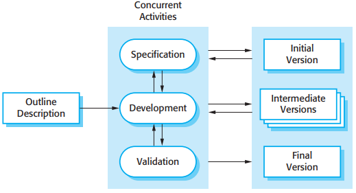
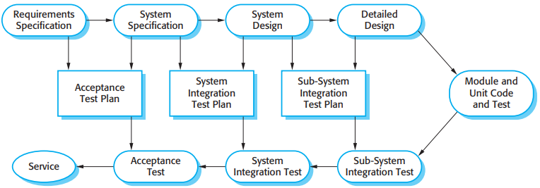
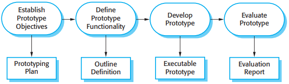
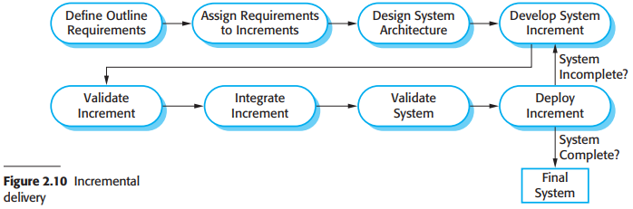
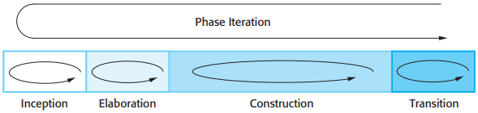
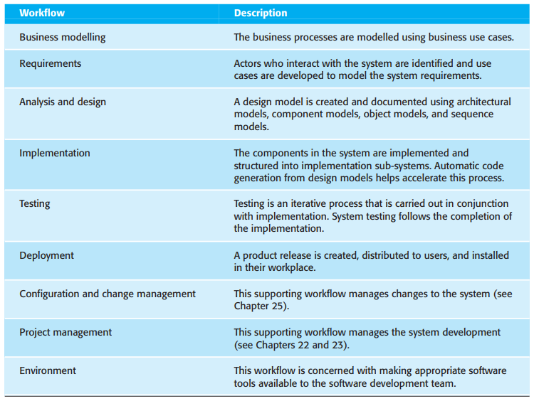

# 第二章 软件过程

所有软件过程都必须具有以下基本活动：

1. 软件描述：必须定义软件的功能以及软件操作上的约束。
2. 软件设计和实现：必须生产符合描述的软件。
3. 软件有效性验证：软件必须得到有效性验证，即确保软件是客户所想要的。
4. 软件进化：软件必须进化以满足不断变化的客户需要。

## 2.1 软件过程模型

- 瀑布模型将基本的过程活动，描述，开发，有效性验证和进化，看成是一些界限分明的独立的过程阶段。
- 增量式开发使得描述活动，开发活动和有效性验证活动交织在仪器。系统的开发是建立一系列的版本（增量），每个版本添加部分功能到先前的版本中。
- 面向复用的软件工程基于已存在的大量可复用的组件。系统开发过程着重于集成这些组件到新系统中，而非从头开发。

### 2.1.1 瀑布模型

瀑布模型中的主要阶段直接映射基本的开发活动：

1. 需求分析和定义；
2. 系统和软件设计；
3. 实现和单元测试；
4. 集成和系统测试；
5. 运行和维护。

### 2.1.2 增量式开发

*增量式开发*

增量式开发相比于瀑布模型有3个重要优点：

1. 降低了适应用户需求变更的成本。
2. 在开发过程中更容易得到用户对于已做的开发工作的反馈意见。
3. 使更快地交付和部署有用的软件到客户方变成了可能，虽然不是所有的功能都已经包含在内。

从管理的角度来看，增量式方法存在两个问题：

1. 过程不可见。
2. 伴随着新的增量的添加，系统结构在逐渐退化。

### 2.1.3 面向复用的软件工程

*面向复用的软件工程*

- 组件分析：给出需求描述，然后搜寻能满足需求的组件。
- 需求修改：根据得到的组件信息分析需求，然后修改需求以反映可得到的组件。
- 使用复用的系统设计：设计系统的框架或重复使用一个已存在的框架。
- 开发和集成：当组件不能买到时就需要自己开发，然后集成这些自己开发的组件和现货组件，使之成为一个整体。

## 2.2 过程活动

### 2.2.1 软件描述

软件描述或需求工程是理解和定义系统需要提供哪些服务，以及找出开发和运行中受到哪些约束。

*需求工程过程*

- 可行性研究：指明现有的软件，硬件技术能否实现用户对新系统的要求。从业务角度来决定系统开发是否划算以及在预算范围内能否开发出来。
- 需求导出和分析：这是一个通过对现有系统分析，与潜在用户和购买者讨论，进行任务分析等导出系统需求的过程。
- 需求描述：就是把在分析活动中收集的信息以文档的形式确定下来。
- 需求有效性验证：该活动检查需求的现实性，一致性和完备性。

### 2.2.2 软件设计和实现

*设计过程的通用模型*

- 体系结构设计：识别系统总体结构，基本组件（有时候也叫子系统或模块），它们之间的关系以及他们是怎样分布的。
- 接口设计：定义系统组件间的接口。
- 组件设计：针对每个系统组件设计它的运行方式。
- 数据库设计：设计系统数据结构，以及如何在数据库中表示这些数据结构。

### 2.2.3 软件有效性验证

*测试各阶段*

- 组件（或单元）测试：由开发系统的人员对组成系统的组件进行测试。
- 系统测试：集成组件形成完整的系统。
- 接收测试：用客户提供的真实数据测试系统。

*计划驱动软件过程中地测试阶段*

### 2.2.4 软件进化

*系统进化*

## 2.3 应对变更

用于降低返工成本的方法：

1. 变更避免：软件过程包括一些能够在重大返工发生之前预测变更的活动。
2. 变更容忍：所设计的过程使得变更以相对较低的成本得到处理。

应对变更系统需求的方法：

1. 系统原型：快速开发一个系统版本或者是系统的一个部分，以检验客户需求和某些设计决定的可行性。
2. 增量交付：系统增量地交付给用户，给用户评审和使用。

### 2.3.1 原型构造

软件原型可以用在软件开发过程中，帮助预计可能需要地变更：

1. 在需求工程过程中，原型有助于启发和验证系统需求。
2. 在系统设计过程中，原型可用于探索特定软件地解决方案，并支持用于接口设计。

*原型开发的过程*

### 2.3.2 增量式交付

*增量式交付*

增量式开发过程的优点：

1. 客户可以将早期的增量作为原型，从中获得对后面系统增量的需求经验。
2. 客户无需等到整个系统的实现才能从中获益。
3. 这一过程保持了增量式开发的优点，那就是相对来讲变更能较容易地嵌入到系统中。
4. 因为具有最高优先权的服务被首先交付，而后面的增量也不断被集成进来，这就使得最重要的系统服务肯定接受了最多的测试。

增量式交付的缺点：

1. 大多数系统需要一组基本设施，这些基本设施会被系统不同部分所使用。
2. 当所开发的是一个替换系统时，迭代开发也是很困难的。
3. 软件描述和软件本身一起开发是迭代过程的本质。

### 2.3.3 Boehm的螺旋模型

*Boehm的软件过程的螺旋模型*

- 目标设置：为项目的这个阶段定义专门目标。
- 风险评估和规避：每个项目风险确定以后要进行详细的分析，并采取措施规避这些风险。
- 开发和有效性验证：在风险预估以后，就可以为系统选择开发模型。
- 规划：对项目进行评审以确定是否需要进入螺旋线的下一个环路。

## 2.4 Rational统一过程

*Rational统一过程的各阶段*

- 开端：
- 细化：
- 构造：
- 转换：

*Rational统一过程中的静态工作流*

RUP的实践视角描述了在系统开发中所需要的好的软件工程实践。6个基本的且最好的实践：

1. 迭代地开发软件：
2. 对需求的管理：
3. 使用基于组件的体系结构：
4. 可视化地建模软件：
5. 检验软件质量：
6. 控制对软件的变更：

## 总结

TODO