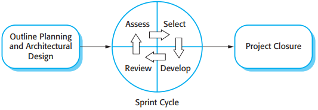

# 3 Agile software development

[TOC]

Although there are many approaches to rapid software development, they share some fundamental characteristics:

1. The processes of specification, design, and implementation are interleaved.
2. The system is developed in a series of versions.
3. System user interfaces are often developed using an interactive development system that allows the interface design to be quickly created by drawing and placing icons on the interface.

## Agile methods

*The principles of agile methods*

## Plan-driven and agile development

*Plan-driven and agile specification*

## Extreme programming

*The extreme programming release cycle*

*Extreme programming practices*

### Pair programming

The use of pair programming has a number of advantages:

1. It supports the idea of collective ownership and responsibility for the system.
2. It acts as an informal review process because each line of code is looked at by at least two people.
3. It helps support refactoring, which is a process of software improvement.

## Agile project management

*The Scrum process*