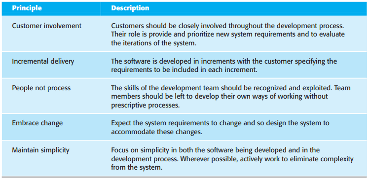
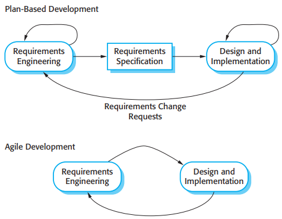
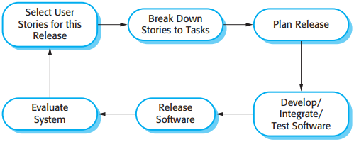
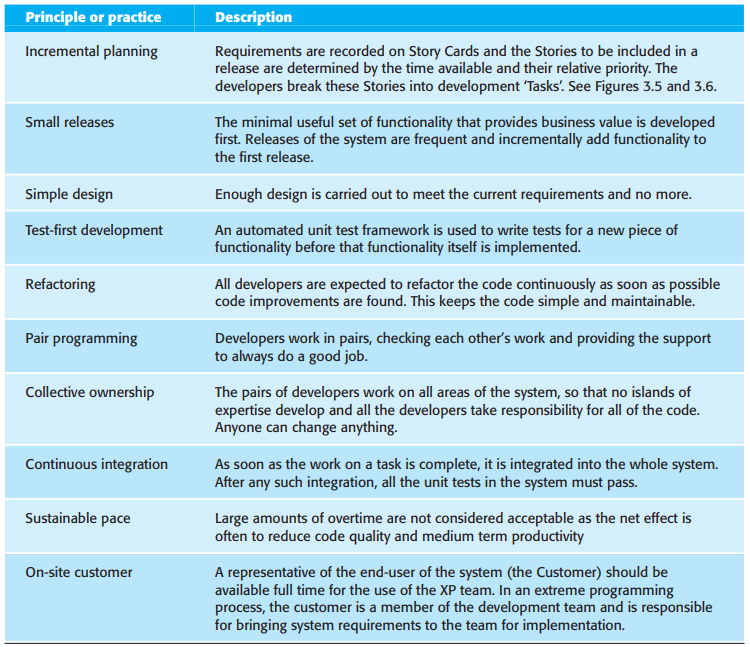
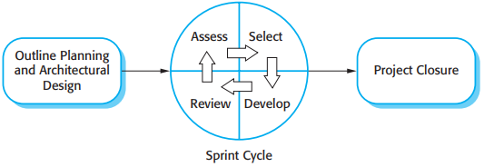

# 第3章 敏捷软件开发

[TOC]

尽管有很多快速软件开发的方法，它们都有一些基本的特征：

1. 描述，设计和实现过程是交织在一起的。
2. 系统通过一系列版本开发出来。
3. 系统用户界面通常是采用交互式开发系统开发的，这些开发系统允许通过绘图和在界面上摆放图标的方式迅速完成界面的设计。

## 3.1 敏捷方法

*敏捷方法的基本原则*

## 3.2 计划驱动开发和敏捷开发

*计划驱动和敏捷描述*

## 3.3 极限编程

*极限编程的版本循环*

### 3.3.1 极限编程中的测试

### 3.3.2 结对编程

结对编程的优点：

1. 它支持共同拥有软件和共同对系统负责。
2. 它担当了非正式的复查过程，因为每一行代码至少经过了两个人的批阅。
3. 它有助于支持重构，这是一个软件改善的过程。

## 3.4 敏捷项目管理

*Scrum过程*

## 3.5 可扩展的敏捷方法

## 总结

TODO