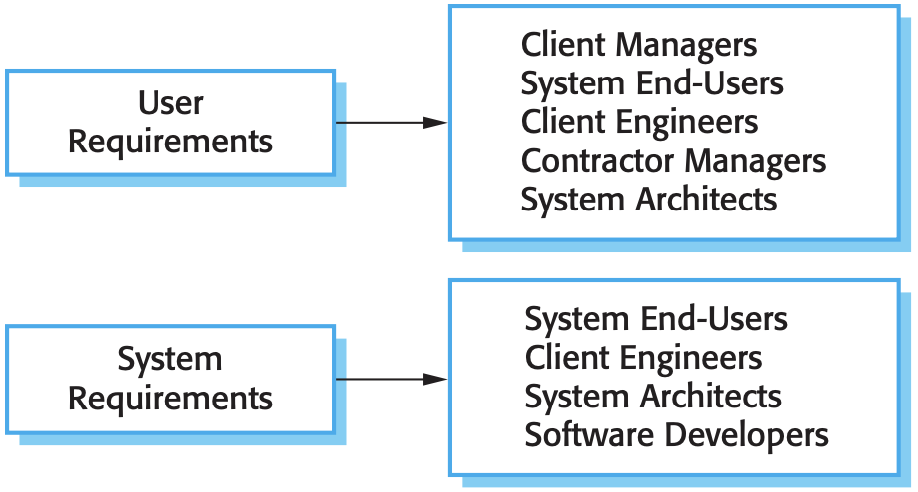
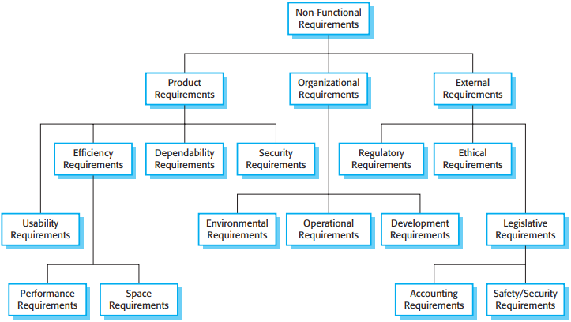
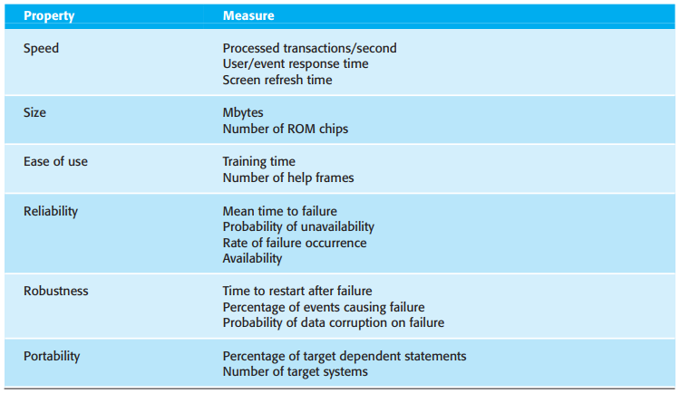
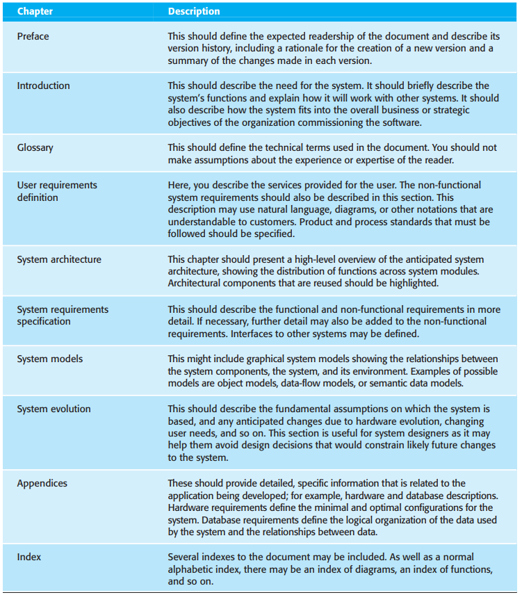
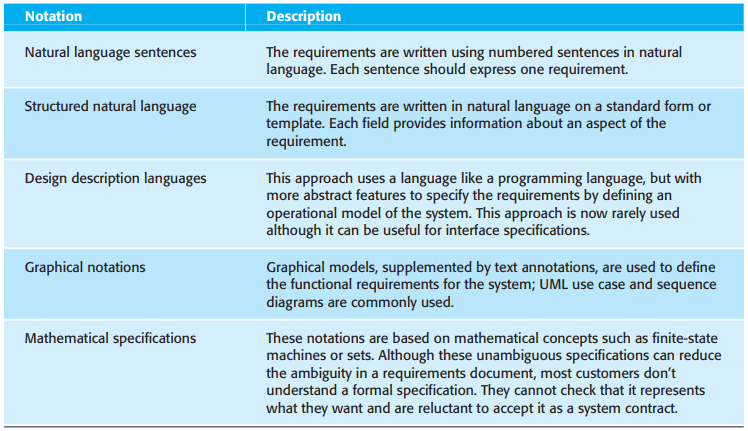
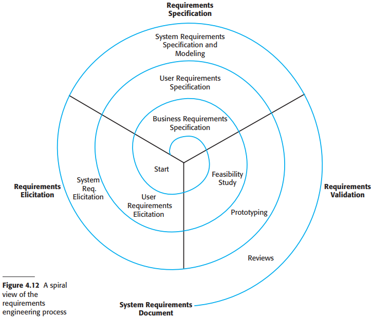
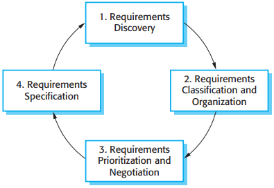
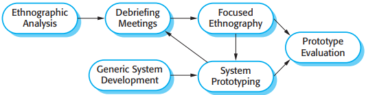
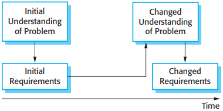
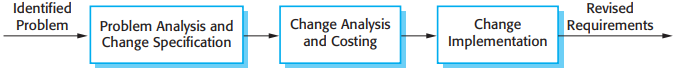

# 4 Requirements engineering

[TOC]

User requirements and system requirements may be defined as follows:

1. User requirements are statements, in a natural language plus diagrams, of what services the system is expected to provide to system users and the constraints under which it must operate.
2. System requirements are more detailed descriptions of the software system's functions, services, and operational constraints. The system requirements document (sometimes called a functional specification) should define exactly what is to be implemented. It may be part of the contract between the system buyer and the software developers.

## Functional and non-functional requirements

*Readers of different types of requirements specifications

Software system requirements are often classified as functional requirements or nonfunctional requirements:

1. `Functional requirements:` These are statements of services the system should provide, how the system should react to particular inputs, and how the system should behave in particular situations. In some cases, the functional requirements may also explicitly state what the system should not do.
2. `Non-functional requirements:` These are constraints on the services or functions offered by the system. They include timing constraints, constraints on the development process, and constraints imposed by standards.

### Non-functional requirements

*Types of non-functional requirements*

You can see from this diagram that the non-functional requirements may come from the required characteristics of the software (product requirements), the organization developing the software (organizational requirements), or from external sources:

1. `Product requirements` These requirements specify or constrain the behavior of the software.
2. `Organizational requirements` These requirements are broad system requirements derived from policies and procedures in the customer's and developer's organization.
3. `External requirements` This broad heading covers all requirements that are derived from factors external to the system and its development process.

*Metrics for specifying non-functional requirements*

## The software requirements document

*The structure of a requirements document*

## Requirements specification

*Ways of writing a system requirements specification*

## Requirements engineering processes

*A spiral view of the requirements engineering process*

## Requirements elicitation and analysis

*The requirements elicitation and analysis process*

### Interviewing

Requirements are derived from the answers to these questions. Interviews may be of two types:

1. Closed interviews, where the stakeholder answers a pre-defined set of questions.
2. Open interviews, in which there is no pre-defined agenda. The requirements engineering team explores a range of issues with system stakeholders and hence develops a better understanding of their needs.

### Ethnography

*Ethnography and prototyping for requirements analysis*

## Requirements validation

*Requirements evolution*

During the requirements validation process, different types of checks should be carried out on the requirements in the requirements document. These checks include:

1. Validity checks.
2. Consistency checks.
3. Completeness checks.
4. Realism.
5. Verifiability.

There are a number of requirements validation techniques that can be used individually or in conjunction with one another:

1. Requirements reviews.
2. Prototyping.
3. Test-case generation.

## Requirements management

There are several reasons why change is inevitable:

1. The business and technical environment of the system always changes after installation.
2. The people who pay for a system and the users of that system are rarely the same people.
3. Large systems usually have a diverse user community, with many users having different requirements and priorities that may be conflicting or contradictory.

### Requirements management planning

Planning is an essential first stage in the requirements management process. The planning stage establishes the level of requirements management detail that is required. During the requirements management stage, you have to decide on:

1. Requirements identification
2. change management process
3. Traceability policies
4. Tool support

Requirements management needs automated support and the software tools for this should be chosen during the planning phase. You need tool support for:

1. Requirements storage
2. Change management
3. Traceability management

*Requirements change management*

### Requirements change management

There are three principal stages to a change management process:

1. Problem analysis and change specification.
2. Change analysis and costing
3. Change implementation
