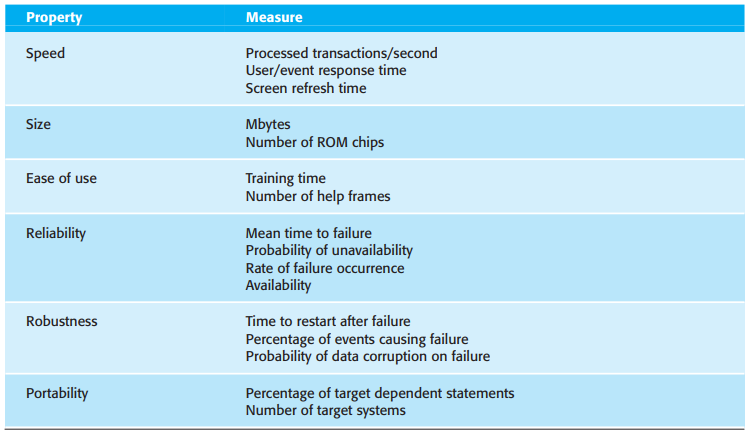
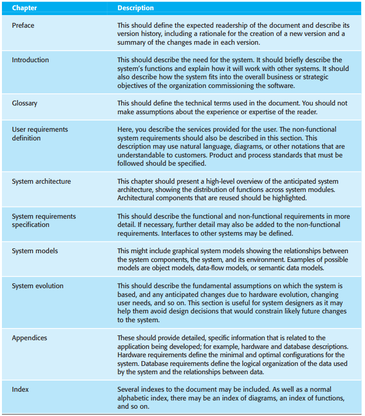
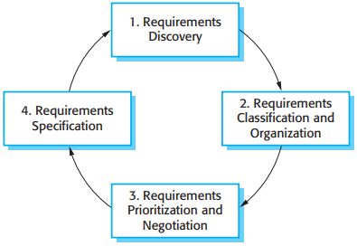
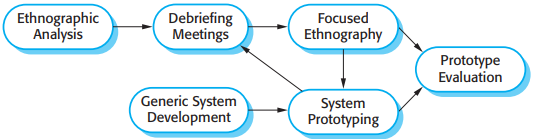
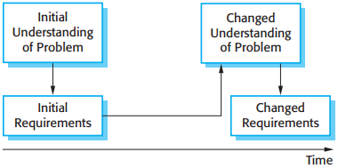
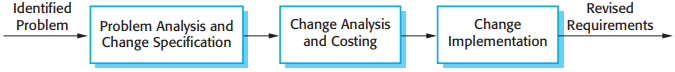

# 第4章 需求工程

用户需求，系统需求的定义如下：

1. 用户需求是用自然语言加图的形式给出的，关于系统需要提供哪些服务以及操作系统受到哪些约束的声明。
2. 系统需求详细地给出系统将要提供的服务以及系统所受到的约束。系统需求文档有时也称为功能描述，应该是精确的。它可能成为系统买方和软件开发者之间合同的重要内容。

## 4.1 功能需求和非功能需求

软件系统需求分为功能需求和非功能需求：

1. 功能需求：包括对系统应该提供的服务，如何对特殊输入做出反应，以及系统在特定条件下的行为的描述。在某些情况下，功能需求可能还需明确声明系统不应该做什么。
2. 非功能需求：对系统提供的服务或功能给出的约束。包括时间约束，开发过程的约束和所受到的标准的约束。

### 4.1.1 功能需求

### 4.1.2 非功能需求

*非功能需求的类型*

- 产品需求
- 机构需求
- 外部需求

*定义非功能需求的量度*

## 4.2 软件需求文档

*需求文档的结构*

## 4.3 需求描述

### 4.3.1 自然语言描述

*系统需求描述的书写方法*

### 4.3.2 结构化描述

## 4.4 需求工程过程

*需求工程过程的螺旋模型*

## 4.5 需求导出和分析

*需求导出和分析过程*

### 4.5.1 需求发现

### 4.5.2 采访

采访有两种类型：

1. 封闭式采访，即信息持有者回答一组预定的问题；
2. 开放式采访，即没有一个预先准备好的程序。需求工程团队即兴提问，因此能达到对他们想要什么有一个更深的了解。

### 4.5.3 脚本

### 4.5.4 用例

### 4.5.5 深入实际

*需求分析的深入实际方法和原型法*

## 4.6 需求有效性验证

在需求有效性验证过程中，要对需求文档中定义的需求执行多种类型的检查。这些检查包括：

1. 有效性检查：
2. 一致性检查：
3. 完备性检查：
4. 真实性检查：
5. 可检验性检查：

有许多能联合使用或单独使用的需求有效性验证技术，主要有：

1. 需求评审：
2. 原型建立：
3. 测试用例生成：

## 4.7 需求管理

*需求进化*

变更不可避免会出现的原因如下：

1. 系统业务和技术环境在安装之后总是在发生变化。
2. 系统购买者和系统最终用户很少是同一人。
3. 大型系统通常拥有不同的用户群。

### 4.7.1 需求管理规划

规划是需求管理过程中第一个重要阶段。规划阶段要确定需求管理所需的细节水平。在需求管理阶段，必须决定以下内容：

1. 需求识别：
2. 变更管理过程：
3. 可追溯策略：
4. 工具支持：

需求管理需要一些自动化手段的支持，在规划阶段要对使用的软件工具做出选择。需要用工具支持的地方有：

1. 需求存储：
2. 变更管理：
3. 可追溯性管理：

*需求变更管理*

### 4.7.2 需求变更管理

一个变更管理过程有3个基本阶段：

1. 问题分析和变更描述：
2. 变更分析和成本计算：
3. 变更实现：

## 总结

TODO

