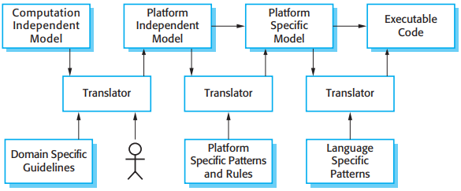

# 第5章 系统建模

[TOC]

## 5.1 上下文模型

## 5.2 交互模型

### 5.2.1 用例建模

### 5.2.2 时序图

## 5.3 结构模型

### 5.3.1 类图

### 5.3.2 泛化

### 5.3.3 聚合

## 5.4 行为模型

行为模型是描述系统运行时的动态行为的模型，表示当系统响应来自所处环境的刺激时所发生的或有可能发生的事情。这样的刺激有两种：

1. 数据：
2. 事件：

### 5.4.1 数据驱动的建模

### 5.4.2 事件驱动模型

## 5.5 模型驱动工程

## 5.5.1 模型驱动体系结构

MDA方法认为应该产生3种类型的抽象系统模型：

1. 计算独立模型（CIM）。
2. 平台独立模型（PIM）。
3. 平台特定模型（PSM）。

*MDA变换*

### 5.5.2 可执行UML

为了建立一个UML可执行的子集，模型类型的数量已经被削减为3个主要的模型类型：

1. 领域模型：识别出系统的主要关注点，然后由UML的类图定义，其中包括对象，属性和关联。
2. 类模型：在类模型中定义类以及它们的属性和操作。
3. 状态模型：状态模型中的每一个状态图都与一个类相关联，并且用来描述类的生命周期。
