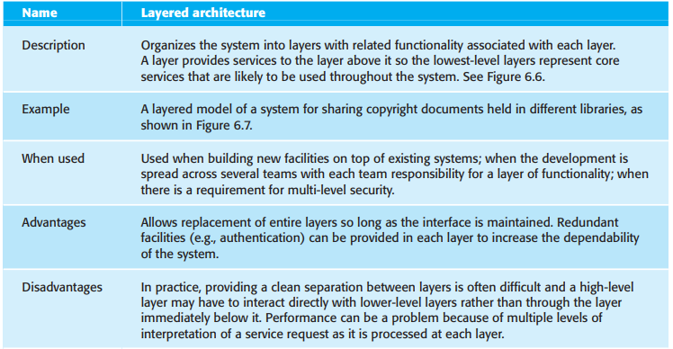
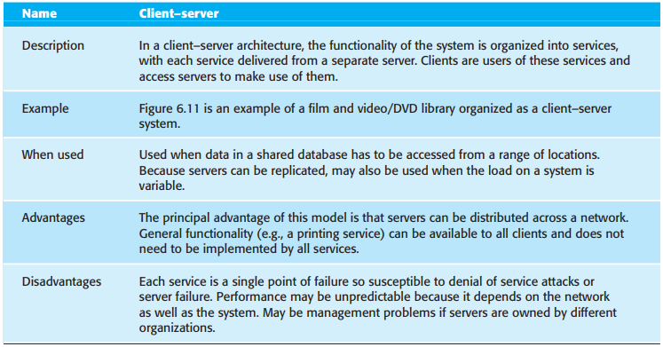
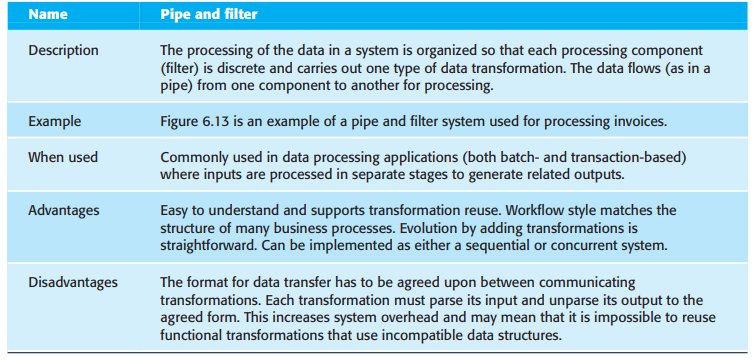

# 6 Architectural design

[TOC]

Three advantages of explicitly designing and documenting software architecture:

1. `Stakeholder communication` The architecture is a high-level presentation of the system that may be used as a focus for discussion by a range of different stakeholders.
2. `System analysis` Making the system architecture explicit at an early stage in the system development requires some analysis.
3. `Large-scale reuse` A model of a system architecture is a compact, manageable description of how a system is organized and how the components interoperate. 

## Architectural design decisions

Because of the close relationship between non-functional requirements and software architecture style and structure that you choose for a system should depend on the non-functional system requirements:

1. Performance
2. Security
3. Safety
4. Availability
5. Maintainability.

## Architectural views

View model of software architecture:

1. A logical view, which shows the key abstractions in the system as objects or object classes.
2. A process view, which shows how, at run-time, the system is composed of interacting processes.
3. A development view, which shows how the software is decomposed for development, that is, it shows the breakdown of the software into components that are implemented by a single developer or development team.
4. A physical view, which shows the system hardware and how software components are distributed across the processors in the system.

## Architectural patterns

*The model-view-controller (MVC) pattern*

### Layered architecture

*The layered architecture pattern*

### Repository architecture

*The repository pattern*

### Client-server architecture

*The client-server pattern*

### Pipe and filter architecture

*The pipe and filter pattern*

## Application architectures

As a software designer, you can use models of application architectures in a number of ways:

1. As a starting point for the architectural design process.
2. As a design checklist.
3. As a way of organizing the work of the development team.
4. As a means of assessing components for reuse.
5. As a vocabulary for talking about types of applications.

### Transaction processing systems

*The structure of transaction processing applications*