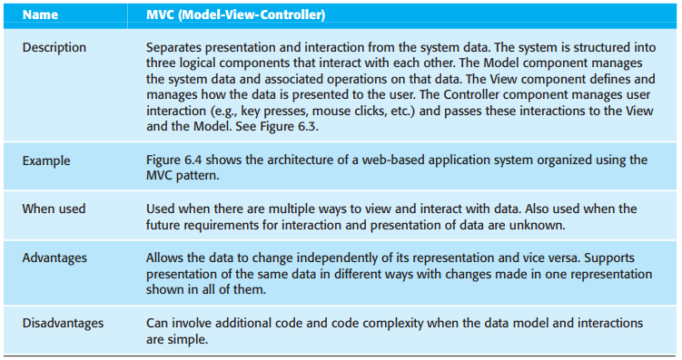
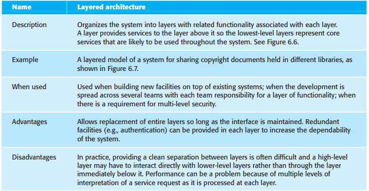
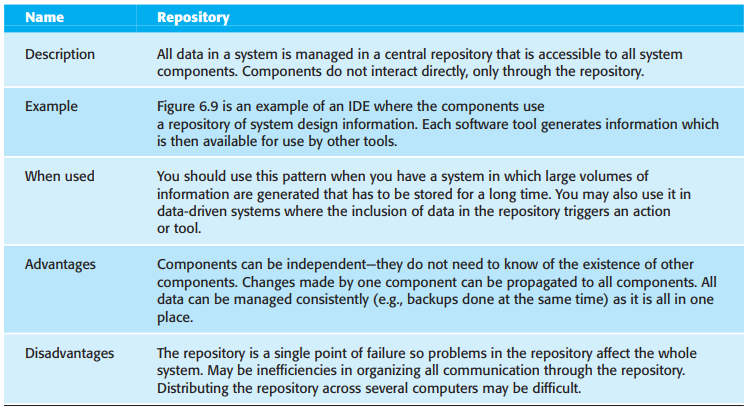
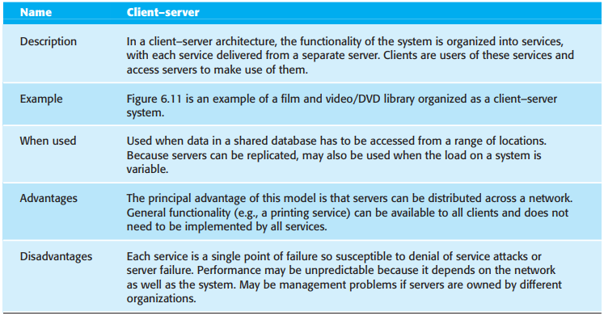
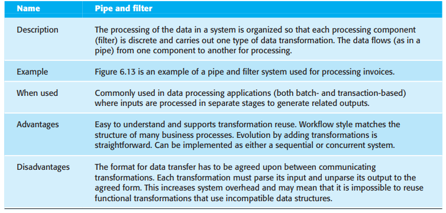
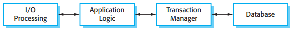

# 第6章 体系结构设计

[TOC]

明确设计和文档化软件体系结构的好处：

1. 信息持有者之间的沟通：体系结构是系统的一个高层表示，可以作为不同的信息持有者之间讨论的焦点。
2. 系统分析：体系结构设计决策对系统能否满足关键性需求（如系统的性能，可靠性和可维护性等）具有极深的影响。
3. 大规模复用：系统体系结构的模型是一个紧凑的，易于管理的描述，描述系统如何组织和组件间如何交互。

## 6.1 体系结构设计决策

由于非功能性需求和软件体系结构的密切关系，我们为系统所选择的特殊的体系结构风格和结构应当依赖于非功能性系统需求：

1. 性能
2. 信息安全性
3. 安全性
4. 可用性
5. 可维护性

## 6.2 体系结构视图

4种基础的体系结构视图：

1. 逻辑视图
2. 进程视图
3. 开发视图
4. 物理视图

## 6.3 体系结构模式

*模型-视图-控制器（MVC）模式*

### 6.3.1 分层体系结构

*分层体系结构模式*

### 6.3.2 容器体系结构

*容器模式*

### 6.3.3 客户机-服务器体系结构

*客户机-服务器模式*

### 6.3.4 管道和过滤器体系结构

*管道和过滤器模式*

## 6.4 应用体系结构

作为一名软件设计人员，我们可以以多种方式来使用这些应用体系结构模型：

1. 作为体系结构设计过程的一个起点
2. 作为设计检查列表
3. 作为对开发团队工作的组织方式
4. 作为评估组件以便复用的手段
5. 作为交流应用类型的词汇

### 6.4.1 事务处理系统

*事务处理应用的体系结构*

### 6.4.2 信息系统

### 6.4.3 语言处理系统

## 总结

TODO