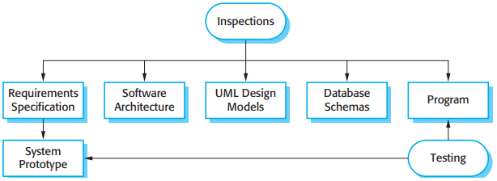

# 第8章 软件测试

[TOC]

测试过程有两个截然不同的目标：

1. 向开发者和用户展示软件满足了需求。
2. 找出软件中的缺陷和不足，即软件的行为是不正确的，所不希望的或不符合它的描述的。

*程序测试的输入-输出模型*

*审查和测试*

*软件测试过程模型*

典型地，一个商业软件系统要经过3个阶段的测试：

1. 开发测试，即在开发中进行系统测试来发现故障和缺陷。
2. 发布测试，即一个测试小组对一个系统的完整版本进行测试，然后发布给用户。
3. 用户测试，即系统的用户或是潜在的用户在他们自己的环境中测试这个系统。

## 8.1 开发测试

在开发过程中，可在3个粒度级别进行测试：

1. 单元测试，即对单独地程序单元或对象类进行测试。
2. 组件测试，即将多个程序单元整合创建一个合成的组件。
3. 系统测试，即集成系统中的一些或所有的组件作为一个整体进行测试。

### 8.1.1 单元测试

当我们测试对象类时，我们应该设计测试来提供对对象所有特征的覆盖。这意味着我们必须：

- 测试与对象相关的所有操作；
- 设置和检查与对象相关的所有属性；
- 让对象处于所有可能的状态下，就是说要模拟所有能改变对象状态的事件。

一个自动化测试有3个部分：

1. 准备部分，用测试用例初始化系统，即输入和期望的输出。
2. 调用部分，即调用所要测试的对象或方法。
3. 断言部分，即比较调用的结果和预期的结果是否相同。

### 8.1.2 选择单元测试案例

有效性意味着两件事：

1. 测试案例应该表明，当按照预期的方式使用时，所测试的组件能够像假设的那样去执行。
2. 如果在组件中有缺陷，这些缺陷应该被测试案例发现。

可能会有效地帮助我们选择测试案例的策略：

1. 划分测试，即识别具有共同特征和以同样的方法处理的一组数据。
2. 基于准则测试，即使用测试准则来选择测试案例。

*等价划分*

### 8.1.3 组件测试

在程序组件之间有各种接口类型：

1. 参数接口
2. 共享内存接口
3. 程序接口
4. 消息传递接口

接口错误可以分为以下几类：

1. 接口误用
2. 接口误解
3. 时序错误

接口测试的一般准则有：

1. 审查要测试的代码并明确地列出对外部组件的每个调用。
2. 当有指针从接口传递时，总用空指针参数来测试接口。
3. 当组件通过程序接口被调用时，设计一些容易引起组件失败的测试。
4. 在消息传递系统中进行强度测试。
5. 当组件间通过共享内存来交互时，可以设计一种测试，使其对激活组件的次序有所改变。

### 8.1.4 系统测试

## 8.2 测试驱动开发

*测试驱动的开发*

测试驱动开发的优势：

1. 代码覆盖
2. 回归测试
3. 简化调试
4. 系统文档
5. 容易理解

## 8.3 发布测试

在开发过程中，发布测试和系统测试之间有两个重要的区别：

1. 一个独立的与系统开发无关的小组应该负责发布测试。
2. 开发组的系统测试的重点是在系统中发现错误（缺陷测试）。发布测试的目标是检查系统符合他的需求描述，并且足可以对外销售（有效性验证测试）。

### 8.3.1 基于需求的测试

### 8.3.2 情景测试

### 8.3.3 性能测试

## 8.4 用户测试

实际上，存在3种不同的用户测试类型：

1. α测试，软件的用户与开发小组一起在开发者的地点测试这个软件。
2. β测试，该软件的版本是提供给用户让他们进行试验，并向开发者提出他们所发现的问题。
3. 接收测试，客户测试系统来决定他们是否愿意从系统开发者那里接收系统并在客户环境中部署。

在接收测试过程中有6个阶段：

*接收测试过程*

1. 定义接收准则
2. 计划接收测试
3. 导出接收测试
4. 运行接收测试
5. 协商测试结果
6. 拒绝/接收系统

## 总结

TODO