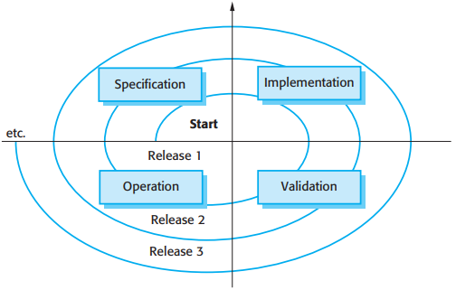
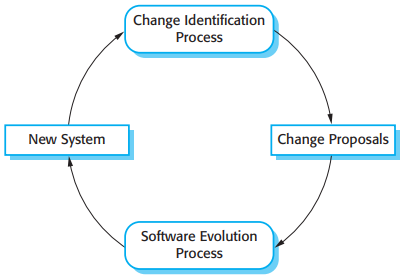
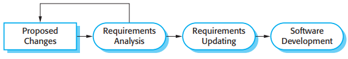
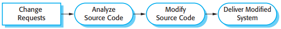
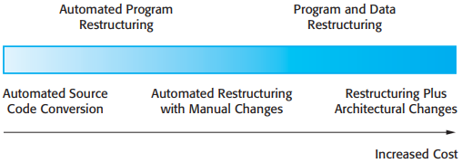
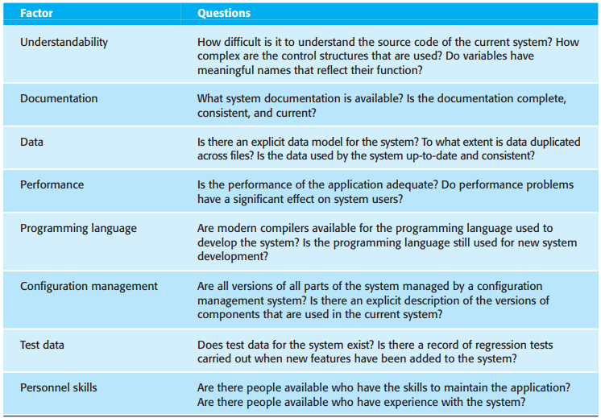

# 9 Software evolution

[TOC]

*A spiral model of development and evolution*

*Evolution and servicing*

## Evolution processes

*Change identification and evolution processes*

*The software evolution process*

*Change implementation*

*The emergency repair process*

## Program evolution dynamics

*Lehman's laws*

## Software maintenance

There are three different types of software maintenance:

1. `Fault repairs` Coding errors are usually relatively cheap to correct; design errors are more expensive as they may involve rewriting several program components.
2. `Environmental adaptation` This type of maintenance is required when some aspect of the system's environment such as the hardware, the platform operating system, or other support software changes.
3. `Functionality addition` This type of maintenance is necessary when the system requirements change in response to organizational or business change.

It is usually more expensive to add functionality after a system is in operation than it is to implement the same functionality during development. The reasons for this are:

1. `Team stability` After a system has been delivered, it is normal for the development team to be broken up and for people to work on new projects.
2. `Poor development practice` The contract to maintain a system is usually separate from the system development contract.
3. `Staff skills` Maintenance staff are often relatively inexperienced and unfamiliar with the application domain.
4. `Program age and structure` As changes are made to programs, their structure tends to degrade.

### Maintenance prediction

To evaluate teh relationships between a system and its environment, you should assess:

1. The number and complexity of system interfaces.
2. The number of inherently volatile system requirements.
3. The business processes in which the system is used.

*Maintenance prediction*

After a system has been put into service, you may be able to use process data to help predict maintainability:

1. Number of requests for corrective maintenance.
2. Average time required for impact analysis.
3. Average time taken to implement a change request.
4. Number of outstanding change requests.

### Software reengineering

There are two important benefits from reengineering rather than replacement:

1. Reduced risk.
2. Reduced cost.

*The reengineering process*

*Reengineering approaches*

### Preventative maintenance by refactoring

Refactoring is the process of making improvements to a program to slow down degradation through change. It means modifying a program to improve its structure, to reduce its complexity, or to make it easier to understand.

Fowler et al. s(1999) suggest that there are stereotypical situations (he calls them 'bad smells') in which the code of a program can be improved. Examples of bad smells that can be improved through refactoring include:

1. Duplicate code.
2. Long methods.
3. Switch (case) statements.
4. Data clumping.
5. Speculative generality.

## Legacy system management

For Legacy systems, there are foru strategic options:

1. Scrap the system completely.
2. Leave the system unchanged and continue with regular maintenance.
3. Reengineer the system to improve its maintainability.
4. Replace all or part of the system with a new system.

*An example of a legacy system assessment*

*Factors used in environment assessment*

*Factors used in application assessment*