# 第9章 软件进化

[TOC]

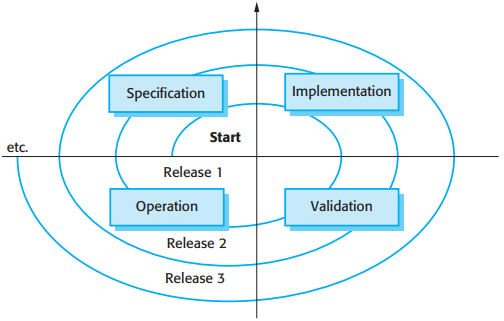

*开发和进化的螺旋模型*

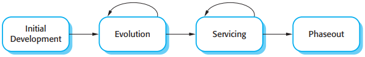

*进化与服务*

## 9.1 进化过程

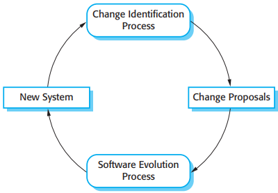

*变更发现和进化过程*

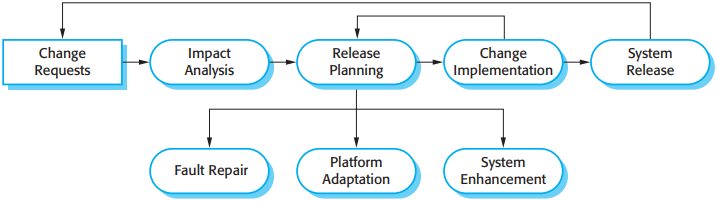

*软件进化过程*

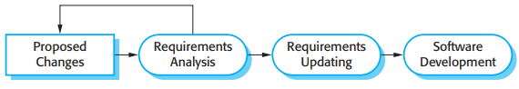

*变更实现*

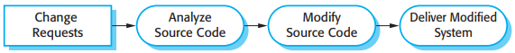

*紧急修补过程*

## 9.2 程序进化的动态特征

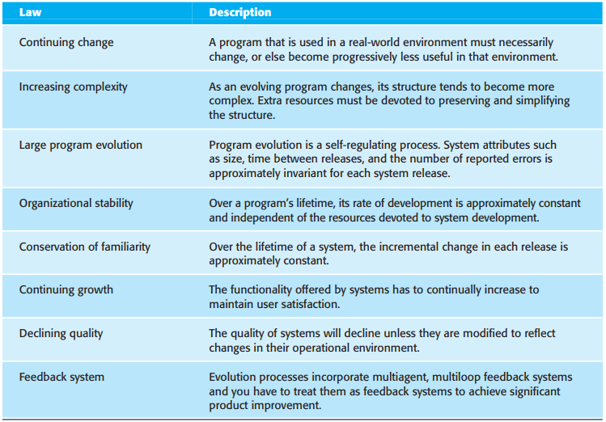

*Lehman定律*

## 9.3 软件维护

有3种不同类型的软件维护：

1. 修补软件缺陷
2. 使软件适应不同操作环境
3. 增加或修改系统功能

通常在系统投入使用后增加功能，较之在开发期间实现相同的功能代价要高得多。主要原因如下：

1. 团队稳定性
2. 糟糕的开发实践
3. 人员技术水平
4. 程序年龄和结构

### 9.3.1 维护预测

预测变更请求的数目需要了解系统和外部环境之间的关系，应该评估以下几点：

1. 系统接口的数目和复杂性
2. 固有的易变性系统需求的数目
3. 系统所处的业务过程

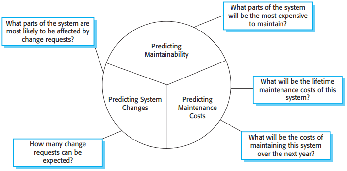

*维护预测*

对可维护性评估有用的过程量：

1. 请求纠正性维护的数目
2. 作用分析所需的平均时间
3. 实现一个变更请求的平均时间
4. 突出的变更请求的数目

### 9.3.2 软件再工程

再工程相对于直接替换系统来说，有两个重要的优势：

1. 较小的风险
2. 较小的成本

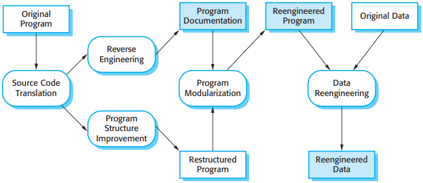

*再工程过程*

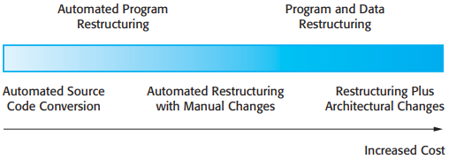

*再工程方法*

### 9.3.3 通过重构进行预防性维护

重构是提升程序以减缓其由于更改而退化的过程。它意味着通过修改程序来改进程序结构性，降低程序复杂性，让程序变得更加易于理解。

存在一些固定的情况，程序的代码能够被改进。这些能够通过重构被改进的情况包括：

1. 冗余代码
2. 长方法
3. 选择语句
4. 数据聚集
5. 假设的一般性

## 9.4 遗留系统管理

对遗留系统，有4种基本选择：

1. 彻底抛弃这个系统
2. 继续维护这个系统
3. 对系统再工程以改善其可维护性
4. 以一个新的系统代替整个或部分系统

环境评估中考虑的因素：

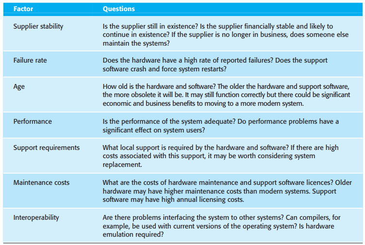

应用评估中使用的因素：

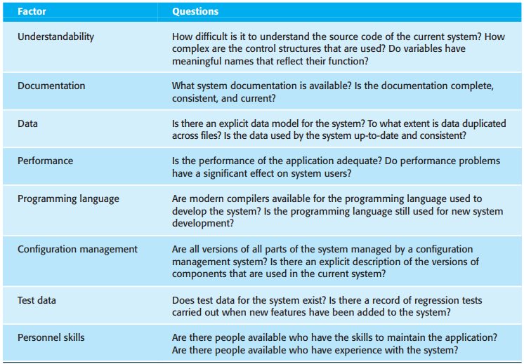

## 总结

TODO