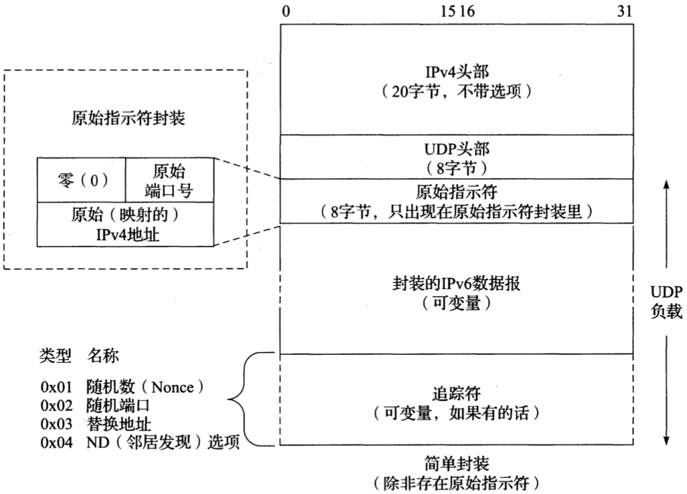

# 第十章 用户数据报协议和IP分片

[TOC]

## 引言

*单个IPv4数据报中的UDP数据报封装（通常情况下没有IPv4选项）。IPv6封装是类似的，UDP头部跟随在头部链之后。*

## UDP头部

*UDP头部和负载（数据）区。校验和（Checksum）字段是端到端的，是对包含了IP头部中的源（Source）和目的IP地址（Destination Address）字段的UDP伪头部计算得到的。因此，任何对这些字段的修改（如，由NAT）都需要对UDP校验和进行修改。*

**注意：端口号在不同的传输协议之间是独立的，即TCP端口只能被TCP使用，UDP端口只能被UDP使用**

## UDP校验和

*用于计算UDP/IPv4数据报的字段，包含了伪头部，UDP头部和数据。如果数据不是偶数个字节长，它会被填充一个值为0的字节以计算校验和。伪头部和任何填充的数据不会于数据报一起被传出去。*

**注意：当一个UDP/IPV4数据报穿过一个NAT时，不仅IP层头部的校验和要被修改，而且UDP伪头部的校验和也必须被正确地修改，因为IP层的地址和`/`或UDP层的端口号可能会改变。**

## UDP和IPv6

*使用IPv6的UDP（以及TCP）伪头部（[RFC2460]）。这个伪头部包含了源和目的IPv6地址以及一个更大的32位的长度字段值。UDP用于IPv6时，伪头部检验和是必需的，因为IPv6头部缺少校验和。下一个头部字段拷贝于链中的最后一个IPv6头部*

**注意：1. 在IPv6里，最小MTU大小是1280字节（与IPv4要求的需要所有主机支持的最小大小576字节不同）；2. IPv6支持超长数据报（>65535字节的分组）；**

### Teredo：通过IPv4网络隧道传输IPv6

`Teredo隧道` 通过把IPv6数据报放置于UDP/IPv4数据报的负载区，来为其它IPv6连接选项的系统传送IPv6数据报。

*Teredo，一种IPv6过渡机制，在UDP/IPv4数据报的负载区中封装IPv6数据报和可选的追踪符，以使IPv6流量能经过只支持IPv4的基础设施。服务器帮助客户机获得一个IPv6地址并决定它们的映射地址和端口号。如果需要，中继器在Teredo，6to4及原生IPv6客户机间转发流量*

*Teredo使用的简单封装和原始指示符封装。原始指示符封装在UDP头部和被封装的IPv6数据报之间携带了UDP地址和端口号信息。在产生一个Teredo地址时，这些信息可以使得Teredo客户机知道他们的映射地址和端口号。地址和端口号被按位取反，从而显得“混乱”，这是为了避免NAT试图去重写这些信息。可能存在零或多个追踪符，被编码成TLV三元组。他们被用于实现许多Teredo扩展（比如支持对称NAT）*

*Teredo客户机使用带Teredo前缀`2001::/32`的IPv6地址。随后位包含了Teredo服务器的IPv4地址，16位标志（用于标识用到的NAT类型和随机位以帮助阻止地址猜测攻击），客户机的16位映射端口号，以及客户机的32位映射IPv4地址。最后两项是“混乱的”*

Teredo追踪符被携带在封装于UDP/IPv4数据报里的IPv6负载之后。每个追踪符都有一个类型值，名称和对应的诠释。某些情况下，长度值是一个常数：

| 类型 | 长度    | 名称               | 用途                | 备注                                                 |
| ---- | ------- | ------------------ | ------------------- | ---------------------------------------------------- |
| 0x00 | 保留    | 未分配             | 未分配              | 未分配                                               |
| 0x01 | 0x04    | 随机数（Nonce）    | SNS，UP，PP，SP，HP | 32位的随机数，用于防治重放攻击                       |
| 0x02 | 保留    | 未分配             | 未分配              | 未分配                                               |
| 0x03 | [8, 26] | 替换地址           | HP                  | 位于同一个NAT后面的Teredo客户机使用的额外的地址/端口 |
| 0x04 | 0x04    | ND（邻居发现）选项 | SLR                 | 允许NAT使用直接气泡（带NS消息）来进行更新            |
| 0x05 | 0x02    | 随机端口           | PP                  | 发送方的预测映射端口                                 |

## UDP-Lite

*UDP-Lite包含了一个`校验和覆盖范围`字段，这个字段给出被校验和覆盖的字节数（从UDP-Lite头部的第1个字节开始）。最小值是0，表示整个数据报都被覆盖。值`1~7`是无效的，因为头部总是要被覆盖的。UDP-Lite使用一个与UDP（17）不同的IPv4协议号（136）。IPv6在下一个头部字段中使用相同的值*

## IP分片

### 例子：UDP/IPv4分片

*一个带有2992字节UDP负载的UDP数据报被分片成三个UDP/IPv4分组（没有选项）。包含源和目的端口号的UDP头部只出现在第一个分片里（对防火墙和NAT来说，这是一个复杂因素）。分片由IPv4头部中的标识（Identification），分片偏移（Fragment Offset）和更多分片（More Fragments，MF）字段控制*

### 重组超时

一个数据报的任何一个分片首先到达时，IP层就得启动一个计时器。如果不这样做的话，不能到达的分片可能会最终导致接收方用尽缓存，留下一种攻击机会。

## 最大UDP数据报长度

**理论上**，一个IPv4数据报的最大长度是65535字节，这由IPv4头部的16位`总长度字段`决定。对于IPv6，在没有使用超长数据报的情况下，16位`负载长度`字段可允许655527字节的有效UDP负载。然而在现实中会受到一些限制。

### 实现限制

UDP协议的实现提供了一个API套接字函数`setsocketopt()`来设置UDP数据报最大大小。

### 数据报截断

UDP编程接口允许应用程序指定每次一个网络的读操作完成时返回的最大字节数，如果接受的数据报操作这个指定大小会发生API`截断（truncate）`数据报行为。

## UDP服务器的设计

### 限制远端IP地址

UDP服务器的三种地址绑定方式：

| 本地地址              | 远端地址                | 描述                                       |
| --------------------- | ----------------------- | ------------------------------------------ |
| `local_IP.local_port` | foreign_IP.foreign_port | 限制只有一台客户机可用                     |
| `local_IP.local_port` | `*.*(wildcard)`         | 限制本地IP地址和端口（但对所有客户机开放） |
| `*.local_port`        | `*.*(wildcard)`         | 只限制本地端口                             |

## 与UDP和IP分片相关的攻击

`DoS攻击` 使用UDP的Dos攻击瞬间产生大量的流量，因为UDP不能管理它的流量发送率，从而对其它应用产生负面影响。

`放大(magnification)攻击` 攻击者发送小部分流量，从而致使其他系统产生更多的流量。

`IP分片攻击` 利用IPv4重组程序的漏洞，发送不带任何数据的分片，导致系统崩溃。

`泪滴（teardrop）攻击` 使用可使某些系统崩溃或严重受影响的`重叠分片偏移(Fragment Offset)`字段来精心构造一系列分片。

