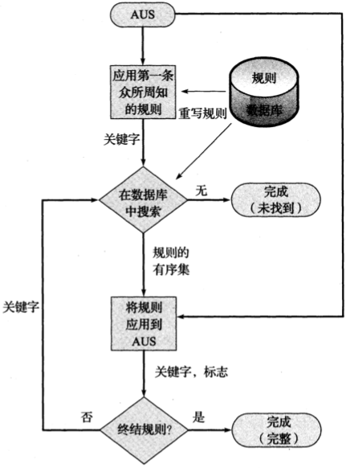
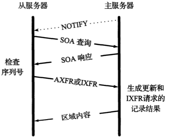
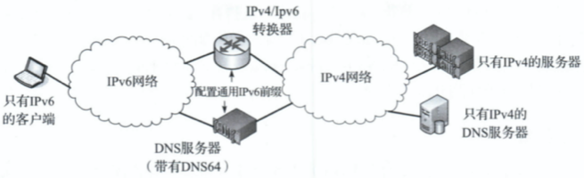

# 名称解析和域名系统

[返回目录](README.md)

## DNS名称空间
DNS名称空间形成了层级结构，顶部的树根未命名。顶级域名TLD包含：

- gTLD：通用顶级域名

  - 通用

  - 通用限制
  - 赞助
- ccTLD：国际代码顶级域名
- IND ccTLD：国际化国家代码顶级域名
- ARPA（基础设施）

通用顶级域名列表：

| TLD    | 用途                      |
| ------ | ------------------------- |
| AERO   | 航空运输行业              |
| ARPA   | 基础设施                  |
| ASIA   | 泛亚洲和亚太地区          |
| BIZ    | 商业用途                  |
| CAT    | 加泰罗尼亚语语言/文化社区 |
| COM    | 通用                      |
| COOP   | 合作协会                  |
| EDU    | 美国公认的中学后教育机构  |
| GOV    | 美国政府                  |
| INFO   | 通用                      |
| INT    | 国际条约组织              |
| JOBS   | 人力资源管理者            |
| MIL    | 美国军方                  |
| MOBI   | 客户/移动产品供应商/服务  |
| MUSEUM | 博物馆                    |
| NAME   | 个体                      |
| NET    | 通用                      |
| ORG    | 通用                      |
| PRO    | 持证专业人士/实体         |
| TEL    | 企业/个体联系资料         |
| TRAVEL | 旅游业                    |
| XXX    | 成人娱乐业                |

### DNS命名语法

顶级域名（TLD）+子域名（subdomain）

## DNS协议

主要由2部分构成：

1. 用于执行对DNS特定名称查询的`查询/响应协议`
2. 名称服务器用于交换数据库记录的协议（区域传输）

### DNS消息格式

dns消息末尾的可变长度区段包含：问题，回答，授权，额外信息等名称；每个名称由一系列标签组成；

标签分2类：

- 数据标签（data label）：包含标签字符

  格式：`[接下来的标签字符长度+标签字符]+[接下来的标签字符长度+标签字符]+...+0`

  例:`www.person.com`的标签值如下:`|3|w|w|w|7|p|e|a|r|s|o|n|3|c|o|m|0|`

  **注意:标签字符最长63字节**

- 压缩标签（compression label）：

  例:`usc.edu`和`ucla.edu`的压缩标签值如下:`|3|u|s|c|3|e|d|u|0|4|u|c|l|a|192|4|0|`

  192: 表示压缩标签

  192后面的4表示: 偏移到`index=4`的位置:`...|3|...`

  压缩标签可以通过引用其他标签从而节省空间

RCODE域中使用的前10个错误类型：

| 值   | 名称     | 参考      | 描述和目的                           |
| ---- | -------- | --------- | ------------------------------------ |
| 0    | NoError  | [RFC1035] | 没有错误                             |
| 1    | FormErr  | [RFC1035] | 格式错误；查询不能被解读             |
| 2    | ServFail | [RFC1035] | 服务器失效；服务器的处理错误         |
| 3    | NXDomain | [RFC1035] | 不存在域名；引用了未知域名           |
| 4    | NotImp   | [RFC1035] | 没有实现；请求在服务器端不被支持     |
| 5    | Refused  | [RFC1035] | 拒绝；服务器不希望提供回答           |
| 6    | YXDomain | [RFC2136] | 名称存在但是不应该存在（用于更新）   |
| 7    | YXRRSet  | [RFC2136] | RRSet存在但是不应该存在（用于更新）  |
| 8    | NXRRSet  | [RFC2136] | RRSet不存在但是应该存在（用于更新）  |
| 9    | NotAuth  | [RFC2136] | 服务器不是为该区域授权的（用于更新） |
| 10   | NotZone  | [RFC2136] | 在区域中不包含名称（用于更新）       |

### UDP或TCP

DNS名字服务器使用的熟知端口号无论对UDP还是TCP都是53。

DNS同时支持UDP和TCP，一般使用UDP，以下2种情况需要使用TCP：

- 当查询数据过大以至于产生了数据截断（TC标志为1），这时，需要利用TCP的分片能力来进行数据传输。
- 当主服务器（master）和辅服务器（slave）之间通信，辅服务器要拿到主服务器的zone信息。

IPv4 UDP数据报：

| IPv4           | UDP头部 | DNS固定头部 | 问题区段 | 回答区段 | 授权区段 | 额外信息区段 |
| -------------- | ------- | ----------- | -------- | -------- | -------- | ------------ |
| 20字节：无选项 | 8字节   | 12字节      | 可变长   | 可变长   | 可变长   | 可变长       |

DNS消息通常封装在UDP/IPv4数据报中，并且其长度限制为512字节，除非不使用TCP和EDNS0.每个区段（除了问题区段）包含一组资源记录；

小的消息用UDP传输，消息太大就会切换成TCP

#### 问题区段格式

- 查询名称（Query Name）: 要被查询的域名
- 查询类型（Query Type）: 正在执行的查询类型
- 查询类（Query Class）: 
  - 1: 互联网类
  - 254: 没有类
  - 255: 所有类

#### 回答.授权.额外区段格式

- 名称: 拥有者
- 类型: PR类型
- 类: 1: 互联网...
- TTL: RR可以被缓存的秒数
- RDLENGTH: 资源数据长度；指定了`RDATA`字段中包含的字节数
- RDATA: 资源数据

### 资源记录类型

传统的DNS（即没有NDSSEC安全扩展的DNS）中使用的最常见RR类型列表：

| 值   | RR类型 | 参考                   | 描述和目的                                                   |
| ---- | ------ | ---------------------- | ------------------------------------------------------------ |
| 1    | A      | [RFC1035]              | IPv4地址记录（32位IPv4地址）                                 |
| 2    | NS     | [RFC1035]              | 名称服务器；提供区域授权名称服务器的名称                     |
| 5    | CNAME  | [RFC1035]              | 规范名称；讲一个名称映射为另一个（提供一种形式的名称别名）   |
| 6    | SOA    | [RFC1035]              | 授权开始；为区域提供授权信息（名称服务器，联系的电子邮件地址，序列号，区域传输计时器） |
| 12   | PTR    | [RFC1035]              | 指针；提供地址到（规范）名称的映射；在`in-addr.arpa`和`ip6.arpa`域中用于IPv4和IPv6的逆向查询 |
| 15   | MX     | [RFC1035]              | 邮件交换器；为一个域提供电子邮件处理主机的名称               |
| 16   | TXT    | [RFC1035] [RFC1464] | 文本；提供各种信息（如，与SPF发垃圾邮件方案一起使用以识别授权电子邮件服务器） |
| 28   | AAAA   | [RFC3596]              | IPv6地址记录（128位IPv6地址）                                |
| 33   | SRV    | [RFC2782]              | 服务器选择；通用服务的传输终点                               |
| 35   | NAPTR  | [RFC3403]              | 名称授权指针；支持交替的名称空间                             |
| 41   | OPT    | [RFC2671]              | 伪RR；支持更大的数据报，标签，ENDS0中的返回码                |
| 251  | IXFR   | [RFC1995]              | 增量区域传输                                                 |
| 252  | AXFR   | [RFC1035] [RFC5936] | 完全区域传输；通过TCP运载                                    |
| 255  | (ANY)  | [RFC1035]              | 请求任意记录                                                 |

#### 地址A,AAAA和名称服务器记录NS

A记录包含32位的IPv4地址；AAAA记录包含IPv6地址；NS记录包含授权DNS服务器的名称，该服务器包含一个特定区域的信息。

#### 逆向DNS查询

- 正向查询：根据域名查ip

- 反向查询：根据ip查域名

  DNS使用另一棵子树来维护`ip->域名`的对应表，这个子树的根节点是`in-addr.arpa`，例：一个IP(`192.168.11.2`)所具有的DNS地址是`2.11.168.192.in-addr.arpa`(ip倒置)。在DNS系统里面，一个反向地址对应一个PTR记录（对应A记录），所以反向查询又叫做**指针查询(PTR)**。

#### 权威记录SOA

授权启动（SOA）：提供部分DNS名称空间和服务器之间的授权联系，允许对地址和其他信息进行查询以提供区域信息。

#### 邮件交换记录MX

邮件交换器（mail exchanger）:为在简单邮件传输协议（SMTP）中愿意代表与域名相关的用于接收传入电子邮件的主机。

#### 选项伪记录OPT

扩展RCODE值，大部分被用来支持安全扩展：

| 值   | 名称    | 参考      | 描述和目的             |
| ---- | ------- | --------- | ---------------------- |
| 16   | BADVERS | [FRC2671] | 坏EDSN版本             |
| 16   | BADVERS | [FRC2845] | 坏TSIG签名             |
| 17   | BADKEY  | [FRC2845] | 坏TSIG密钥             |
| 18   | BADTIME | [FRC2845] | 坏TSIG签名（时间问题） |
| 19   | BADMODE | [FRC2930] | 坏TKEY模式             |
| 20   | BADMODE | [FRC2930] | 重复密钥名称           |
| 21   | BADALG  | [FRC2930] | 不支持的算法           |

#### 名称授权指针记录

- 动态委托发现系统（DDDS）

  一般是抽象的算法，它将动态检索字符串转换规则应用于应用程序提供的字符串，并经常使用结果定位资源。

  

- 名称授权指针（NAPTR）

#### URI,URN解析

URN（Uniform Resource Names 统一资源名称）

#### 动态更新DNS_UPDATE

向一个区域的授权DNS服务器发送动态更新的DNS消息，服务器收到消息后评估先决条件（prerequisite），为真就执行更新。

5种先决条件: todo

| 先决条件类型（语义）    | 类设置         | 类型设置         | RDATA设置         |
| ----------------------- | -------------- | ---------------- | ----------------- |
| RRSet存在（不依赖于值） | ANY            | 与区域的类型相同 | 空                |
| RRSet存在（依赖于值）   | 与区域的类相同 | 正在被检查的类型 | 正在被检查的RRSet |
| RRSet不存在             | NONE           | 正在被检查的类型 | 空                |
| 名称在使用              | ANY            | ANY              | 空                |
| 名称没有使用            | NONE           | ANY              | 空                |

Update区段中使用的RR类和类型字段说明了更新类型: todo

| 用法                    | 类设置         | 类型设置              | RDATA                    |
| ----------------------- | -------------- | --------------------- | ------------------------ |
| 向RRSet添加RR           | 与区域的类相同 | 正被添加的RR的类型    | 正被添加的RR的RDATA      |
| 删除RRSet               | ANY            | 正被删除的RRSet的类型 | 空（TTL和RDLENGTH也是0） |
| 从名称中删除所有的RRset | ANY            | ANY                   | 空（TTL和RDLENGTH也是0） |
| 从RRset中删除RR         | NONE           | 正被删除的RR的类型    | 要删除的匹配的RDATA      |

### 区域传输和DNS通知

主服务器到从服务器内容同步。

## 从IPv4向IPv6转换DNS

## LLMNR和mDNS

- LLMNR（Link-Local Multicast Name Resolution, 本地链路组播名称解析）

  由微软开发的基于DNS的（非标准）协议，在本地环境中使用以帮助发现局域网上的设备，如打印机和文件服务器。对于IPv4组播地址`224.0.0.252`和IPv6地址`ff02::1:3`，它使用UDP端口5355。

- mDNS（multicast DNS, 组播DNS）

  由苹果公司开发，与DNS服务发现协议结合，通过本地组播地址携带的DNS消息，使用UDP端口5353，该TLD中的域名的任何DNS查询被发送到IPv4地址`224.0.0.251`或IPv6地址`ff02::fb`。使用`.local`域名格式分配，例：`printer.local`。