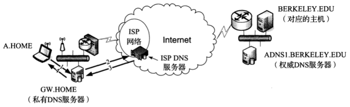

# 名称解析和域名系统

[返回目录](README.md)

## DNS名称空间
DNS名称空间形成了层级结构，顶部的树根未命名。顶级域名TLD包含：

- gTLD：通用顶级域名

  - 通用

  - 通用限制
  - 赞助

- ccTLD：国际代码顶级域名

- IND ccTLD：国际化国家代码顶级域名

- ARPA（基础设施）

### DNS命名语法

顶级域名（TLD）+子域名（subdomain）

## 名称服务器和区域

## 缓存

## DNS协议

主要由2部分构成：

1. 用于执行对DNS特定名称查询的`查询/响应协议`
2. 名称服务器用于交换数据库记录的协议（区域传输）

### DNS消息格式

dns消息末尾的可变长度区段包含：问题，回答，授权，额外信息等名称；每个名称由一系列标签组成；

标签分2类：

- 数据标签（data label）：包含标签字符

  格式：`[接下来的标签字符长度+标签字符]+[接下来的标签字符长度+标签字符]+...+0`

  例:`www.person.com`的标签值如下:`|3|w|w|w|7|p|e|a|r|s|o|n|3|c|o|m|0|`

  **注意:标签字符最长63字节**

- 压缩标签（compression label）：

  例:`usc.edu`和`ucla.edu`的压缩标签值如下:`|3|u|s|c|3|e|d|u|0|4|u|c|l|a|192|4|0|`

  192: 表示压缩标签

  192后面的4表示: 偏移到`index=4`的位置:`...|3|...`

  压缩标签可以通过引用其他标签从而节省空间

### UDP或TCP

IPv4 UDP数据报：

| IPv4           | UDP头部 | DNS固定头部 | 问题区段 | 回答区段 | 授权区段 | 额外信息区段 |
| -------------- | ------- | ----------- | -------- | -------- | -------- | ------------ |
| 20字节：无选项 | 8字节   | 12字节      | 可变长   | 可变长   | 可变长   | 可变长       |

DNS消息通常封装在UDP/IPv4数据报中，并且其长度限制为512字节，除非不使用TCP和EDNS0.每个区段（除了问题区段）包含一组资源记录；

小的消息用UDP传输，消息太大就会切换成TCP

**问题区段格式**

- 查询名称（Query Name）: 要被查询的域名
- 查询类型（Query Type）: 正在执行的查询类型
- 查询类（Query Class）: 
  - 1: 互联网类
  - 254: 没有类
  - 255: 所有类

**回答-授权-额外区段格式**

- 名称: 拥有者
- 类型: PR类型
- 类: 1: 互联网...
- TTL: RR可以被缓存的秒数
- RDLENGTH: 资源数据长度；指定了`RDATA`字段中包含的字节数
- RDATA: 资源数据

### 资源记录类型

传统的DNS（即没有NDSSEC安全扩展的DNS）中使用的最常见RR类型列表：todo

| 值   | RR类型 | 参考 | 描述和目的 |
| ---- | ------ | ---- | ---------- |
|      |        |      |            |
|      |        |      |            |
|      |        |      |            |
|      |        |      |            |
|      |        |      |            |
|      |        |      |            |
|      |        |      |            |
|      |        |      |            |
|      |        |      |            |
|      |        |      |            |
|      |        |      |            |
|      |        |      |            |
|      |        |      |            |
|      |        |      |            |

**地址（A，AAAA）和名称服务器记录（NS）**

A记录包含32位的IPv4地址；AAAA记录包含IPv6地址；NS记录包含授权DNS服务器的名称，该服务器包含一个特定区域的信息。

**逆向DNS查询：PTR（指针）记录**

ip到名称的映射查询

