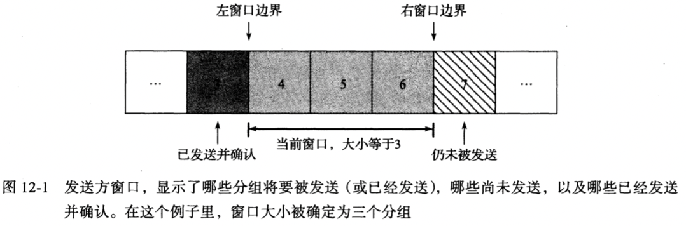
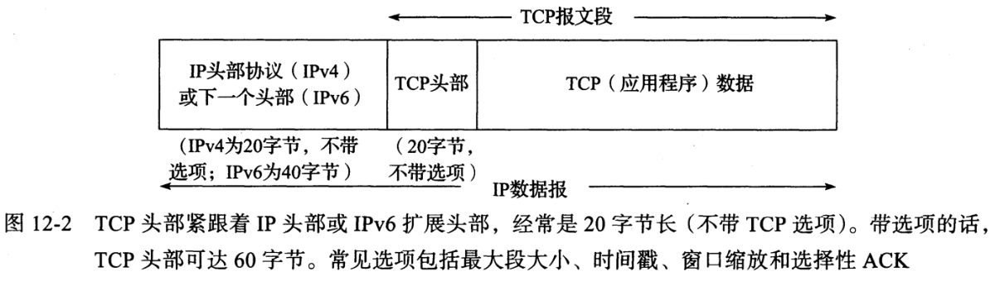
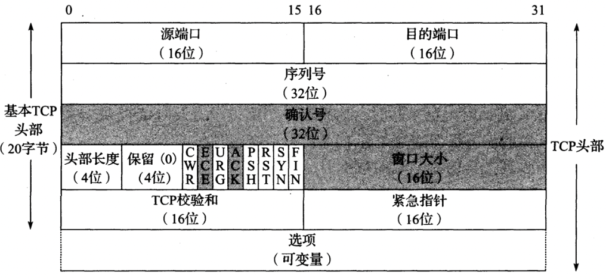

# 第十二章 TCP 传输控制协议

[TOC]

## ARQ和重传

`ARQ(Automatic Repeat Request，自动重复请求)`

`ACK(acknowledgment， 确认)`

### 分组窗口和滑动窗口

滑动窗口协议（sliding window protocol）示意：

*发送方窗口，显示了哪些分组将要被发送（或已经发送），哪些尚未发送，以及哪些已经发送并确认。在这个例子里，窗口大小被确定为三个分组*

### 变量窗口：流量控制和拥塞控制

流量控制（flow control）：在接收方跟不上时会强迫发送方慢下来，一共有2种方法：

- 基于速率（rate-based）流量控制

  给发送方指定某个速率，同时确保数据永远不能超过这个速率发送，适用于流应用程序。

- 基于窗口（windows-based）流量控制

  使用滑动窗口，窗口大小不是固定的，而是允许随时间而变动的；发送方使用**窗口通告(window advertisement)或窗口更新(window update)**调整窗口大小。

### 设置重传超时

RTT(round-trip-time estimation， 往返时间估计)

## TCP的引入

### TCP服务模型

TCP提供了一种*面向连接的(connection-oriented)，可靠的*字节流服务。

## TCP头部和封装

TCP在IP数据报中的封装：

*TCP头部紧跟着IP头部或IPv6扩展头部，经常是20字节长（不带TCP选项）。带选项的话，TCP头部可达60字节。常见选项包括最大段大小，时间戳，窗口缩放和选择性ACK*

TCP头部结构：

*TCP头部。它的标准长度是20字节，除非出现选项。`头部长度（Header Length）`字段以32位字为单位给出头部的大小（最小值是5）。带阴影的字段（`确认号（Acknowledgment Number）`，`窗口大小（Window Size）`以及ECE位和ACK位）用于与该报文段的发送方关联的相反方向上的数据流*

- `源端口` 与IP头部中的源地址组合成一个端点(endpoint)，用于唯一标识发送方。

- `目的端口` 与IP头部中的目的地址组合成一个端点(endpoint)，用于唯一标识接收方。

- `序列号` Sequence Number，标识TCP发送端到TCP接收端的数据流的一个字节，该字节代表着包含该序列号的报文段的数据中的第一个字节。

- `确认号` Acknowledgment Number，发送方期待接收的下一个序列号。

- `头部长度` 定义了头部的长度，长度单位为字（32bit）；TCP头部被限制为60字节，不带选项的TCP头部大小为20字节。

- `保留字段`

- `CWR` 缩小拥塞窗口，发送方用来降低它的发送速率

- `ECE` ECN回显，发送方收到了一个更早的拥塞通告

- `URG` 紧急，让`紧急指针`生效，很少使用

- `ACK` 确认，让`确认号字段`生效，建立连接后启用

- `PSH` 推送

- `RST` 重置连接 

- `SYN` 初始化同步序号

- `FIN` 发送数据结束

- `窗口大小` 用来通告窗口大小（单位：字节数，最大65535字节），实现流量控制

- `TCP校验和` 强制性的，由发送方进行计算和保存，由接收方验证。

- `紧急指针` Urgent Pointer，只有当`URG`字段被设置时生效；

- `选项`(变长)