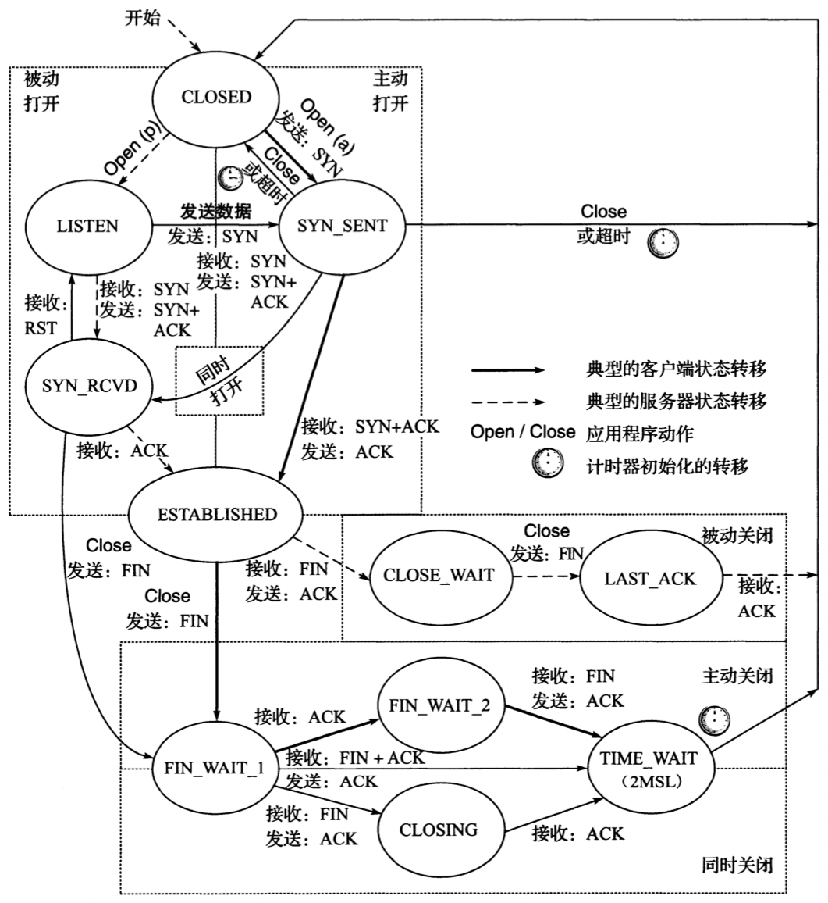

# TCP 连接管理

[TOC]


## TCP连接的建立与终止

```sequence
Title:一个普通TCP连接的建立与终止
Note over 客户端,服务端: 连接建立（三次握手）
客户端->服务端: SYN,Seq=ISN(c)(选项)
服务端-->客户端: SYN+ACK,Seq=ISN(s),ACK=ISN(c)+1(选项)
客户端->服务端: ACK,Seq=ISN(c)+1,ACK=ISN(s)+1(选项)

Note over 客户端,服务端: 连接关闭（修改的三次握手）
客户端->服务端: FIN+ACK,Seq=K,ACK=L(选项)
服务端-->客户端: ACK,Seq=L,ACK=K+1(选项)
服务端-->客户端: FIN+ACK,Seq=L,ACK=K+1(选项)
客户端->服务端: ACK,Seq=K,ACK=L+1(选项)

```

- `ISN` (Initial Sequence Number, 初始序列号)

一个普通TCP连接的建立和终止，通常由客户端负责发起一个三次握手过程；在该过程中，客户端与服务器利用SYN豹纹端交换彼此的初始序列号（包括客户端的初始序列号和服务器的初始序列号）；在通信双方都发送了一个FIN数据包并收到来自对方的相应的确认数据包后，该连接终止；

### 建立连接

1. 客户端发送一个SYN报文段（设置SYN字段），并指明想要连接的端口号和初始序列号ISN(c)；
2. 服务端发送SYN报文段，包含初始序列号ISN(s)，ACK = ISN(c)+1；
3. 发送ACK = ISN(s)+1 报文；

### 关闭连接

1. 客户端发送一个FIN报文段，包括：序列号（K），一个ACK段；用于确认对方最近一次发来的的数据（L）。
2. 服务端将ACK设置为K+1，以表明它已经成功接收到客户端发送的FIN报文段。
3. 服务端发送自己的FIN，序列号为L，以表明它以成功发送完数据。
4. 客户端发送一个ACK用于确认上一个FIN。

### TCP半关闭

```sequence
Title:TCP半关闭操作
Note over 客户端,服务端: 客户端发起关闭
客户端->服务端: FIN+ACK,Seq=K,ACK=L(选项)
服务端-->客户端: ACK,Seq=L,ACK=K+1(选项)

Note over 客户端,服务端: 连接处于半关闭状态
服务端-->客户端: [发送更多数据]
客户端->服务端: [数据确认]

Note over 客户端,服务端: 关闭连接的“另一半”
服务端-->客户端: FIN,Seq=L,ACK=K+1(选项)
客户端->服务端: ACK,Seq=K,ACK=L+1(选项)
```

在TCP半关闭操作中，连接的一个方向被关闭，而另一个方向仍在传输数据直到它被关闭为止；（很少有应用程序使用这一特性）

### 同时打开与关闭


### 初始序列号

TCP报文段伪造：选择合适的序列号，IP地址以及端口号，那么任何人都能伪造出一个TCP报文段，从而打断TCP的正常连接`[RFC5961]`。

Linux系统采用基于时钟的方案，并且针对每一个连接为时钟设置随机的偏移量，来设置初始序列号，从而防止TCP报文段被伪造。具体参考：`CA-2001-09[CERTISN]`。


## TCP选项

TCP选项数值，超过40个字节用于保存选项

| 种类 | 长度 | 名称           | 参考       | 描述与目的                       |
| ---- | ---- | -------------- | ---------- | -------------------------------- |
| 0    | 1    | EOL            | [RFC0793]  | 选项列表结束                     |
| 1    | 1    | NOP            | [RFC0793]  | 无操作（用于填充）               |
| 2    | 4    | MSS            | [RFC0793]  | 最大段大小                       |
| 3    | 3    | WSOPT          | [RFC01323] | 窗口缩放因子（窗口左移量）       |
| 4    | 2    | SACK-Permitted | [RFC02018] | 发送者支持SACK选项               |
| 5    | 可变 | SACK           | [RFC02018] | SACK阻塞（接收到乱序数据）       |
| 8    | 10   | TSOPT          | [RFC01323] | 时间戳选项                       |
| 28   | 4    | UTO            | [RFC05482] | 用户超时（一段空闲时间后的终止） |
| 29   | 可变 | TCP-AO         | [RFC05925] | 认证选项（使用多种算法）         |
| 253  | 可变 | Experimental   | [RFC04727] | 保留供实验所用                   |
| 254  | 可变 | Experimental   | [RFC04727] | 保留供实验所用                   |

- MSS

  TCP协议所允许的从对方接收到的最大报文段，不包括TCP头部和IP头部。

- SACK

  当收到乱序数据时，能提供一个SACK选项来描述这些乱序的数据，从而帮助对方有效的进行重传。

- WSOPT

  该选项可以有效的改变TCP窗口数值，通过将窗口字段值左移来成比例的扩大窗口数值；窗口数值的扩大公式为：$65535 \times 2^{S}$​​​，其中S为比例因子，取值范围[0, 14]；窗口数值最大为$65536 \times 2^{14}$​，约等于1GB。

- TSPOT

  时间戳选项要求发送方在每一个报文段中添加2个4字节的时间戳数值，接收方将会在确认中反映这些数值，允许发送方针对每一个接收到的ACK估算TCP连接的往返时间。

  防回绕序列号（Protection Against Wrapped Sequence numbers，PAWS），为接受者提供了避免接收旧报文段与判断报文段正确性的方法。

  TCP时间戳选项通过提供一个额外的32位有效序列号空间清除了具有相同序列号的报文段之间的二义性：

  | 时间 | 发送字节数 | 发送序列号 | 发送时间戳 | 接收                         |
  | ---- | ---------- | ---------- | ---------- | ---------------------------- |
  | A    | 0G:1G      | 0G:1G      | 1          | 完好                         |
  | B    | 1G:2G      | 1G:2G      | 2          | 完好，但一个报文段丢失并重传 |
  | C    | 2G:3G      | 2G:3G      | 3          | 完好                         |
  | D    | 3G:4G      | 3G:4G      | 4          | 完好                         |
  | E    | 4G:5G      | 0G:1G      | 5          | 完好                         |
  | F    | 5G:6G      | 1G:2G      | 6          | 完好，但重传的报文段重新出现 |

- UTO

  该选项是一个相对较新的TCP的功能，用户超时数值（USER_TIMEOUT）指明了TCP发送者在确认对方未能成功接收数据之前愿意等待该数据ACK确认时间。USER_TIMEOUT的计算方法如下：

  `USER_TIMEOUT = min(U_LIMIT, max(ADV_UTO, REMOTE_UTO, L_LIMIT))`

  - `U_LIMIT` 本地系统对用户超时选项设定的数值**上边界**
  - `L_LIMIT` 本地系统对用户超时选项设定的数值**下边界**
  - `ADV_UTO` 本端告知远端通信方的用户超时选项数值
  - `REMOTE_UTO` 远端通信方告知的用户超时选项数值

- TCP-AO

  (TCP Authentication Option，TCP-AO)，用于增强连接的安全性；使用一种加密散列算法以及TCP连接双方共同维护的一个秘密值来认证每一个报文段。


## TCP的路径最大传输单元发现

TCP常规的路径最大传输单元发现过程如下：在一个连接建立时，TCP使用对外接口的最大传输单元的最小值，或者根据通信对方声明的最大段大小来选择发送方的最大段大小（SMSS）。

最大传输单元如果没有声明，默认536字节。


## TCP状态转换

### TCP状态转换图



### 连接的建立与终止


### TIME_WAIT状态

TIME_WAIT状态也称为`2MSL等待状态`或`加倍等待`，TCP将会等待两倍于最大段生存期（Maximum Segment Lifetime, MSL）的时间；它代表任何报文段在被丢弃前在网络中被允许存在的最长时间，常见的值为：30秒，1分钟，2分钟...。

2MSL的值可以被修改，其值的保存位置如下：

- `linux`

  （单位：秒） `net.ipv4.tcp_fin_timeout`。

- `windows` 

  `HKLM\SYSTEM\CurrentControlSet\Services\Tcpip\Parameters\TcpTimeWaitDelay`。

影响2MSL等待状态的因素：

1. 当TCP执行一个主动关闭并发送最终的ACK时，连接必须处于TIME_WAIT状态并持续两倍于最大生存期的时间。这样就能让TCP重新发送最终的ACK以避免出现丢失的情况。重新发送最终的ACK并不是因为TCP重传了ACK（他们并不消耗序列号，也不会被TCP重传），而是因为通信另一方重传了它的FIN（它消耗一个序列号）。

2. 当TCP处于等待状态时，通信双方将该连接（客户端IP地址，客户端端口号，服务器IP地址，服务器端口号）定义为不可重新使用。

   只有当2MSL等待结束时，或一条新链接使用的初始序列号超过了连接之前的实例所使用的最高序列号时，或者允许使用时间戳选项来区分之前连接实例的报文段以避免混淆时，这条连接才能被再次使用。

有许多机制可以绕开2MSL限制，如：`SO_REUSEADDR`套接字选项...

2MSL的作用：

1. 在本地与外地的IP地址，端口号都相同的情况下，2MSL状态能够防止新的连接将前一个连接的延迟报文段解释成自身数据。

**静默时间**，[RFC0793]指出，在崩溃或者重启后TCP协议应当在创建新的连接之前等待相当于一个MSL的时间，该段时间被称为*静默时间*。

### FIN_WAIT_2状态

在FIN_WAIT_2状态，某TCP通信端已发送一个FIN并已得到另一端的确认，除非出现半关闭的情况，否则该TCP端将会等待另一端的应用程序识别出自己已接收到一个文件末尾的通知并关闭这一端引起发送FIN的连接。只有当应用程序完成了这一关闭操作（它的FIN已经被接收），正在关闭的TCP连接才会从FIN_WAIT_2状态转移至TIME_WAIT状态。这意味着连接的一端能够依然永远保持这种状态。另一端也会依然处于CLOSE_WAIT状态，并且能永远维持这一状态直到应用程序决定宣布他的关闭。

### 同时打开与关闭的转换

TODO


## 重置报文段

### 针对不存在端口的连接请求

- UDP协议

  当一个数据报到达一个不能使用的的目的端口时就会生成一个ICMP目的地不可达（端口不可达）的消息；

- TCP协议

  使用重置报文段；

### 终止一条连接

- 有序释放

  由通信一方发送一个FIN，因为FIN是在之前所有排队数据都已发送后才被发送出去，通常不会出现丢失数据的情况；

- 终止释放

  通过发送一个重置报文段替代FIN来终止一条连接；

终止一条连接可以为应用程序提供以下特性：

- 任何排队的数据都将被抛弃，一个重置报文段会被立即发送出去；
- 重置报文段的接收方会说明通信另一端采用了终止的方式而不是一次正常关闭；

套接字API通过将套接字选项（SO_LINGER）的数值设置为0来实现以上特性；

例，使用重置报文段（RST）代替FIN报文段来终止一条连接：

```sh
he@hes-MacBook-Air ~ % sudo tcpdump -vvv -s 1500 tcp
Password:
tcpdump: data link type PKTAP
tcpdump: listening on pktap, link-type PKTAP (Apple DLT_PKTAP), capture size 1500 bytes
00:14:23.419721 IP (tos 0x0, ttl 64, id 0, offset 0, flags [DF], proto TCP (6), length 64)
    192.168.10.102.51009 > 5.28.195.141.https: Flags [S], cksum 0x3610 (correct), seq 1633944638, win 65535, options [mss 1460,nop,wscale 4,nop,nop,TS val 1354362333 ecr 0,sackOK,eol], length 0
00:14:24.420380 IP (tos 0x0, ttl 64, id 0, offset 0, flags [DF], proto TCP (6), length 64)
    192.168.10.102.51009 > 5.28.195.141.https: Flags [S], cksum 0x3228 (correct), seq 1633944638, win 65535, options [mss 1460,nop,wscale 4,nop,nop,TS val 1354363333 ecr 0,sackOK,eol], length 0
00:14:25.420698 IP (tos 0x0, ttl 64, id 0, offset 0, flags [DF], proto TCP (6), length 64)
    192.168.10.102.51009 > 5.28.195.141.https: Flags [S], cksum 0x2e3f (correct), seq 1633944638, win 65535, options [mss 1460,nop,wscale 4,nop,nop,TS val 1354364334 ecr 0,sackOK,eol], length 0
00:14:25.971861 IP (tos 0x0, ttl 64, id 0, offset 0, flags [DF], proto TCP (6), length 64)
    192.168.10.102.51010 > 5.28.195.141.https: Flags [S], cksum 0x629c (correct), seq 1954842719, win 65535, options [mss 1460,nop,wscale 4,nop,nop,TS val 1940260642 ecr 0,sackOK,eol], length 0
00:14:26.421465 IP (tos 0x0, ttl 64, id 0, offset 0, flags [DF], proto TCP (6), length 64)
    192.168.10.102.51009 > 5.28.195.141.https: Flags [S], cksum 0x2a56 (correct), seq 1633944638, win 65535, options [mss 1460,nop,wscale 4,nop,nop,TS val 1354365335 ecr 0,sackOK,eol], length 0
00:14:26.972734 IP (tos 0x0, ttl 64, id 0, offset 0, flags [DF], proto TCP (6), length 64)
    192.168.10.102.51010 > 5.28.195.141.https: Flags [S], cksum 0x5eb3 (correct), seq 1954842719, win 65535, options [mss 1460,nop,wscale 4,nop,nop,TS val 1940261643 ecr 0,sackOK,eol], length 0
00:14:27.973930 IP (tos 0x0, ttl 64, id 0, offset 0, flags [DF], proto TCP (6), length 64)
    192.168.10.102.51010 > 5.28.195.141.https: Flags [S], cksum 0x5aca (correct), seq 1954842719, win 65535, options [mss 1460,nop,wscale 4,nop,nop,TS val 1940262644 ecr 0,sackOK,eol], length 0
00:14:28.422258 IP (tos 0x0, ttl 64, id 0, offset 0, flags [DF], proto TCP (6), length 64)
    192.168.10.102.51009 > 5.28.195.141.https: Flags [S], cksum 0x2286 (correct), seq 1633944638, win 65535, options [mss 1460,nop,wscale 4,nop,nop,TS val 1354367335 ecr 0,sackOK,eol], length 0
00:14:28.975535 IP (tos 0x0, ttl 64, id 0, offset 0, flags [DF], proto TCP (6), length 64)
    192.168.10.102.51010 > 5.28.195.141.https: Flags [S], cksum 0x56e0 (correct), seq 1954842719, win 65535, options [mss 1460,nop,wscale 4,nop,nop,TS val 1940263646 ecr 0,sackOK,eol], length 0
00:14:29.976491 IP (tos 0x0, ttl 64, id 0, offset 0, flags [DF], proto TCP (6), length 64)
    192.168.10.102.51010 > 5.28.195.141.https: Flags [S], cksum 0x52f7 (correct), seq 1954842719, win 65535, options [mss 1460,nop,wscale 4,nop,nop,TS val 1940264647 ecr 0,sackOK,eol], length 0
00:14:30.977489 IP (tos 0x0, ttl 64, id 0, offset 0, flags [DF], proto TCP (6), length 64)
    192.168.10.102.51010 > 5.28.195.141.https: Flags [S], cksum 0x4f0e (correct), seq 1954842719, win 65535, options [mss 1460,nop,wscale 4,nop,nop,TS val 1940265648 ecr 0,sackOK,eol], length 0
00:14:31.382322 IP (tos 0x0, ttl 64, id 0, offset 0, flags [DF], proto TCP (6), length 779)
```

**注意：重置报文段不会令通信另一端作出任何响应（它不会被确认）；接收重置报文段的一端会终止连接并通知应用程序当前连接已被重置，这样会造成“连接被另一端重置”的错误提示或类似信息；**

### 半开连接

如果在未告知另一端的情况下通信的一端关闭或终止连接，那么就认为该条TCP连接处于`半开状态`；

### 时间等待错误

设计`TIME_WAIT`状态的目的是允许任何受制于一条关闭连接的数据报被丢弃；

时间等待错误（TIME-WAIT Assassination, TWA）：如果在`TIME_WAIT`状态下接收到来自于这条连接的一些报文段，或是更加特殊的重置报文段，它将会被破坏；


