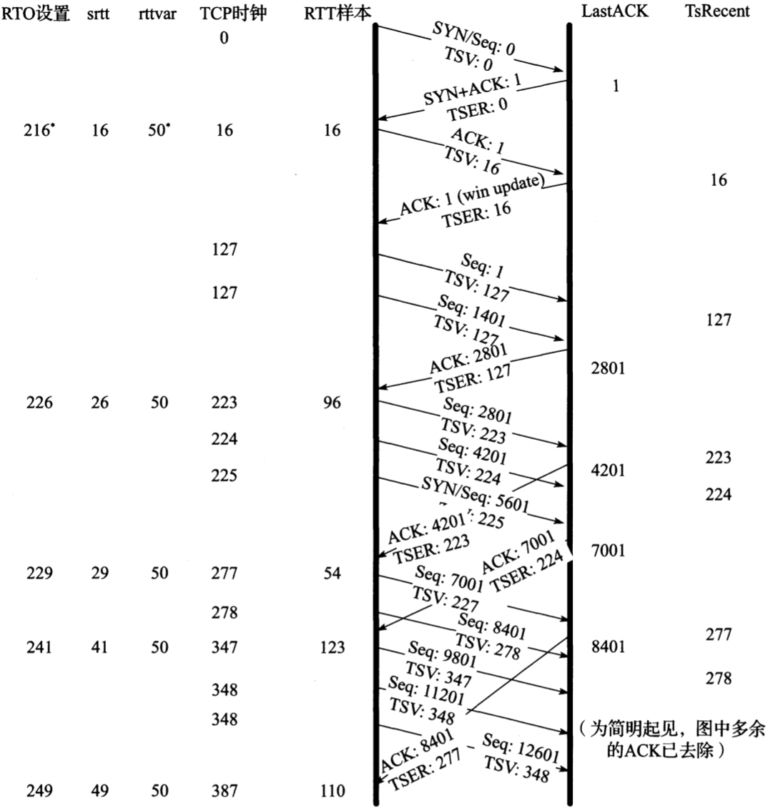
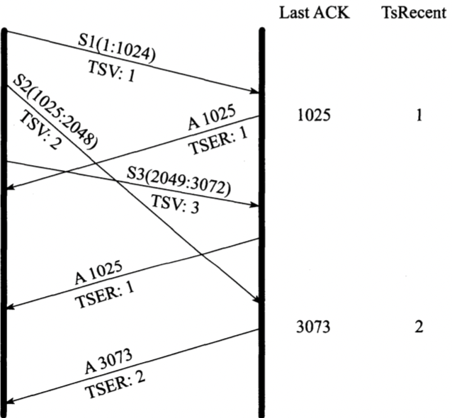
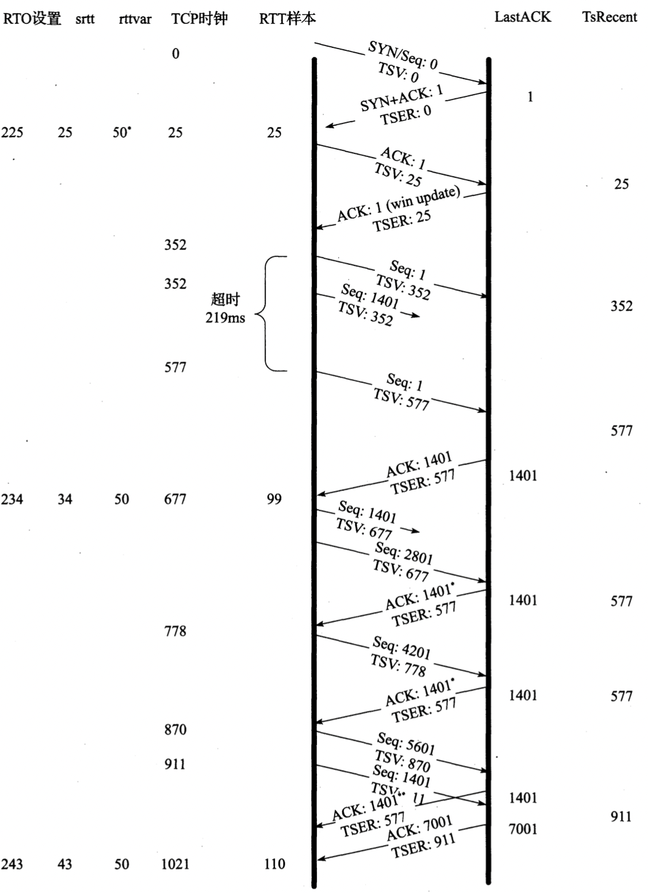
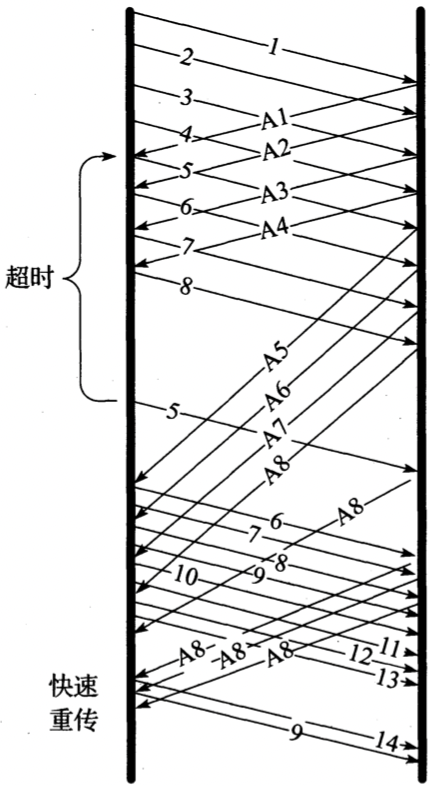
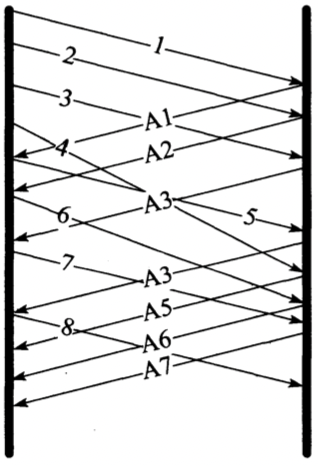
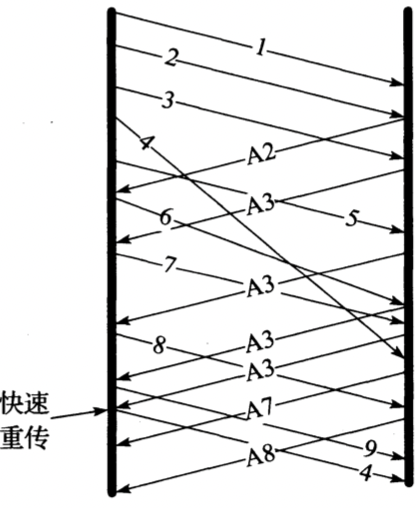

# 第14章 TCP超时与重传

[TOC]

## 简单的超时与重传举例

二进制指数退避（binary exponential backoff）：每次重传间隔时间加倍；

### 经典方法

最初的TCP规范[RFC0793]采用如下公式计算得到`平滑的RTT估计值（俗称SRTT）`：

$SRTT \leftarrow a(SRTT) + (1 - a)RTT_s$

- $a$ 平滑因子（常量，推荐0.8~0.9）

这种估算方法称为`指数加权移动平均(Exponentially Weighted Moving Average, EWMA)`或`低通过滤器(low-pass filter)`；

考虑到SRTT估计器得到的估计值会随RTT而变化，[RFC0793]推荐根据如下公式设置RTO：

$RTO=min(ubound, max(lbound, (SRTT)\beta))$

- $\beta$ 时延离散因子（推荐1.3~2.0）
- $ubound$ RTO的上边界（可设定建议值，1min）
- $lbound$ RTO的下边界（可设定建议值，1sec）

### 标准方法

经典方法的缺陷：

- 按照经典方法设置计时器无法适应RTT的大规模变动，当实际的RTT远大于估计值时，会导致不必要的重传；
- 增大的RTT样本值表明网络已出现过载，此时不必要的重传会进一步加重网络负担；

标准方法在采用经典方法的同时，考虑RTT变化值以及均值来设置RTO，比仅使用均值的常数倍来计算RTO更能适应RTT变化幅度较大的情况；

对每个RTT测量值$M$(即前面的$RTT_s$)采用以下方法估算：

$srtt \leftarrow (1-g)(srtt)+(g)M$

$rttvar \leftarrow (1-h)(rttvar) + (h)(|M-srtt|)$

$RTO = srtt + 4(rttvar)$

或另一种对计算机实现来说操作较为方便的估算方法：

$Err = M - srtt$

$srtt \leftarrow srtt + g(Err)$

$rttvar \leftarrow rttvar + h(|Err| - rttvar)$

- $srtt$ 均值的EWMA
- $rttvar$ 绝对误差$|Err|$的EWMA
- $Err$ 测量值M与当前RTT估计值srtt估计值的权重
- $h$ 为新平均偏差样本（新样本M与当前平均值srtt之间的绝对误差）占偏差估计值$rttvar$的权重（取1/4）；

当$RTT$变化时，偏差的增量越大，$RTO$增长越快；$g$和$h$的值取为2的（负的）多少次方，使得整个计算过程较为简单，对计算机来说只要采用定点整型数的移位和加法操作即可，而无需复杂的乘除法运算；

#### 时钟粒度与RTO边界

`时钟粒度`：TCP时钟一个“滴答”的时间长度；

`时钟粒度`会影响RTT的测量以及RTO的设置，用于优化RTO的更新情况，并给RTO设置了一个下界，公式如下：

$RTO=max(srt+max(G, 4(rttvar)), 1000)$

- $G$ 计时器粒度
- $1000$ 整个RTO的下界值

因此计算出RTO至少为1s，同时提供了可选上界值，假设为60s；

#### 初始值

在首个SYN交换前，TCP无法设置RTO初始值；除非系统提供，否则也无法设置估计器的初始值；当收到首个RTT测量结果$M$，估计器按如下方法进行初始化：

$srtt \leftarrow M$

$rttvar \leftarrow M/2$

#### 重传二义性与Karn算法

`重传二义性`：在测量RTT样本的过程中若出现重传，就可能导致某些问题；假设一个包的传输出现超时，该数据包会被重传，接着收到一个确认信息；那么该信息是对第一次还是第二次传输的确认就存在二义性；

`Karn算法`：当接收到重复传输（即至少重传一次）数据的确认信息时，不进行该数据包的RTT测量，可以避免重传二义性问题；另外，对该数据之后的包采取退避策略，仅当接收到未经重传的数据时，该SRTT才用于计算RTO；

#### 带时间戳选项的RTT测量

使用时间戳选项的TCP采用如下算法来测量RTT样本值：

1. TCP发送端在其发送的每个报文段的TSOPT的TSV部分携带一个32比特的时间戳值，该值包含数据发送时刻的TCP时钟值；
2. 接收端记录接收到的TSV值（名为TsRecent的变量）并在对应的ACK中返回，并且记录其上一个发送的ACK号（名为LastACK的变量）；
3. 当一个新的报文段到达时，如果其序列号与LastACK的值吻合（即为下一个期望接收的报文段），则将其TSV值存入TsRecent；
4. 接收端发送的任何一个ACK都包含TSOPT，TsRecent变量包含的时间戳值被写入其TSER部分；
5. 发送端接收到ACK后，将当前TCP时钟减去TSER值，得到的差即为新的RTT样本估计值；

**注意1：linux中系统变量`net.ipv4.tcp_timestamps`决定是否使用时间戳选项；**

**注意2：Windows修改Tcp13230pts值来决定是否使用时间戳选项；**

### Linux采用的方法

Linux根据`mdev_max`的值来更新rttvar，RTO总是等于$srtt$与$4(rttvar)$之和，以此确保RTO不超过`TCP_RTO_MAX`（默认值为120s），其过程如下：

TCP时间戳选项携带了发送端TCP时钟的副本，接着ACK将该值返回至接收端，通过计算两者之差（当前时钟减去返回的时间戳）来更新其srtt与rttvar估计值；Linux采用如下算法进行更新：

- $srtt = 16ms$
- $mdev = (16/2)ms = 8ms$
- $rttvar = mdev_max = max(mdev, TCP_RTO_MIN) = max(8, 50) = 50ms$
- $RTO = srtt + 4(rttvar) = 16 = 4(50) = 216ms$

### RTTM对丢包和失序的鲁棒性

时间戳选项使得发送端即使在丢包，延时，失序的情况下也能测量RTT；

RTTM算法在以下情况下都能正确运行：

- 失序报文段

  当接收端收到失序报文段时，通常是由于在此之前出现了丢包，应当立即返回ACK以启动快速重传算法；该ACK的TSER部分包含的TSV值为接收端收到最近的有序报文段的时刻（即最新的使窗口前进的报文段，通常不会是失序报文段）；这使得发送端RTT样本增大，由此导致相应的RTO增大；这在一定程度上是有利的，即当包失序时，发送端有更多的时间去发现是出现了失序而非丢包，由此可避免不必要的重传；

- 成功重传

  当收到接收端缓存中缺失的报文段时（如成功接收重传报文段），窗口通常会前移；此时对应ACK中的TSV值来自最新到达的报文段，这是比较有利的；若采用原来报文段中的TSV，可能对应的是前一个RTO，导致发送端RTT估算的偏离；

例，假设3个报文段，每个包含1024字节，接收顺序如下：

当报文段失序，返回的时间戳为最新的使窗口前移的报文段（而非到达接收端的最大的时间戳）；这将使得发送端RTO在包失序期间过高估计RTT，并降低其重传积极性；

## 基于计时器的重传

若在连接设定的RTO内，TCP没有收到被计时报文段的ACK，将会触发超时重传；TCP通过降低当前数据发送率来响应超时重传，它的实现有2种方法：

- 基于拥塞控制机制减少发送窗口大小；

- 为每当一个重传报文段被再次重传时，增大RTO的退避因子；当同一报文段出现多次重传时，RTO值乘上值$\gamma$来形成新的超时退避值：

  $RTO = \gamma RTO$

  - $\gamma$ 值为1，随着多次重传，$\gamma$呈加倍增长（2, 4, 8, ...），不能超过最大退避因子（Linux确保其RTO设置不能超过`TCP_RTO_MAX`，默认值为120s），一旦接收到相应的ACK，$\gamma$重置为1；

### 例子

报文段1401被人为地丢弃2次，导致发送端引发了超时重传；仅在接收到使得发送窗口前移的ACK时，srtt, rttvar和RTO值才会做出更新；带星号`（*）`的ACK包含了SACK信息；

## 快速重传

`快速重传算法`：TCP发送端在观测到至少`dupthresh`个重复ACK后，即重传可能丢失的数据分组，而不必等到重传计时器超时；当然也可以同时发送新的数据，根据重复ACK推断的丢包与网络拥塞有关，因此伴随快速重传应出发拥塞控制机制；不采用SACK时，在接收到有效ACk前至多只能重传一个报文段；采用SACK，ACK可包含额外信息，使得发送端在每个RTT时间内可以填补多个空缺；

## 带选择确认的重传

`SACK功能`：通过TCP头部累积ACK号字段来描述其接收到的数据；

`空缺`：ACK号与接收端缓存中的其它数据之间的间隔；

`失序数据`：序列号高于空缺的数据，这些数据和之前接收的序列号不连续；

### SACK接收端行为

接收端在TCP连接建立期间收到SACK许可选项即可生成SACK，每当缓存中存在失序数据时，接收端就可生成SACK，导致数据失序的原因可能是由于传输过程中丢失，也可能是新数据先于旧数据到达；

### SACK发送端行为

`选择性重传（selective retransmission）/选择性重发（selective repeat）`：在发送端提供SACK功能，合理利用接收到的SACK块来进行丢失重传；

当发送端收到了SACK或重复ACK时，可以选择发送新数据或重传旧数据；SACK信息提供接收端数据的序列号范围，因此发送端可以据此推断需要重传的空缺数据；最简单的方法是发送端首先填补接收端的空缺，然后在继续发送新数据[RFC3517]；

## 伪超时与重传

`伪重传（spurious retransmission）`：即使没有出现数据丢失也可能引发重传，造成的主要原因是：伪超时（spurious timeout），包失序，包重复，ACK丢失，...；

伪重传的解决办法：

- `检测（detection）算法` 用于判定某个超；
- `响应（response）算法` 用于撤销或减轻超时带来的影响；

### 重复SACK(DSACK)扩展

在非SACK的TCP中，ACK只能向发送端告知最大的有序报文段，采用SACK则可告知其它的（失序）报文段；例：

在传输完报文段8后出现一次延迟高峰，导致了报文段5的伪超时和重传；重传完成后，首次传输的报文段5对应的ACK到达；报文段5的重传使得接收端收到了重复报文段，紧接着又重传了报文段6, 7, 8, 尽管在接收端已存在这些报文段，整个连接还是执行了“回退N”行为；

### Eifel检测算法

`Eifel检测算法` 利用了TCP的TSOPT来检测伪重传，在发生超时重传后，Eifel算法等待接受下一个ACK，若为针对第一次传输（即原始传输）的确认，则判定该重传是伪重传；它需要使用TCP的TSOPT，当发送一个重传（不论是基于计时器的重传还是快速重传）后，保存其TSV值，当接收到相应分组的ACK后，检查该ACK的TSER部分；若TSER值小于之前存储的TSV值，则可判定该ACK对应的是原始传输分组，即该重传是伪重传；

### 前移RTO恢复（F-RTO）

`前移RTO恢复（Forward-RTO Recovery, F-RTO）` 是检测伪重传的标准算法，`F-RTO`会修改TCP的行为，在超时重传后收到第一个ACK时，TCP会发送新（非重传）数据，之后再响应后一个到达的ACK；如果其中有一个为重复ACK，则认为此次重传没问题；如果这两个都不是重复ACK，则表示该重传是伪重传；

### Eifel响应算法

`Eifel响应算法` 在重传计时器超时后，查看srtt和rttvar的值，并按照如下方式记录新的变量`srtt_prev`和`rttvar_prev`：

$srtt\_prev = srtt + 2(G)$

$rttvar\_prev = rttvar$

- $G$ TCP时钟粒度

$srtt$的值过小，可能会出现伪超时；如果$srtt$稍大，可能不会发生超时；

一旦接收到重传计时器超时后发送的报文段的ACK，按照如下方式更新$srtt$, $rttvar$, $RTO$的值：

$srtt \leftarrow max(srtt\_prev, m)$

$rttvar \leftarrow max(rttvar\_prev, m/2)$

$RTO = srtt + max(G, 4(rttvar))$

## 包失序与包重复

### 失序

失序问题可能存在于TCP连接的正向或反向链路中（也可能两者同时存在），数据段的失序与ACk包的失序对TCP的影响有一定差别；

在IP网络中出现包失序的原因在于IP层不能保证包传输是有序进行的，这一方面是有利的（至少对IP层来说），因为IP可以选择另一条传输链路（例如传输速度更快的路径），而不用担心新发送的分组会先于旧数据到达，这就导致数据的接收顺序与发送顺序不一致（还有其它的原因也会导致包失序）；

例，**轻微失序**可忽略少量的重复ACK：

例，**严重失序**网络中的包重复会引起重复ACK，从而触发伪快速重传：

## 与TCP重传相关的攻击

- `低速率DoS攻击` 攻击者向网关或主机发送大量数据，使得受害系统持续处于重传超时状态。由于攻击者可预知受害TCP合适启动重传，并在每次重传时生成并发送大量数据。因此，受害TCP总能感知到拥塞的存在，根据Karn算法不断减小发送速率并退避发送，导致无法正常使用网络带宽。针对此类攻击的预防方法是随机选择RTO，使得攻击者无法预知确切的重传时间。
- `减慢/加速TCP的发送` 使RTT估值过大，这样受害者在丢包后不会立即重传。相反的攻击也是有可能的：攻击者在数据发送完成但还未到达接收端伪造ACK。这样攻击者就能使受害TCP认为连接的RTT远小于实际值，导致过分发送，造成大量的无效传输。

