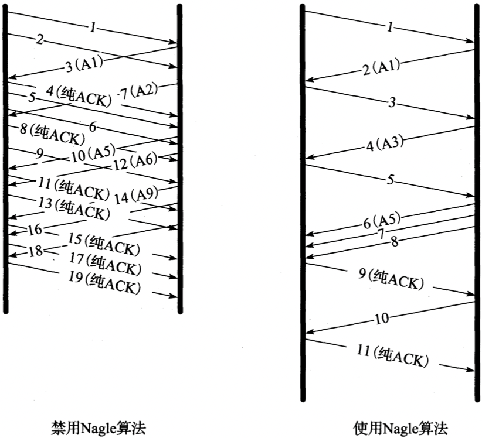
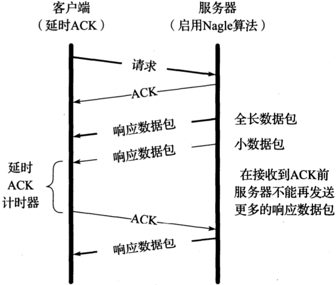
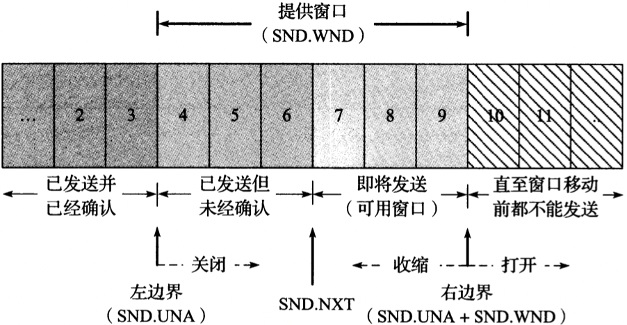
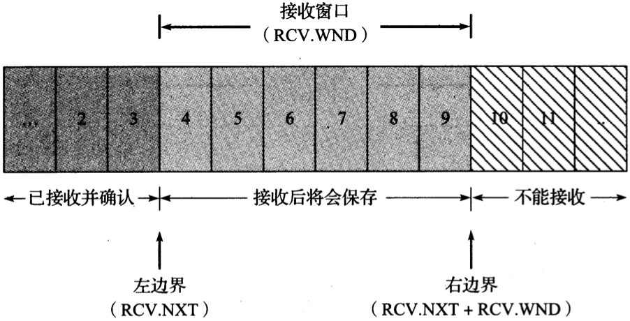

# 第十五章 TCP 数据流与窗口管理

[TOC]

## Nagle算法

`Nagle算法` 当一个TCP连接中有在传数据（即那些已发送但还未经确认的数据），小的报文段（长度小于SMSS）就不能被发送，直到所有的在传数据都收到ACK。并且，在收到ACK后，TCP需要收集这些小数据，将其整合到一个报文段中发送。此算法迫使TCP遵循停等（stop-and-wait）规程--只有等接收到所有在传数据的ACK后才能继续发送。此算法的精妙之处在于它实现了自时钟（self-clocking）控制：ACK返回越快，数据传输也越快。在相对高延迟的广域网中，更需要减少微型报的数目，该算法使得单位时间内发送的报文段数目更少。也就是说，RTT控制着发包速率。

例，同一环境下禁用/使用Nagle算法的TCP连接情况：

在启用Nagle算法的情况下，在任一时刻最多只有一个包在传，这样可以减少小包数目，但同时也增大了传输时延；

### 延时ACK与Nagle算法结合

ACK与Nagle算法的结合导致了某种程度的`死锁`（两端互相等待对方做出行动），在死锁期间整个传输连接处于空闲状态，使性能变差；这种死锁并不是永久的，在延时ACK计时器超时后死锁会解除。

例，Nagle算法与延时ACK的交互，形成一个短暂的死锁：

### 禁用Nagle算法

对于一些延时敏感的应用，需要禁用Nagle算法，禁用方法如下：

1. `Berkeley套接字` 设置TCP_NODELAY选项；
2. `Windows系统` 设置注册表`HKLM\so盯WARE\Micr ゚S ゚ft\MsMQ\parameters \TCPNoDelay`的值为1；

## 流量控制与窗口管理

### 滑动窗口

每个TCP活动连接维护以下窗口：

- 发送窗口结构（send window structure）
- 接收窗口结构（receive window structure）

例，提供窗口：

- `提供窗口` 由接收端通告的窗口
- `可用窗口` 它可以立即发送的数据量，其值=$SND.UNA + SND.WND - SND.NXT$

TCP发送端滑动窗口结构记录了已确认，在传以及还未传的数据的序列号，提供窗口的大小由接收端返回的ACK中的窗口大小字段控制；

例，接收窗口结构：

TCP接收端滑动窗口结构帮助了解其下次应接收的数据序列号，若接收到的数据序列号在窗口内，则可以存储，否则丢弃；

窗口的左右边界运动：

- `关闭（close）` 窗口左边界右移，当已发送数据得到ACK确认时，窗口会减少。
- `打开（open）` 窗口右边界右移，使得可发送数据量增大，当已确认数据得到处理，接收端可用缓存变大，窗口也随之变大。
- `收缩（shrink）` 窗口右边界左移。

### 零窗口与TCP持续计时器

当接收端重新获得可用空间时，会给发送端传输一个窗口更新（window update），告知其可继续发送数据。这样的窗口更新通常都不包含数据（为“纯ACK”），不能保证其传输的可靠性；如果一个包含窗口更新的ACk丢失，通信双方就会一直处于等待状态：接收方等待接收数据（已将窗口设置为非零值），发送方等待收到窗口更新告知其可继续发送；

### 糊涂窗口综合症

`糊涂窗口综合症（Silly Window Syndrome, SWS）` 

当接收端的通告窗口较小（没有等到窗口变大才通告）或者发送端发送的数据段较小（没有等待将其它数据组合成一个更大的报文段）时，会导致SWS的出现；

遵循以下规则可以避免SWS：

- 对于接收端来说，不应通告小的窗口值
- 对于发送端来说，不应发送小的报文段，而且需要由Nagle算法控制何时发送；只有至少满足以下条件之一时才能传输报文段：
  1. 全长（发送MSS字节）的报文段可以发送（直接避免了高耗费的报文段传输问题）。
  2. 数据段长度>=接收端通告过的最大窗口值的一半的，可以发送（主要针对通告窗口值较小可能小于要传输的报文段的情况）。
  3. 满足以下任一条件的都可以发送（有效防止TCP在数据需要被确认以及Nagle算法启用的情况下发送小报文段）：
     - 某一ACK不是目前期盼的（即没有未确认的在传数据）；
     - 该连接禁用Nagle算法；

## 紧急机制

当收到UGR置位的报文段时，TCP接收端就会进入紧急模式；

## 与窗口管理相关的攻击

`客户端多“SYN cookies”技术` 基于已知的持续计时器的缺陷，所有必要的连接状态都可以下载到受害主机进行，从而使得攻击方主机消耗最少的资源，使得受害者资源耗尽；