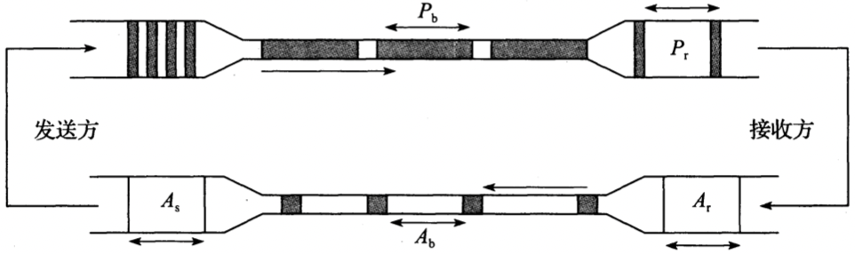
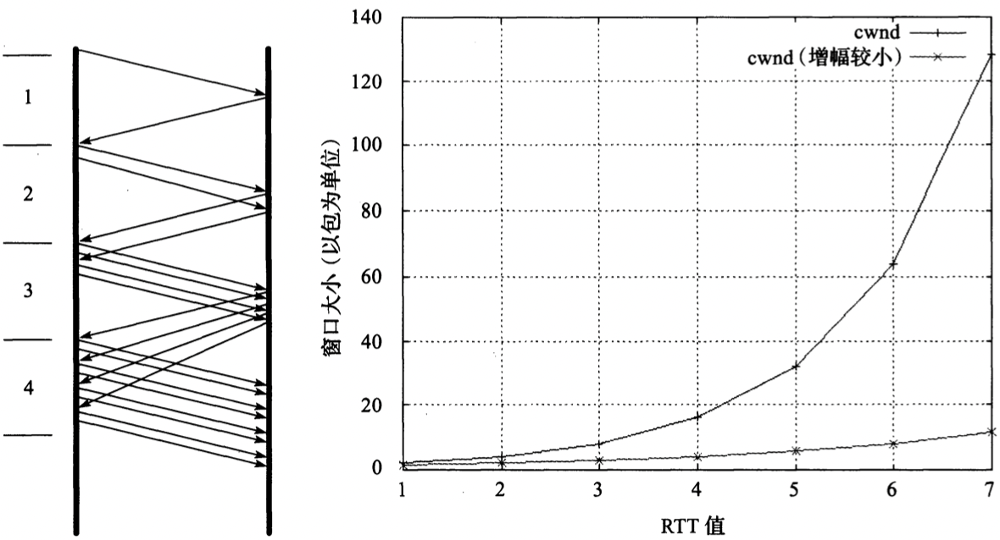
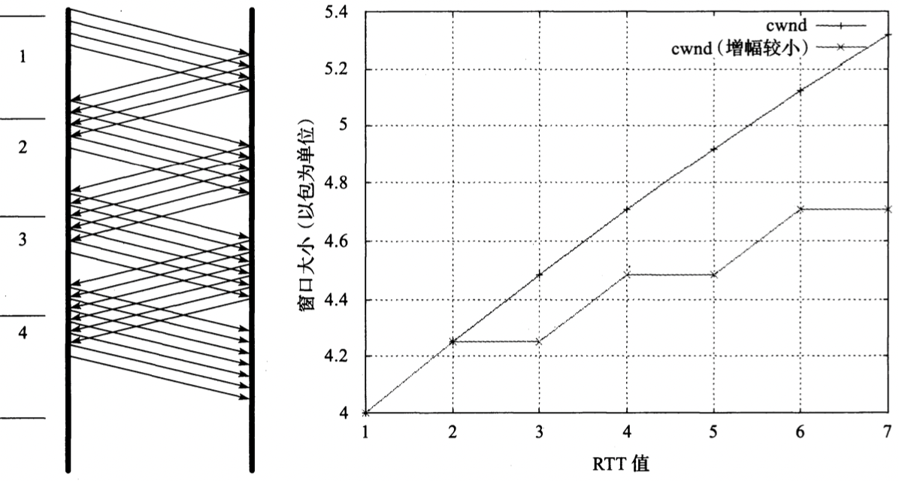

# 第16章 TCP拥塞控制

[TOC]

## 引言

`拥塞` 因无法处理高速率到达的流量而被迫丢弃数据信息；

### TCP拥塞检测

针对丢包，TCP采取的首要机制是重传：

- 超时重传
- 快速重传

拥塞探测方法：

- 丢包分析
- 时延测量
- 显式拥塞通知(ECN)

### 减缓TCP发送

`拥塞窗口（congestion window）` 反映网络传输能力的变量；

`外数据值（flight size）` 已经发出但还未经确认的数据量大小；

`最佳窗口大小（optional window size）` 网络中可存储的待发送数据量接近于带宽延迟积(Bandwidth-Delay Product, BDP)，计算方式为RTT与链路中最小通行速率（即发送端与接收端传输路径中的“瓶颈”）的乘积；

发送端实际可用窗口$w$的计算公式：$W = min(cwnd, awnd)$

- $awnd$ 接收端通知窗口
- $cwnd$ 拥塞窗口

## 一些经典算法

TCP拥塞控制操作是基于数据包守恒原理运行的。由于传输能力有限，数据包（$P_b$）会适时地“伸展”。接收方以一定间隔（$P_r$）接收到数据包后，会陆续（以$A_r$为间隔）生成相应的ACK，以一定的发送间隔（$A_b$）返回给发送方。当ACK陆续（以$A_s$为间隔）到达发送端时，其到达提供了一个信号或者说“ACK时钟”，表明发送端可以继续发送数据。在稳定传输状态下，整个系统可“自同步”控制。

### 慢启动

当一个新的TCP连接建立或检测到由重传超时（RTO）导致的丢包时，需要执行慢启动。使TCP在用拥塞避免探寻更多可用带宽之前得到$cwnd$值，以及帮助TCP建立ACK时钟。通常，TCP在建立新连接时执行慢启动，直至有丢包时，执行拥塞避免算法进入稳定状态。

`初始窗口（Initial Window, IW）` TCP以发送一定数目的数据段开始慢启动（在SYN交换之后），$IW$的计算公式如下：

$IW = 2 * (SMSS)且小于等于2个数据段(当SMSS > 2190字节)$

$IW = 3 * (SMSS)且小于等于3个数据段(当2190 >= SMSS > 1095字节)$

$IW = 4 * (SMSS)且小于等于4个数据段(其它)$

**经典慢启动算法操作**。在没有ACK延时情况下，每接收到一个好的ACK就意味着发送方可以发送两个新的数据包（左）。这会使得发送方窗口随着时间呈指数增长（右，上方曲线）。当发生ACK延时，如每隔一个数据包生成一个ACK，cwnd仍以指数增长，但增幅较小（右，下方曲线）。

### 拥塞避免

`拥塞避免算法` 为了得到更多的传输资源而不致影响其它连接传输，一旦确立慢启动阈值，TCP会进入拥塞避免阶段，cwnd每次的增长值近似于成功传输的数据段大小。这种随时间线形增长方式与慢启动的指数增长相比缓慢许多。更准确地说，每接收一个新的ACK，cwnd会做以下更新：$cwnd_{t+1} = cwnd_t + SMSS * SMSS/cwnd_t$

分析上式，假设$cwnd_0 = k * SMSS$字节分k段发送，在接收到第一个ACK后，cwnd的值增长了$1/k$倍：

$cwnd_1$ = $cwnd_0 + SMSS * SMSS / cwnd_0 = k * SMSS + SMSS * (SMSS/(k * SMSS))$

​             = $k * SMSS + (1/k) * SMSS = (k + (1/k) * SMSS = cwnd_0 + (1/k) * SMSS)$

**拥塞避免算法操作**。若没有ACK延时发生，每接收一个好的ACK，就意味着发送方可继续发送$1/W$个新的数据包。发送窗口随时间近似呈线性增长（右，上方曲线）。当有ACK延时，如每隔一个数据包生成一个ACK，cwnd仍近似呈线性增长，只是增幅较小（右，下方曲线）。

### 慢启动和拥塞避免的选择

慢启动和拥塞避免的选择条件：

- `cwnd < ssthresh` 使用慢启动算法
- `cwnd > ssthresh` 使用拥塞避免
- `cwnd = ssthresh` 任一算法

不论是慢启动还是拥塞避免，慢启动阈值(ssthresh)按以下方式改变：

$ssthresh = max(在外数据值/2, 2 * SMSS)$

### 标准TCP

在TCP连接建立之初首先是慢启动阶段（cwnd = IW），ssthresh通常取一较大值（至少为AWND）。当接收到一个好的ACK（表明新的数据传输成功），cwnd会相应更新：

$cwnd += SMSS （若cwnd < ssthresh）慢启动$

$cwnd += SMSS * SMSS / cwnd （若cwnd > ssthresh）拥塞避免$

当收到三次重复ACK（或其它表明需要快速重传的信号）时，会执行以下行为：

1. ssthresh更新为大于等于$ssthresh = max(在外数据值/2, 2*SMSS)$中的值。
2. 启用快速重传算法，将cwnd设为$(ssthresh + 3 * SMSS)$。
3. 每接收一个重复ACK，cwnd值暂时增加$1SMSS$。
4. 当接收到一个好的ACK，将cwnd重设为ssthresh。

以下情况下总会执行慢启动：

- 新连接的建立以及出现重传超时。
- 当发送方长时间处于空闲状态，或者有理由怀疑cwnd不能精确反映网络当前拥塞状态时。

## 对标准算法的改进

### NewReno

`NewReno算法` 对快速恢复做出了改进，它记录了上一个数据传输窗口的最高序列号。仅当接收到序列号不小于恢复点的ACK，才停止快速恢复阶段。这样TCP发送方每接收一个ACK后就能继续发送一个新数据段，从而减少重传超时的发生，特别针对一个窗口出现多个包丢失的情况时。

**NewReno算法不会出现经典快速重传的问题，实现起来也没有选择确认（SACK）复杂。当出现上述多个丢包情况时，利用SACK机制能比NewReno获得更好的性能，但需要较为复杂的拥塞控制操作。**

### 转发确认（FACK）和速率减半

`转发确认策略(forward acknowledgment, FACK)` 包含两部分算法，称为`过度衰减(overdamping)`和`缓慢衰减(rampdown)`从最初想法的提出到改进，最终形成统一算法，称为`速率减半(rate halving)`。

`带界定参数的速率减半算法(Rate-Halving with Bounding Parameters, RHBP)` 在一个RTT时间内，每接收两个重复ACK，TCP发送方可发送一个新数据包。这样在恢复阶段结束前，TCP已经发送了一部分新数据，与之前的所有发送都挤在后半个RTT时间段内相比，数据发送比较均衡。

RHBP区分了`调整间隔(adjustment interval, cwnd的修正阶段)`和`恢复间隔（repair interval, 数据重传阶段）`，一旦出现丢包或其它拥塞信号旧立即进入调整间隔。调整间隔结束后cwnd的最终值为：至检测时间为止，网络中已正确传输的窗口数据量的一半。RHBP要求发送方传输数据需要满足以下公式：

$(SND.NXT - fack + retran_data +len) < cwnd$

### 限制传输

`限制传输(limited transmit)` TCP发送方每接收2个连续的重复ACK，就能发送一个新数据包。这就使得网络中的数据包维持一定数量，足以触发快速重传。TCP因此也可以避免长时间等待RTO而导致吞吐性能下降。

### 拥塞窗口校验

`拥塞窗口校验(Congestion Window Validation, CWV)机制` 当需要发送新数据时，首先看距离上次发送操作是否超过一个RTO，如果超时，则：

- 更新ssthresh值（设为$max(ssthresh, (3/4) * cwnd)$）。
- 每经一个空闲RTT时间，cwnd值减半，但不小于$1SMSS$。

对于应用受限阶段（非空闲阶段），执行相似的操作：

- 已使用的窗口大小记为W_used。
- 更新ssthresh值（设为$max(ssthresh, (3/4) * cwnd)$）。
- cwnd设为cwnd和W_used的平均值。

## 伪RTO处理-Eifel响应算法

`Eifel算法` 用于处理重传计时器以及重传计时器超时后的拥塞控制操作，在首次发生超时重传时，Eiffel算法开始执行。若认为出现伪重传情况，会撤销对ssthresh值的修改。在所有情况下，若因RTO而需改变ssthresh值，在修改前需要记录一个特殊变量：$pipe_prev = min(在外数据值，ssthresh)$。然后需要运行一个检测算法来判断RTO是否真实。假如出现伪重传，则当到达一个ACK时，执行以下步骤：

1. 若接收的是包含ECN-Echo标志位的好的ACK，停止操作。
2. $cwnd = 在外数据值 + min(bytes_acked, IW)(假设cwnd以字节为单位)$。
3. $ssthresh = pipe_prev$。

## 扩展举例

### 慢启动行为

