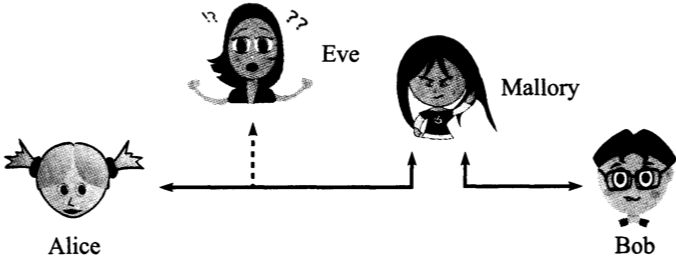
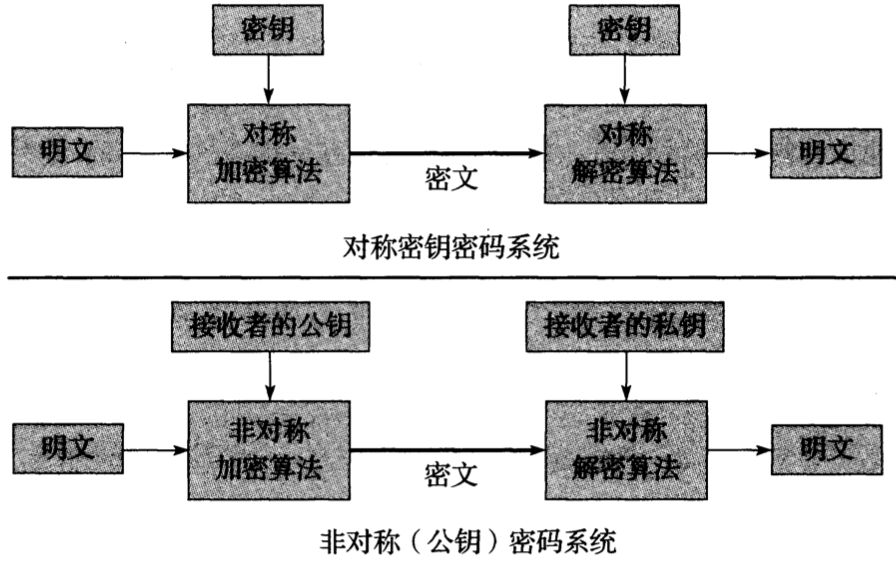

# 第18章 安全：可扩展身份认证协议，IP安全协议，传输层安全，DNS安全，域名密钥识别邮件

[TOC]


## 引言

安全威胁一般可以根据执行目标的不同分为三类攻击：

- 试图颠覆已有过程来运行其他不应该执行的代码
- 试图获得用户权限来运行恶意程序
- 采用未经授权的方法使用兼容的网络协议

`恶意软件(malicious software, malware)` 任何由用户或以用户账户执行却违背了用户本身意愿的软件。

`僵尸网络(botnet)` 

`鱼叉式网络钓鱼(spear phishing)`


## 信息安全的基本原则

信息具有以下

核心属性：

- `机密性` 信息只能为其指定的用户（可能包含处理系统）知晓；
- `完整性` 信息在传输完成之前不能通过未授权的方式修改；
- `可用性` 在需要的时候信息是可用的。

重要属性：

- `可认证性`
- `不可抵赖性`
- `可审计性`


## 网络通信的威胁



*Alice与Bob进行通信，Eve发起了被动攻击，Mallory发起了主动攻击*

通信攻击广义上分为被动与主动两类。被动攻击一般较难检测出来，而主动攻击一般较难进行防御：

| 被动攻击                                                | 主动攻击                                                     |
| ------------------------------------------------------- | ------------------------------------------------------------ |
| - `类型` 威胁<br>- `窃听` 机密性<br>- `流量分析` 机密性 | - `类型` 威胁<br>- `消息流篡改` 可认证性，完整性<br>- `拒绝服务(DoS)` 可用性<br>- `伪造机构` 可认证性 |

`消息流篡改(MSM)`

`拒绝服务(DoS)`

`中间人攻击(MITM)`


## 基础的加密与安全机制

加密是为了满足：在不安全的信道上保护所传输信息的机密性，完整性以及可认证性。

### 密码系统



*未加密的消息（明文）经过加密算法的处理生成加密的消息（密文）。在对称密码系统中，加密与解密使用相同的密钥。在非对称或弓腰密码系统中，使用接收者的公钥进行加密而用它的私钥进行解密，从而保证信息的机密性*

### RSA公钥密码算法

RSA的安全性基于对大数分解因数的困难性；

通过“反向”使用公钥算法（如RSA）能够对信息进行数字签名；

RSA原理如下：

在RSA初始化阶段，需要生成两个大素数$p$与$q$。这项工作首先需要随机地生成数值较大的奇数，然后检验这些数是否为素数，直到找到两个大素数为止。这两个素数的乘积$n = pq$被称作模。$n$, $p$与$q$的长度一般用比特来衡量。虽然目前推荐$n$采用2048比特的长度，但在通常情况下$n$的长度为1024比特，而$p$与$q$的长度为512比特。根据数论的知识，$\Phi(v)$的值表示整数$v$的欧拉数。它表示那些比$v$小且与$v$互质（即最大公约数为1）的正整数的个数。根据RSA算法，$n$的构建方法为$\Phi(n)=(q-1)(p-1)$；

根据$\Phi(n)$的定义，我们选择RSA的公钥指数（称作$e$，表示加密），并按照关系式$d = e^{-1}(mod \Phi(n))$得到一个私钥指数（称作$d$，表示解密）作为乘法逆元素。为了获得密文$c$，需要使用公式$c = m^e(mod n)$对明文$m$进行计算。为了从密文$c$中获得明文$m$，需要使用公式$m = c^d(mod \quad n)$进行解密。一个RSA公钥包含了公钥指数$e$与模$n$，而对应的私钥则包括私钥指数$d$与模$n$。

### Diffie-Hellman-Merkle密钥协商协议

`Diffie-Hellman-Merkle密钥协商协议(Diffie-Hellman, DH)` 是一种在有限域上的计算方法，用于帮助通信双方在窃听者不知情的状况下完成共同密钥的协商；

DH原理如下：

假设所有人都有相同的特征，并且知道两个整数$p$与$q$。$p$是一个（大）素数，而$g$是模$p$的原根($g < p$)。在上述前提下，集合$Z_p = {1, ..., p - 1}$中的每一个整数都能够通过不断地增加$g$来生成。换一种说法，对于任意一个整数$n$，必定存在倍数$k$使式子$g^k \equiv n (mod \quad p)$成立。在给定$g$, $n$与$p$的情况下寻找合适的$k$值被认为是一件困难的事情（称为离散对数问题）；

假设Alice与Bob为通信双方，为了建立一个共享的安全密钥，Alice选择一个秘密的随机数$a$，并按照公式$A = g^a(mod \quad p)$计算出$A$的值，然后将这个值发送给Bob。Bob选择一个秘密的随机数$b$，并按照公式$B = g^b(mod \quad p)$计算出$B$的值，然后将这个值发送给Alice，从而达成一个共享的密钥$K = g^{ab}(mod \quad p)$。Alice将按照下面的公式计算$K$值：

$K = B^a(mod \quad p) = g^{ba}(mod \quad p)$

Bob计算$K$值的方法如下：

$K = A^b(mod \quad p) = g^{ab}(mod \quad p)$

由于$g^{ba}$与$g^{ab}$是相等的，所以Alice与Bob都能获得协商密钥$K$。

### 签密与椭圆曲线密码

`椭圆曲线密码系统(Elliptic Curve Cryptography, ECC)` 寻找椭圆曲线离散对数元素，用于解决RSA选值时密集型计算导致的性能不佳问题。

### 密钥派生与完全正向保密

`密钥派生函数(KDF)`

`重新设定密钥(rekey)`

`完全正向保密(Perfect Forward Secrecy, PFS)` 能够保证即使有一个会话密钥被破解而由其它密钥加密的后续通信过程仍然安全；

### 伪随机数，生成器与函数族

`伪随机数(pseudorandom number)`

`伪随机数生成器(PseudoRandom Number Generator, PRNG)`

`伪随机数发生器(PseudoRandom Generator, PRG)`

`线性同余发生器(Linear Congruential Generator, LCG)`

`伪随机函数族(PseudoRandom Function family, PRF)`

`加密性强的（或安全的）伪随机数生成器(Cryptographically Strong PseudoRandom Number Generator, CSPRNG)`

### 随机数与混淆值

`加密随机数(cryptographic nonce)` 又叫临时密钥，只使用一次的数值，常用于认证协议；

`混淆值(salt value)` 用于加密文本中的随机数或伪随机数，可用于抵御对密文的蛮力攻击；

### 加密散列函数与消息摘要

`加密散列函数 用于验证消息完整性的函数`

当以一条消息$M$作为输入时，加密散列函数的输出$H$被称为这条消息的摘要或指纹$H(M)$，具有下述特性：

- `原像不可计算性(preimage resistance)` 在给定摘要$H(M)$而未知消息$M$的情况下，很难计算出消息$M$的值。
- `原像不相同性(second preimage resistance)` 给定消息$M1$的摘要$H(M1)$，找出一条消息$M2(M2 \neq M1)$使它的摘要与$M1$的摘要相等$(H(M1) = H(M2))$是十分困难的。
- `抗碰撞性(collision resistance)` 找出一对摘要相同$(H(M1) = H(M2))$而自身不同的消息$M1$, $M2(M1 \neq M2)$是十分困难的。

`消息摘要算法5(Message Digest Algorithm 5, MD5)` 128位加密散列算法

`安全散列算法1(Secure Hash Algorithm 1, SHA-1)` 160位加密散列算法

### 消息认证码

`消息认证码(MAC)` 用于防止各种伪造。

一个标准的使用加密散列函数的消息认证码被称为`基于有密钥散列的消息认证码(HMAC)`。下面的公式定义了使用密钥$K$对消息$M$用$H$进行散列的方法（称为HMAC-H），它形成$t$字节的HMAC：

$HMAC-H(K, M)^t = A_t(H((K \oplus opad) || H((K \oplus ipad) || M)))$

- $opad$（外填充）将数值`0x5C`重复$|K|$次的数组
- $ipad$（内填充）将数值`0x36`重复$|K|$次的数组
- $\oplus$ 向量的异或运算符
- $||$ 连接运算符
- $A_t(M)$ 取消息$M$最左边的$t$字节

`基于密码的消息认证码(CMAC)`

`Galois消息认证码(GMAC)`

### 加密套件与密码套件

`加密套件(cryptographic suite)`

`密码套件(cipher suite)`


## 证书，证书颁发机构与公钥基础设施

公钥签名方法：

- `信任网络模型` 通过背书者做背书的方式来证明一个证书的可靠性；
- `PKI` 依靠中心化机构对PKI(Public Key Infrastructure, 公钥基础设施)的使用；

`证书颁发机构(Certificate Authority, CA)`

### 公钥证书，证书颁发机构与X.509标准

查看一个网站的证书：

```sh
CDIR=`openssl version -d | awk '{print $2}'` # 指定CA证书的存放位置
openssl s_client -CApath $CDIR -connect www.baidu.com:443 > digicert.out 2>1 # 打印每个证书认证的实体
openssl x509 -in digicert.out -out digicert.pem # 抽取证书中的数据，转换并保存到一个PEM编码的证书文件中
openssl x509 -in digicert.pem -text # 查看服务器证书
```

`认证业务规则(Certification Practice Statement, CPS)`


