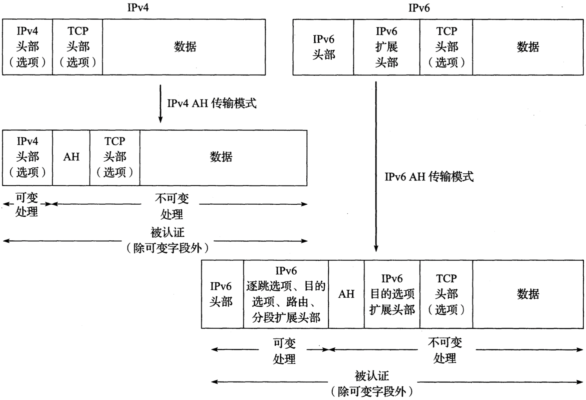

# 第18章 安全：可扩展身份认证协议，IP安全协议，传输层安全，DNS安全，域名密钥识别邮件

[TOC]


## 引言

安全威胁一般可以根据执行目标的不同分为三类攻击：

- 试图颠覆已有过程来运行其他不应该执行的代码
- 试图获得用户权限来运行恶意程序
- 采用未经授权的方法使用兼容的网络协议

`恶意软件(malicious software, malware)` 任何由用户或以用户账户执行却违背了用户本身意愿的软件。

`僵尸网络(botnet)` 

`鱼叉式网络钓鱼(spear phishing)`


## 信息安全的基本原则

信息具有以下

核心属性：

- `机密性` 信息只能为其指定的用户（可能包含处理系统）知晓；
- `完整性` 信息在传输完成之前不能通过未授权的方式修改；
- `可用性` 在需要的时候信息是可用的。

重要属性：

- `可认证性`
- `不可抵赖性`
- `可审计性`


## 网络通信的威胁


*Alice与Bob进行通信，Eve发起了被动攻击，Mallory发起了主动攻击*

通信攻击广义上分为被动与主动两类。被动攻击一般较难检测出来，而主动攻击一般较难进行防御：

| 被动攻击                                                | 主动攻击                                                     |
| ------------------------------------------------------- | ------------------------------------------------------------ |
| - `类型` 威胁<br>- `窃听` 机密性<br>- `流量分析` 机密性 | - `类型` 威胁<br>- `消息流篡改` 可认证性，完整性<br>- `拒绝服务(DoS)` 可用性<br>- `伪造机构` 可认证性 |

`消息流篡改(MSM)`

`拒绝服务(DoS)`

`中间人攻击(MITM)`


## 基础的加密与安全机制

加密是为了满足：在不安全的信道上保护所传输信息的机密性，完整性以及可认证性。

### 密码系统


*未加密的消息（明文）经过加密算法的处理生成加密的消息（密文）。在对称密码系统中，加密与解密使用相同的密钥。在非对称或弓腰密码系统中，使用接收者的公钥进行加密而用它的私钥进行解密，从而保证信息的机密性*

### RSA公钥密码算法

RSA的安全性基于对大数分解因数的困难性；

通过“反向”使用公钥算法（如RSA）能够对信息进行数字签名；

RSA原理如下：

在RSA初始化阶段，需要生成两个大素数$p$与$q$。这项工作首先需要随机地生成数值较大的奇数，然后检验这些数是否为素数，直到找到两个大素数为止。这两个素数的乘积$n = pq$被称作模。$n$, $p$与$q$的长度一般用比特来衡量。虽然目前推荐$n$采用2048比特的长度，但在通常情况下$n$的长度为1024比特，而$p$与$q$的长度为512比特。根据数论的知识，$\Phi(v)$的值表示整数$v$的欧拉数。它表示那些比$v$小且与$v$互质（即最大公约数为1）的正整数的个数。根据RSA算法，$n$的构建方法为$\Phi(n)=(q-1)(p-1)$；

根据$\Phi(n)$的定义，我们选择RSA的公钥指数（称作$e$，表示加密），并按照关系式$d = e^{-1}(mod \Phi(n))$得到一个私钥指数（称作$d$，表示解密）作为乘法逆元素。为了获得密文$c$，需要使用公式$c = m^e(mod n)$对明文$m$进行计算。为了从密文$c$中获得明文$m$，需要使用公式$m = c^d(mod \quad n)$进行解密。一个RSA公钥包含了公钥指数$e$与模$n$，而对应的私钥则包括私钥指数$d$与模$n$。

### Diffie-Hellman-Merkle密钥协商协议

`Diffie-Hellman-Merkle密钥协商协议(Diffie-Hellman, DH)` 是一种在有限域上的计算方法，用于帮助通信双方在窃听者不知情的状况下完成共同密钥的协商；

DH原理如下：

假设所有人都有相同的特征，并且知道两个整数$p$与$q$。$p$是一个（大）素数，而$g$是模$p$的原根($g < p$)。在上述前提下，集合$Z_p = {1, ..., p - 1}$中的每一个整数都能够通过不断地增加$g$来生成。换一种说法，对于任意一个整数$n$，必定存在倍数$k$使式子$g^k \equiv n (mod \quad p)$成立。在给定$g$, $n$与$p$的情况下寻找合适的$k$值被认为是一件困难的事情（称为离散对数问题）；

假设Alice与Bob为通信双方，为了建立一个共享的安全密钥，Alice选择一个秘密的随机数$a$，并按照公式$A = g^a(mod \quad p)$计算出$A$的值，然后将这个值发送给Bob。Bob选择一个秘密的随机数$b$，并按照公式$B = g^b(mod \quad p)$计算出$B$的值，然后将这个值发送给Alice，从而达成一个共享的密钥$K = g^{ab}(mod \quad p)$。Alice将按照下面的公式计算$K$值：

$K = B^a(mod \quad p) = g^{ba}(mod \quad p)$

Bob计算$K$值的方法如下：

$K = A^b(mod \quad p) = g^{ab}(mod \quad p)$

由于$g^{ba}$与$g^{ab}$是相等的，所以Alice与Bob都能获得协商密钥$K$。

### 签密与椭圆曲线密码

`椭圆曲线密码系统(Elliptic Curve Cryptography, ECC)` 寻找椭圆曲线离散对数元素，用于解决RSA选值时密集型计算导致的性能不佳问题。

### 密钥派生与完全正向保密

`密钥派生函数(KDF)`

`重新设定密钥(rekey)`

`完全正向保密(Perfect Forward Secrecy, PFS)` 能够保证即使有一个会话密钥被破解而由其它密钥加密的后续通信过程仍然安全；

### 伪随机数，生成器与函数族

`伪随机数(pseudorandom number)`

`伪随机数生成器(PseudoRandom Number Generator, PRNG)`

`伪随机数发生器(PseudoRandom Generator, PRG)`

`线性同余发生器(Linear Congruential Generator, LCG)`

`伪随机函数族(PseudoRandom Function family, PRF)`

`加密性强的（或安全的）伪随机数生成器(Cryptographically Strong PseudoRandom Number Generator, CSPRNG)`

### 随机数与混淆值

`加密随机数(cryptographic nonce)` 又叫临时密钥，只使用一次的数值，常用于认证协议；

`混淆值(salt value)` 用于加密文本中的随机数或伪随机数，可用于抵御对密文的蛮力攻击；

### 加密散列函数与消息摘要

`加密散列函数 用于验证消息完整性的函数`

当以一条消息$M$作为输入时，加密散列函数的输出$H$被称为这条消息的摘要或指纹$H(M)$，具有下述特性：

- `原像不可计算性(preimage resistance)` 在给定摘要$H(M)$而未知消息$M$的情况下，很难计算出消息$M$的值。
- `原像不相同性(second preimage resistance)` 给定消息$M1$的摘要$H(M1)$，找出一条消息$M2(M2 \neq M1)$使它的摘要与$M1$的摘要相等$(H(M1) = H(M2))$是十分困难的。
- `抗碰撞性(collision resistance)` 找出一对摘要相同$(H(M1) = H(M2))$而自身不同的消息$M1$, $M2(M1 \neq M2)$是十分困难的。

`消息摘要算法5(Message Digest Algorithm 5, MD5)` 128位加密散列算法

`安全散列算法1(Secure Hash Algorithm 1, SHA-1)` 160位加密散列算法

### 消息认证码

`消息认证码(MAC)` 用于防止各种伪造。

一个标准的使用加密散列函数的消息认证码被称为`基于有密钥散列的消息认证码(HMAC)`。下面的公式定义了使用密钥$K$对消息$M$用$H$进行散列的方法（称为HMAC-H），它形成$t$字节的HMAC：

$HMAC-H(K, M)^t = A_t(H((K \oplus opad) || H((K \oplus ipad) || M)))$

- $opad$（外填充）将数值`0x5C`重复$|K|$次的数组
- $ipad$（内填充）将数值`0x36`重复$|K|$次的数组
- $\oplus$ 向量的异或运算符
- $||$ 连接运算符
- $A_t(M)$ 取消息$M$最左边的$t$字节

`基于密码的消息认证码(CMAC)`

`Galois消息认证码(GMAC)`

### 加密套件与密码套件

`加密套件(cryptographic suite)`

`密码套件(cipher suite)`


## 证书，证书颁发机构与公钥基础设施

公钥签名方法：

- `信任网络模型` 通过背书者做背书的方式来证明一个证书的可靠性；
- `PKI` 依靠中心化机构对PKI(Public Key Infrastructure, 公钥基础设施)的使用；

`证书颁发机构(Certificate Authority, CA)`

### 公钥证书，证书颁发机构与X.509标准

查看一个网站的证书：

```sh
CDIR=`openssl version -d | awk '{print $2}'` # 指定CA证书的存放位置
openssl s_client -CApath $CDIR -connect www.baidu.com:443 > digicert.out 2>1 # 打印每个证书认证的实体
openssl x509 -in digicert.out -out digicert.pem # 抽取证书中的数据，转换并保存到一个PEM编码的证书文件中
openssl x509 -in digicert.pem -text # 查看服务器证书
```

`认证业务规则(Certification Practice Statement, CPS)`

### 18.5.2 验证与撤销证书

证书撤销的方法：

- 证书撤销列表（CRL）
- 在线证书状态协议（Online Certificate Status Protocol, OCSP）

```sh
wget http://cr13.digicert.com/ev2009a.crl # 检索CRL对应的证书
```

### 18.5.3 属性证书

`属性证书（Attribute Certificate，AC）`在结构上与公钥证书类似，但缺少公钥。


## 18.6 TCP/IP安全协议与分层


*存在于OSI协议栈中各层次以及一些“中间”层的安全协议。值得注意的是需要根据不同的安全威胁选择合适的协议*


## 18.7 网络访问控制：802.1X, 802.1AE, EAP, PANA

`网络访问控制（NAC）`指对于特定系统或用户而言用于授权或拒绝网络通信的方法。

`802.1X基于端口的网络访问控制（PNAC）`。

`可扩展身份认证协议（EAP）`可与多种链路层技术一同使用，并提供多种方法来实现*身份验证*，*授权*以及*计费（AAA）*。


*由802.11i与802.1X支持的EAP，允许在隔离AAA服务器的前提下由认证者对一个端点（申请者）进行认证。认证者能够按照“直通”模式来运行。在该模式下，将会有更多的EAP数据包转发。它也可以更直接地参与EAP协议。“直通”模式帮助认证者免于执行大量的认证方法*


*EAP头部包含一个用于多路分解数据包类型（请求，响应，成功，失败，初始化以及结束）的代码字段。标识符字段用于匹配请求与响应。对于请求与响应消息而言，第一个数据字节是一个类型字段*

- `代码` 定义了EAP数据包类型；

  | 数值 | 说明   |
  | ---- | ------ |
  | 1    | 请求   |
  | 2    | 响应   |
  | 3    | 成功   |
  | 4    | 失败   |
  | 5    | 初始化 |
  | 6    | 结束   |

- `标识符` 包含由发送者选择的序号，用于匹配请求与响应

- `长度` EAP消息的字节数。


*基本EAP消息承载着端点与认证者之间的认证材料。在许多部署中，认证者是一个相对简单的设备并采用“直通”模式。在这种情况下，绝大多数协议的流程都运行在端点与AAA服务器上。IETF为特定的AAA协议制定了标准，比如用于封装EAP消息的RADIUS或Diameter。EAP消息在AAA服务器与认证者之间进行传输*

EAP是一个支持自身的多路复用与多路分解的分层体系结构，它包括以下层次：


*EAP栈与实现模式。在直通模式下，端点与AAA服务器负责EAP认证方法的实现。认证者只需要实现EAP消息处理，认证者处理，并具有足够的AAA协议（例如RADIUS，Diameter）来与AAA服务器进行信息交换*

- 底层

  （拥有多个协议），负责有序地传输EAP帧。EAP底层协议的实例包括：`802.1X`, `802.11(802.lli)`, 带有L2TP的UDP，带有IKEv2的UDP以及TCP。

- EAP层

  实现了可靠性与消除重复，它还实现了基于EAP数据包代码值的多路分解。

- EAP端点/认证者层

  负责实现端点与（或）认证者协议的消息，这是基于对代码字段的多路分解实现的。

- EAP方法层

  包含了所有用于认证的特殊方法，包括任何用于处理大消息的协议操作。

### 18.7.1 EAP方法与密钥派生

EAP方法的目的在于建立认证，并为网络访问提供可能的授权。

`主会话密钥（Transient Session Key, TSK）`通常用在底层来加强端点与认证者之间的访问控制。

`MSK扩展（EMSK）` 通常与MSK一同使用，适用于：

1. EAP服务器或端点，而不适用于直通认证者。
2. 派生根密钥[RFC5295]，根密钥一般与特定的用途或域密切相关。

`特定用途的根密钥（Usage-Specific Root Key，USRK）`在特殊的使用环境下由EMSK派生而来。

`特定域的根密钥（DSRK）` 针对特定的域（即系统的集合）由EMSK派生而来。

`特定域特定用途的根密钥（Domain-Specific Usage-Specific Root Key, DSUSRK）`由DSRK派生出的子密钥。

### 18.7.2 EAP重新认证协议

`ERP重新认证协议（EAP Re-authentication Protocol, ERP）`[RFC5296]提供了独立于任何特定的EAP方法来完成任务：在EAP认证已经成功完成后，如果随后还需要进行认证交换，那么通常会要求减少这一过程的延迟。

### 18.7.3 网络接入认证信息承载协议

`网络接入认证信息承载协议（Protocol for Carrying Authentication for Network Access，PANA）`使用UDP/IP协议（端口号716），因此能够用于多种类型的链路，并且不限于点对点的网络模型。

PANA的框架包含了三个主要的功能性实体：

- PANA客户端（PANA Client，PaC）
- PANA认证代理（PANA Authentication Agent，PAA）
- PANA中继元件（PANA Relay Element，PRE）

PANA会话包含4个阶段：

1. 认证/授权。
2. 访问。
3. 重新认证。
4. 终止。


## 18.8 第三层IP安全（IPsec）


*IPsec适用于保障主机与主机之间的通信，主机与网关之间的通信，以及网关与网关之间的通信。IPsec还支持组播的分布与移动*

`安全关联（Security Association, SA）`

`认证头（Authentication Header, AH）`

`封装安全负载（Encapsulation Security Payload, ESP）`

`安全策略数据库（Security Policy Database, SPD）`

`安全关联数据库（Security Association Database, SAD）`

`端点认证数据库（Peer Authorization Database, PAD）`


*在一个安全网关中，IPsec数据包的处理过程一般位于一个逻辑实体的第3层。该逻辑实体划分了受保护与未受保护的网络。安全策略数据库指示如何处理数据包：绕开，丢弃或者保护。保护一般设计应用或验证完整性保护或加密。管理者会配置SPD以达到预期的安全目标*

### 18.8.1 Internet密钥交换协议（IKEv2）

`Internet密钥交换（Internet Key Exchange, IKE）`

IKE消息封装在UDP中通过端口500或4500发送。

#### 18.8.1.1 IKEv2消息格式


*IKEv2头部。所有的IKE消息都包含一个头部，后面跟着0或多个负载。IKE使用64位SPI值。交换类型字段给出了所支持的交换以及消息中期望的负载。标志位字段指明消息是否从发起者发往响应者。消息标识符将请求与响应关联起来以检测重放攻击*

`安全参数索引（Security Parameter Index，SPI）`是一个64位的号码，用于标识一个特定的IKE_SA。

- `下一个负载` 

- `主要版本`

- `次要版本`

- `交换类型`

  消息的交换类型，主要包括：

  - `IKE_SA_INIT` 34
  - `IKE_AUTH` 35
  - `CREATE_CHILD_SA` 36
  - `INFORMATIONAL` 37
  - `IKE_SESSION_RESUME` 38
  - 私人用途 240~255
  - 保留值

- `标志位`

  定义了一个3bit的字段：

  - `I` 发起者（第3位），由原是发起者设置，接收者会在返回消息中将其清除。
  - `V` 版本（第4位），高于发送者当前使用的协议的主要版本号。
  - `R` 响应者（第5位），指出当前消息是之前某一消息的响应，与其使用相同的消息标识符。

表18-2 IKEv2负载类型。数值0表示没有下一个负载：

| 数值    | 符号    | 用途                       |
| ------- | ------- | -------------------------- |
| 1~32    |         | 保留                       |
| 33      | SA      | 安全关联                   |
| 34      | KE      | 密钥交换                   |
| 35      | IDi     | 标识符（发起者）           |
| 36      | IDs     | 标识符（响应者）           |
| 37      | CERT    | 证书                       |
| 38      | CERTREQ | 证书请求（指出信任锚点）   |
| 39      | AUTH    | 认证                       |
| 40      | Ni, Nr  | 当事人（发起者，响应者）   |
| 41      | N       | 通知                       |
| 42      | D       | 删除                       |
| 43      | V       | 供应商标识符               |
| 44      | TSi     | 流量选择器（发起者）       |
| 45      | Tar     | 流量选择器（响应者）       |
| 46      | SK{}    | 加密与认证（包含其他负载） |
| 47      | CP      | 配置                       |
| 48      | EAP     | 扩展认证（EAP）            |
| 49~127  |         | 保留                       |
| 128~255 |         | 留作私用                   |

每一个IKE负载都是从IKE通用负载头开始，如图所示：


*一个“通用”的IKEv2负载头部。每一个负载都始于这种形式的头部*

- `下一个负载`
- `负载长度`

#### 18.8.1.2 IKE_SA_INIT交换


*IKE_SA_INIT与IKE_AUTH交换所包含的负载用于建立两个安全关联（IKE_SA与一个CHILD_SA）。证书负载与证书请求负载（包括信任锚点）也可能会像同志负载与配置负载（图中未显示）一样被包含于交换过程中*

#### 18.8.1.3 安全关联负载与建议

#### 18.8.1.4 密钥交换和随机负载

`密钥交换（Key Exchange, KE）`包含了DH组编号与密钥交换数据。

`随机数负载（Ni, Nr, No）`

SKEYSEED用来生成所有与IKE_SA相关的子密钥：

`SKEYSEED = prf(Ni|Nr, g^ir)`

`{SK_d|SK_ai|SK_ar|SK_ei|SK_er|SK_pi|SK_pr} = prf + (SKEYSEED, Ni|Nr|SPIi|SPIr)`

#### 18.8.1.5 通知负载与配置负载

#### 18.8.1.6 算法选择与应用

IKE将形成加密套件的转换氛围4种类型：

- 加密

  类型1，与IKE和ESP一起使用。

- PRF

  类型2，与IKE一起使用。

- 完整性保护

  类型3，与IKE和AH一起使用，在ESP中是可选的。

- DH组

  类型4，与IKE一起使用，在AH与ESP中是可选的。


#### 18.8.1.7 IKE_AUTH交换

#### 18.8.1.8 流量选择器与TS负载

TS负载的内容包括：IPv4/IPv6地址范围，端口范围，以及IPv4协议标识符或IPv6头部值。

例：`192.0.2.*`或`192.0.2.0/24`都代表从`192.0.2.0`到`192.0.2.255`的IP地址范围。

#### 18.8.1.9 EAP与IKE

#### 18.8.1.10 “总比没有强”的安全

`"总比没有强"的安全（Better-Than-Nothing Security, BTNS）` 旨在解决IPsec的部署问题中的可用性与舒适性，尤其是建立一个PKI或部署其他认证系统来使用证书的需求[RFC5387]。

#### 18.8.1.1 CREATE_CHILD__SA交换


*CREATE_CHILD_SA交换能够用于创建或更新一个CHILD_SA，或用于更新一个IKE_SA。当修改CHILD_SA以指出要修改的SA的SPI时，将会使用通知负载*

#### 18.8.1.12 信息交换


*用于传输状态信息与删除SA的INFORMATIONAL交换。它能够使用通知（N），删除（D）以及配置（CP）负载*

#### 18.8.1.13 移动IKE

一旦IKE_SA被建立起来，将不断地使用它知道不再有需求为止。

### 18.8.2 认证头部

`IP认证头部（Authentication Header, AH）`定义于[RFC4302]中，是IPsec的三大主要组成部分之一。



*IPsec认证头部，用于为IPv4与IPv6数据报提供认证与完整性保护。在传输模式下（这里与TCP一起描述），传统的IP数据报回呗修改以包含AH*

- `负载长度` AH的长度。
- `安全参数索引（SPI）` 包含一个32位的位于接收者端的SA标识符，该接受者包含了由SA派生出的与组织有关的信息。
- `序列号` 会随着每一个SA数据包的发送而增1，一般用于重放保护。
- `扩展的序列号（ESN）` 。
- `完整性校验值（ICV）` 长度是可变的并且依赖于使用的密码套件；该字段在长度上总保持为32比特的整数倍。


*AH封装的IPsec隧道模式，提供了对IPv4与IPv6数据报的认证与完整性保护。在隧道模式中（此处与TCP一起描述），传统的IP数据报被封装在一个新的“外部”IP数据报中，新的数据报承载着原始数据报*


*无论是在传输模式，还是在隧道模式，IPsec AH用于位IPv4与IPv6数据报提供认证与完整性保护。SPI的数值指出AH属于哪一个SA。序列号字段用于为重放攻击计数。ICV在负载的不可变部分之上提供了一种MAC形式*

### 18.8.3 封装安全负载

#### 18.8.3.1 传输模式与隧道模式

`流量机密性（Traffic Flow Confidentiality, TFC）`


*IPsec ESP用于对IPv4与IPv6数据报提供机密性（加密），可认证性，完整性保护。在传输模式下（此处与TCP一起描述），传统的IP数据报会被修改以包含ESP头部。在传输模式中的ESP允许对传输负载进行加密，认证以及完整性保护*


*在隧道模式下（此处与TCP一起描述），ESP将一个传统的IP数据报封装在一个新的“外部”IP数据报中，该“外部”数据报承载着原始的数据报。ESP允许在保证内部数据报完整的同时对外部数据报进行修改（例如，用于NAT穿越）。在很多应用中，ESP比AH更加流行*


*ESP消息结构中间包含了被加密的负载。SPI与序列号构成了ESP头部，而填充，填充长度以及下一个头部字段构成了ESP尾部。当需要进行完整性保护时，可以使用一个可选的ESP ICV尾部*

#### 18.8.3.2 ESP-NULL，封装的ESP与流量可见性

`封装ESP（Wrapped ESP，WESP）` [RFC5840]是一个标准跟踪RFC，它在ESP数据包结构之前定义了一个头部。

### 18.8.4 组播

`组密钥管理（Group Key Management, GKM）协议`

`组控制器/密钥服务器（Group Controller Key Servers, GCKS）`

`组安全关联（Group Security Association, GSA）`

`带地址保护的隧道模式（tunnel mode with address preservation）`

`路径转发（Reverse Path Forwarding, RPF）`

### 18.8.5 L2TP/IPsec

`第二层隧道协议（Layer 2 Tunneling Protocol, L2TP）`支持第二层流量的隧道传输，比如通过IP与非IP网络的PPP流量。它依赖一些在连接初始阶段提供认证的方法，但没有对后续的每个数据包提供认证以及完整性与机密性保护。

### 18.8.6 IPsec NAT穿越

如果要支持针对IKE的NAT穿越功能，需要将`NAT_DETECTION_DESTINATION_IP`与`NAT_DETECTION_SOURCE_IP`包含于`IKE_SA_INIT`交换中。

### 18.8.7 例子

`证书请求（Certificate Request, CERTREQ）负载`指明响应者首选的证书。

二进制唯一编码规则（DER）的格式是ASN.1标准所定义的基本编码规则（BER）的一个子集。DER允许按照唯一，明确的方式对数值进行编码。DER是当今两种最流行的编码X.509证书的方法之一。另一种方法是PEM，它是一种ASCII码格式。许多工具（包括openssl）更够用于上述两种格式之间的转换。


## 18.9 传输层安全（TLS和DTLS）

`传输层安全（Transport Layer Security, TLS）`

`安全套接字层（Secure Sockets Layer, SSL [RFC6101]）`

`数据报传输层安全（DatagramTransport Layer Security, DTLS [RFC4347]）`

#### 18.9.1 TLS 1.2


*TLS协议“栈”包括位于底部的记录层以及上层协议（称为信息交换协议）中的三个协议。第4个上层协议是使用TLS的应用协议。记录层提供分片，压缩，完整性保护以及加密功能。握手协议为TLS完成的许多工作类似于IKE为IPsec所做的工作*

信息交换协议包含了4个特殊的协议：

- 握手协议
- 警告协议
- 密码变更协议
- 应用数据协议

TLS基于5个加密操作：

- 数字签名
- 流密码加密
- 分组密码加密
- 认证加密相关的数据（AEAD）
- 公钥加密

#### 18.9.1.1 TLS记录协议


*TLS记录层开始于TLS明文记录。它通过一个无损的压缩算法生成一个TLS压缩记录。TLS压缩记录经过加密（包括MAC）生成一个可用于传输的TLS密文记录。传统的流或分组密码要求一个MAC，分组密钥可能包含填充数据。当使用AEAD密码时，加密与完整性保护的内容中会包含一个随机数，并且不需要单独的MAC*

#### 18.9.1.2 TLS信息交换协议


*正常的TLS连接初始交换包括若干条消息，按流水线的方式排列。需要的消息用实心箭头与黑体字表示。如果之前存在的连接能够重新启动，那么就使用简化的交换过程。这样就避免了端点的认证工作，使处理能力有限的系统能够节省资源*

已完成消息本身包含“验证数据”，由下面的值组成：

`verify_data = PRF(master_secret, finished_lable, Hash(handshake_messages))`

48字节的`master_secret`值根据下式进行计算：

`master_secret = PRF(premaster secret, "master secret", ClientHello.random + ServerHello.random)`

#### 18.9.1.3 TLS扩展

`安全远程密码协议（Secure Remote Password protocol, SRP）`

`安全实时协议（Secure Real-Time Protocol, SRTP）`

#### 18.9.1.4 重新协商

`信号密码套件值（Signaling Cipher Suite Value, SCSV）`

#### 18.9.1.5 示例

### 18.9.2 DTLS

TLS协议假设了一个基于流的底层传输协议来传输它的消息，`数据报TLS（DTLS）`放宽了这一假设。

#### 18.9.2.1 DTLS记录层

一个数据报可能会包含多个DTLS记录，但是一条记录不可能跨越多个数据报。

#### 18.9.2.2 DTLS握手协议


*在DTLS中，必须处理丢失数据报的问题。初始的完整交换（左）包括6个班次的信息。每个班次都能够重新传输。DTLS简化交换（右上）只使用3个班次，并且与TLS略有不同。DTLS在处理协议时保持一个3状态的有限状态机（右下）*

#### 18.9.2.3 DTLS DoS保护


## 18.10 DNS安全（DNSSEC）

`域名系统安全扩展（Domain Name System Security Extensions, DNSSEC）`

DNSSEC提供以下保护：

- 提供了一种加密的安全方式来确定实体是否已对一块DNS信息授权，以及接收到的信息是否被篡改。
- 进行`不存在性验证`。
- 指出某一受保护的的特定域名是不存在的并对此提供保护。

### 18.10.1 DNSSEC资源记录

#### 18.10.1.1 DNS安全（DNSKEY）资源记录


*DNSKEY资源记录的RDATA部分包含一个只用于DNSSEC的公钥。`标志`字段包含了一个`区域密钥指示符`（第七位），一个`安全入口点`指示符（第15位），一个`撤销`指示符（第八位）。一般来说，区域密钥位是为所有的DNSSEC密钥设置的。如果公开的SEP位也被置位，那么该密钥通常被称为密钥签名密钥，并用于验证对子区域的授权。如果没有置位，该密钥通常是一个区域签名密钥，拥有更短的验证周期，通常用于签名区域的内容但不授权。DNSKEY资源记录所包含的密钥会与其`算法`字段指定的算法一同使用*

`区域签名密钥（Zone Signing Key, ZSK）`

`密钥签名密钥（Key Signing Key, KSK）`

#### 18.10.1.2 授权签名者资源记录

`授权签名者（DS）`资源记录用于指定一条DNSKEY资源记录，通常从一个父区域到一个子区域。


*DS资源记录的RDATA部分在密钥标签字段包含了对一条DNSKEY资源记录的非唯一参考，还包含了对DNSKEY资源记录及其所有者的消息摘要。此外，还有对摘要类型与算法的说明*

- `密钥标签` 一条DNSKEY资源记录的参考（非唯一），多条DNSKEY资源记录可能会拥有相同的标签值；该字段只能用作查找的提示。

- `算法` 使用了与DNSKEY资源记录的算法字段相同的数值。

- `摘要类型` 指出了所用的签名类型。

- `摘要` 包含了将要引用的DNSKEY资源记录的摘要；

  摘要计算方法：

  `摘要 = 摘要算法(DNSKEY所有者名 | DNSKEY RDATA)`

  `DNSKEY RDATA = 标志 ｜ 协议 | 算法 | 公钥`

  SHA-1的摘要为20字节，SHA-256的摘要为32字节。

#### 18.10.1.3 下一步安全（NSEC和NSEC3）资源记录


*NSEC资源记录的RDATA部分包含了下一个RRset所有者在规范有序的区域中的名称。它也指出了哪种RR类型出现在NSEC资源记录所有者的域名中*


*NSEC3资源记录的RDATA部分包含了下一个RRset所有者在规范有序区域中的名称的散列值。`迭代次数`字段指出了散列函数使用的次数。在使用散列函数之前，长度可变的`混淆值`（Salt，“盐”）被附加到名称上，以抵御字典攻击。`类型位图`字段使用与NSEC RR相同的结构。NSEC3PARAM记录非常相似，但只包含散列参数（不是下一个散列所有者或类型位图字段）*

为了获得`下一个散列所有者`字段的散列值，需要进行以下计算：

$IH(0) = H(所有者名称 | 混淆值)$

$IH(k) = H(IH(k - 1) | 混淆值), 若 k > 0$

$下一个散列所有者 = H(IH(迭代次数) | 混淆值)$

#### 18.10.1.4 资源记录签名资源记录

`资源记录签名（Resource Record Signature, RRSIG）`用于签署并验证RRset中的签名。


*RRSIG资源记录的RDATA部分包含了一个RRset的签名。RRset出现在授权域中的TTL也包含在内。此外，还指出了算法与签名的有效期。`密钥标签`字段指出那些包含公钥的DNSKEY资源记录（该公钥用于验证签名）。`标签`字段指出有多少标签构成了资源记录的原所有者名称*

- `覆盖类型` 指出签名使用的RRset类型。
- `算法` 指出签名算法。
- `标签` 给出了在RRSIG资源记录的原所有者名称中的标签数目。
- `源TTL` 维护了一份TTL副本，这个副本是当RRset出现于授权区域时保留下来的（缓存名称服务器能减少TTL）。
- `签名到期` 签名有效期的结束时间。
- `签名成立` 签名有效期的开始时间。
- `密钥标签 `表示用于获得某种特殊公钥的DNSKEY资源记录。
- `签名者名称` 
- `签名`

### 18.10.2 DNSSEC运行

#### 18.10.2.1 规范顺序与形式

对于一个特殊的资源记录而言，需要有一个定义良好的规范形式。这一形式要求资源记录遵循以下规则：

1. 每一个域名都是一个完全限定域名并完全展开（无压缩标签）。
2. 在所有者名称中的所有大写的US-ASCII码字符都需要被它们的小写版本代替。
3. 对于任何类型号为2~9, 12, 14, 15, 17, 18, 21, 24, 26, 33, 35, 36, 39以及38的记录，在它们的RDATA部分出现的域名中，所有大写的US-ASCII码字符都需要被它们的小写版本代替。
4. 任何通配符都不会被取代。
5. 当出现在原权威区域或覆盖RRSIG资源记录的原TTL字段，TTL将会设置为原始数值。

#### 18.10.2.2 签署区域与区域削减


*对一个已认证授权的区域的区域划分包括父区域的一条DS资源（父区域包含了子区域DNSKEY资源记录的散列值）。所有的RRset都使用相关的RRSIG资源记录进行签名，除了父区域的授权NS资源记录（与粘贴记录）。NSEC资源记录能用于验证区域中的类型，并包含一个SOA资源记录类型来指出子区域的顶部*

#### 18.10.2.3 解析器操作示例

为域名www.ican.org处理并验证一个A资源记录类型：

```sh
# 获取根的信任锚点
dig @a.root-servers.net. . dnskey +noquestion +nocomments +nostats +multiline

# 获取根证书中有趣的RRSIG记录
dig @a.root-servers.net. . rrsig +noquestion +nocomments +nostats +noauthorithy +noadditional

# 检查根的NSEC资源记录，验证它的类型是否存在
dig @a.root-servers.net. . nsec +noquestion +nocomments +nostats +noauthorithy +noadditional

# 检查从根到域名org.授权的签名
dig @a.root-servers.net. org. rrsig +noquestion +nocomments +nostats +noadditional +dnssec

# 在一个NS资源记录指出的服务器中为根区域的org.进行查询
dig @d0.org.afilias-nst.org. org. dnskey +dnssec +nostats +noquestion +multiline

# 查看org.中存在的NSEC或NSEC3记录
dig @d0.org.affilias-nst.org. org. nsec +dnssec +nostats +noquestion

# 根据NSEC3PARAM记录，判断NSEC3的信息
dig @a0.org.afilias-nst.info. org. nsec3param +dnssec +nostats +noadditional +noauthorith +noquestion

# 查询icann.org信息
dig @a0.org.afilias-nst.info. icann.org. any +dnssec +nostats +noadditional

# 查看最终服务器
dig @a.iana-servers.net. icann.org. dnskey +dnssec +nostats +noquestion +multiline

# 请求记录A
dig @a.iana-servers.net. www.icann.org. a +dnssec +nostats +noquestion +noauthority +noadditional

# 验证所有的签名数值是否都是正确的
dig @a.root-servers.net. www.icann.org. a +sigchase +topdown +trusted-key=trusted-keys
```


*一条可见的DNSSEC信任链。矩形代表区域，椭圆形代表链的节点，带阴影的椭圆表示SEP位置位。箭头指出了有效的RRSIG记录或DS摘要。双圈椭圆指出了信任锚点*

### 18.10.3 事务认证（TSIG, TKEY, SIG(0)）

有2种主要的方法来认证DNS事务：

- `TSIG` 使用共享密钥
- `SIG(0)` 使用公钥/私钥对。

#### 18.10.3.1 TSIG

`针对DNS或事务签名的密钥事务认证（TSIG）[RFC2845]` 使用基于共享密钥的签名为DNS交换添加事务认证。TSIG使用一个按需计算并且只用于保障一次事务的TSIG伪资源记录。


*TSIG伪资源记录RDATA部分包含一个签名算法ID，签名时间与时间更新参数，以及一个消息认证码。最初，只使用基于MD5的签名，但现在基于SHA-A与SHA-2的签名已经标准化。TSIG端点必须在`更新`字段给出的秒数内完成时间同步。TSIG资源记录是由DNS消息的附加数据部分传输的*

#### 18.1.3.2 SIG(0)

SIG(0)为交换动态地生成，SIG(0)的0部分指一条被签署资源记录中数据的长度。原则上SIG(0)记录能够替代TSIG资源记录，并达到相同的效果。

#### 18.10.3.3 TKEY

TKEY元资源记录类型旨在简化DNS交换安全的部署，会动态创建TKEY资源记录并添加到DNS请求与响应的附加信息部分发送出去（它们能呕包含密钥或者用于形成密钥的资料）。

### 18.10.4 带有DNS64的DNSSEC


## 18.11 域名密钥识别邮件

`域名密钥识别邮件（DomainKeys Identified Mail, DKIM）[RFC5585]`用于帮助验证消息的签名者，以及治理垃圾邮件。

### 18.11.1 DKIM签名

为了生成一条消息的数字签名，`签名域标识符（SDID）`会使用RSA/SHA-1或RSA/SHA-256算法以及相关的私钥。

`作者域签名实现（Author Domain Signing Practices, ADSP）[RFC5617]`

### 18.11.2 例子

例，检索公钥：

```sh
dig gamma._domainkey.gmail.com txt +nostats +noquestion
```

例，查看ADSP：

```c++
host -t txt _adsp._domainkey.paypal.com.
```


## 18.12 与安全协议相关的攻击


## 18.13 总结

