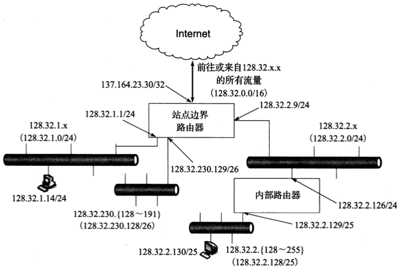
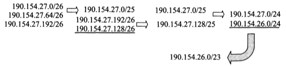
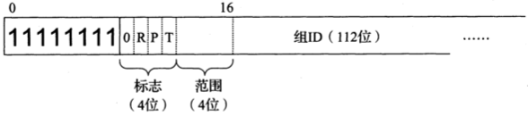

# 第二章 Internet地址结构

[TOC]

## 引言

## IP地址表示

ipv4地址长32bit，通常采用`Dotted decimal notation(点分十进制)`的方法表示。

ipv6地址长128bit，传统表示方法是采用称为块或字段的4个16进制数，以及冒号分隔。

ipv6的简化表示方法标准：

1. 一个块中前导的零不必书写
2. 全零的块可以省略
3. 在ipv6格式中潜入ipv4地址可使用混合符号形式，紧接着ipv4部分的地址块的值`ffff`，地址的其余部分使用点分四组格式
4. ipv6地址的低32位通常采用点分四组表示法。

## 基本IP地址结构

### 分类寻址

- A类

  | 1bit | 7bit              | 24bit       |
  | ---- | ----------------- | ----------- |
  | 0    | 网络号-Net Number | 主机号-Host |

- B类

  | 1bit | 1bit | 14bit             | 16bit       |
  | ---- | ---- | ----------------- | ----------- |
  | 1    | 0    | 网络号-Net Number | 主机号-Host |

- C类

  | 1bit | 1bit | 1bit | 21bit             | 8bit        |
  | ---- | ---- | ---- | ----------------- | ----------- |
  | 1    | 1    | 0    | 网络号-Net Number | 主机号-Host |

- D类

  | 1bit | 1bit | 1bit | 1bit | 28bit                      |
  | ---- | ---- | ---- | ---- | -------------------------- |
  | 1    | 1    | 1    | 0    | 多播组号-Multicast Address |

- E类

  | 1bit | 1bit | 1bit | 1bit | 1bit | 28bit         |
  | ---- | ---- | ---- | ---- | ---- | ------------- |
  | 1    | 1    | 1    | 1    | 0    | 保留-Reserved |

A, B, C类用于单播

ipv4空间划分:

| 类   | 地址范围                  | High-Order Bits | Use             | Fraction of Total | Number of Nets | Number of Hosts |
| ---- | ------------------------- | --------------- | --------------- | ----------------- | -------------- | --------------- |
| A    | 0.0.0.0~127.255.255.255   | 0               | Unicast/special | 1/2               | 128            | 16,777,216      |
| B    | 128.0.0.0~191.255.255.255 | 10              | Unicast/special | 1/4               | 16,384         | 65536           |
| C    | 192.0.0.0~223.255.255.255 | 110             | Unicast/special | 1/8               | 2,097,152      | 256             |
| D    | 224.0.0.0~239.255.255.255 | 1110            | Multicast       | 1/16              | N/A            | N/A             |
| E    | 240.0.0.0~255.255.255.255 | 1111            | Reserved        | 1/16              | N/A            | N/A             |

### 子网掩码

*子网掩码*: 由一台主机或路由器实用的分配位，以确定如何从一台主机对应IP地址中获得网络和子网信息。

*一个IP地址可以与一个子网掩码使用按位与操作，以形成用于路由的地址的网络/子网标识符（前缀）。在这个例子中，IPv4地址128.32.1.14使用长度为24的掩码得到前缀128.32.1.0/24*

### 可变长度子网掩码

可变长度子网掩码(VLSM)，例:

*VLSM可用于分割一个网络号，使每个子网支持不同数量的主机。每个路由器和主机除了IP地址，还需要配置一个子网掩码。大多数软件支持VLSM，除了一些旧的路由协议（例如RIP版本1）*

- `/24`: 允许`32-24=8`位（256台主机）
- `/25`: 允许`32-25=7位`（128台主机）
- `/26`: 允许`32-26=6`位（64台主机）

### 广播地址

先将子网掩码取反，然后与ipv4进行或运算得到子网广播地址，例:

*子网广播地址由子网掩码首先取反，然后与IPv4地址进行或运算构建而成。在这种情况下，一个/24的子网掩码，剩余的32-24=8位设置为1，得到一个十进制255和子网广播地址128.32.1.255*

**注意:上面的广播叫做定向广播，目前在Internet中被禁用，其根本不会被路由器转发。**

### IPv6地址和接口标识符

- IID(接口标识符)
- EUI(扩展唯一标识符)
- OUI(组织唯一标识符)

*EUI-48和EUI-64格式由IEEE定义。这些都是用于IPv6的地址，它们是通过将接口标识符取反u位来形成的*

## CIDR和聚合

### 前缀

- CIDR(无类别域间路由)
- 网络前缀: 解释和处理掩码，用于IPv4和IPv6地址管理

前缀的例子及其相应的IPv4或IPv6地址范围:

| 前缀               | 前缀(二进制)                                                 | 地址范围                        |
| ------------------ | ------------------------------------------------------------ | ------------------------------- |
| 0.0.0.0/0          | 00000000 00000000 00000000 00000000                          | 0.0.0.0~255.255.255.255         |
| 128.0.0.0/1        | ~~1~~0000000 00000000 00000000 00000000                      | 128.0,0.0~255.255.255.255       |
| 128.0.0.0/24       | ~~10000000 00000000 00000000~~ 00000000                      | 128.0,0.0~128.0.0.255           |
| 198.128.128.192/27 | ~~11000110 10000000 10000000 1100~~0000                      | 198.128.128.192~198.128.128.223 |
| 165.195.130.107/32 | ~~10100101 11000011 10000010 01101011~~                      | 165.195.130.107                 |
| 2001:db8::/32      | 00100000 00000001 00001101 10111000 00000000 00000000 00000000 00000000 00000000 00000000 00000000 00000000 00000000 00000000 00000000 00000000 | 2001:db8::~2001:db8:ffff:ffff   |

### 聚合

*路由聚合*: 采用分层路由思想以一种特定方式减少Internet路由条目数。例：

*在这个例子中，箭头表示将两个地址前缀聚合为一个，带下划线的前缀是每一步的结果。第一步，190.154.27.0/26和192.154.27.64.0/26可以聚合，这是由于它们数值相邻，但是190.154.27.192/26不能聚合。通过与190.154.27.128/26相加，它们可经过两步聚合形成190.154.27.0/24。最后，通过与相邻的190.154.26.0/24相加，生成聚合结果190.154.26.0/23*

## 特殊用途地址

IPv4特殊用途地址

| 前缀               | 特殊用途                                                     | 参考文献               |
| ------------------ | ------------------------------------------------------------ | ---------------------- |
| 0.0.0.0/8          | 本地网络中的主机。仅作为源IP地址使用                         | [RFC1122]              |
| 10.0.0.0/8         | 专用网络（内联网）的地址。这种地址不会出现在公共Internet中   | [RFC1918]              |
| 127.0.0.0/8        | Internet主机回送地址（同一计算机）。通常只用127.0.0.1        | [RFC1122]              |
| 169.254.0.0/16     | “链路本地”地址，只用于一条链路，通常自动分配。               | [RFC3927]              |
| 172.16.0.0/12      | 专用网络（内联网）的地址。这种地址不会出现在Internet中       | [RFC1918]              |
| 192.0.0.0/24       | IETF协议分配(IANA保留)                                       | [RFC5736]              |
| 192.0.2.0/24       | 批准用于文档中的TEST-NET-1地址。这种地址不会出现在公共Internet中 | [RFC5737]              |
| 192.88.99.9/24     | 用于6to4中继（任播地址）                                     | [RFC3068]              |
| 192.168.0.0/16     | 专用网络（内联网）的地址。这种地址不会出现在公共Internet中   | [RFC1918]              |
| 198.18.0.0/15      | 用于基准和性能测试                                           | [RFC2544]              |
| 198.51.100.0/24    | TEST-NET-2地址。被批准用于文档中                             | [RFC5737]              |
| 203.0.113.0/24     | TEST-NET-3地址。被批准用于文档中                             | [RFC5737]              |
| 224.0.0.0/4        | IPv4组播地址（以前的D类），仅作为目的IP地址使用              | [RFC5771]              |
| 224.0.0.0/4        | 保留空间（以前的E类），除了255.255.255.255                   | [RFC1112]              |
| 255.255.255.255/32 | 本地网络（受限的）广播地址                                   | [RFC0919] [RFC0922] |

IPv6特殊用途地址

| 前缀                | 特殊用途                                                     | 参考文献  |
| ------------------- | ------------------------------------------------------------ | --------- |
| ::/0                | 默认路由条目。不用于寻址                                     | [RFC5156] |
| ::/128              | 未指定地址，可作为源IP地址使用                               | [RFC4291] |
| ::1/128             | IPv6主机回送地址，不用于发送出本地主机的数据报中             | [RFC4291] |
| ::ffff:0:0/96       | IPv4映射地址。这种地址不会出现在分组头部，只用于内部主机     | [RFC4291] |
| ::{ipv4-address}/96 | IPv4兼容地址。已过时，未使用                                 | [RFC4291] |
| 2001::/32           | Teredo地址                                                   | [RFC4380] |
| 2001:10::/28        | ORCHI（覆盖可路由加密散列标识符）。这种地址不会出现在公共Internet中 | [RFC4843] |
| 2002::/16           | 6to4隧道中继的6to地址                                        | [RFC3056] |
| 3ffe::/16           | 用于6bone实验。已过时，未使用                                | [RFC3701] |
| 5f00::/16           | 用于6bone实验。已过时，未使用                                | [RFC3701] |
| fc00::/7            | 唯一的本地单播地址，不用于全球性的Internet                   | [RFC4193] |
| fe80::/10           | 链路本地单播地址                                             | [RFC4291] |
| ff00::/8            | IPv6组播地址，仅作为目的IP地址使用                           | [RFC4291] |

### IPv4_IPv6地址转换

- 嵌入IPv4的IPv6地址

*IPv4地址可以嵌入IPv6地址中，形成一个嵌入IPv4的IPv6地址。有6种不同的格式可用，这取决于使用的IPv6前缀长度。众所周知的前缀64:ff9b::/96可用于IPv4和IPv6单播地址之间的自动转换*

### 组播地址

### IPv4组播地址

| 范围（包含）                                               | 特殊用途                            | 参考文献                 |
| ---------------------------------------------------------- | ----------------------------------- | ------------------------ |
| `224.0.0.0~224.0.0.255`                                    | 本地网络控制；不转发                | [RFC5771]                |
| `224.0.1.0~224.0.1.255`                                    | 互联网络孔子；正常转发              | [RFC5771]                |
| `224.0.2.0~224.0.255.255`                                  | Ad hoc块1                           | [RFC5771]                |
| `224.1.0.0~224.1.255.255`                                  | 保留                                | [RFC5771]                |
| `224.2.0.0~224.2.255.255`                                  | SDP/SAP                             | [RFC4566]                |
| `224.3.0.0~224.4.255.255`                                  | Ad hoc 块2                          | [RFC5771]                |
| `224.5.0.0~224.255.255.255`                                | 保留                                | [IP4MA]                  |
| `225.0.0.0~231.255.255.255`                                | 保留                                | [IP4MA]                  |
| `232.0.0.0~233.255.255.255`                                | 源特定组播(SSM)                     | `[RFC4607][RFC4608]`     |
| `233.0.0.0~233.251.255.255`                                | GLOP                                | [RFC3180]                |
| `233.252.0.0~233.255.255.255`                              | Ad hoc块3(233.252.0.0/24为文档保留) | [RFC5771]                |
| `234.0.0.0~234.255.255.255` `235.0.0.0~238.255.255.255` | 基于单播前缀的IPv4组播地址保留      | `[RFC6034]` `[IP4MA]` |
| `239.0.0.0~239.255.255.255`                                | 管理范围                            | [RFC2365]                |

UBM`(基于单播前缀的组播寻址)`

*IPv4的UBM地址格式。为单播地址分配/24或更短的前缀，关联的组播地址分配基于前缀234/8，分配的单播前缀和组播组ID的串联。因此，较短的单播前缀分配包含更多单播和组播地址*

### IPv6组播地址

*基本的IPv6组播地址格式包括4个标志位（0，保留：R，包含会合点；P，使用单播前缀；T，是临时的）。4位范围值表示组播的范围（全球，本地等）。组ID编码在低序的112位中。如果P或R位被设置，则使用一种代替格式*

IPv6范围字段的值：

| 值    | 范围          |
| ----- | ------------- |
| 0     | 保留          |
| 1     | 接口/机器本地 |
| 2     | 链路/子网本地 |
| 3     | 保留          |
| 4     | 管理          |
| 5     | 站点本地      |
| `6~7` | 未分配        |
| 8     | 组织本地      |
| `9~d` | 未分配        |
| e     | 全球          |
| f     | 保留          |

IPv6组播地址标志：

| 位字段（标志） | 含义                                         | 参考文献  |
| -------------- | -------------------------------------------- | --------- |
| R              | 会合点（RP）标志（0，常规的；1.包括RP地址）  | [RFC3956] |
| P              | 前缀标志（0，常规的；1，基于单播前缀的地址） | [RFC3306] |
| T              | 临时标志（0，永久分配的；1，临时的）         | [RFC4291] |

IPv6组播地址空间中的保留地址

| 地址              | 范围       | 特殊用途                | 参考文献  |
| ----------------- | ---------- | ----------------------- | --------- |
| ff01::1           | 节点       | 所有节点                | [RFC4291] |
| ff01::2           | 节点       | 所有路由器              | [RFC4291] |
| ff01::fb          | 节点       | mDNSv6                  | [IDChes]  |
| ff02::1           | 链路       | 所有节点                | [RFC4291] |
| ff02::2           | 链路       | 所有路由器              | [RFC4291] |
| ff02::4           | 链路       | DVMRP路由器             | [RFC1075] |
| ff02::5           | 链路       | OSPFIGP                 | [RFC2328] |
| ff02::6           | 链路       | 基于OSPFIGP设计的路由器 | [RFC2328] |
| ff02::9           | 链路       | RIPng路由器             | [RFC2080] |
| ff02::a           | 链路       | EIGRP路由器             | [EIGRP]   |
| ff02::d           | 链路       | PIM路由器               | [RFC5059] |
| ff02::16          | 链路       | 支持MLDv2的路由器       | [RFC3810] |
| ff02::6a          | 链路       | 所有探测器              | [RFC4286] |
| ff02::6d          | 链路       | LL-MANET路由器          | [RFC5498] |
| ff02::fb          | 链路       | mDNSv6                  | [IDChes]  |
| ff02::1:2         | 链路       | 所有DHCP代理            | [RFC3315] |
| ff02::1:3         | 链路       | LLMNR                   | [RFC4795] |
| ff02::1:ffxx:xxxx | 链路       | 请求节点地址范围        | [RFC4291] |
| ff05::2           | 站点       | 所有路由器              | [RFC4291] |
| ff05::fb          | 站点       | mDNSv6                  | [IDChes]  |
| ff05::1:3         | 站点       | 所有DHCP服务器          | [RFC3315] |
| ff0x::            | 可变的     | 保留                    | [RFC4291] |
| ff0x::fb          | 可变的     | mDNSv6                  | [IDChes]  |
| ff0x::101         | 可变的     | NTP                     | [RFC5905] |
| ff0x::133         | 可变的     | 聚合服务器访问协议      | [RFC5352] |
| ff0x::18c         | 可变的     | 所有AC的地址（CAPWAP）  | [RFC5415] |
| ff3x::/32         | （特殊的） | SSM块                   | [RFC4607] |

## 单播地址分配

### 单个供应商_多个网络_多个网址

*一个典型的小型到中型规模的企业网络。该网站已被分配128.32.2.64/26范围内的64个公开（可路由）的IPv4地址。“DMZ”网络包含Internet中可见的服务器。内部路由器使用NAT为企业内部的计算机提供Internet访问*

### 多个供应商_多个网络_多个地址

*供应商聚合和供应商独立的IPv4地址用于一个假设的多宿主企业。如果PI地址是可用的，站点运营者倾向于选择使用PI空间。ISP更喜欢PA空间，因为它可促进前缀聚合，减少路由表的大小*

