# 第三章 链路层

[TOC]


## 引言

`最大传输单元（MTU）`


## 以太网和IEEE802局域网/城域网标准

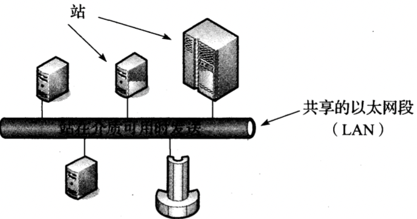

*基本的共享以太网包含一个或多个站（例如工作站，超级计算机），他们都被连接到一个共享的电缆段上。当介质被确定为空闲状态时，链路层的PDU（帧）可以从一个站发送到一个或更多其他站。如果多个站同时发送数据，可能因信号传播延迟而发生碰撞，碰撞可以被检测到，它会导致发送站等待一个随机时间，然后重新发送数据。这种常见的方法称为带冲突检测的载波侦听多路访问*

由于多个站共享同一网络，该标准需要在每个以太网接口实现一种分布式算法，以控制一个站发送自己的数据。这种特定方法称为`带冲突（或称碰撞）检测的载波侦听多路访问（CSMA/CD）`，它协调哪些计算机可访问共享的介质（电缆），同时不需要其他特殊协议或同步。

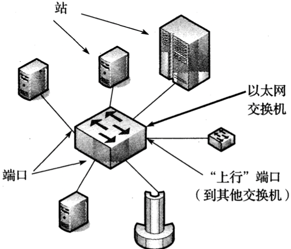

*一个交换式以太网包含一个或多个站每个站使用一条专用的线路连接到一个交换机端口。在大多数情况下，交换式以太网以全双工方式运行，并且不需要使用CSMA/CD算法。交换机可以通过交换机端口级联形成更大的以太网，该端口有时也称为“上行”端口*

### IEEE802局域网/城域网标准

有关TCP/IP协议的局域网和城域网IEEE 802标准（2001）：

| 名称            | 描述                                                         | 官方参考                |
| --------------- | ------------------------------------------------------------ | ----------------------- |
| 802.1ak         | 多注册协议（MRP）                                            | [802.1AK-2007]          |
| 802.1AE         | MAC安全（MACSec）                                            | [802.1AE-2006]          |
| 802.1AX         | 链路聚合（以前的802.3ad）                                    | [802.1AX-2008]          |
| 802.1d          | MAC网桥                                                      | [802.1D-2004]           |
| 802.1p          | 流量类/优先级/QoS                                            | [802.1D-2004]           |
| 802.1q          | 虚拟网桥的局域网/MRP的更正                                   | [802.1Q-2005/Corl-2008] |
| 802.1s          | 多生成树协议（MSTP）                                         | [802.1Q-2005]           |
| 802.1w          | 快速生成树协议（RSTP）                                       | [802.1D-2004]           |
| 802.1X          | 基于端口的网络访问控制（PNAC）                               | [802.1X-2010]           |
| 802.2           | 逻辑链路控制（LLC）                                          | [802.2-1998]            |
| 802.3           | 基本以太网和10Mb/s以太网                                     | [802.3-2008]（第1节）   |
| 802.3u          | 100Mb/s以太网（“快速以太网”）                                | [802.3-2008]（第2节）   |
| 802.3x          | 全双工运行和流量控制                                         | [802.3-2008]            |
| 802.3z/802.3ab  | 1000Mb/s以太网（“千兆以太网”）                               | [802.3-2008]（第3节）   |
| 802.3ae         | 10Gb/s以太网（“万兆以太网”）                                 | [802.3-2008]（第4节）   |
| 802.3ad         | 链路聚合                                                     | [802.1AX-2008]          |
| 802.3af         | 以太网供电（PoE，15.4W）                                     | [802.3-2008]（第2节）   |
| 802.3ah         | 以太网接入（第一公里以太网）                                 | [802.3-2008]（第5节）   |
| 802.3as         | 帧格式扩展（2000字节）                                       | [802.3-2008]            |
| 802.3at         | 以太网供电增强（“PoE+”，30W）                                | [802.3at-2009]          |
| 802.3ba         | 40/100Gb/s以太网                                             | [802.3ba-2010]          |
| 802.11a         | 运行在5GHz的54Mb/s的无线局域网                               | [802.11-2007]           |
| 802.11b         | 运行在2.4GHz的11Mb/s的无线局域网                             | [802.11-2007]           |
| 802.11e         | 针对802.11的QoS增强                                          | [802.11-2007]           |
| 802.11g         | 运行在2.4GHz的54Mb/s的无线局域网                             | [802.11-2007]           |
| 802.11h         | 频谱/电源管理扩展                                            | [802.11-2007]           |
| 802.11i         | 安全增强/代替WEP                                             | [802.11-2007]           |
| 802.11j         | 运行在4.9~5.0GHz（日本）                                     | [802.11-2007]           |
| 802.11n         | 运行在2.4GHz和5GHz的6.5~600Mb/s的无线局域网，使用可选的MIMO和40MHz信道 | [802.11n-2009]          |
| 802.11s（草案） | 网状网，拥塞控制                                             | 开发中                  |
| 802.11y         | 运行在3.7GHz的54Mb/s的无线局域网（许可的）                   | [802.11y-2008]          |
| 802.16          | 微波存取全球互通技术（WiMAX）                                | [802.16-2007]           |
| 802.16d         | 固定的无线城域网标准（WiMAX）                                | [802.16-2007]           |
| 802.16e         | 固定/移动的无线城域网标准（WiMAX）                           | [802.16-2007]           |
| 802.16h         | 改进的共存机制                                               | [802.16h-2007]          |
| 802.16j         | 802.16中的多跳中继                                           | [802.16j-2007]          |
| 802.16k         | 802.16网桥                                                   | [802.16k-2007]          |
| 802.21          | 介质无关切换                                                 | [802.21-2007]           |

### 以太网帧格式

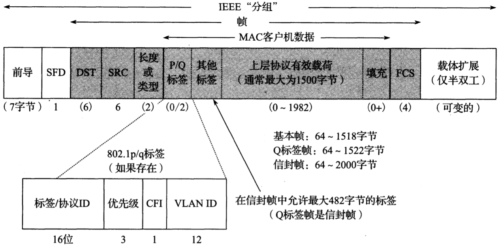

*以太网（IEEE 802.3）帧格式包含一个源地址和目的地址，一个重载的长度/类型字段，一个数据字段和一个帧校验序列（CRC32）。另外，基本帧格式提供了一个标签，其中包含了一个VLAN ID和优先级信息（802.1p/q），以及一个最近出现的可扩展标签。前导和SFD被用于接收器同步。当以太网以半双工模式运行在100Mb/s或以上速率时，其他位可能被称作为载体扩展添加到短帧中，以确保冲突检测电路的正常运行*

#### 帧校验序列/循环冗余校验

`循环冗余校验（CRC）`

#### 帧大小

以太网最小帧长度是64字节，要求数据区（有效载荷）长度（无标签）最小为48字节；当有效载荷较小时，填充字节（值为0）被添加到有效载荷尾部，以确保达到最小长度。

以太网的最大帧长度是1518字节（包括4字节CRC和14字节头部）。

### 802.1p/q：虚拟局域网和QoS标签

`虚拟局域网（VLAN）` 被定义在802.lq[802.1Q-2005]标准中，用来扩展802 LAN标准。

例，为VLAN ID为2的接口eth1添加，删除虚拟接口，修改虚拟接口的命名方式并添加新接口：

```sh
# 添加接口
vconfig add eth1 2
# 删除接口
vconfig rem eth1 2
# 重命名接口
vconfig set_name_type VLAN_PLUS_VID
```

### 802.1AX：链路聚合（以前的802.3ad）

`链路聚合控制协议（LACP）`

Linux使用以下命令实现跨越不同类型设备的链路聚合（绑定）：

```sh
# 加载绑定驱动
modprobe bonding
# 使用IPv4地址来创建bond0接口
ifconfig bond0 10.0.0.111 netmask 255.255.255.128
# 绑定设备bond0并用MASTER标志来标记
ifenslave bond0 eth0 wlan0
```


## 全双工，省电，自动协商和802.1X流量控制

例，使用ethtool程序可以查询是否支持全双工，以及是否正在执行全双工操作：

```sh
ethtool eth0
```

### 双工不匹配

一台计算机及其相关的交换机端口使用不同的双工配置时，或者当自动协商只在链路的一端杯禁用时，可能会发生`双工不匹配`现象；当这种状况发生时，连接不会完全失败，但可能带来显著的性能下降。

### 局域网唤醒（WoL），省电和魔术分组

Linux中，可以被一下几种帧唤醒：

- 任何物理层（PHY）活动（p）
- 发往站的单播帧（u）
- 组播帧（m）
- 广播帧（b）
- ARP帧（a）
- 魔术分组帧（g）
- 包括密码的魔术分组帧

### 链路层流量控制

以全双工模式运行扩展的以太网和跨越不同速率的网段时，可能需要由交换机将帧缓存一段时间，如果这种情况持续，这些帧可能被丢弃；`流量控制`可以避免这种情况，通过将PAUSE消息包含在MAC控制帧中，通过将以太网`长度/类型`字段值设置为`0x8808`，以及使用MAC控制操作码0x0001来标识，如果一个站接收到这种帧，表示建议它减缓发送速度；PAUSE帧总是被发送到MAC地址`01:80:C2:00:00:01`，并且只能在全双工链路上使用。它包含一个保持关闭（hold-off）时间值（指定量为512比特的时间），表明发送方在急速发送之前需要暂停多长时间。

**注意：以太网层次的流量控制可能有重大负面影响，因此通常并不使用它。**


## 网桥和交换机

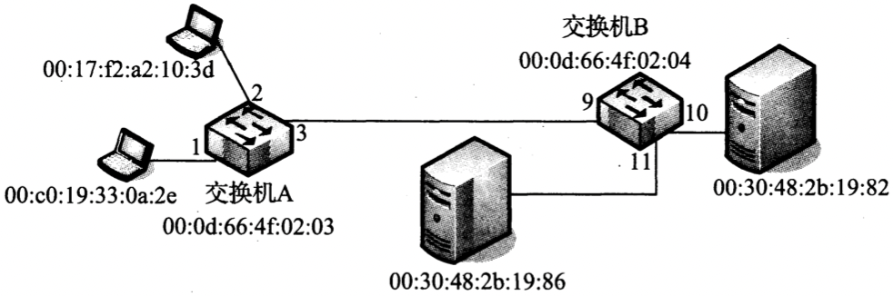

*一个包括两台交换机的扩展以太网。每个交换机端口有一个编号，每个站（包括每个交换机）都有自己的MAC地址*

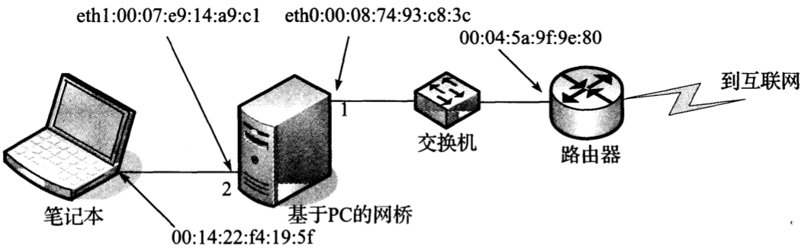

*在这个简单的拓扑中，一台基于Linux的PC被配置为网桥，它在两个以太网之间实现互联。作为一个处于学习中的网桥，它不断积累并建立一些表，其中包含有关哪个端口可到达扩展局域网中的其他系统的信息*

例，Linux下启用网桥：

```sh
# 创建一个网桥设备br0
brctl addbr br0
# 为网桥增加接口eth0和eth1
brctl addif br0 eth0
brctl addif br0 eth1
# 启用网桥
ifconfig eth0 up
ifconfig eth1 up
ifconfig br0 up
```

例，检查过滤数据库：

```sh
brctl show
# 检查过滤数据库
brctl showmacs br0
```

例，设置数据库条目的有效期：

```sh
brctl setageing br0 1
brctl showmacs br0
```

### 生成树协议

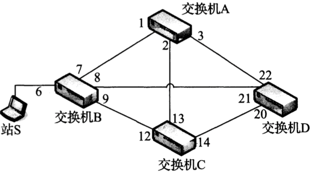

*一个扩展的以太网包括4台交换机和多条冗余链路。如果在这个网络中采用简单的洪泛转发帧，由于多余的倍增流量（所谓的广播风暴），将会导致一场大的灾难。这种情况需要使用`生成树协议（STP）`*

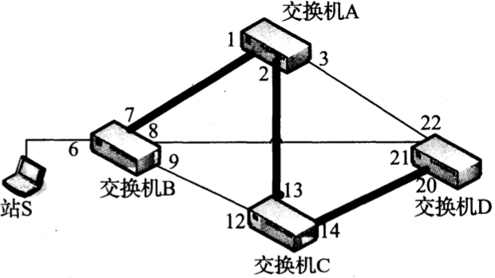

*通过STP，链路B-A，A-C和C-D在生成树中是活跃的。端口6，7，1，2，13，14和20处于转发状态；所有其他端口被阻塞（即不转发）。这样可以防止帧循环，避免广播风暴。如果配置发生变化或者某台交换机故障，则将阻塞端口改变为转发状态，并由网桥计算一个新生成树*

`网桥协议数据单元（BPDU）`

#### 端口状态和角色		

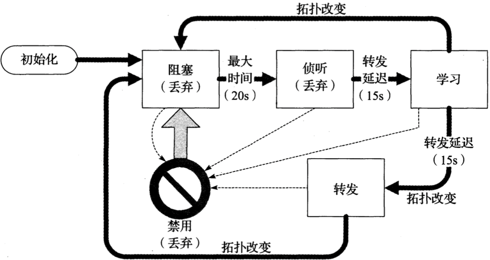

*在正常的STP操作中，端口在4个主要状态之间转换。在阻塞状态下，帧不被转发，但一次拓扑变化或超时可能导致向侦听状态转换。转发状态是活跃的交换机端口承载数据流量的正常状态。括号中的状态名用于表示RSTP相关的端口状态*

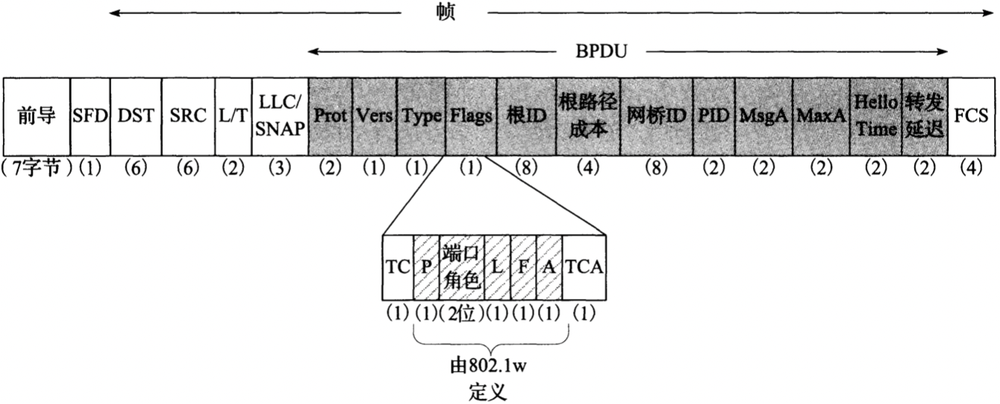

*BPDU被放置在802帧的有效载荷区，并在网桥之间交换以建立生成树。重要的字段包括源，根节点，到根的成本和拓扑变化提示。在802.1w和[802.1D-2004]中（包括快速STP或RSTP），附加字段显示端口状态*

- `Prot` 协议

- `Vers` 版本 

  - `0` STP
  - `2` RSTP

- `Type` 类型 

- `Flags` 标志

- `TC` 拓扑变化

- `P` 建议

- `端口角色`

  - `00` 未知
  - `01` 备用
  - `10` 根
  - `11` 指定

- `L` 学习

- `F` 转发

- `A` 协议

- `TCA` 拓扑变化确认

- `根ID`

- `根路径成本`

- `网桥ID` MAC地址

- `PID` 端口标识符和由发送帧给出的端口号，它被附加在一个可配置的1字节的优先级字段（默认0x80）之后。

- `MsgA` 消息有效期

- `MaxA` 超时的最大期限（默认20s）

- `Hello Time` 欢迎时间，配置帧的传输周期

- `转发延迟` 处于学习和侦听状态的时间

- `FCS`

#### 建立生成树

选举根网桥：当一个网桥初始化时，它假设自己是根网桥，并用自己的网桥ID作为根ID字段的值发送配置BPDU消息，如果它检测到一个ID更小的网桥，则停止发送自己的帧，并基于接收到的ID更小的帧构造下一步发送的BPDU。发出根BPDU的端口被标记为根端口（即端口在到根网桥的路径上）。剩余端口被设置为阻塞或转发状态。

#### 拓扑变化

在STP中，当一个端口进入阻塞或转发状态时，意味着发生拓扑变化。当网桥检测到一个链接变化（例如一条链路故障），它向根端口之外的端口发送拓扑变化通知（TCN）BPDU，通知自己在树中的父网桥，直到根为止。

#### 快速生成树协议（以前的802.1w）

`快速生成树协议（Rapid Spanning Tree Protocol，RSTP）`

### 802.1ak：多注册协议

`多注册协议（Mutiple Registration Protocol，MRP）` 提供了在桥接局域网环境中的站之间注册属性的通用方法。


## 无线局域网-IEEE 802.11（Wi-Fi）

`无线保真（Wi-Fi）` 是一种常用的无线以太网标准（802.11）

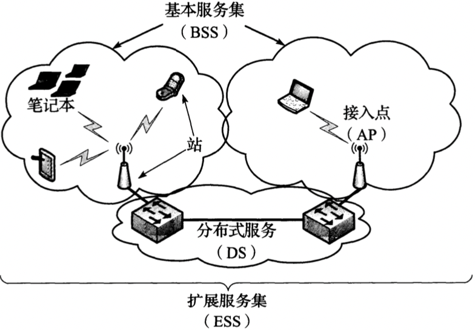

*一个无线局域网的802.11术语。接入点可采用一种分布式服务器（一个无线或有线的主干）来连接，以形成一个扩展的无线局域网（称为一个ESS）。站（包括AP和移动设备）之间的通信构成一个基本服务集。在通常情况下，每个ESS有一个指定的ESSID，它的功能是作为一个网络的名称*

### 802.11帧

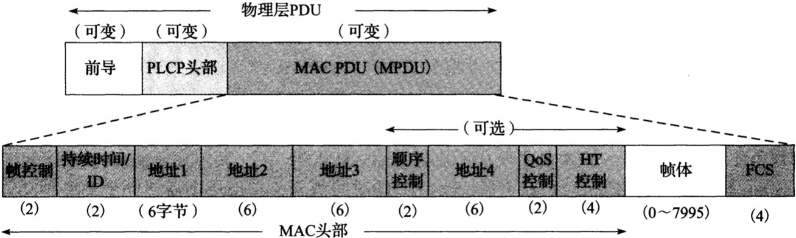  

*802.11基本数据帧格式（见[802.11n-2009]）。MPDU格式类似于以太网，但取决于接入点之间使用的DS类型：帧是发送到DS还是来自它，以及帧是否被聚合。QoS控制字段用于特殊功能，HT控制字段用于控制802.11n的“高吞吐量”功能*

- `前导码` 用于同步

- `PLCP头部` 以独立于物理层的方式提供特定的物理层信息

- `MPDU` 

  - `帧控制` 2位类型字段，用于识别帧的类型：

    - `管理帧` 用于创建，维持，终止站，接入点之间的连接，是否采用加密，传输网络名称（SSID和ESSID），支持哪种传输速率，以及采用的时间数据库等。

    - `控制帧` 用于流量控制；

      1. 支持可选的`请求发送/明确发送（RTS/CTS）`，通过放缓传输来进行流量控制；

         `RTS/CTS`阈值可以通过以下命令设置：

         ```sh
         iwconfig wlan0 rts 250
         ```

      2. 采用`重传/确认（ACK）`方法来扩展802.3重传机制，对预期在一定时间内接受一个单播帧（802.11a/b/g）或一组帧（802.11n或带“块确认”的802.11e）的响应，以避免组播/广播时的"ACK爆炸"问题；

    - `数据帧`

  - `持续时间/ID` 

#### 数据帧，分片和聚合

802.11支持`帧分片`，可以将一个帧分为多个分片；根据802.11n的规定，它也支持`帧聚合`，可将多个帧合并发送以减少开销。

`分片`有用的原因在于其出错的概率。如果误码率（Bit Error Rate，BER）为$P$，1位数据成功交付的概率为$(1-P)$，$N$位成功交付的概率为$(1-P)^N$。随着N的增长，这个值逐渐减小；因此如果我们减少一个帧的大小，理论上可改善错误交付的概率；

例：假如要发送一个1500字节（12000位）的帧，如果假设$P=10^{-4}$（一个相对较高的误码率），不分片时的成功交付概率为$(1-10^{-4})^{12000}=0.301$，那么只有约30%机会将这个帧成功交付，即平均发送3或4次可使它成功接收。如果使用分片，将分片阈值设置为500，这时将产生3个4000位的分片，每个分片成功交付的概率为$(1-10^{-4})^{4000}=0.670$，因此，每个分片约有67%的机会成功交付，平均2或3个分片被成功交付的机会较大。

`聚合的MAC服务数据单元（A-MSDU）` 可将多个完整的802.3（以太网）帧聚合在一个802.11帧中。

`聚合的MAC协议数据单元（A-MPDU）` 可将多个具有相同源，目的和QoS的MPDU聚合为短帧。

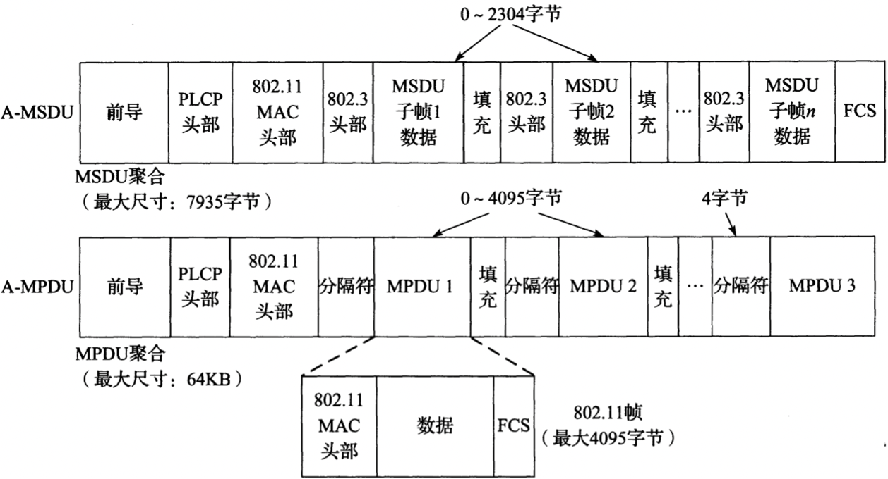

*802.11n中的帧聚合包括A-MSDU和A-MPDU。A-MSDU使用一个FCS聚合多个帧。A-MPDU在集合的每个802.11帧之间使用一个4字节的分隔符。每个A-MPDU拥有自己的FCS，并可以分别使用ACK确认，以及在必要时重传*

### 省电模式和时间同步功能

`省电模式（PSM）` 为了节省电源，在使用PSM时，STA的输出帧在帧控制字段中设置1位。当AP发现某些帧的该位置被设置时，它会缓冲该帧直到需要时为止。

Wifi采用`时间同步功能（TSF）`。每个站保持一个64位计数器的参考时间（微秒），这个时间与网络中的其它站保持同步（延迟在4微秒+PHY之内）。

`自动省电交付模式（APSD）` 使用QoS控制字中的一些子字段。

### 802.11介质访问控制

`点协调功能（PCF）`

`分布式协调功能（DCF）`

`混合式协调功能（HCF）`

#### 虚拟载波侦听，RTS/CTS和网络分配向量

`虚拟载波侦听机制` 通过站的侦听而非引导流量来实检查每个MAC帧中的持续时间字段；

`网络分配向量（NAV）`

#### 物理载波侦听（CCA）

`空闲信道评估（Clear Channel Assessment，CCA）` 每个802.11PHY规范需提供一种评估信道是否空闲的功能，它基于能量和波形识别（通常是一个完好的PLCP）。

#### DCF冲突避免/退避过程

`竞争窗口（CW）` 是一个整数，其中包含许多等待时隙，且$aCWmin \leqslant CW \leqslant aCWmax$。

#### HCF和802.11e/n的QoS

在HCF中，有以下信道访问方法可以协同工作：

- `HFCA控制信道访问（HCCA）` 基于预约的访问
- `增强型DCF信道访问（EDCA）` 基于竞争的访问

### 物理层的细节：速率，信道和频率

802.11标准中描述的物理层部分：

| 标准（条款）      | 速率（Mb/s）                                            | 频率范围；调制                               | 信道设置                                               |
| ----------------- | ------------------------------------------------------- | -------------------------------------------- | ------------------------------------------------------ |
| 802.11a（第17条） | 6, 9, 12, 18, 24, 36, 48,  54                           | 5.16GHz～5.35GHz和5.725~5.825GHz; OFDM       | 37~164（根据国家不同），20MHz/10MHz/5MHz信道宽度选项   |
| 802.11b（第18条） | 1, 2, 5.5, 11                                           | 2.401GHz~2.495GHz; DSSS                      | 1~14（根据国家不同）                                   |
| 802.11g（第19条） | 1, 2, 5.5, 6, 9, 11, 12, 18, 24, 36, 48, 54（加22, 23） | 2.401GHz~2.495GHz; OFDM                      | 1~14（根据国家不同）                                   |
| 802.11n           | 6.5~600，很多选项（最多4个MIMO流）                      | 2.4GHz和5GHz模式，信道宽度20MHz或40MHz; OFDM | 1~13（2.4GHz频段）；36~196（5GHz频段）（根据国家不同） |
| 802.11y           | （与802.11-2007相同）                                   | 3.650GHz~3.7GHz（需要许可）；OFDM            | 1~25，36~64，100~161（根据国家不同）                   |

#### 信道和频率

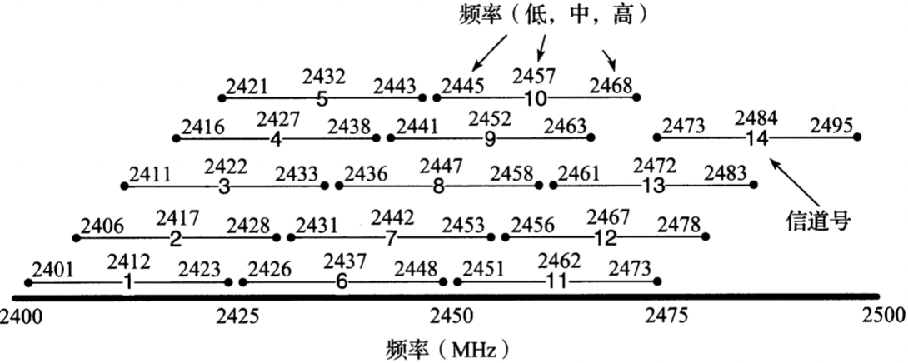

*802.11b和802.11g标准使用2.4GHz和2.5GHz之间的频段。这个频段被划分为14个22MHz宽的重叠信道，其中一些子集是否可合法使用取决于所在国家。在同一个地址运行多个基站，分配非重叠的信道是可取的做法，例如美国的1，6和11。只有一个40MHz的802.11n信道可用于此频段而不会发生重叠*

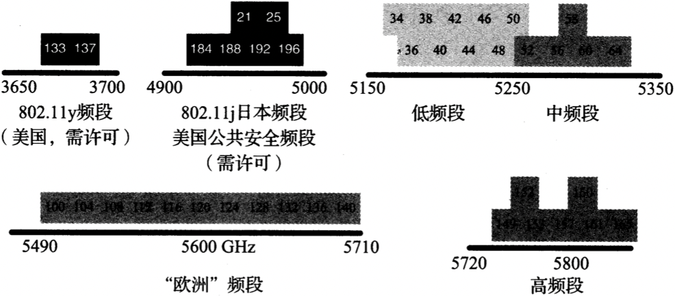

*20MHz信道中的一些可用的802.11信道号和中心频率。最常见的无须许可使用的频率范围包括U-NII频段，它们均在5GHz之上。较低频段被批准可用于大多数国家。“欧洲”频段被批准用于大多数欧洲国家，高频段被批准用于美国和中国。802.11a/y信道的典型宽度为20MHz，但802.11n的信道宽度可能为40MHz。另外，在日本也可使用窄信道和某些信道（未显示）*

#### 更高吞吐量的802.11/802.11n

`多输入多输出（MIMO）`

`空间流（Spatial Stream）`

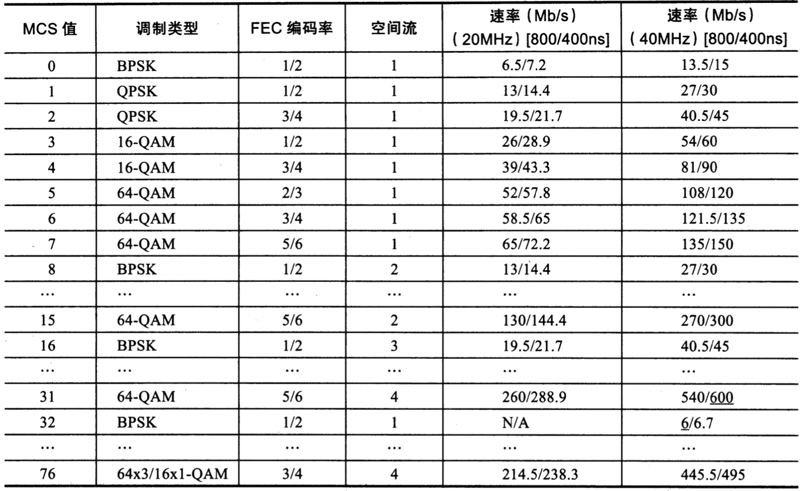

*802.11n的MCS值包括平等和不平等调制，不同的FEC编码率，使用20MHz或40MHz信道宽度的4个空间流，以及800ns或400ns GI的组合。77中组合提供从6Mb/s到600Mb/s的数据传输速率*

`二进制相移键控（BPSK）`

`正交相移键控（QPSK）`

`转发纠错（FEC）`

`分阶段共存操作（PCO）`

### Wi-Fi安全

`有线等效保密（WEP）`

`临时密钥完整性协议（TKIP）`

`预设置共享密钥（PSK）`

`计数器模式（CCM）`

`密码块链接消息认证码（CBC-MAC）`

`强健安全网络（RSN）`

`强健安全网络访问（RSNA）`

Wi-Fi安全已从不安全的WEP演变到WPA，再到当前标准的WPA2方案：

| 名称/标准        | 密码 | 密钥流管理     | 认证                |
| ---------------- | ---- | -------------- | ------------------- |
| WEP（预RSNA）    | RC4  | （WEP）        | PSK，（802.1X/EAP） |
| WPA              | RC4  | TKIP           | PSK，802.1X/EAP     |
| WPA2/802.11（i） | CCMP | CCMP，（TKIP） | PSK，802.1 X/EAP    |

### Wi-Fi网状网

`网状网（Mesh）`

`混合无线路由协议（HWRP）`

`hoc按需距离向量（AODV）`

`优化链路状态路由（OLSR）`


## 点到点协议

`点到点协议[RFC1661][RFC1662][RFC2153]` 是一种在串行链路上传输IP数据报的流行方法，从低速的拨号调制解调器到高速的光链路[RFC2615]。

`链路控制协议（Link Control Protocol，LCP）`

### 链路控制协议

`高级数据链路控制（HDLC）`

`同步数据链路控制（SDLC）`

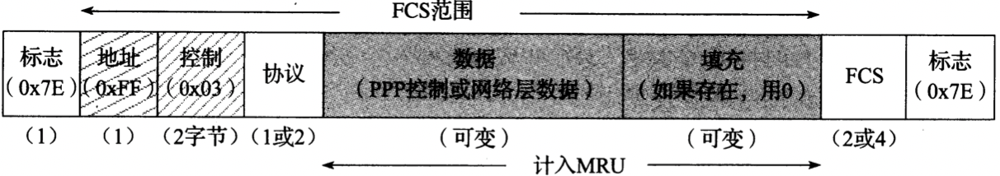

*PPP基本帧格式借用了HDLC的格式。它包括一个协议标识符，有效载荷区域，以及2或4字节的FCS。其它字段是否存在取决于压缩选项*

#### LCP操作

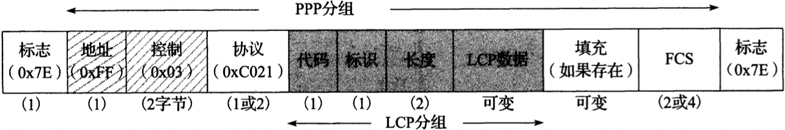

*LCP分组采用很普通的格式，能识别封装数据的类型和长度。LCP帧主要用于建立PPP链路，这种格式已成为很多网络控制协议的基础*

- `地址` 
- `控制`
- `协议` 始终为`0xC021`，不能用PFC删除，以免产生歧义；
- `代码` 给出请求或响应的操作类型：
  - 配置请求（0x01）
  - 配置ACK（0x02）
  - 配置NACK（0x03）
  - 配置REJECT（0x04）
  - 终止请求（0x05）
  - 终止ACK（0x06）
  - 代码REJECT（0x07）
  - 协议REJECT（0x08）
  - 回送请求（0x09）
  - 回送应答（0x0A）
  - 放弃请求（0x0B）
  - 标识（0x0C）
  - 剩余时间（0x0D）
- `标识` 由LCP请求帧的发送方提供的序列号，并伴随着每个后续消息递增；
- `长度` LCP分组的字节长度，不能超过`最大接收单元（MRU）`
- `LCP数据`
- `FCS`

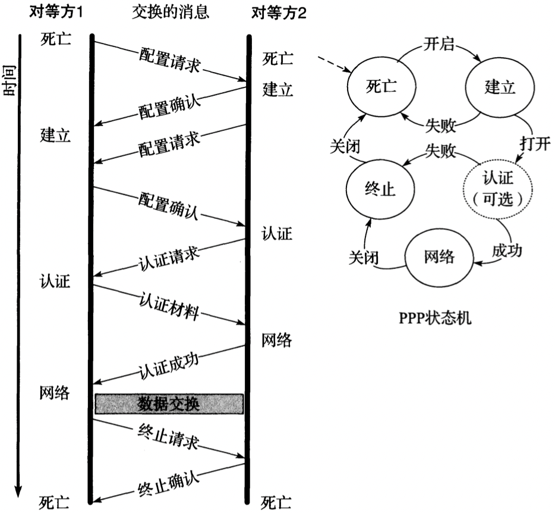

*LCP用于建立PPP链路和各方商定选项。典型的交换过程包括一对包含选项列表的配置请求和配置确认，一个认证交换，数据交换（未画出）和一个终止交换。因为PPP是一个包括很多部分的通用协议，所以在一条链路建立和终止之间可能发生很多其它类型的操作*

#### LCP选项

`异步控制字符映射（asyncmap，ACCM）`

由于PPP缺少一个长度字段，并且串行线路通常不提供帧封装，所以在理论上对一个PPP帧的长度没有硬性限制；实际上，最大帧大小通常由MRU指定。

`回叫控制协议（CBCP）`

`PPPMux控制协议（PPPMuxCP）`

### 多链路PPP

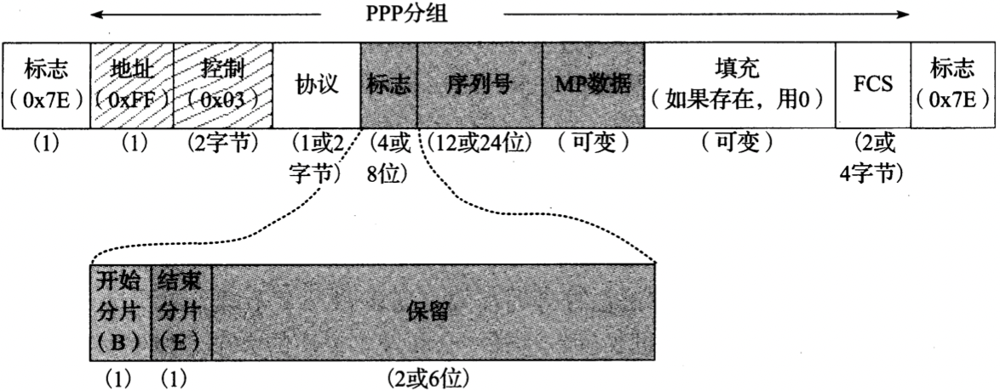

*一个MP分片包含一个系列头部，允许在一个多链路捆绑的远端对分片重新排序。这个头部支持2中格式：短头部（2字节）和长头部（4字节）*

`多链路最大接收重构单元（MRRU，类型18）`

`带宽分配协议（BAP）`

`带宽分配控制协议（BACP）`

`按需带宽（BOD）`

### 压缩控制协议

`压缩控制协议（CCP）[RFC1962]` 在链路进入网络状态时协商，它使用与LCP相同的分组交换过程和格式（除协议字段被设置为0x80FD之外），另外还有一些特殊选项，并对常见的代码字段值（1~7）定义了2个新的操作：复位请求（0x0e）和复位确认（0x0f）。如果在一个压缩帧中检测到一个错误，复位请求可用于要求对方复位压缩状态（例如字典，状态变量，状态机等）。在复位后，对方响应一个复位确认。

`Microsoft点对点压缩协议（MPPC）`

### PPP认证

`密码认证协议（PAP）`

`查询-握手认证协议（CHAP）[RFC1994]`

### 网络控制协议

`IP控制协议（IPCP）[RFC1332]`

### 头部压缩

`鲁棒性头部压缩（ROHC）[RFC5225]`


## MTU和路径MTU

`路径MTU发现（PMTUD）`


## 隧道基础

建立隧道的3个常见协议：

- `通用路由封装（GRE）[RFC2784]`
- `Microsoft专用的点对点隧道协议（PPTP）[RFC2637]`
- `第二层隧道协议（L2TP）[RFC3931]`

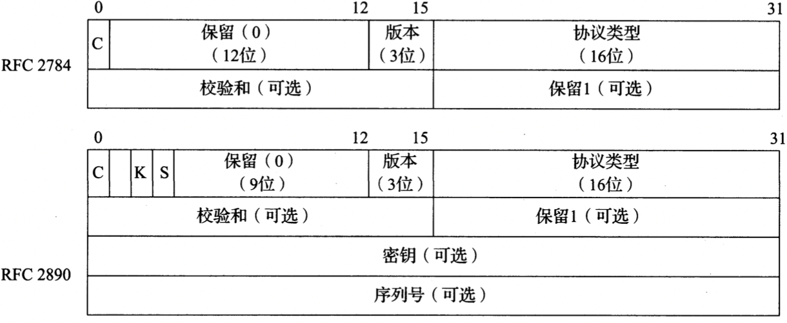

*基本的GRE头部只有4字节，包括一个16位的检验和选项（很多Internet协议中的典型选项）。后来，这个头部被扩展为包括一个标识符（密钥字段），该标识符是同一个流中的多个分组共有的，还包括一个序列号（用于顺序混乱的分组重新排序）*

- `C` 是否存在校验和
- `版本`
- `协议类型`
- `密钥`
- `序列号`

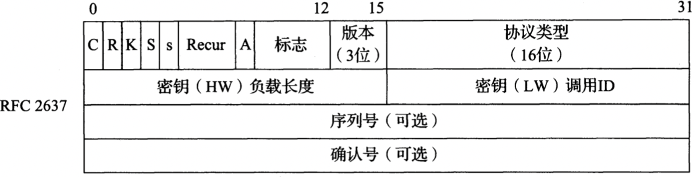

*PPTP头部基于一个旧的，非标准的GRE头部。它包括一个序列号，一个累积的分组确认号和一些标识信息。多数字段在第一次使用时设置为0*

- `C`
- `R`
- `K` 密钥
- `S` 序列号
- `s`
- `Recur`
- `A` 确认号
- `序列号` 对方可看到的最大分组数

### 单向链路

`单向链路（UDL）` 在一个方向工作的链路；

`动态隧道配置协议（DTCP）`


## 与链路层相关的攻击

TODO
