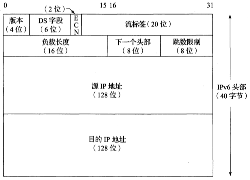
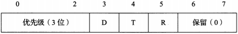
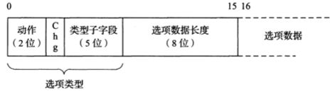
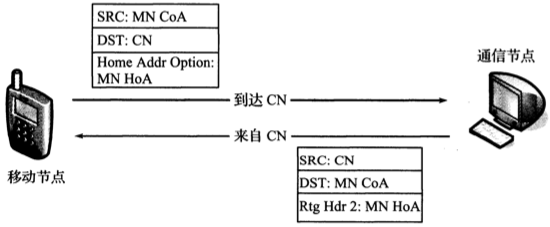

# 第五章 Internet协议

[TOC]

## 引言

### IPv4和IPv6头部

IP是TCP/IP协议族中的核心协议。所有TCP，UDP，ICMP和IGMP数据都通过IP数据报传输，但是不保证IP数据报能成功到达目的地。

- 版本（4位）
  - IPv4: 4
  - IPv6: 6
  
- IHL（Internet头部长度，仅限IPv4，4位）

  描述32位字的数量，Internet最多$32*15=480$位，即60字节

- 服务类型字段（ToS，8位）
  
  
  - DS字段（服务字段，6位）
    
    - 优先级（3位）：低优先级可以被高优先级抢占，不同优先级有不同的被丢弃概率。共8级
  		| 值   | 优先级   |
  		| ---- | -------- |
  		| 000  | 常规     |
  		| 001  | 优先     |
  		| 010  | 立即     |
  		| 011  | 瞬间     |
  		| 100  | 瞬间覆盖 |
  		| 101  | 严重     |
  		| 110  | 网间控制 |
  		| 111  | 网络控制 |
  
    - D（1位）：延时
    - T（1位）：吞吐量
    - R（1位）：可靠性
    - 保留（0，2位）：
      
      如果选项存在，它在IPv4分组中紧跟在基本IPv4头部之后。选项由一个8位的类型字段标识。这个字段被细分为3个子字段：复制(1位)，类别(2位)和编号(5位)。选项0和1的长度是1字节，多数的其他选项的长度可变。可变选项包括1字节的类型标识符，1字节的长度以及选项自身
      | 名 称 |  编号 |    值    | 长度 |             描述            |  参考文献  |  注释  |
      | ----- | ---- | -------- | ---- | -------------------------- | --------- | ------ |
      |列表结尾|0     |0         |1     |表示没有更多选项              |`[RFC0791]`|如果需要|
      |没有操作|1     |1         |1     |标识没有操作执行（用于填充）   |`[RFC0791]`|如果需要|
      |源路由  |3 9|131 137|可变  |发送方列出分组转发时遍历的路由器“航点”。松散意味着其他路由器可以包含在航点（3，131）中。严格意味着（9，137）中的所有航点都要按顺序遍历|`[RFC0791]`|很少，经常被过滤|
      |安全和处理标签|2 5|130 133|11|在美国军事环境下如何为IP数据报指定安全标签和处理限制|`[RFC1108]`|历史的|
      |记录路由|7     |7         |可变  |在分组的头部中记录经过的路由器  |`[RFC0791]`|很少   |
      |时间戳  |4     |68        |可变  |在分组的源和目的地记录日期和时间|`[RFC0791]`|很少   |
      |流ID   |8     |136       |4     |携带16位的SATNET流标识符       |`[RFC0791]`|历史的 |
      |EIP    |17    |145       |可变  |扩展Internet协议（20世纪90年代早期的一个实验）|`[RFC1385]`|历史的|
      |跟踪    |18    |82       |可变   |增加一个路由跟踪选项和ICMP报文（20世纪90年代早期的一个实验）|`[RFC1393]`|历史的|
      |路由器警告|20   |148      |4     |标识一个路由器需要解释数据报的内容|`[RFC2113]` `[RFC5350]`|偶然|
  	  |快速启动 |25    |25       |8     |标识启动快速传输协议（实验性的）  |`[RFC4782]`|很少  |
  
    服务代码点（DSCP）值被分成3个池：
  	
  	| 池   | 代码点前缀 | 策略        |
  	| ---- | ---------- | ----------- |
  	| 1    | `xxxxx0`   | 标准的      |
  	| 2    | `xxxx11`   | `EXP/LU`    |
  	| 3    | `xxxx01`   | `EXP/LU(*)` |
    
    DS字段值设计为兼容服务类型和IPv6流量类别字段中指定的IP优先级子字段。AF和EF提供比简单的“尽力而为”更好的服务
  
    | 名称        | 值     | 参考文献    | 描述                                   |
  	| ----------- | ------ | ----------- | -------------------------------------- |
  	| CS0         | 000000 | `[RFC2474]` | 类别选择（尽力而为/常规）              |
  	| CS1         | 001000 | `[RFC2474]` | 类别选择（优先）                       |
  	| CS2         | 010000 | `[RFC2474]` | 类别选择（立即）                       |
  	| CS3         | 011000 | `[RFC2474]` | 类别选择（瞬间）                       |
  	| CS4         | 100000 | `[RFC2474]` | 类别选择（瞬间覆盖）                   |
  	| CS5         | 101000 | `[RFC2474]` | 类别选择（CRITIC/ECP）                 |
  	| CS6         | 110000 | `[RFC2474]` | 类别选择（网间控制）                   |
  	| CS7         | 111000 | `[RFC2474]` | 类别选择（控制）                       |
  	| AF11        | 001010 | `[RFC2597]` | 保证转发（1，1）                       |
  	| AF12        | 000000 | `[RFC2597]` | 保证转发（1，2）                       |
  	| AF13        | 001100 | `[RFC2597]` | 保证转发（1，3）                       |
  	| AF21        | 010010 | `[RFC2597]` | 保证转发（2，1）                       |
  	| AF22        | 010100 | `[RFC2597]` | 保证转发（2，2）                       |
  	| AF23        | 010110 | `[RFC2597]` | 保证转发（2，3）                       |
  	| AF31        | 011010 | `[RFC2597]` | 保证转发（3，1）                       |
  	| AF32        | 011100 | `[RFC2597]` | 保证转发（3，2）                       |
  	| AF33        | 011110 | `[RFC2597]` | 保证转发（3，3）                       |
  	| AF41        | 100010 | `[RFC2597]` | 保证转发（4，1）                       |
  	| AF42        | 100100 | `[RFC2597]` | 保证转发（4，2）                       |
  	| AF43        | 100110 | `[RFC2597]` | 保证转发（4，3）                       |
  	| EF PHB      | 101110 | `[RFC3246]` | 加速转发，应享受较低的延时，抖动和丢包 |
  	| VOICE-ADMIT | 101100 | `[RFC5865]` | 容量许可的流量                         |
  	
  	**(i,j)表示中,i,j分别表示流量类别和丢弃优先级**
  	
  - ECN（显式拥塞通知，2位）：标记网络拥堵情况，用于滑动窗口。
  
- 总长度（仅限IPv4，16位）：IPv4数据报的总长度（单位：字节），最大$2^{16}=65535$字节

- 标识（仅限IPv4，16位）：标记数据报ID，自增

- 标志（仅限IPv4，3位）：

- 分片偏移（仅限IPv4，13位）：

- 生存期（仅限IPv4，TTL，8位）：可经过的路由器数量的上限，每过一台路由器就减1，到0就丢弃；一般初始化为64或128或255

- 协议（仅限IPv4，8位）：

- 头部校验和（仅限IPv4，Internet校验和，16位）：校验数据报头是否完整
  
  
- 源IP地址（IPv4:32位, IPv6:128位）

- 目的IP地址（IPv4:32位, IPv6:128位）

- 选项（仅限IPv4，变长）：

  如果选项存在，它在IPv4分组中紧跟在基本IPv4头部之后。选项由一个8位的类型字段标识。这个字段被细分为3个子字段：复制（1位），类别（2位）和编号（5位）。选项0和1的长度是1字节，多数的其他选项的长度可变。可变选项包括1字节的类型标识符，1字节的长度以及选项自身

  | 名称           | 编号   | 值         | 长度 | 描述                                                         | 参考文献                   | 注释             |
  | -------------- | ------ | ---------- | ---- | ------------------------------------------------------------ | -------------------------- | ---------------- |
  | 列表结尾       | 0      | 0          | 1    | 表示没有更多选项                                             | `[RFC0791]`                | 如果需要         |
  | 没有操作       | 1      | 1          | 1    | 表示没有操作执行（用于填充）                                 | `[RFC0791]`                | 如果需要         |
  | 源路由         | 3 9 | 131 137 | 可变 | 发送方列出分组转发时遍历的路由器“航点”。松散意味着其他路由器可以包含在航点（3，131）中。严格意味着（9，137）中的所有航点都要按顺序遍历 | `[RFC0791]`                | 很少，经常被过滤 |
  | 安全和处理标签 | 2 5 | 130 133 | 11   | 在美国军事环境下如何为IP数据报指定安全标签和处理限制         | `[RFC1108]`                | 历史的           |
  | 记录路由       | 7      | 7          | 可变 | 在分组的头部中记录经过的路由器                               | `[RFC0791]`                | 很少             |
  | 时间戳         | 4      | 68         | 可变 | 在分组的源和目的地记录日期和时间                             | `[RFC0791]`                | 很少             |
  | 流ID           | 8      | 136        | 4    | 携带16位的SATNET流标识符                                     | `[RFC0791]`                | 历史的           |
  | EIP            | 17     | 145        | 可变 | 扩展Internet协议                                             | `[RFC1385]`                | 历史的           |
  | 跟踪           | 18     | 82         | 可变 | 增加一个路由跟踪选项和ICMP报文                               | `[RFC1393]`                | 历史的           |
  | 路由器警告     | 20     | 148        | 4    | 表示一个路由器需要解释数据报的内容                           | `[RFC2113]` `[RFC5350]` | 偶然             |
  | 快速启动       | 25     | 25         | 8    | 表示启动快速传输协议（实验性的）                             | `[RFC4782]`                | 很少             |

- 流标签（仅限IPv6，20位）：
- 负载长度（仅限IPv6，16位）：
- 下一个头部（仅限IPv6，8位）：
- 跳数限制（仅限IPv6，8位）：
- 源IP地址（仅限IPv6，128位）：
- 目的IP地址（仅限IPv6，128位）：

## IPv4扩展头部

## IPv6扩展头部

IPv6下一个头部字段值可能表示扩展头部或其他协议头部。在适当的情况下，它与IPv4协议字段使用相同值
| 头部类型 | 顺序 | 值 |
| ------- | ---- | -- |
|IPv6头部  |1    |41  |
|逐跳选项（HOPOPT）|2|0 |
|目的地选项|3，8|60 |
|路由|4|43 |
|分片|5|44 |
|封装安全载荷（ESP）|7|50 |
|认证（AH）|6|51 |
|移动（MIPv6）|9|135 |
|（无--没有下一个头部）|最后|59 |
|ICMPv6|最后|58 |
|UDP|最后|17 |
|TCP|最后|6 |
|各种其他高层协议|最后|- |

### IPv6选项

TLV: `类型-长度-值`

一个IPv6的TLV选项类型的2个高序位，表示如果这个选项没有被识别，一个IPv6节点是转发还是丢弃该数据报，以及是否向发送方返回一个消息，提示这个数据报的处理结果

| 值   | 动作                                                       |
| ---- | ---------------------------------------------------------- |
| 00   | 跳过选项，继续处理                                         |
| 01   | 丢弃这个数据报（沉默）                                     |
| 10   | 丢弃这个数据报，并向源地址发送一个“ICMPv6参数问题”消息     |
| 11   | 与10相同，但仅在分组的目的地不是组播时，发送这个ICMPv6消息 |

IPv6选项携带在逐跳（H）选项或目的地（D）选项扩展头部中。选项类型字段包含来自“类型”列以及动作和改变子字段中的二进制值。

| 选项名       | 头部 | 动作 | 改变 | 类型 | 长度 | 参考文献    |
| ------------ | ---- | ---- | ---- | ---- | ---- | ----------- |
| 填充1        | HD   | 00   | 0    | 0    | N/A  | `[RFC2460]` |
| 填充N        | HD   | 00   | 0    | 1    | 可变 | `[RFC2460]` |
| 超大有效载荷 | H    | 11   | 0    | 194  | 4    | `[RFC2675]` |
| 隧道封装限制 | D    | 00   | 0    | 4    | 4    | `[RFC2473]` |
| 路由器警告   | H    | 00   | 0    | 5    | 4    | `[RFC2711]` |
| 快速启动     | H    | 00   | 1    | 6    | 8    | `[RFC4782]` |
| CALIPSO      | H    | 00   | 0    | 7    | 8+   | `[RFC5570]` |
| 家乡地址     | D    | 11   | 0    | 201  | 16   | `[RFC6275]` |

- 填充1和填充N

  由于IPv6选项需要与8字节的偏移量对齐，因此较小的选项用0填充到长度为8字节，有以下2个填充选项：

  - 填充1（类型0）：唯一缺少长度字段和值字段的选项；仅有1字节长，取值为0。
  - 填充N（类型1）：向头部的选项区域填充2字节或更多字节；对于n个填充字节，选项数据长度字段包含的值为(n-2)。

- 超大有效载荷

  `超大报文`:指定一种有效载荷大于65535字节的IPv6数据报。

- 隧道封装限制：是否限制隧道封装

  `隧道`:将一个协议封装在另一个协议中，隧道可以嵌套。

- 路由器警告: 指出数据报包含需要路由器处理的信息。

- 快速启动（QS）

- CALIPSO：用于在某些专用网络中支持**通用体系结构标签IPv6安全选项**，提供了一种为数据报做标记的方法，包括一个安全级别标识符和一些额外的信息。

- 家乡地址

### 路由头部

IPv6数据报控制机制，以控制（至少部分控制）数据报通过网络的路径。有2个版本：

- ~~类型0（RH0）~~
- 类型2（RH2）

### 分片头部

- 分片偏移: 表明数据以`8字节`为单位的偏移量放置在分片头部之后。
- Res
- M
  - 1: 表示在数据报中包含更多分片
  - 0: 表示该分片是原始数据报的最后一个分片
- 标识符

## IP转发

### 转发表

IP转发逐跳进行，路由或转发表中的每个条目包含以下字段信息：

- 目的地`(32位/128位)`：用于与一个掩码操作结果相匹配
- 掩码`(32位/128位)`：用作数据报目的IP地址按位与操作
- 下一跳：下一个IP实体，数据报将发送给它
- 接口：包含一个由IP层使用的标识符，以确定将数据报发送到下一跳的网络接口

### IP转发行动

最长前缀匹配算法：

1. 在表中搜索具有以下属性的所有条目：$(D^{m_j})=d_j$，其中$m_j$是索引为`j`的转发条目$e_j$的掩码字段值，$d_j$是转发条目$e_j$的目的地字段值。这意味着目的IP地址D与每个转发表条目中的掩码$(m_j)$执行按位与，并将该结果与同一转发条目中的目的地$(d_j)$比较。如果满足这个属性，该条目（这里为$e_j$）与目的IP地址相“匹配”。当进行匹配时，该算法查看这个条目的索引（这里为j），以及在掩码$m_j$中有多少位设置为1.设置为1的位数越多，说明匹配得“越好”。
2. 选择最匹配的条目$e_k$（即掩码$m_k$中最多位为1得条目），并将其下一跳字段$n_k$作为转发数据报的下一跳IP地址。

如果在转发表中没有发现匹配的条目，这个数据报无法交付，返回一个“主机不可达”错误。

**IP单播转发关键点：**

1. 大多数主机和路由器使用默认路由，其中包含一个以下形式的转发表条目：`掩码为0，目的地为0，下一跳为<某些IP地址>`。
2. 在传统的Internet中，数据报中的源IP地址和目的IP地址从不改变。
3. 不同的低层头部用于每种链路上的寻址，低层的目的地址（如果存在）总是包含下一跳的低层地址。因此，当数据报沿着到目的地的每个跳步移动时，低层头部经常发生变化。

## 移动IP

移动IP基于一台主机拥有一个“家乡网络”，但可以不时地访问其他网络的想法。当主机离开家乡时，它保持平时在家乡使用的IP地址，就好像它仍然连接在自己的“家乡网络”中那样。

### 基本模型_双向隧道

### 路由优化

路由优化（RO）:

## IP数据报的主机处理

### 主机模式

- 强主机模式

    当目的IP地址字段中包含的IP地址与数据报到达的接口配置的IP地址匹配时，才同意把数据报交付本地协议栈

- 弱主机模式

    一个数据报携带的目的地址与它到达的任何接口的任何本地地址匹配，无论它到达哪个网络接口，它都会被接收的协议栈处理

### 地址选择

`[RFC2484]`的默认主机策略表。更高的优先级数据表明一个更大的偏好

| 前缀             | 优先级P() | 标签L() |
| ---------------- | --------- | ------- |
| `::1/128`        | 50        | 0       |
| `::/0`           | 40        | 1       |
| `2002::/16`      | 30        | 2       |
| `::/96`          | 20        | 3       |
| `::ffff: 0:0/96` | 10        | 4       |

地址选择算法前提：

$P(A)$表示优先级。

$L(A)$表示标签。

$C(A)$表示判断A是否是一个转交地址。

$H(A)$表示判断A是否是一个家乡地址。

$T(A)$表示判断A是否是一个临时地址。

$U(B)$表示判断目的地B是否不可达。

$E(A)$表示采用某些“封装传输”（例如，隧道路由）可到达目的地A。

$S(A)$表示将IP6地址A的范围映射到一个数值，范围越大，映射的值越大。

$Q(D)$表示为目的地D选择的源地址。

$CS(D)$表示一个源地址的候选集合。

$R(A)$表示地址A在集合$CS(D)$中的等级，假如$R(A) > R(B)$，意味着优先选择A而不是B最为到带地址D的源地址。

$R(A) * > R(B)$表示在$CS(D)$中为A分配一个比B更高的等级。

$@(i)$表示分配给接口i的地址集合。

$CPL(A, B)$表示在IP6地址A和B中从最左边的位开始的一个最长通用前缀的位长度。

#### 源地址选择算法

1. 优先选择相同地址：

    $if A = D, R(A)* > R(B)$；$if B = D, R(B) * > R(A)$。

2. 优先选择适当范围：

    $if S(A) < S(B) and S(A) < S(D), R(B) *> R(A) else R(A) *> R(B)$；$if S(B) < S(A) and S(B) < S(D), R(A) *> R(B) else R(B) *> R(A)$。

3. 避免过期地址：

    $if S(A) = S(B), \{if \Lambda(A) < \Lambda(B), R(B) *> R(A) else R(A) *> R(B)\}$。

4. 优先选择家乡地址：

    $if H(A) and C(A) and \neg (C(B) and H(B)), R(A) *> R(B)$；$if H(B) and C(B) and \neg(C(A) and H(A)), R(B) *> R(A)$；$if(H(A) and \neg C(A)) and (\neg H(B) and C(B)), R(A) *> R(B)$; $if(H(B) and \neg C(B)) and (\neg H(A) and C(A)), R(B) *> R(A)$。

5. 优先选择输出接口：

    $if A \in @(I(D)) and B \in @(I(D)), R(A) *> R((B)$; $if B \in @(I((D)) and A \in @(I(D)), R(B) *> R(A)$。

6. 优先选择匹配标签：

    $if L(A) = L(D) and L(B) \neq L(D), R(A) *> R(B)$；$if L(B) = L(D) and L(A) \neq L(D), R(B) *> R(A)$。

7. 优先选择非临时地址：

    $if T(B) and \neg T(A), R(A) *> R(B)$；$if T(A) *> and \neg T(B), R(B) *> R(A)$。

8. 使用最长匹配前缀：

    $if CPL(A, D) > CPL(B, D), R(A) *> R(B)$；$if CPL(B, D) > CPL(A, D), R(B) *> R(A)$。

#### 目的地址选择算法

1. 避免不可用的目的地：

    $if U(B) or Q(B) = \emptyset, R(A) *> R(B)$；$if U(A) or Q(A) = \emptyset, R(B) *> R(A)$。

2. 优先选择匹配范围：

    $if S(A) = S(Q(A)) and S(B) \neq S(Q(B))，R(A) *> R(B)$；$if S(B) = S(Q(B)) and S(A) \neq S(Q(A))，R(B) *> R(A)$。

3. 避免过期地址：

    $if \Lambda (Q(A)) \Lambda(Q(B))$，$R(B) *> R(A)$；$if \Lambda(Q(B)) < \Lambda(Q(A)), R(A) *> R(B)$。

4. 优先选择家乡地址：

    $if H(Q(A)) and C(Q(A)) and \neg (C(Q(B)) and H(Q(B)))，R(A) *> R(B)$；$if (Q(B)) and C(Q(B)) and \neg (C(Q(A)) and H(Q(A)))，R(B) *> R(A)$；$if (H(Q(A)) and \neg C(Q(A))) and (\neg H(Q(B)) and C(Q(B)))，R(A) *> R(B)$；$if (H(Q(B)) and \neg C(Q(B))) and (\neg H(Q(A)) and C(Q(A)))，R(B) *> R(A)$。

5. 优先选择匹配标签：

    $if L(Q(A)) = L(A) and L(Q(B)) \neq L(B)，R(A) *> R(B)$；$if L(Q(A)) \neq L(A) and L(Q(B)) = L(B)，R(B) *> R(A)$。

6. 优先选择更高优先级：

    $if P(A) > P(B)，R(A) * > R(B)$；$if P(A) < P(B)，R(B) * > R(A)$。

7. 优先选择本地传输：

    $if E(A) and \neg E(B)，R(B) *> R(A)$；$if E(B) and \neg E(A)，R(A) * > R(B)$。

8. 优先选择更小范围：

    $if S(A) < S(B)，R(A) *> R(B) else R(B) *> R(A)$。

9. 使用最长匹配前缀：

    $if CPL(A, Q(A)) > CPL(B, Q(B)), R(A) *> R(B)$；

    $if CPL(A, Q(A)) < CPL(B, Q(B)), R(B) *> R(A)$。

10. 否则，保持等级顺序不变。

