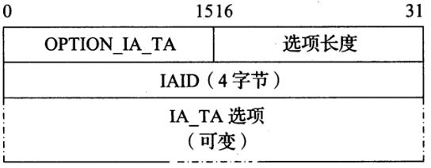
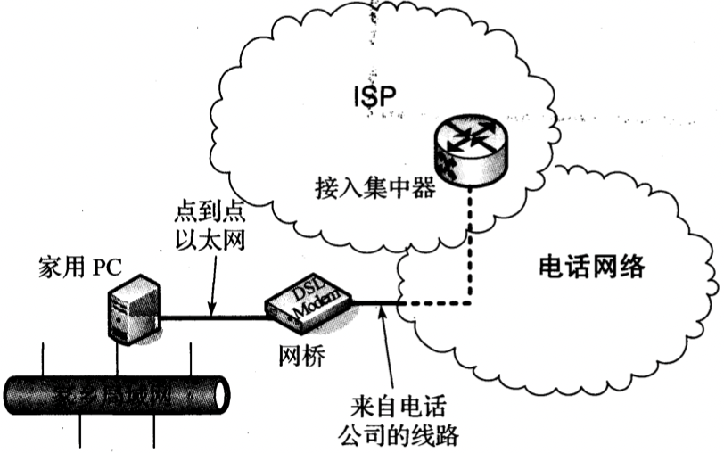

# 第六章 系统配置：DHCP和自动配置

[TOC]


## 动态主机配置协议

`DHCP[RFC2131]`是一种流行的客户机/服务器协议，它用于为主机（或路由器）指定配置信息。

DHCP由以下部分组成：

- `地址管理` 用于IP地址的动态分配，并为客户机提供地址租用。
- `配置数据交付` 包括DHCP协议的消息格式和状态机。

DHCP的地址分配方式：

- 自动分配
- 动态分配
- 手动分配

### 地址池和租用

`租用期` 分配给客户机的地址只在一段特定时间内有效，到期后可以续租。

### DHCP和BOOTP消息格式

DHCP扩展了BOOTP，DHCP消息格式的定义采用扩展BOOTP的方式，以保持两种协议之间的兼容性。


*BOOTP消息格式，包括来自[RFC0951], [RFC1542]和[RFC2131]的字段名。BOOTP消息格式采用适当的分配方案保存DHCP消息。通过这种方式，BOOTP中继代理可处理DHCP消息，BOOTP客户机可使用DHCP服务器。如果有必要，服务器名和引导文件名字段可携带DHCP选项。*

- `Op` 标识消息是请求(1)/应答(2)
- `htype` 基于ARP使用的值分配
- `hlen` 存放硬件(MAC)地址(默认6)
- `跳步数` 消息传输过程中的中继次数，每次中继时递增
- `xid` 客户机选择的随机数，用于应答与请求匹配
- `Secs` 第1次尝试申请或重新申请地址经过的秒数（由客户机设置）
- `标志` 当前只包含一个经过定义的位：广播标志
- `ciaddr` 客户机IP地址
- `yiaddr` 服务器IP地址
- `siaddr` 下一个服务器的地址（用于引导）
- `giaddr` 网关中继IP地址
- `chaddr` 客户机硬件地址(MAC地址)
- `sname` 服务器名
- `file` 引导文件名
- `vend` 可选项，供应商扩展字段

### DHCP和BOOTP选项

`选项超载` 当选项携带在后两个位置时。

### DHCP协议操作


*一次典型的DHCP交换。客户机通过广播消息发现一组服务器和可提供的地址，它请求自己想获得的地址，并接收到选定服务器的确认。交易ID(xid)用于将请求和响应匹配，服务器ID（一个选项）指出那台服务器提供地址，并承诺将它与客户机绑定。如果客户机知道它想获得的地址，该协议可简化为仅使用`REQUEST`和`ACK`消息。*

#### 例

释放使用DHCP获得的数据：

```sh
# Windows
ipconfig /release
```

获取新的DHCP地址分配：

```sh
# Windows
ipconfig /renew
```

#### DHCP状态机


*DHCP客户机的状态机。粗体的状态和转换通常涉及客户机首次获得租用地址。虚线和INIT状态表示协议开始。*

1. 客户机开始于`INIT`状态，这时没有消息，广播`DISCOVER`消息
2. 进入选择状态，循环接收`OFFER`消息，直到决定使用哪个地址和服务器
3. 发送`REQUEST`消息进入请求状态，并接收`ACK`消息
   - `如果没有发现需要需要的地址` 发送一个`DECLINE`消息，转换到`INIT`状态
   - `收到一个需要的地址ACK消息` 接受它，获得超时值`T1`和`T2`，进入`绑定`状态
4. 计时器`T1`到期，进入`更新状态`并尝试重新建立租约
   - `成功` 重新绑定，进入`绑定`状态
   - `失败` 等待计时器`T2`到期，从服务器重新获得一个地址
5. 租用期最终到期，客户机放弃所租用的地址，如果没有可用的地址，断开连接

### DHCPv6

#### IPv6地址生命周期


*IPv6地址的生命周期。临时地址仅用于DAD，直至被验证为唯一。此后，它们成为首选地址，并可无限制地使用，直至超时将其状态更改为废弃。废弃地址不能用于初始化新连接，并且可能在有效超时期满后不能使用。*

#### DHCPv6消息格式

DHCPv6消息封装为UDP/IPv6数据报，它使用客户机端口546和服务器端口547。

客户机/服务器消息格式：


中继代理消息格式：


DHCPv6/DHCPv4消息的类型，值和标准：

| DHCPv6消息          | DHCPv6值 | 参考文献  | DHCPv4消息                       | 参考文献  |
| ------------------- | -------- | --------- | -------------------------------- | --------- |
| SOLICIT             | 1        | [RFC3315] | DISCOVER                         | [RFC2132] |
| ADVERTISE           | 2        | [RFC3315] | OFFER                            | [RFC2132] |
| REQUEST             | 3        | [RFC3315] | REQUEST                          | [RFC2132] |
| CONFIRM             | 4        | [RFC3315] | REQUEST                          | [RFC2132] |
| RENEW               | 5        | [RFC3315] | REQUEST                          | [RFC2132] |
| REBIND              | 6        | [RFC3315] | DISCOVER                         | [RFC2132] |
| REPLY               | 7        | [RFC3315] | ACK/NAK                          | [RFC2132] |
| RELEASE             | 8        | [RFC3315] | RELEASE                          | [RFC2132] |
| DECLINE             | 9        | [RFC3315] | DECLIEN                          | [RFC2132] |
| RECONFIGURE         | 10       | [RFC3315] | FORCERENEW                       | [RFC3203] |
| INFORMATION-REQUEST | 11       | [RFC3315] | INFORM                           | [RFC2132] |
| RELAY-FORW          | 12       | [RFC3315] | N/A                              |           |
| RELAY-REPL          | 13       | [RFC3315] | N/A                              |           |
| LEASEQUERY          | 14       | [RFC5007] | LEASEQUERY                       | [RFC4388] |
| LEASEQUERY-REPLY    | 15       | [RFC5007] | LEASE{UNASSIGNED,UNKNOWN,ACTIVE} | [RFC4388] |
| LEASEQUERY-DONE     | 16       | [RFC5460] | LEASEQUERYDONE                   | [ID4LQ]   |
| LEASEQUERY-DATA     | 17       | [RFC5460] | N/A                              | N/A       |
| N/A                 | N/A      | N/A       | BULKLEASEQUERY                   | [ID4LQ]   |

#### 身份关联

`身份关联(IA)` 是用在DHCP客户机和服务器之间的一个标识符，用于指向一个地址集。

当服务器响应一个请求时，它对客户机的IA分配一个或多个地址，分配时基于服务器管理员确定的一组地址分配策略。在通常情况下，这些策略依赖于请求所到达的链路，客户机的标准消息，以及DHCP选项中由客户机提供的其它信息。

非临时地址的DHCPv6 IA格式：


临时地址的DHCPv6 IA格式：



#### DHCP唯一标识符

`DHCP唯一标识符(DUID)` 用于标识一台DHCPv6客户机或服务器，并被设计为可持续一段时间。服务器用它标识所选地址（作为IA的一部分）对应的客户机和配置信息，客户机用它标识感兴趣的服务器。

[RFC3315]定义了3中可能的DUID类型：

1. `DUID-LLT` 基于链路层地址和时间的DUID。
2. `DUID-EN` 基于企业编号和供应商分配的DUID。
3. `DUID-LL` 仅基于链路层地址的DUID。

#### 协议操作


*DHCPv6的基本操作。客户机通过ICMPv6路由器通告中的信息决定是否使用DHCPv6。如果使用，DHCPv6操作与DHCPv4相似，但在细节上有显著不同*


## 使用DHCP中继


*DHCP中继代理将DHCP操作扩展到一个网段之外。中继和DHCPv4服务器之间的信息可携带在`中继代理信息`选项中。DHCPv6中继以类似的方式工作，但是它拥有一组不同的选项*

### 中继代理信息选项

`中继代理信息选项(针对DHCPv4，简称RAIO)` 在中继和服务器之间传递的消息中包含额外信息。

#### 中继代理远程ID子选项和IPv6远程ID选项

`中继代理信息`选项的一个子选项称为`远程ID`子选贤，它提供了一种标识发送请求的DHCP客户机的方法，即采用一系列本地解释的命名方法。

`DHCPv6中继代理远程ID` 选项提供了相同的功能，它还包括一个额外的字段（企业编号），以表明与供应商相关的识别信息。

#### 服务器标识符覆盖

`服务器标识符覆盖` 允许中继为不同类型的消息提供不同选项；

#### 租约查询和大批量租约查询

`DHCPLEASEQUERY`消息支持以下查询：

- DHCPv4
  - IPv4地址
  - MAC地址
  - 客户机标识符
  - 远程ID
- DHCPv6
  - IPv6地址
  - 客户机标识符(DUID)

`LEASEQUERY-REPLY`消息包含以下选项：

- `中继数据` 包括中继最后一次发送的相关查询的数据
- `客户机链路` 指出特定客户机拥有一个或多个地址绑定的链路

DHCPv4服务器用一下消息响应租约查询：

- `DHCPLEASEUNASSIGNED` 指出该查询值的响应服务器是授权的，但目前美誉分配相应租约。
- `DHCPLEASEACTIVE` 表示一个租约是有效的，并提供了租约参数。
- `DHCPLEASEUNKNOWN` 服务器最后一次询问客户机的时间（s）。

#### 第二层中继代理

`第2层"轻量级"DHCP中继代理(LDRA)`工作原理：

- `IPv4` LDRA在客户机接收的DHCP请求中插入RAIO，但不填写`giaddr`字段。DHCP消息以广播方式发送给一个或多个DHCP服务器，以及其它处于接收状态的LDRA。
- `IPv6` LDRA通过创建`RELAY-FORW`和`RELAY-REPL`消息处理`DHCPv6`流量。面向客户的接口将会丢弃接收到的`ADVERITISE`, `REPLY`, `RECONFIGURE`和`RELAY-REPL`消息。


## DHCP认证


*DHCP认证选项包括重放检测，可使用不同方法进行认证。认证选项的目的是确定DHCP消息是否来自一个授权的发送方。*

CHCP认证没有广泛使用的2个原因：

1. 这种方法需要在DHCP服务器和每个需要认证的客户机之间分发共享密钥。
2. 认证选项的定义出现在DHCP已广泛使用之后。

### 重新配置扩展

[RFC3203]定义了`重新配置扩展`和相关的`DHCPFORCERENEW`消息。这个扩展允许服务器引发一个客户机改变更新状态，并通过别的普通操作（即DHCPREQUEST）尝试更新租约。

### 快速确认

`DHCP快速确认选项` 允许一台DHCP服务器通过一个DHCPACK来响应DHCPDISCOVER消息，从而有效跳过`DHCPREQUEST`消息，并最终使用两消息交换来代替四消息交换。

### 位置信息（LCI和LoST）

IETF的一个众所周知的成果是Geoconf（“地理位置”）[RFC6225]，[RFC6225]规定了如何使用GeoConf（123）和GeoLoc（144）的DHCP选项，为客户机提供这种地理空间`位置配置信息（LCI）`。

一个可供选择的高层协议称为`启用HTTP的位置投递（HELD）协议[RFC5985]`，可用于提供位置信息。代替在DHCP消息中直接编码LCI，而是采用DHCP选项OPTION_V4_ACCESS_DOMAIN（213）和OPTION_V6_ACCESS_DOMAIN（57）分别为IPv4和IPv6提供一台HELD服务器的FQDN[RFC5986]。

IETF的`位置到服务转换（LoST）`框架[RFC5222]通过一个使用位置相关URI访问的应用层协议来实现主机自我定位功能。

### 移动和切换信息（MoS和ANDSF）

蜂窝配置和不同无线网络之间切换的框架和相关DHCP选项：

- `MoS` IEEE 802.21移动服务发现，包括以下服务：
  - 信息服务
  - 命令服务
  - 事件服务
- `ANDSF` 接入网发现和选择功能，定义了一下选项：
  - 携带ANDSF信息的DHCPv4
  - 携带ANDSF信息的DHCPv6


## 无状态地址自动配置

IPv4和IPv6都有用于链路本地地址自动配置的机制，一台主机基本不需要协助就可以决定自己的地址。这就是所谓的`无状态地址自动配置（SLAAC）`。

### IPv4链路本地地址的动态配置

`自动专用IP寻址（APIPA）` 又称链路本地地址的动态配置，在没有手工配置地址且所在网络没有DHCP服务器的情况下，一台主机从一个范围中随机选择一个地址，并检查该地址是否已在本子网中被其它系统使用（这种检查通过IPv4 ACD来实现）。

### 链路本地地址的IPv6 SLAAC

#### IPv6重复地址检测（DAD）

DAD执行步骤：一个节点首先加入临时地址的**所有节点**组播地址和**请求节点**组播地址。为了检查使用的地址是否重复，一个节点发送一个或多个ICMPv6邻居请求消息。这些消息的源和目的IPv6地址分别是未指定地址和被检查目的地址的请求节点弟子。**目的地址**字段设置为被检查的地址（临时地址）。如果在响应中接收到一条邻居通告消息，说明DAD失败，并放弃被检查的地址。

#### 全球地址的IPv6 SLAAC

全球地址的形成类似于链路本地SLAAC，需要使用一个由路由器提供的前缀，这种前缀携带在一个路由器通告的前缀选项中，并且由一个标志来表示这个前缀是否用于与SLAAC共同形成全球地址。

#### 无状态DHCP

为了实现标准的无状态DHCPv6服务器，相应系统必须实现以下消息：

- `INFORMATION-REQUEST`
- `REPLY`
- `RELAY-FORW`
- `RELAY-REPL`

还必须实现以下选项：

- 选项请求
- 状态代码
- 服务器标识符
- 客户机消息
- 服务器消息
- 接口ID

#### 地址自动配置的用途

为了防止系统自己分配一个IP地址，通过禁止APIPA来实现：

- `window` 设置`HKLM\SYSTEM\CurrentControlSet\Services\Tcpip\Parameters\ |PAutoconfigurationEnabled`中`REG_DWORD`的值为0
- `linux` 修改`/etc/sysconfig/network`中`NOZEROCONF=yes`

在IPv6 SLAAC的情况下，获取一个全局IPv6地址可能会导致潜在的安全问题，通过禁用SLAAC实现：

- `Linux`

  ```sh
  sysctl -w net.ipv6.conf.all.autoconf=0
  ```

- `MacOS/FreeBSD`

  ```sh
  sysctl -w net.inet6.ip6.auto_linklocal=0
  ```

- `Window`

  ```sh
  netsh
  interface ipv6
  set interface {ifname} managedaddress=disabled
  ```


## 以太网上的PPP

`以太网上的PPP（PPPoE）` 在以太网中携带PPP，用于广域网连接设备。该协议格式如下：


*PPPoE消息携带在以太网帧的有效载荷区。以太网类型字段在发现阶段设置为`0x8863`，而设置为`0x8864`表示携带PPP会话数据。对于PAD消息，采用TLV方式携带配置信息，这类似于DHCP选项。服务器选择一个PPPoE会话ID，并在PADS消息中传输。*

- `版本`
- `类型`
- `代码`
- `会话ID`
- `有效载荷`


*PPPoE消息交换开始于发现阶段及建立PPP会话阶段。每个消息是一个PAD消息。PADI请求来自PPPoE服务器的响应。PADO提供连接。PADR表示客户机可以从多个可能的服务器中做出选择。PADS从选中的服务器想客户机提供一个确认。经过PAD交换，一次PPP会话开始。PPP会话可由任何一方发送PADT消息来终止，或在低层链路出现故障时关闭。*



*为客户提供使用PPPoE的DSL服务的简化视图。家用PC实现了PPPoE协议，并向ISP进行用户身份认证。它也可作为家乡局域网中的路由器，DHCP服务器，DNS服务器或NAT设备。*

PPPoE的TAG_TYPE字段的值，名称和用途。PAD消息可能包含一个或多个标签：

| 值     | 名称               | 用途                                                  |
| ------ | ------------------ | ----------------------------------------------------- |
| 0x0000 | End-of-List        | 表示没有更多标签存在。TAG_LENGTH必须为0               |
| 0x0101 | Service-Name       | 包含一个UTF-8编码的服务名称（供ISP使用）              |
| 0x0102 | AC-Name            | 包含一个UTF-8编码的字符串，用于表示访问集中器         |
| 0x0103 | Host-Uniq          | 由客户机使用的二进制数据，用于匹配消息；不能被AC解释  |
| 0x0104 | AC-Cookie          | 由AC使用的二进制数据，用于防止DoS；由客户机回显       |
| 0x0105 | Vendor-Specific    | 不推荐；更多细节见[RFC2516]                           |
| 0x0110 | Relay-Session-ID   | 中继增加该值以转发PAD流量                             |
| 0x0201 | Service-Name-Error | 请求的Service-Name标签不能被AC认可                    |
| 0x0202 | AC-System-Error    | AC在执行请求的操作时出现一个错误                      |
| 0x0203 | Generic-Error      | 包含一个UTF-8编码的字符串，用于描述一个不可恢复的错误 |


## 与系统配置相关的攻击

