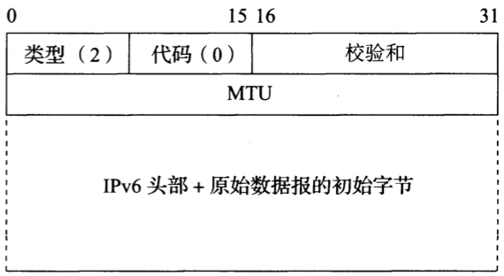
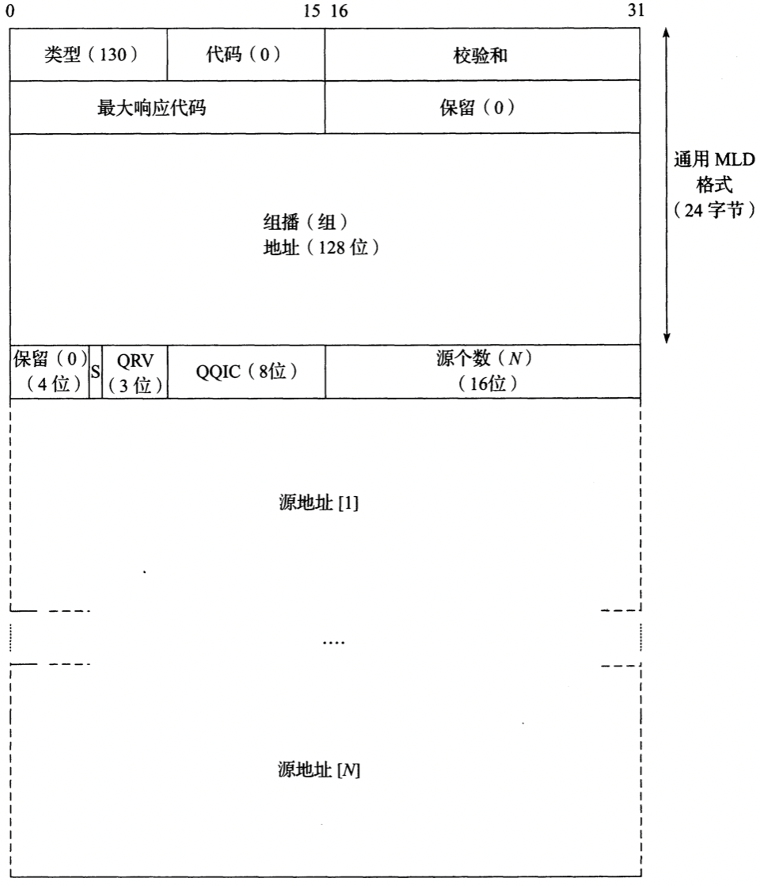
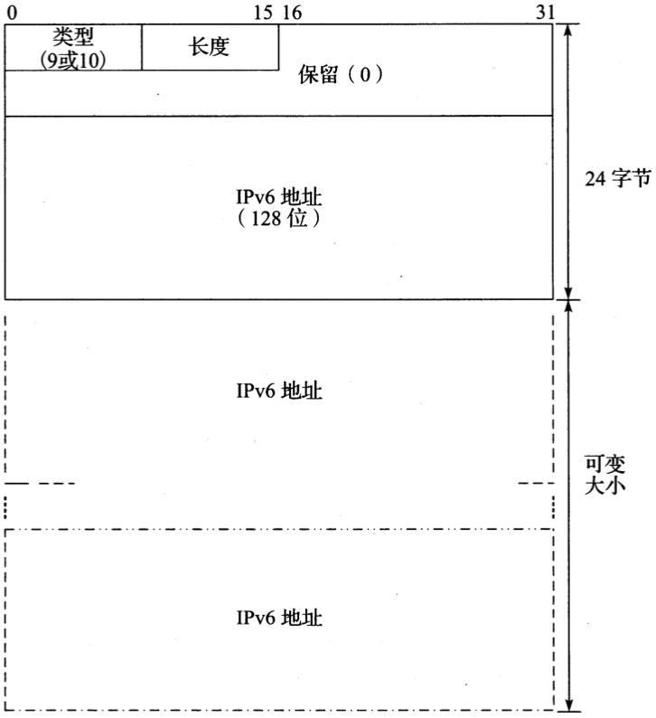

# ICMPv4和ICMPv6：Internet控制报文协议

[TOC]


## 引言

`Internet控制报文协议（Internet Control Message Protocol，ICMP）` 用于提供与IP协议层配置和IP数据包处理相关的诊断和控制信息。

`多协议标签交换（Multiprotocol Label Switching，MPLS）`

`路由器发现（Router Discovery）`

### 在IPv4和IPv6中的封装


*ICMP报文封装在IPv4和IPv6内部。ICMP头部包含了涵盖整个ICMP数据段的校验和。在ICMPv6中，这个校验和也涵盖了IPv6头部中的源（Source）和目的IPv6地址（Destination IPv6 Address）字段，长度（Length）字段和下一个头部（Next Header）字段*


*所有的ICMP报文都以8位的类型（Type）和代码（Code）字段开始，其后的16位校验和（Checksum）字段涵盖了整个报文。ICMPv4和ICMPv6中的类型和代码字段值是不同的*


## ICMP报文

ICMP报文可分为两大类：

- 有关IP数据报传递的ICMP报文（称为差错报文（error message））
- 有关信息采集和配置的ICMP报文（称为查询（query）或者信息类报文（informational message））

### ICMPv4报文

由类型字段决定的标准ICMPv4报文类型：

| 类型       | 正式名称   | 参考      | E/I  | 用途/注释                  |
| ---------- | ---------- | --------- | ---- | -------------------------- |
| `0(*)`     | 回显应答   | [RFC0792] | I    | 回显（ping）应答，返回数据 |
| `3(*)(+)`  | 目的不可达 | [RFC0792] | E    | 不可达的主机/协议          |
| `4`        | 源端抑制   | [RFC0792] | E    | 标识拥塞（弃用）           |
| `5(*)`     | 重定向     | [RFC0792] | E    | 标识应该被使用的可选路由器 |
| `8(*)`     | 回显       | [RFC0792] | I    | 回显（ping）请求           |
| `9`        | 路由器通告 | [RFC1256] | I    | 指示路由器地址/优先级      |
| `10`       | 路由器请求 | [RFC1256] | I    | 请求路由器通告             |
| `11(*)(+)` | 超时       | [RFC0792] | E    | 资源耗尽（例如IPv4 TTL）   |
| `12(*)(+)` | 参数问题   | [RFC0792] | E    | 有问题的数据包或者头部     |

**注：星号`（*）`标记的类型是最常见的。那些标有加号`(+)`的可能包含[RFC4884]扩展对象。在低4列中，E表示差错报文，I表示查询/信息类报文。**

通用的ICMPv4报文类型所使用的代码号。尽管所有这些报文类型是比较通用的，但只使用了少数代码号：

| 类型    | 代码 | 正式名称                                | 用途/注释                                             |
| ------- | ---- | --------------------------------------- | ----------------------------------------------------- |
| `3`     | 0    | 网络不可达                              | （完全）没有路由到目的地                              |
| `3(*)`  | 1    | 主机不可达                              | 已知但不可达的主机                                    |
| `3`     | 2    | 协议不可达                              | 未知的（传输）协议                                    |
| `3(*)`  | 3    | 端口不可达                              | 未知的/不用的（传输）端口                             |
| `3(*)`  | 4    | 需要进行分片但设置了不分片位（PTB报文） | 需要设置分片但被DF位禁止了，被PMTUD[RFC1191]采用      |
| `3`     | 5    | 源路由失败                              | 中间跳不可达                                          |
| `3`     | 6    | 未知的目的网络                          | 弃用[RFC1812]                                         |
| `3`     | 7    | 未知的目的主机                          | 目的不存在                                            |
| `3`     | 8    | 源主机隔离                              | 弃用[RFC1812]                                         |
| `3`     | 9    | 管理上禁止和目的网络                    | 弃用[RFC1812]                                         |
| `3`     | 10   | 管理上禁止和目的主机通信                | 弃用[RFC1812]                                         |
| `3`     | 11   | 目的网络不可达的服务类型                | 不可用的服务类型（网络）                              |
| `3`     | 12   | 目的主机不可达的服务类型                | 不可用的服务类型（主机）                              |
| `3`     | 13   | 管理禁止通信                            | 被过滤策略禁止的通信                                  |
| `3`     | 14   | 违反主机优先级                          | src/dest/port不准许的优先级                           |
| `3`     | 15   | 优先级终止生效                          | 在最小ToS之下[RFC1812]                                |
| `5`     | 0    | 网络（或者子网）重定向数据报            | 指示一个可选的路由器                                  |
| `5(*)`  | 1    | 主机重定向数据报                        | 指示一个可选的路由器（主机）                          |
| `5`     | 2    | 服务类型和网络重定向数据报              | 指示一个可选的路由器（ToS/网络）                      |
| `5`     | 3    | 服务类型和主机重定向数据报              | 指示一个可选的路由器（ToS/主机）                      |
| `9`     | 0    | 正常路由器通告                          | 路由器的地址和配置信息                                |
| `9`     | 16   | 不路由常见流量                          | 和移动IP[RFC5944]一起使用时，路由器不会路由普通数据包 |
| `11(*)` | 0    | 在传输期间生存时间超时                  | 跳数限制/TTL超时                                      |
| `11`    | 1    | 分片重组时间超时                        | 在重组计时器超时之前，并不是所有的数据报分片都到达了  |
| `12(*)` | 0    | 指针指示差错                            | 字节偏移量（指针）指示第一个问题字段                  |
| `12`    | 1    | 缺少一个必需的选项                      | 弃用/已成为历史                                       |
| `12`    | 2    | 错误的长度                              | 数据包有无效的总长度（Total Length）字段              |

### ICMPv6报文

在ICMPv6中，差错报文的报文类型从0到127。信息类报文的报文类型从128到255.加号（+）表示该报文可能包含一个扩展结构。保留的，未分配的，实验性的和过时的值并未显示：

| 类型      | 正式名称                   | 参考      | 描述                                             |
| --------- | -------------------------- | --------- | ------------------------------------------------ |
| `1(+)`    | 目的不可达                 | [RFC4443] | 不可达的主机，端口，协议                         |
| `2`       | 数据包太大（PTB）          | [RFC4443] | 需要分片                                         |
| `3(+)`    | 超时                       | [RFC4443] | 跳数用尽或者重组超时                             |
| `4`       | 参数问题                   | [RFC4443] | 畸形数据包或者头部                               |
| `100,101` | 为私人实验保留             | [RFC4443] | 为实验保留                                       |
| `127`     | 为ICMPv6差错报文扩充保留   | [RFC4443] | 为更多的差错报文保留                             |
| `128`     | 回显请求                   | [RFC4443] | ping请求，可能包含数据                           |
| `129`     | 回显应答                   | [RFC4443] | ping应答，返回数据                               |
| `130`     | 组播侦听查询               | [RFC2710] | 查询组播订阅者（v1）                             |
| `131`     | 组播侦听报告               | [RFC2710] | 组播订阅者报告（v1）                             |
| `132`     | 组合侦听完成               | [RFC2710] | 组播取消订阅报文（v1）                           |
| `133`     | 路由器请求（RS）           | [RFC4861] | IPv6 RS和移动IPv6选项                            |
| `134`     | 路由器通告（RA）           | [RFC4861] | IPv6 RA和移动IPv6选项                            |
| `135`     | 邻居请求（NS）             | [RFC4861] | IPv6邻居发现（请求）                             |
| `136`     | 邻居通告（NA）             | [RFC4861] | IPv6邻居发现（通告）                             |
| `137`     | 重定向报文                 | [RFC4861] | 使用另一个下一跳路由器                           |
| `141`     | 反向邻居发现请求报文       | [RFC3122] | 反向邻居发现请求：请求给定的链路层地址的IPv6地址 |
| `142`     | 反向邻居发现通告报文       | [RFC3122] | 反向邻居发现应答：报告给定的链路层地址的IPv6地址 |
| `143`     | 组播侦听报告版本2          | [RFC3810] | 组播侦听报告（v2）                               |
| `144`     | 本地代理地址发现请求报文   | [RFC6275] | 请求移动IPv6 HA地址，由移动节点发送              |
| `145`     | 本地代理地址发现应答报文   | [RFC6275] | 包含MIPv6 HA地址，在本地网络中由合格的HA发送     |
| `146`     | 移动前缀请求               | [RFC6275] | 当离开时请求本地前缀                             |
| `147`     | 移动前缀通告               | [RFC6275] | 提供从HA到移动节点的前缀                         |
| `148`     | 证书路径请求报文           | [RFC3971] | 一条证书路径的保护邻居发现（SEND）请求           |
| `149`     | 证书路径通告报文           | [RFC3971] | 响应一个证书路径请求的SEND                       |
| `151`     | 组播路由器通告             | [RFC4286] | 提供组播路由器的地址                             |
| `152`     | 组播路由器请求             | [RFC4286] | 请求组播路由器的地址                             |
| `153`     | 组播路由器终止             | [RFC4286] | 组播路由器使用结束                               |
| `154`     | FMIPv6报文                 | [RFC5568] | MIPv6快速切换报文                                |
| `200,201` | 为私人实验保留             | [RFC4443] | 为实验保留                                       |
| `255`     | 为ICMPv6信息类报文扩充保留 | [RFC4443] | 为更多的信息类型报文保留                         |

ICMPv6标准报文类型除0之外被赋予的代码值：

| 类型 | 代码 | 名称                   | 用途/注释                             |
| ---- | ---- | ---------------------- | ------------------------------------- |
| 1    | 0    | 没有目的地的路由       | 路由不存在                            |
| 1    | 1    | 管理禁止               | 策略（例如防火墙）禁止                |
| 1    | 2    | 超时源地址范围         | 目的范围超出源地址的范围              |
| 1    | 3    | 地址不可达             | 当代码0~2并不合适时使用               |
| 1    | 4    | 端口不可达             | 没有传输层实体在端口监听              |
| 1    | 5    | 源地址失败策略         | 违反进/出策略                         |
| 1    | 6    | 拒绝到目的地的路由     | 特定的拒绝到目的地的路由              |
| 3    | 0    | 在传输中超过了跳数限制 | 跳数限制（Hop Limit）字段递减为0      |
| 3    | 1    | 重组时间超时           | 在有限的时间内无法重组                |
| 4    | 0    | 找到错误的头部字段     | 一般的头部处理错误                    |
| 4    | 1    | 无法识别的下一个头部   | 未知的下一个头部（Next Header）字段值 |
| 4    | 2    | 无法识别的IPv6选项     | 未知的“逐跳”或者“目的地”选项          |

### 处理ICMP报文

处理传入的ICMPv6报文[RFC4443]时将应用以下规则：

1. 未知的ICMPv6差错报文必须传递给上层产生差错报文的进程（如果可能的话）。
2. 未知的ICMPv6信息类报文被丢弃。
3. ICMPv6差错报文将会尽可能多地包含导致差错的原始（“违规”）IPv6报文，当然最终的差错报文大小不能超过最小的IPv6MTU（1280字节）。
4. 在处理ICMPv6差错报文时，需要提取原始（original）或者“违规”数据包（包含在ICMPv6差错报文中）中的上层协议类型，用于选择适当的上层进程。如果这是不可能的，在任何IPv6层处理完后将无声地丢弃差错报文。
5. 存在处理差错的特殊规则。
6. IPv6节点必须限制它发送ICMPv6差错报文的速率。


## ICMP差错报文

以下情况不会影响产生ICMPv4差错报文：

- ICMPv4差错报文（但是，响应ICMPv4查询报文可能会产生ICMPv4差错报文）。
- 目的地址是IPv4广播地址或IPv4组播地址（以前称为D类地址）的数据报。
- 作为链路层广播的数据报。
- 不是第一个分片的其它分片。
- 源地址不是单个主机的数据报。这就是说，源地址不能为零地址，环回地址，广播地址或组播地址。

以下情况不会影响产生ICMPv6差错报文：

- ICMPv6差错报文。
- ICMPv6重定向报文。
- 目的地址是IPv6组播地址的数据包，以下情况除外：数据报太大（PTB）的报文；参数问题报文（代码2）。
- 作为链路层组播（以及前面提到的例外情况）的数据包。
- 作为链路层广播（以及前面提到的例外情况）的数据报。
- 源地址不是唯一识别的单个节点的数据包。这意味着，源地址不能是未指定的地址，IPv6组播地址，或者任意为发送者所知的选播地址。

### 扩展的ICMP和多部报文


*扩展的ICMPv4和ICMPv6报文，包括一个32位的扩展头部和零个或多个相关联的对象。每个对象包含一个固定大小的头和一个可变长度的数据区。为了兼容性，ICMP主要有效载荷区至少有128个字节*

### 目的不可达（ICMPv4类型3，ICMPv6类型1）和数据报太大（ICMPv6类型2）

TODO

#### ICMPv4主机不可达（代码1）和ICMPv6地址不可达（代码3）


*ICMPv4（左）和ICMPv6（右）的ICMP目的不可达报文。长度字段出现在扩展的ICMP实现中并符合[RFC4884]规范，它给出了保存原始数据报的字数大小，分别以4个字节（IPv4）或8个字节（IPv6）为单位。可能还会包含一个可选的扩展结构。当代码值为4时，ICMP中标记为“其它”（various）的字段用于记录下一跳的MTU，这将被PMTUD使用。为了这个目的，ICMPv6使用了不同的ICMPv6 PTB报文（ICMPv6类型2）*

#### ICMPv6目的无路由（代码0）

TODO

#### ICMPv4管理禁止通信（代码3）和ICMPv6目的管理禁止通信（代码1）

`管理禁令（administrative prohibition）`

#### ICMPv4端口不可达（代码3）和ICMPv6端口不可达（代码4）

`简单文件传输协议（Trivial File Transfer Protocol，TFTP）`


*一个ICMPv4目的不可达-端口不可达差错报文，包含尽可能多的违规IPv4数据报，但总的IPv4数据报长度不能超过576字节。在这个例子中，有足够的空间包括整个TFTP请求报文*

#### ICMPv4 PTB（代码4）



*ICMPv6的数据包太大报文（类型2）像ICMPv4的目的不可达报文一样工作。ICMPv6变体包含32比特用于保存下一跳的MTU*

#### ICMPv6 PTB（类型2，代码0）

TODO

#### ICMPv6超出源地址范围（代码2）

TODO

#### ICMPv6源地址失败进/出策略（代码5）

TODO

#### ICMPv6拒绝路由到目的地（代码6）

TODO

### 重定向（ICMPv4类型5，ICMPv6类型137）


*主机不正确地通过R2向目的地发送了一个数据报。R2意识到了主机的错误，并发送数据报到适当的路由器R1。它还通过发送一个ICMP重定向报文来通知主机的错误。主机也期望调整它的转发表，以便来到相同目的的报文会通过R1而不再打扰R2*


*ICMPv4重定向报文在其有效负载部分中包含了数据报下一跳正确路由器的IPv4地址。一个主机通过检查到来的重定向报文的源IPv4地址来验证它是否来自当前正使用的默认路由器*


*ICMPv6重定向报文。目标地址字段指出了针对目的地址节点而言一个更好的下一跳路由器的IPv6地址。这个报文也能够用于指出目的地址和发出报文进而导致差错报文的节点是在同一个链路上的。在这种情况下，目的地址和目标地址是一样的*

### ICMP超时（ICMPv4类型11，ICMPv6类型3）


*ICMPv4和ICMPv6的ICMP超时报文格式。当TTL或者跳数超出（代码0）或者分片重组的时间超过预先配置的阈值（代码1）时，便会产生该报文*

例，使用traceroute工具确定从发送者到目的地路径上的路由器：


```sh
he@hes-MacBook-Air ~ % traceroute -m 2 www.baidu.com
traceroute: Warning: www.baidu.com has multiple addresses; using 183.232.231.174
traceroute to www.a.shifen.com (183.232.231.174), 2 hops max, 52 byte packets
 1  xiaoqiang (192.168.31.1)  4.434 ms  6.635 ms  6.918 ms
 2  172.29.128.1 (172.29.128.1)  7.371 ms  7.301 ms  6.494 ms
```

### 参数问题（ICMPv4类型12，ICMPv6类型4）


*当没有其它报文可应用时便采用ICMPv4参数问题报文。指针字段指示了出错的IPv4头部中出问题的值的字节索引。代码0是为最常见的。代码1以前用于指示缺失了一个必需的选项，但现在已成为历史了。代码2指示出错的IPv4数据报存在一个错误的IHL或总长度（Total Length）字段*


*ICMPv6参数问题报文。指针字段给出了相对于发生错误的原始数据报的字节偏移。代码0表示一个出错的头部字段。代码1表示一个未识别的下一个头部类型，代码2表示出现了一个未知的IPv6选项*


## ICMP查询/信息类报文

### 回显请求/应答(ping)(ICMPv4类型0/8，ICMPv6类型129/128)


*ICMPv4和ICMPv6回显请求和回显应答报文格式。请求中的任何可选数据都必须包含在应答中。NAT使用其中的标识符字段来匹配请求和应答*

### 路由器发现：路由器请求和通告（ICMPv4类型9，10）


*ICMPv4路由器通告报文包含了一个IPv4地址列表可用作下一跳的默认路由。优先水平允许网络操作人员为这个列表安排不同的的优先级（越高优先级越大）。移动IPv4[RFC5944]通过扩展增强了RA报文，目的是为了通告MIPv4移动代理以及被通告的路由器地址的前缀长度*

- `地址数（Number of Address）` 报文中路由地址块的个数
- `优先水平（preference level）` 
- `地址条目大小（Address Entry Size）` 每个块的32位字数
- `生命周期（Lifetime）` 地址列表被认为是有效的秒数


*MIPv6本地代理地址发现应答报文包含了来源于对应的请求中的标识符，以及愿意为移动节点转发数据包的本地代理的一个或者多个地址*

### 移动前缀请求/通告（ICMPv6类型146/147）


*当一个移动节点离开去请求一个本地代理提供一个移动前缀通告时，便发送MIPv6移动前缀请求报文*


*MIPv6移动前缀通告报文。标识符字段值和请求中对应字段的值一致。M标志指示地址是由一个有状态配置机制提供的。O标志表示除了地址之外的其它信息是由有状态的机制提供的*

### 移动IPv6快速切换报文（ICMPv6类型154）


*用于FMIPv6报文的通用ICMPv6报文类型。代码（Code）和子类型（Subtupe）字段给出了更深入的信息。请求报文使用代码0和子类型2，可能包含发送者的链路层地址和首选的下一个接入点链路层地址（如果知道的话）作为选项。通告使用代码0～5和子类型3。不同的代码值表示存在不同的选项，通告是否被请求了，前缀和路由消息是否已经改变，DHCP是否需要处理*

### 组播侦听查询/报告/完成（ICMPv6类型130/131/132）


*ICMPv6 MLD版本1报文都是这种形式。查询（类型130）都是通用或者特定组播地址的。一般查询要求主机报告它们正在使用哪个组播地址，特定于地址的查询用于确定一个特定的地址是否（仍然）在使用。最大的响应时间是主机可能延迟发送响应查询报文的最大毫秒数。对于一般的查询和针对特定报告查询的组播地址，其目的组播地址为0。对于报告（类型131）和完成报文（类型132），它将分别包含和报告相关的地址或者不再感兴趣的地址*

`最大响应时间（Maximum Response Time）`

### 版本2组播侦听发现（ICMPv6类型143）

`最大响应代码（Maximum Response Code）`



*MLDv2查询报文格式，它与MLD版本1报文通用格式兼容，最大的区别是能够从主机感兴趣列表中限制或者剔除特定的组播源*


*当最大响应代码字段值至少为32768时，MLDv2查询报文使用的浮点格式。在这些情况中，延迟被设置为((mant|0x1000)<<(exp+3))毫秒*

`QRV(Querier Robustness Variable，查询器鲁棒性变量)`

`QQIC(Querier's Query Interval Code，查询器查询间隔代码)`


*MLDv2查询器查询间隔代码编码了MLDv2查询之间的时间间隔。这个值的（未编码）版本称为查询器查询间隔，且是以秒来测量的。QQI是通过下面的方法来计算的：如果QQIC<128, QQI=QQIC; 否则QQI=((mant|0x10) << (exp+3))*


*MLDv2报告报文包含了一组组播地址记录向量*


*一条组播地址（组）记录。MLDv2报告报文中可能存在多个这样的记录。记录类型字段值是下列之一：MODE_IS_INCLUDE, MODE_IS_EXECLUDE, CHANGE_TO_INCLUDE_MODE, CHANGE_TO_EXCLUDE_MODE, ALLOW_NEW_SOURCES, 或BLOCK_OLD_SOURCES。LW-MLDv2通过删除EXCLUDE模式简化了MLDv2.辅助数据长度（Aux Data Len）字段包含了记录中的辅助数据，以32位字为单位。对于在[RFC3810]中定义的MLDv2而言，此字段必须为0，表示没有辅助数据*

### 组播路由器发现（IGMP类型48/49/50，ICMPv6类型151/152/153）

`组播路由器发现（Multicast Router Discovery, MRD）` 该方法定义的特殊报文可以和ICMPv6和IGMP一起使用，用来发现能够转发组播数据包和他们的一些配置参数的路由器。


*MRD的通告报文（ICMPv6类型151；IGMP类型48）包含说明多长时间发送主动通告的通告时间间隔（秒），发送者的查询间隔（QQI）和MLD定义的鲁棒性变量。发送者的IP地址就是用来指示接收者能够转发组播流量的路由器。该报文被发送到所有侦听者的组播地址（IPv4,224.0.0.106;IPv6,ff02::6a）*


*ICMPv6 MRD请求（ICMPv6类型152；IGMP类型49）和终止（ICMPv6类型153；IGMP类型50）报文使用相同的格式。MRD报文将IPv6跳数限制字段或者IPv4TTL字段值设置为1，并包含路由器警告选项。请求被发送到所有路由器的组播地址（IPv4, 224.0.0.2; IPv6, ff02::2）*


## IPv6中的邻居发现

IPv6中的邻居发现协议（有时简称为NDP或者ND）[RFC4861]将路由器发现和由ARP提供的带有地址映射功能的ICMPv4重定向机制结合在一起。它也被指定用于支持移动IPv6.

ND包含以下部分：

- `邻居请求/通告（NS/NA）` 在网络和链路层地址之间提供类似于ARP的映射功能；
- `路由器请求和通告（RS/RA）` 提供的功能包括路由器发现，移动IP代理发现，重定向，以及对一些自动配置的支持。

### ICMPv6路由器请求和通告（ICMPv6类型133，134）


*ICMPv6路由器请求报文非常简单，但是通常包含一个源链路层地址选项（不像ICMPv4中对应项）。假如链路中使用了一个不常用的MTU值，那么它可能包含一个MTU选项*


*一个ICMPv6路由器通告报文被发送到所有节点的组播地址（ff02::1）。接收节点检查以确定跳数显示字段值是255，并确保数据包尚未通过路由器转发。报文包括三个标志：M(托管地址配置)，O(其它有状态的配置)和H(本地代理)*

- `当前跳数限制（Current Hop Limit）` 指定主机发送IPv6数据报的默认跳数限制；
- `M（托管）` 表示本地IPv6地址分配是由有状态的配置来处理的，主机应避免使用无状态的自动配置；
- `O（其他）` 表示其它有状态的信息（即IPv6地址以外的）使用一个有状态的配置机制
- `H（本地代理）` 表示发送路由器愿意充当一个移动IPv6节点的本地代理
- `pref（优先级）` 给出了将报文发送者作为一个默认路由器来使用的优先级层次：
  - `01` 高
  - `00` 中（默认）
  - `11` 低
  - `10` 保留（未使用）
- `路由器生命周期（Router Lifetime）` 表示发送路由器可以作为默认下一跳的时间（单位s），如果被设置为0，发送路由器不应该用作默认路由器
- `可达时间（Reachable Time）` 给出一个节点到达另一个节点所需的ms数

### ICMPv6另据请求和通告（ICMPv6类型135，136）


*ICMPv6邻居请求报文和RS报文类似，但包含一个目标IPv6地址。这些报文被发送到请求节点组播地址以提供类似于ARP的功能，发送到单播地址以测试到其它节点的可达性。在使用低层寻址的链路上，NS报文包含源链路层地址选项*


*ICMPv6邻居通告报文包含以下标志：R表示发送者是一个路由器，S表示通告是为了响应一个请求，O表示该报文的内容应覆盖其它缓存的地址映射。目标地址字段包含报文发送者的IPv6地址（一般，从ND请求中请求节点的单播地址）。包含一个目标链路层地址选项用于为IPv6弃用类似的ARP功能*

- `R` 表示该报文的发送者是一个路由器
- `S` 表示该报文是在响应先前收到的请求
- `O` 表示在报文中的信息应覆盖报文发送者之前缓存的任何信息

### ICMPv6反向邻居发现请求/通告（ICMPv6类型141/142）


*ICMPv6 IND请求（类型141）和通告（类型142）报文的基本格式相同。它们被用于从已知的链路层地址映射到IPv6地址*

`反向邻居发现（Inverse Neighbor Discovery, IND）`

### 邻居不可达检测

`邻居不可达检测（Neighbor Unreachability Detection, NUD）`

`邻居缓存（neighbor cache）`


*邻居不可达检测帮助维护由多个邻居条目组成的邻居缓存。在任何时间，每个条目是5种状态中的一种。对连续可达性的确认是通过接收邻居通告报文或者其它更高层的协议信息来完成的。主动证据包括主动的邻居和路由器通告报文*

`目标缓存（destination cache）`

### 安全邻居发现

#### 密码生成地址

`密码生成的地址（Cryptographically Generated Address, CGA）`

`安全散列函数（secure hash function）`

`散列扩展（hash extension）`

`公钥基础设施（public key infrastructure, PKI）`


*用来计算CGA的SEND方法。CGA参数数据结构可用作两个加密三列函数Hash1和Hash2的输入。Hash2值必须有（$16 \times Sec$）个初始0位，其中Sec是一个3位的参数。到Hash2适当计算时，才改变伪随机序列字段。结果值被用来计算Hash1，并和Sec与子网前缀结合用来生成CGA*

- `碰撞计数（Collision Count）`

#### 证书路径请求/通告（ICMPv6类型148/149）


*证书路径请求报文。发送者通过由组件（Component）字段值提供的位置索引来请求一个特定的证书。值65535表示需要路径中的所有证书，其中该路径的根身份在附加信任锚选项中给定*


*请求路径通告报文。发送者通过由组件字段值提供的位置索引来请求一个特定的证书。值65535表示需要所有根植在一个附加信任锚选项中给定身份的路径中的证书*

### ICMPv6邻居发现选项


*ND选项的长度是变化的，并以一个通用的TLV布局开始。长度字段给出了选项的总长度，以8字节为单位（包含类型和长度字段）*

IPv6 ND选项类型，定义参考，用途和注释：

| 类型     | 名称           | 参考                 | 用途/注释                                                    |
| -------- | -------------- | -------------------- | ------------------------------------------------------------ |
| 1        | 源链路层地址   | [RFC4861]            | 发送者的链路层地址；与NS，RS及RA报文一起使用                 |
| 2        | 目标链路层地址 | [RFC4861]            | 目标链路层地址；与NA及定向报文一起使用                       |
| 3        | 前缀信息       | `[RFC4861][RFC6275]` | 一个IPv6前缀或者地址；与RA报文一起使用                       |
| 4        | 被重定向的头部 | [RFC4861]            | 原始IPv6报文的部分；与重定向报文一起使用                     |
| 5        | MTU            | [RFC4861]            | 推荐的MTU；与RA报文，IND通告报文一起使用                     |
| 6        | NMBA捷径限制   | [RFC2491]            | “捷径尝试”的跳数限制；与NS报文一起使用                       |
| 7        | 通告间隔       | [RFC6275]            | 主动RA报文的发送间隔；与RA报文一起使用                       |
| 8        | 本地代理信息   | [RFC6275]            | 成为一个MIPv6 HA的优先级和生命周期；与RA报文一起使用（设置H位） |
| 9        | 源地址列表     | [RFC3122]            | 主机地址；与IND报文一起使用                                  |
| 10       | 目标地址列表   | [RFC3122]            | 目标地址；与IND报文一起使用                                  |
| 11       | CGA            | [RFC3971]            | 基于密码的地址；与安全邻居发现报文（SEND）一起使用           |
| 12       | RSA签名        | [RFC3971]            | 主机签名的证书（SEND）                                       |
| 13       | 时间戳         | [RFC3971]            | 反重放时间戳（SEND）                                         |
| 14       | 随机数         | [RFC3971]            | 反重放随机数（SEND）                                         |
| 15       | 信任锚         | [RFC3971]            | 指示证书类型（SEND）                                         |
| 16       | 证书           | [RFC3971]            | 编码一个证书（SEND）                                         |
| 17       | IP地址/前缀    | [RFC5568]            | 移交或者NAR地址；与FMIPv6 PrRtAdv报文一起使用                |
| 19       | 链路层地址     | [RFC5568]            | 想要的下一个接入点或者移动节点的地址；与FMIPv6 RtSolPr或者PrRtAdv报文一起使用 |
| 20       | 邻居通告确认   | [RFC5568]            | 告诉移动节点下一个有效的CoA；与RA报文一起使用                |
| 24       | 路由信息       | [RFC4191]            | 路由前缀/首选的路由器列表                                    |
| 25       | 递归DNS服务器  | [RFC6106]            | DNS服务器的IP地址；添加到RA报文                              |
| 26       | RA标志扩展     | [RFC5175]            | 扩展RA标志的空间                                             |
| 27       | 切换密钥请求   | [RFC5269]            | FMIPv6--使用SEND请求密钥                                     |
| 28       | 切换密钥应答   | [RFC5269]            | FMIPv6--使用SEND应答密钥                                     |
| 31       | DNS搜索列表    | [RFC6106]            | DNS域搜索名称；添加到RA报文中                                |
| 253, 254 | 实验性         | [RFC4727]            | [RFC3692]类型的实验1/2                                       |

#### 源/目标链路层地址选项（类型1，2）


*源（类型1）和目标（类型2）链路层地址选项。长度字段值给出了整个选项的长度，包括地址，以8字节为单位（例如，一个IEEE以太网类型地址的长度字段值应该为1）*

#### 前缀信息选项（类型3）


*前缀信息选项包含一个在本地网络中使用的IPv6地址前缀。如果设置了A位字段，它将为主机提供可用于地址自动配置的前缀。L位字段表示在“链路上”判定中允许使用该前缀。R位字段表示所包含的前缀是发送路由器的整个全局IPv6地址*

#### 重定向头部选项（类型4）

重定向头部选项被用于包含一份导致生成重定向报文的原始（“违规”）IPv6数据报。

#### MTU选项（类型5）


*重定向头部选项标记出了部分（或者全部）违规IPv6数据报拷贝的开始。在任何情况下，该报文受限于最小的IPv6 MTU（当前时1280字节）*


*MTU选项包含在本地链路中使用的MTU。这个选项是和RA报文一起使用的·，在·使用非标准或者未知MTU时是最有用的*

#### 通告间隔选项（类型7）


*通告间隔给出了主动组播路由器通告之间间隔的毫秒数*

- `通告间隔（Advertisement Interval）` 定义了此报文到达网络上的发送者所发送的RA报文传输间的最大毫秒数。

#### 本地代理信息选项（类型8）

 

*本地代理信息选项表示了选项的发送者愿意作为一个移动IPv6的本地代理的优先级和时间长度。本地代理优先级字段值越大，表示越愿意做一个本地代理。本地代理生命周期字段给出了发送者愿意成为一个HA的秒数*

`本地代理生命周期（Home Agent Lifetime）`

#### 源和目标地址列表选项（类型9，10）



*源（类型9）和目标（类型10）地址列表选项。这些被用来支持IND，并提供了一个节点的IPv6地址的列表。只能包含用来发送报文的接口地址*

#### CGA选项（类型11）


*与SEND一起使用的CGA选项。*

#### RSA签名选项（类型12）


*与SEND一起使用的RSA签名选项。该签名被编码进了PKCS#1 v1.5格式，被用于检验发送者拥有匹配的私钥，因此是CGA的正确拥有者*

#### 时间戳选项（类型13）

时间戳选项给出了发送系统知晓的当天的当前时间，这有助于避免遭到潜在的针对SEND的重放攻击[RFC397]


*与SEND一起使用的时间戳选项。该值编码了从1970年1月1日至今的秒数。主要用于防范重放攻击*

#### 随机数选项（类型14）


*与SEND一起使用的随机数选项。该值编码了一个和SEND报文一起使用的随机数。它被用来防范重放攻击*

#### 信任锚选项（类型15）


*与SEND一起使用的信任锚选项。信任锚是一个证书链的根的名称。后续的证书可以通过和信任锚的比较来验证。主机利用SEND中的信任链来验证路由器通告*

- `名称类型（Name Type）` 表示所使用的名称类型
  - `1` DER X.502名称
  - `2` 全限定域名称（FQDN）
- `名称` 采用名称类型字段定义的格式给出了信任锚的名称

#### 证书选项（类型16）


*与SEND一起使用的证书选项。选项保存了一个组成证书路径上的一个组件的加密证书。这可以用来验证路由器通告*

- `证书类型（Cert Type）` 表示所使用的证书类型：
  - `1` X.509v3证书

#### IP地址/前缀选项（类型17）

TODO