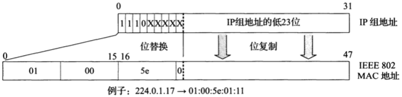
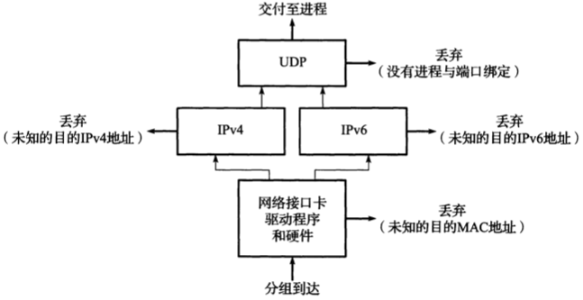

# 第九章 广播和本地组播(IGMP和MLD)

[返回目录](README.md)

## 广播

### 使用广播地址

### 发送广播数据报

一般来说，使用广播的应用程序使用UDP协议（或ICMPv4协议）；

通过使用 `netstat -rn` 查询路由信息，可以知道哪些接口用于广播。

## 组播

IPv4到IEEE 802 MAC组播地址映射，例：

IPv6到IEEE 802 MAC组播地址映射，例：

### 接收组播数据报

使用 `netsh interface ipv6 show joins` 显示接口上的组播组。

使用 `netstat -gn` 显示IP组成员。

### 主机地址过滤

## 互联网组管理协议和组播侦听发现协议

IPv4使用`互联网组管理协议（IGMP）`查询主机所属于哪些组

IPv6使用`组播侦听发现协议（MLD）`查询主机所属于哪些组

IGMP和MLD结构：

### 组成员的IGMP和MLD处理组成员部分

IGMPv3报告格式：

IGMPv3组记录格式：

IGMP和MLD源列表的类型值指明过滤模式（包含或排除）以及源列表是否已经改变：

| 类型 | 名称和意义                                                   | 何时发送                                 |
| ---- | ------------------------------------------------------------ | ---------------------------------------- |
| 0x01 | MODE_IS_INCLUDE(IS_IN)：来自任意相关源地址的流量不会被过滤   | 响应来自一个组播路由器的查询             |
| 0x02 | MODE_IS_EXCLUDE(IS_EX)：来自任意相关源地址的流量会被过滤     | 响应来自一个组播路由器的查询             |
| 0x03 | CHANGE_TO_INCLUDE_MODE(TO_IN)：来自排除模式的改变；来自任意相关源地址的流量现在不应该被过滤 | 响应过滤器模式从排除变成包含的本地动作   |
| 0x04 | CHANGE_NEW_SOURCES(TO_EX)：来自包含模式的改变；来自任意相关源地址的流量现在应该被过滤 | 响应过滤器模式从包含变为排除的本地动作   |
| 0x05 | ALLOW_NEW_SOURCES(ALLOW)：源列表中的改变；来自任意相关源地址的流量现在不应该被过滤 | 响应源列表变为允许新源的本地动作         |
| 0x06 | BLOCK_OLD_SOURCES(BLOCK)：源列表中的改变；来自任意相关源地址的流量现在应该被过滤 | 响应源列表变为禁止先前允许的源的本地动作 |

- 当前状态记录（current-state record）
  - 0x01
  - 0x02
- 过滤器模式改变记录（filter-mode-change record）
  - 0x03
  - 0x04
- 源列表变更记录（source-list-change record）
  - 0x05
  - 0x06

### 组播路由器的IGMP和MLD处理组播路由器部分

### 轻量级IGMPv3和MLDv2

IGMPv3和MLDv2的完整版本与它们的轻量级版本LW-IGMPv3和LW-MLDv2的对比

| 完整版      | 轻量级      | 何时发送                          |
| ----------- | ----------- | --------------------------------- |
| `IS_EX({})` | `TO_EX({})` | 对于`(*, G)`加入的查询响应        |
| `IS_EX(S)`  | `N/A`       | 对于`EXCLUDE(S, G)`加入的查询响应 |
| `IS_IN(S)`  | `ALLOW(S)`  | 对于`INCLUDE(S, G)`加入的查询响应 |
| `ALLOW(S)`  | `ALLOW(S)`  | `INCLUDE(S, G)` 加入              |
| `BLOCK(S)`  | `BLOCK(S)`  | `INCLUDE(S, G)`离开               |
| `TO_IN(S)`  | `TO_IN(S)`  | 改变为`INCLUDE(S, G)`加入         |
| `TO_IN({})` | `TO_IN({})` | `(*, G)`离开                      |
| `TO_EX(S)`  | `N/A`       | 改变为`EXCLUDE(S, G)`加入         |
| `TO_EX({})` | `TO_EX({})` | `(*, G)`离开                      |

### IGMP和MLD计数器和变量

todo 9-3

### IGMP和MLD探听

todo