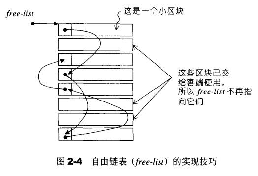
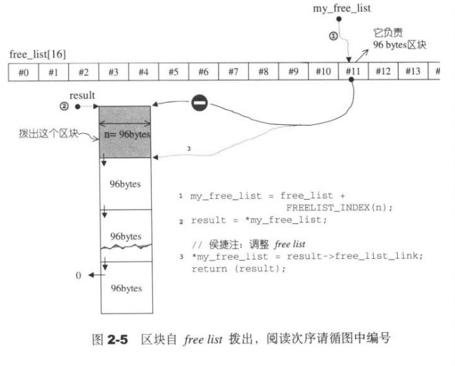
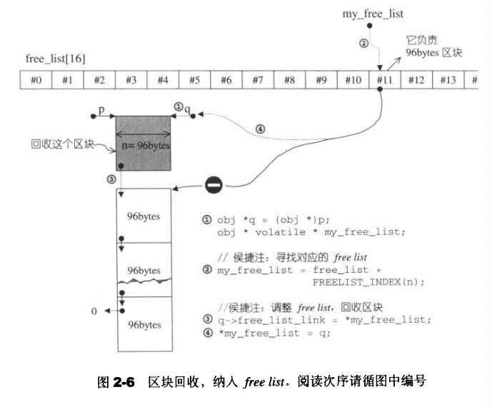
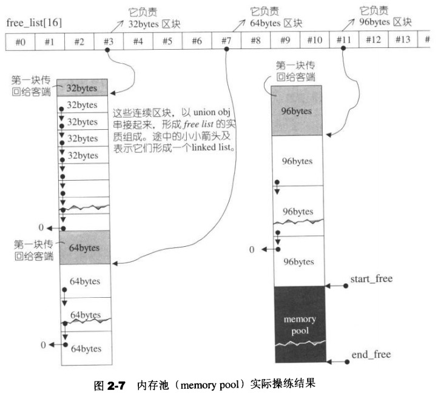

# 第二章 空间配置器

[返回目录](README.md)

- [具备次配置力的SGI空间配置器](#具备次配置力的SGI空间配置器)
  - [SGI标准的空间配置器std::allocator](#SGI标准的空间配置器std::allocator)
  - [SGI特殊的空间配置器std::alloc](#SGI特殊的空间配置器std::alloc)
  - [构造和析构基本工具construct和destroy](#构造和析构基本工具construct和destroy)
  
- [空间的配置与释放std::alloc](#空间的配置与释放std::alloc)
  - [空间配置函数allocate](#空间配置函数allocate)
  - [空间释放函数deallocate](#空间释放函数deallocate)
  - [内存池](#内存池)
  
- [内存基本处理工具](#内存基本处理工具)
  - [uninitialized_copy](#uninitialized_copy)
  - [uninitialized_fill](#uninitialized_fill)
  - [uninitialized_fill_n](#uninitialized_fill_n)


## 具备次配置力的SGI空间配置器

SGI STL的配置器与众不同，也与标准规范不同，其名称是alloc而非allocator，而且不接收任何参数。换句话说，如果你要在程序中明白采用SGI配置器，则不能采用标准写法：

```c++
vector<int, std::allocator<int> > iv;
```

必须这么写：

```c++
vector<int, std::alloc> iv;
```

SGI STL allocator未能符合标准规格，这个事实通常不会给我们带来困扰，因为通常我们使用缺省的空间配置器，很少需要自行指定配置器名称，而SGI STL的每个容器都已经指定其缺省的空间配置器为alloc。例如下面的vector声明：

```c++
template <class T, class Alloc = alloc>		// 缺省使用alloc为配置器
class vector {...};
```

### SGI标准的空间配置器std::allocator

<defalloc.h>中包含了一个符合标准的配置器，但是不建议使用，原因：**效率较差**；

### SGI特殊的空间配置器std::alloc

STL定义在<emmory>中与空间配置相关的三部分：
* < stl_construct.h >

    > 定义全局函数construct()和destroy()，负责对象的构造和析构

* < stl_alloc.h >

    > 定义一，二级allocator;配置器名为alloc，负责内存空间的配置与释放

* < stl_uninitialized.h >
  
    > 定义了一些全局函数用来填充和复制大块内存数据，实现STL标准规范：
    > un_initialized_copy()
    >
    > un_initialized_fill()
    >
    > un_initialized_fill_n()

### 构造和析构基本工具construct和destroy

<stl_construct.h>

- construct()

  > ```c++
  > template <class T1, class T2>
  >    inline void construct(T1 *p, const T2& value) {
  >      new (p) T1(value);		// placement new; 调用T1::T1(value);
  >    }
  > ```

- destroy()

  > ```c++
  > // destroy()第一个版本，接受一个指针
  > template <class T>
  > inline void destroy(T* pointer) {
  >   pointer->~T();			// 调用dtor ~T()
  > }
  > 
  > // destroy()第二个版本，接收两个迭代器。此函数设法找出元素的数值型别，
  > // 进而利用 __type_traits<>求取最适当措施
  > template <class ForwardIterator>
  > inline void destroy()
  > ```


## 空间的配置与释放std::alloc

<stl_alloc.h>

- 向system heap要求空间。
- 考虑多线程(multi-threads)状态。
- 考虑内存不足时的应变措施。
- 考虑过多“小型区块”可能造成的内存碎片(fragment)问题。

一二级分配机制：
* 一级allocator: 

  > template <int inst>
  >
  > class __mlloc_alloc_template {...};
  >
  > 其中：
  >
  > 1. allocate()直接使用malloc(), dealloc()直接使用free()。
  > 2. 模拟c++的set_new_handler()用来处理内存不足；
  
* 二级allocator:

> template <bool threads, int inst>
>
> class __default_alloc_template {...};
>
> 其中:
>
> 1. 如果需求区块<128bytes,使用内存池管理；维护16中**自由链表**,负责16种小型区块(8, 16, 24, 32, 40, 48, 56, 64, 72, 80, 88, 96, 104, 112, 120, 128)bytes的配置能力;
> 2. 如果需求区块>128bytes,转而调用第一级配置器；  

自由链表:

```c++
enum {_ALIGN = 8}; 								// 小型区块的上调边界
enum {_MAX_BYTES = 128}; 					// 小型区块的上限
enum {_NFREELISTS = 16};					// _MAX_BYTES/_ALIGN free-list的个数

// free-list的节点结构，降低维护链表list带来的额外负担
union _Obj {
  union _Obj* _M_free_list_link;	// 利用联合体特点
  char _M_client_data[1];
};
static _Obj*__STL_VOLATILE _S_free_list[_NFREELISTS]; // 注意，它是数组，每个数组元素包含若干相等的小额区块
```



其中free-list是指针数组，16个数组元素，就是16个free-list，各自管理大小分别为8,16,24,32,...128bytes(8的倍数)的小额区块。

小额区块的结构体 **union _Obj** 使用链表连接起来。

### 空间配置函数allocate

<stl_alloc.h>

```c++
static void* allocate(size_t n)
```



### 空间释放函数deallocate

<stl_alloc.h>

```c++
  static void deallocate(void* __p, size_t __n)
```




### 内存池

<stl_alloc.h>

```c++
template <bool __threads, int __inst>
char* __default_alloc_template<__threads, __inst>::_S_chunk_alloc(size_t __size, int& __nobjs)
```



## uninitialized_copy内存基本处理工具

### uninitialized_copy

```c++
template <class InputIterator, class ForwardIterator>
ForwardIterator
uninitialized_copy(InputIterator first, InputIterator last, ForwardIterator result);
```

- first: 指向输入端的起始位置的迭代器
- last: 指向输入端的结束位置（前闭后开区间）的迭代器
- result: 指向输出端（欲初始化空间）的起始处的迭代器

使内存的配置与对象的构造行为分离开来。如果作为输出目的地的[result, result+(last-first))范围内的每一个迭代器都指向未初始化区域，则uninitialized_copy()会使用copy constructor，给身为输入来源之[first, last)范围内的每一个对象产生一份复制品，放进输出范围中。

### uninitialized_fill

```c++
template <class ForwardIterator, class T>
void uninitialized_fill(ForwardIterator first, ForwardIterator last, cosnt T& x);
```

- first: 指向输出端（欲初始化空间）的起始处的迭代器
- last: 指向输出端（欲初始化空间）的结束处（前闭后开区间）的迭代器
- x: 表示初值

也能够使我们将内存配置与对象的构造行为分离开来。如果[first, last)范围内的每个迭代器都指向未初始化的内存，那么uninitialized_fill()会在该范围内产生x(上式第三参数)的复制品。

### uninitialized_fill_n

```c++
template <class ForwardIterator, class Size, class T>
ForwardIterator uninitialized_fill_n(ForwardIterator first, Size n, const T& x);
```

- first: 指向欲初始化空间的起始处的迭代器
- n: 表示欲初始化空间的大小
- x: 表示初值

使我们将内存配置与对象构造行为分离开来。它会为指定范围内的所有元素设定相同的初值。