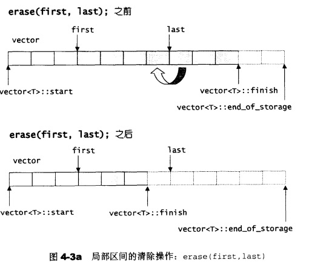
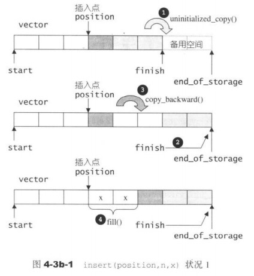
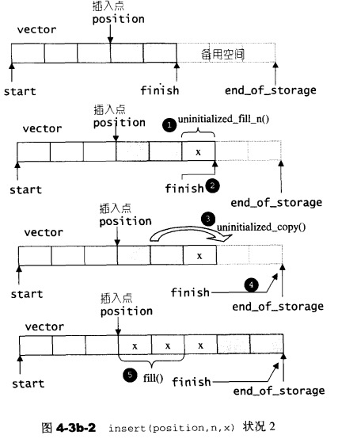
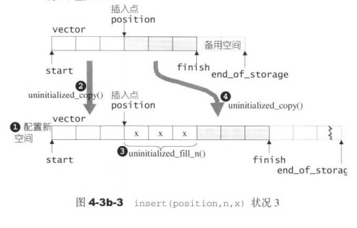
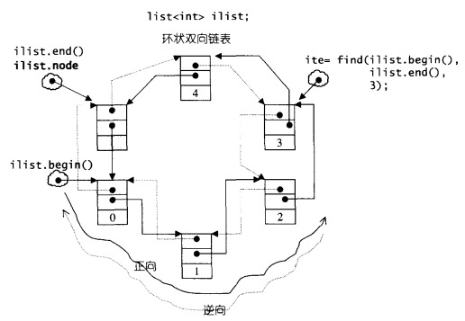
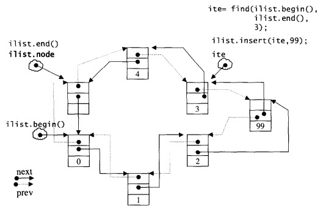

# 第四章 序列式容器

序列式容器分类

- vector
- list

## vector

### vector数据结构:

```c++
template <class T, class Alloc *alloc>
class vector {
...
protected:  
  iterator start;						// 表示目前使用空间的头
  iterator finish;					// 表示目前使用空间的尾
  iterator end_of_storage;	// 表示目前可用空间的尾
  ...
}
```

### vector的指针(Random Access Iterators)

支持随机存取,支持以下操作:`operator*, operator->, operator++, operator--, operator+, operator-, operator+=, operator-=`

### 扩容算法

如果空间不够，则以原空间大小的2倍开辟一块新空间，然后将原内容拷贝过来，并释放原空间。

所以，一旦引起空间重新配置，会导致迭代器失效。

### 元素操作

- pop_back

  丢掉尾部元素

- erase

  删除指定范围的元素，后面的元素全部前移

  

- clear

  删除某个位置的元素，后面的元素全部前移

- insert

  插入元素

  1. 备用空间 > 新增元素个数

  >  1.1. 插入点之后的现有元素个数 > 新增元素个数
  >  

  >  1.2. 插入点之后的现有元素个数 ≤ 新增元素个数
  >  

  2. 备用空间 < 新增元素个数
  >  

### 适用场景

随机访问的情况，不适宜插入，删除等操作频繁的操作

---

## list

STL list是一个环状双向链表(double linked-list), 插入(insert)和拼接(splice)都不会造成原有list迭代器失效。

遵循STL的前闭后开原则，默认有一个node指针可以置于尾部的一个空白节点。

### list node结构

```c++
// stl_list.h
// 双向链表
struct _List_node_base {
  _List_node_base* _M_next;
  _List_node_base* _M_prev;
};
// list节点
template <class _Tp>
struct _List_node : public _List_node_base {
  _Tp _M_data;	// 节点存储的值
}
```

### list的迭代器(Bidirectional Iterators)

具备:递增，递减，取值，成员取用，前移，后移等功能

```c++
// stl_list.h
// list迭代器基类
struct _List_iterator_base {
  typedef size_t 											size_type;
  typedef ptrdiff_t 									difference_type;
  typedef bidirectional_iterator_tag 	iterator_category; // 双向移动迭代器
  
  _List_node_base* _M_node;	// 指向节点的指针
  
  _List_iterator_base(_List_node_base* __x) : _M_node(__x) {}
  _List_iterator_base() {}
  
  void _M_incr() { _M_node = _M_node->_M_next; }	// 前移
  void _M_decr() { _M_code = _M_node->_M_prev; }	// 后退
  
  bool operator==(const _List_iterator_base& __x) const {
    return _M_node == __x._M_node;
  }
  bool operator!=(const _List_iterator_base& __x) const {
    return _M_node != __x._M_node;
  }
};
```

### list本身的结构

环状链表



```c++
// stl_list.h
// list 基类
template <class _Tp, class _Alloc>
class _List_base
{
public:
  typedef _Alloc allocator_type;
  allocator_type get_allocator() const { return allocator_type(); }
  
  _List_base(const allocator_type&) {
    _M_node = _M_get_node();
    _M_node->_M_next = _M_node;
    _M_node->_M_prev = _M_node;
  }
  ~_List_base() {
    clear();
    _M_put_node(_M_node);
  }
  
  void clear();
  
protected:
  // 专属空间配置器，每次配置一个节点大小
  typedef simple_alloc<_List_node<_Tp>, _Alloc> _Alloc_type;
  // 配置一个节点并返回
  _List_node<_Tp>* _M_get_node() { return _Alloc_type::allocate(1); }
  //  释放一个节点
  void _M_put_node(_List_node<_Tp>* __p) { _Alloc_type::deallocate(__p, 1); }
  
protected:
  _List_node<_Tp>* _M_node;	// 只要一个指针，便可表示整个环状双向链表，空白节点
}
```

### 元素操作

- insert

  插入元素

  ```c++
  iterator insert(iterator __position, const _Tp& __x) {
    _Node* __tmp = _M_create_node(__x);
    __tmp->_M_next = __position._M_node;
    __tmp->_M_prev = __position._M_node->_M_prev;
    __position._M_node->_M_prev->_M_next = __tmp;
    __position._M_node->_M_prev = __tmp;
    return __tmp;
  }
  ```

  

- push_front

  插入一个节点，作为头节点

  ```c++
  void push_front(const T& x) { insert(begin(), __x); }
  ```

- push_back

  插入一个节点，作为尾节点

  ```c++
  void push_back(const T& x) { insert(end(), x); }
  ```

- erase

  移除迭代器position所指节点

  ```c++
  iterator erase(iterator __position) {
    _List_node_base* __next_node = __position._M_node->_M_next;
    _List_node_base* __prev_node = __position._M_node->_M_prev;
    _Node* __n = (_Node*) __position._M_node;
    __prev_node->_M_next = __next_node;
    __next_node->_M_prev = __prev_node;
    _Destroy(&__n->_M_data);
    _M_put_node(__n);
    return iterator((_Node*) __next_node);
  }
  ```

- pop_front

  移除头节点

  ```c++
  void pop_front() { erase(begin()); }
  ```

- pop_back

  移除尾节点

  ```c++
  void pop_back() {
    iterator __tmp = end();
    erase(--__tmp);
  }
  ```

- clear

  清除所有节点(整个链表)

  ```c++
  template <class _Tp, class _Alloc>
  void
  _List_base<_Tp, _Alloc>::clear()
  {
    _List_node<_Tp>* __cur = (_List_node<_Tp>*) _M_node->_M_next; // 头节点
    while (__cur != _M_node) {	// 遍历环链表
      _List_node<_Tp>* __tmp = __cur;
      __cur = (_List_node<_Tp>*) __cur->_M_next;
      _Destroy(&__tmp->_M_data);
      _M_put_node(__tmp);
    }
    _M_node->_M_next = _M_node;
    _M_node->_M_prev = _M_node;
  }
  ```

- remove

  将数值为value的所有元素移除

  ```c++
  template <class _Tp, class _Alloc>
  void list<_Tp, _Alloc>::remove(const _Tp& __value)
  {
    iterator __first = begin();
    iterator __last = end();
    while (__first != __last) {
      iterator __next = __first;
      ++__next;
      if (*__first == __value) erase(__first);	// 符合条件就删除
      __first = __next;
    }
  }
  ```

- unique

  移除数值相同的连续元素，保持每个元素的唯一性。

  ```c++
  template <class _Tp, class _Alloc>
  void list<_Tp, _Alloc>::unique()
  {
    iterator __first = begin();
    iterator __last = end();
    if (__first == __last) return;
    iterator __next = __first;
    while (++__next != __last) {
      if (*__first == *__next)
        erase(__next);
      else
        __first = __next;
      __next = __first;
    }
  }
  ```

- splice

  拆分list

  ```c++
  void transfer(iterator __position, iterator __first, iterator __last) {
    if (__position != __last) {
      // 从__position位置移除[first, last)
      __last._M_node->_M_prev->_M_next 			= __position._M_node;
      __first._M_node->_M_prev->_M_next 		= __last._M_node;
      __position._M_node->_M_prev->_M_next 	= __first._M_node;
      
      // 插入[first, last)到新位置
      _List_node_base* __tmp 			= __position._M_node->_M_prev;
      __position._M_node->_M_prev = __last._M_node->_M_prev;
      __last._M_node->_M_prev 		= __first._M_node->_M_prev;
      __first._M_node->_M_prev 		= __tmp;
    }
  }
  void splice(iterator __position, list&, iterator __first, iterator __last) {
    if (__first != __last)
      this->transfer(__position, __first, __last);
  }
  ```

- merge

  合并2个list

  ```c++
  template <class _Tp, class _Alloc>
  void list<_Tp, _Alloc>::merge(list<_Tp, _Alloc>& __x)
  {
    iterator __first1 = begin();
    iterator __last1 = end();
    iterator __first2 = __x.begin();
    iterator __last2 = __x.end();
    while (__first1 != __last1 && __first2 != __last2)
      if (*__first2 < *__first1) {
        iterator __next = __first2;
        transfer(__first1, __first2, ++__next);
        __first2 = __next;
      } 
    	else
        ++__first1;
    if (__first2 != __last2) transfer(__last1, __first2, __last2);
  }
  ```

- reverse

  翻转list

  ```c++
  inline void __List_base_reverse(_List_node_base* __p)
  {
    _List_node_base* __tmp = __p;
    do {
      __STD::swap(__tmp->_M_next, __tmp->_M_prev);
      __tmp = __tmp->_M_prev;
    } while (__tmp != __p);
  }
  
  template <class _Tp, class _Alloc>
  inline void list<_Tp, _Alloc>::reverse()
  {
    __List_base_reverse(this->_M_node);
  }
  ```

- sort

  对list进行排序

  list不能使用STL算法sort()，必须使用自己的sort()；因为STL算法sort()只接受RamdonAccessIterator

  ```c++
  template <class _Tp, class _Alloc>
  void list<_Tp, _Alloc>::sort()
  {
    if (_M_node->_M_next != _M_node && _M_node->_M_next->_M_next != _M_node) {
      list<_Tp, _Alloc> __carry;
      list<_Tp, _Alloc> __counter[64];
      int __file = 0;
      while (!empty()) {
        __carry.splice(__carry.begin(), *this, begin());
        int __i = 0;
        while (__i < __fill && !__counter[__i].empty()) {
          __counter[__i].merge(__carry);
          __carry.swap(__counter[__i++]);
        }
        __carry.swap(__counter[__i]);
        if (__i == __fill) ++_fill;
      }
      
      for (int __i = 1; __i < __fill; ++__i)
        __counter[__i].merge(__counter[__i-1]);
      swap(__counter[__fill-1]);
    }
  }
  ```

## deque(double-ended queue, 双端队列)

### deque概述
deque是一种双向进出的连续线性空间。它是动态地分段连续空间组合而成，随时可以增加一段新的空间并连接起来。

特点:
- deque时有下表顺序容器，它允许在其首尾两端快速插入及删除
- deque的元素不是相接存储的，典型实现用单独分配的固定大小数组的序列，外加额外的标记，这表示下标访问必须进行二次指针解引用，与之相比vector的下标访问只进行一次

deque和vector的差异:

- deque允许常数时间内对起头端进行元素的插入或移除操作
- deque没有所谓容量(capacity)观念，因为它是动态地以分段连续空间组合而成，随时可以增加一段新的空间并连接起来

除非必要我们应尽可能使用vector二飞deque。在对de1ue进行的排序操作时，为了最高效率，可将deque先完整复制到一个vector身上，将vector排序后(利用STL sort算法)，再复制回deque。

### deque的中控器
```c++
template <class _Tp, class _Alloc>
class _Deque_base
  : public _Deque_alloc_base<_Tp,_Alloc,
                              _Alloc_traits<_Tp, _Alloc>::_S_instanceless>
{
public:
  typedef _Deque_iterator<_Tp,_Tp&,_Tp*> iterator;

protected:
  _Tp** _M_map;         // map
  size_t _Map_map_size; // map的节点数量大小
  iterator _M_start;  // 指向第一个缓冲区的第一个元素
  iterator _M_finish; // 指向最后一个缓冲区的最后一个元素

  typedef simple_alloc<_Tp, _Alloc>   _Node_alloc_type; // 节点配置器
  typedef simple_alloc<_Tp*, _Alloc>  _Map_alloc_type;  // map配置器
  ...
};

template <class _Tp, class _Alloc = __STL_DEFAULT_ALLOCATOR(_Tp)>
class deque : protected _Deque_base<_Tp, Alloc> {

protected:
  typedef pointer* _Map_pointer;
  ...
}
```

deque采用一小块连续空间(map)来做主控，map的每一个节点(node)都是指针，指向另一端比较大的连续线性空间。


### deque的迭代器
```c++
template <class _Tp, class _Ref, class _Ptr>
struct _Deque_iterator {
  typedef _Tp** _Map_pointer;

  _Tp* _M_curr;         // 指向节点的当前元素
  _Tp* _M_first;        // 指向节点的头
  _Tp* _M_last;         // 指向节点的尾部（含备用空间）
  _Map_pointer _M_node; // 指向所在的map
  ...
}
```


### deque的构造与内存管理
- push_back
```c++
void push_back(const value_type& __t) {
  if (_M_finish._M_cur != _M_finish._M_last - 1) {
    // 最后的节点还有2个（含）以上的元素备用空间
    construct(_M_finish._M_cur, __t); // 直接在备用空间上构造元素
    ++_M_finish._M_cur;               // 调整最后节点的使用状态
  }
  else                                // 最后节点只剩一个元素的备用空间
    _M_push_back_aux(__t);
}

template <class _Tp, class _Alloc>
void deque<_Tp,_Alloc>::_M_push_back_aux(const value_type& __t)
{
  value_type __t_copy = __t;
  _M_reserve_map_at_back();                       // 如果符合条件，重换一个map
  *(_M_finish._M_node + 1) = _M_allocate_node();  // 配置一个新节点
  __STL_TRY {
    construct(_M_finish._M_cur, __t_copy);        // 赋值
    _M_finish._M_set_node(_M_finish._M_node + 1); // 改变finish,指向新节点
    _M_finish._M_cur = _M_finish._M_first;
  }
  __STL_UNWIND(_M_deallocate_node(*(_M_finish._M_node + 1)));
}
```


- puth_front
```c++
void push_front() {
  if (_M_start._M_cur != _M_start._M_first) { // 第一节点还有备用空间
    construct(_M_start._M_cur - 1, __t);      // 构造元素
    --_M_start._M_cur;                        // 调整第一节点的状态
  }
  else                                        // 第一节点无可用空间
    _M_push_front_aux(__t);
}

template <class _Tp, class _Alloc>
void deque<_Tp,_Alloc>::_M_push_front_aux(const value_type& __t)
{
  value_type __t_copy = __t;
  _M_reserve_map_at_front();                    // 如果符合条件，更换一个map
  *(_M_start._M_node - 1) = _M_allocate_node(); // 配置一个新节点
  __STL_TRY {
    _M_start._M_set_node(_M_start._M_node - 1); // 改变start，令其指向新节点
    _M_start._M_cur = _M_start._M_last - 1;     // 设定start的状态
    construct(_M_start._M_cur, __t_copy);       // 设置值
  }
  __STL_UNWIND((++_M_start, _M_deallocate_node(*(_M_start._M_node - 1))));
}
```


### deque的元素操作
- pop_back
```c++
void pop_back() {
  if (_M_finish._M_cur != _M_finish._M_first) {
    // 最后节点有一个（或多个）元素
    --_M_finish._M_cur; // 调整指针
    destroy(_M_finish._M_cur);
  }
  else  // 最后节点没有任何元素
    _M_pop_back_aux();  // 释放节点
}

template <class _Tp, class _Alloc>
void deque<_Tp,_Alloc>::_M_pop_back_aux()
{
  _M_deallocate_node(_M_finish._M_first); // 释放左右一个节点
  _M_finish._M_set_node(_M_finish._M_node - 1); // 重设节点
  _M_finish._M_cur = _M_finish._M_last - 1;
  destroy(_M_finish._M_cur);
}
```

- pop_front
```c++
void pop_front() {
  if (_M_start._M_cur != _M_start._M_last - 1) {
    // 第一个节点有两个（或多个）元素
    destroy(_M_start._M_cur);
    ++_M_start._M_cur;
  }
  else  // 第一个节点仅有一个元素
    _M_pop_front_aux();
}

template <class _Tp, class _Alloc>
void deque<_Tp,_Alloc>::_M_pop_front_aux()
{
  destroy(_M_start._M_cur);                   // 将第一个节点的第一个元素析构
  _M_deallocate_node(_M_start._M_first);      // 释放第一个节点
  _M_start._M_set_node(_M_start._M_node + 1); // 重设start
  _M_start._M_cur = _M_start._M_first;
}
```

- clear
```c++
template <class _Tp, class _Alloc>
void deque<_Tp,_Alloc>::clear()
{
  for (_Map_pointer __node = _M_start._M_node + 1;
      __node < _M_finish._M_node;
      ++__node>) {
    destroy(*__node, *__node + _S_buffer_size());   // 释放节点的所有元素
  }

  if (_M_start._M_node != _M_finish._M_node) {
    destroy(_M_start._M_cur, _M_start._M_last);     // 释放头节点的所有元素
    destroy(_M_finish._M_first, _M_finish._M_cur);  // 释放尾节点的所有元素
    _M_deallocate_node(_M_finish._M_first);         // 是否尾节点，保留头节点
  }
  else
    destroy(_M_start._M_cur, _M_finish._M_cur);

  _M_finish = _M_start; // 重置尾节点
}
```

- erase
```c++
template <class _Tp, class _Alloc>
typename deque<_Tp,_Alloc>::iterator
deque<_Tp,_Alloc>::erase(iterator __first, iterator __last)
{
  if (___first == _M_start && __last == _M_finish) {  // 如果时清除整个deque
    clear();
    return _M_finish;
  }
  else {
    difference_type __n = __last - __first; // 计算长度
    difference_type __elems_before = __first - _M_start; // 计算离start的距离
     // 如果前面的元素较少
    if (__elems_before < difference_type((this->size() - __n) / 2)) {
      copy_backward(_M_start, __first, __last); // 向后移动前方元素（覆盖清除区间）
      iterator __new_start = _M_start + __n;    // 重设新起点
      destroy(_M_start, __new_start);
      _M_destroy_nodes(__new_start._M_node, _M_start._M_node);
      _M_start = __new_start;
    }
    else {
      copy(__last, _M_finish, __first); // 向前移动后方元素(覆盖清除区间)
      iterator __new_finish = _M_finish - __n;
      destroy(__new_finish, _M_finish);
      _M_destroy_nodes(__new_finish._M_node + 1, _M_finish._M_node + 1);
      _M_finish = __new_finish;
    }
    return _M_start + __elems_before;
  }
}
```

- insert
```c++
template <class _Tp, class _Alloc>
void deque<_Tp, _Alloc>::insert(iterator __pos,
                                const value_type* __first,
                                const value_type* __last) {
  size_type __n = __last - __first; // 元素数量
  if (__pos._M_cur == _M_start._M_cur) {  // 如果插入点是最前端
    iterator __new_start = _M_reserve_elements_at_front(__n);
    __STL_TRY {
      uninitialized_copy(__first, __last, __new_start);
      _M_start = __new_start;
    }
    __STL_UNWIND(_M_destroy_nodes(__new_start._M_node, _M_start._M_node));
  }
  else if (__pos._M_cur == _M_finish._M_cur) {  // 如果插入点是最后端
    iterator __new_finish = _M_reserve_elements_at_back(__n);
    __STL_TRY {
      uninitialized_copy(__first, __last, _M_finish);
      _M_finish = __new_finish;
    }
    __STL_UNWIND(_M_destroy_nodes(_M_finish._M_node + 1,
                                  __new_finish._M_node + 1));
  }
  else
    _M_insert_aux(__pos, __first, __last, __n);
}

template <class _Tp, calss _Alloc>
void deque<_Tp,_Alloc>::_M_insert_aux(iterator __pos,
                                      const value_type* __first,
                                      const value_type* __last,
                                      size_type __n)
{
  const difference_type __elemsbefore = __pos - _M_start;
  size_type __length = size();
  if (__elemsbefore < __length / 2) { // 插入点之前的元素个数较少
    iterator __new_start = _M_reserve_elements_at_front(_n);
    iterator __old_start = _M_start;
    __pos = _M_start + __elemsbefore;
    __STL_TRY {
      if (__elemsbefore >= difference_type(__n)) { // 如果插入点之前的长度，大于要插入的元素个数
        iterator __start_n = _M_start + difference_type(__n);
        uninitialized_copy(_M_start, __start_n, __new_start);
        _M_start = __new_start;
        copy(__start_n, __pos, __old_start);
        copy(__first, __last, __pos - difference_type(__n));
      }
      else {
        const value_type* __mid =
          __first + (difference_type(__n) - __elemsbefore);
        __unitialized_copy_copy(_M_start, __pos, __first, __mid, __new_start);
        
        _M_start = __new_start;
        copy(__mid, __last, __old_start);
      }
    }
    __STL_UNWIND(_M_destroy_nodes(__new_start._M_node, _M_start._M_node);)
  }
  else {
    iterator __new_finish = _M_reserve_elements_at_back(__n);
    iterator __old_finish = _M_finish;
    const difference_type __elemsafter = 
      difference_type(__length) - __elemsbefore;
    __pos = _M_finish - __elemsafter;
    __STL_TRY {
      if (__elemsafter > difference_type(__n)) {
        iterator __finish_n = _M_finish - difference_type(__n);
        uninitialized copy(__finish_n, _M_finish, _M_finish);
        _M_finish = __new_finish;
        copy_backward(__pos, __finish_n, __old_finish);
        _M_finish = __new_finish;
        copy_backward(__pos, _finish_n, __old_finish);
        copy()
      }
    }
  }
}
```