# 第五章 关联式容器

关联式容器分类：

- 以RB-tree为基础的容器：set, map, multisite, multimap
- 以hash table为基础的容器：hash_set, hash_map, hash_multiset, hash_multimap

## 树的导览

### 二叉搜索树

节点插入:

插入新元素时，可以从根节点开始，遇到键值比插入元素大就向左，遇到键值比插入元素小就向右，一直到尾部，即为插入点。

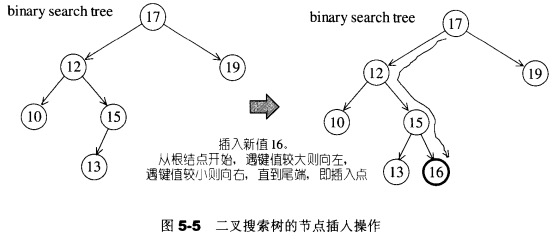

节点删除:

删除节点A，当A只有一个子节点，就直接将A的字节点连接到A的父节点，并将A删除。当A有两个子节点，将其右子树内的最小节点取代A。

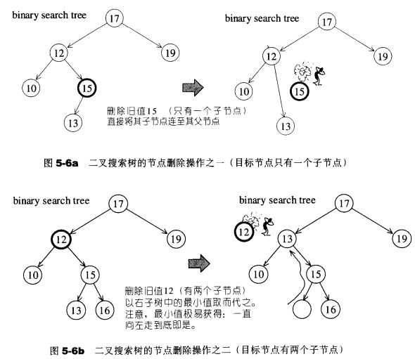

### 平衡二叉搜索树(balanced binary search tree)

### AVL tree(Adelson-Velskii-Landis tree)

### 单旋转(Single Rotation)

### 双旋转(Double Rotation)

---

## RB-tree (红黑树)

红黑树本质是一个二叉搜索树，每个节点要么是红色，要么是黑色，加上一些特性，变成平衡二叉搜索树。

红黑树的插入、删除、查找操作的时间复杂度是 O(logN)。

红黑树的高度在 [logN, logN+1]

RB-tree必须满足以下规则：

1. 每个节点不是红色就是黑色
2. 根节点必须为黑色
3. 如果节点为红，其子节点必须为黑
4. 任何一个节点向下遍历到其叶子节点，所经过的黑色节点必须相等
5. 空节点必须是黑色

### 插入节点

- 状况1

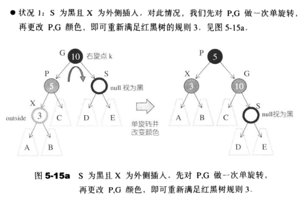

- 状况2

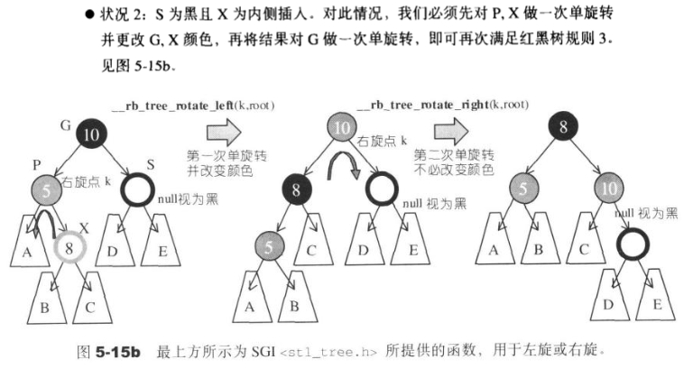

- 状况3

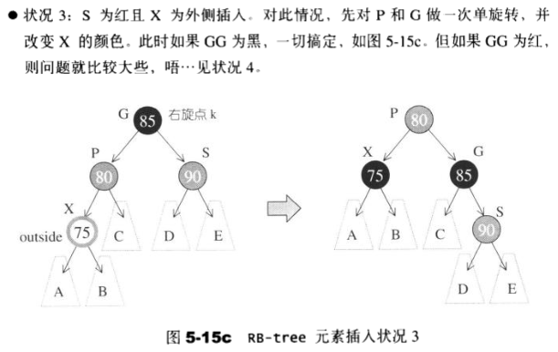

- 状况4

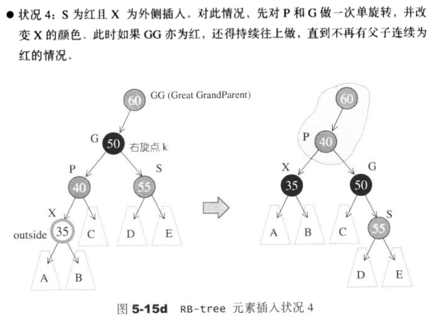

### 一个由上而下的程序

RB-tree自动调整

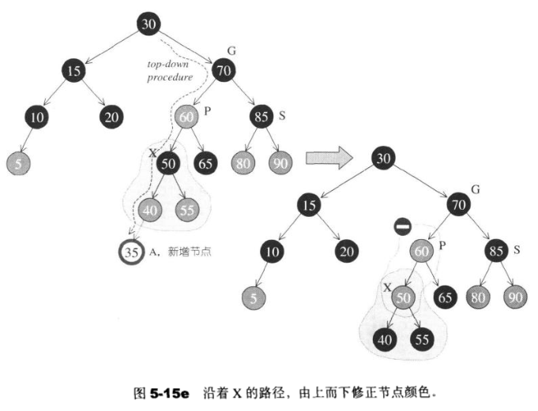

### RB-tree的节点设计

```c++
_Link_type& _M_root() const				// 根节点
	{ return (_Link_type&) _M_header->_M_parent; }
_Link_type& _M_leftmost() const		// 最小值
	{ return (_Link_type&) _M_header->_M_left; }
_Link_type& _M_rightmost() const	// 最大值
	{ return (_Link_type&) _M_header->_M_right; }

// 颜色定义
typedef bool _Rb_tree_Color_type;
const _Rb_tree_Color_type _S_rb_tree_red = false;		// 红色
const _Rb_tree_Color_type _S_rb_tree_black = true;	// 黑色

struct _Rb_tree_node_base
{
  typedef _Rb_tree_Color_type _Color_type;
  typedef _Rb_tree_node_base* _Base_ptr;
  
  _Color_type _M_color;	// 节点颜色，非红即黑
  _Base_ptr _M_parent;	// 父节点
  _Base_ptr _M_left;		// 左节点（小）
  _Base_ptr _M_right;		// 右节点（大）
  
  static _Base_ptr _S_minimum(_Base_ptr __x)
  {
    while (__x->_M_left != 0) __x = __x->_M_left;		// 一直向左走，直到最小值
    return __x;
  }
  
  static _Base_ptr _S_maximum(_Base_ptr __x)
  {
    while (__x->_M_right != 0) __x = __x->_M_right;	// 一直向右走，直到最大值
    return __x;
  }
};

template <class _Value>
struct _Rb_tree_node : public _Rb_tree_node_base
{
  typedef _Rb_tree_node<_Value>* _Link_type;
  _Value _M_value_field;	// 节点值
};
```

### RB-tree的迭代器

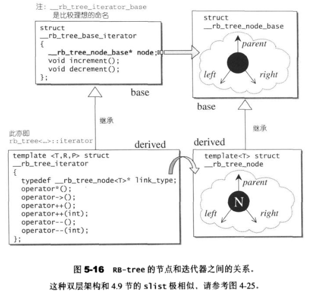

```c++
struct _Rb_tree_base_iterator
{
  typedef _Rb_tree_node_base::_Base_ptr _Base_ptr;
  typedef bidirectional_iterator_tag iterator_category;
  typedef ptrdiff_t difference_type;
  _Base_ptr _M_node;
  
  // 供 operator++() 调用
  void _M_increment()
  {
    if (_M_node->_M_right != 0) {					// 如果有右子节点，向右走
      _M_node = _M_node->_M_right;
      while (_M_node->_M_left != 0)				// 一直到最左边
        _M_node = _M_node->_M_left;
    }
    else {
      _Base_ptr __y = _M_node->_M_parent;	// 没有右子节点，找到父节点
      while (_M_node == __y->_M_right) {	// 如果本身是右子节点，上溯到非右子节点
        _M_node = __y;
        __y = __y->_M_parent;
      }
      if (_M_node->_M_right != __y)
        _M_node = __y;
    }
  }
  
  // 供 operator--() 调用
  void _M_decrement()
  {
    // 红色节点，父节点的父节点等于自己
    if (_M_node->_M_color == _S_rb_tree_red &&
        _M_node->_M_parent->_M_parent == _M_node)
      _M_node = _M_node->_M_right;
    else if (_M_node->_M_left != 0) {			// 找到节点的左子树最大值
      _Base_ptr __y = _M_node->_M_left;
      while (__y->_M_right != 0)					// 向右走
        __y = __y->_M_right;
      _M_node = __y;
    }
    else {																// 即非根节点，亦无左子节点
      _Base_ptr __y = _M_node->_M_parent;
      while (_M_node == __y->_M_left) {		// 向左走
        _M_node = __y;
        __y = __y->_M_parent;
      }
      _M_node = __y;
    }
  }
}
```

### RB-tree的数据结构

```c++
template <class _Value>
struct _Rb_tree_node : public _Rb_tree_node_base
{
  typedef _Rb_tree_node<_Value>* _Link_type;
  _Value _M_value_field;					// 节点的值
};

template <class _Tp, class _Alloc>
struct _Rb_tree_base
{
protected:
  _Rb_tree_node<_Tp>* _M_header; 	// 头节点
  ...
}

template <class _Key, class _Value, class _KeyOfValue, class _Compare,
					class _Alloc = __STL_DEFAULT_ALLOCATOR(_Value) >
class _Rb_tree : protected _Rb_tree_base<_Value, _Alloc> {
protected:
  size_type _M_node_count;				// 节点数量
  _Compare _M_key_compare;				// 节点的键值比较函数
  ...
}
```

### RB-tree的构造与内存管理

RB-tree的构造方式有2种:

- 以现有的RB-tree复制一个新的RB-tree

	```c++
  _Rb_tree(const _Rb_tree<_Key,_Value,_KeyOfValue,_Compare,_Alloc>& __x) 
    : _Base(__x.get_allocator()),
      _M_node_count(0), _M_key_compare(__x._M_key_compare)
  { 
    if (__x._M_root() == 0)
      _M_empty_initialize();
    else {
      _S_color(_M_header) = _S_rb_tree_red;						// 设置header颜色为红色
      _M_root() = _M_copy(__x._M_root(), _M_header);	// 根节点为黑色
      _M_leftmost() = _S_minimum(_M_root());
      _M_rightmost() = _S_maximum(_M_root());
    }
    _M_node_count = __x._M_node_count;
  }
	```

- 产生一棵空空如也的树

  ```c++
  _Rb_tree()
    : _Base(allocator_type()), _M_node_count(0), _M_key_compare()
    { _M_empty_initialize(); }
  
  _Link_type& _M_leftmost() const
  	{ return (_Link_type&) _M_header->_M_left; }
  _Link_type& _M_rightmost() const
  	{ return (_Link_type&) _M_header->_M_right; }
  
  void _M_empty_initialize() {
    _S_color(_M_header) = _S_rb_tree_red;	// 设置头节点为红色
  _M_root() = 0;
    _M_leftmost() = _M_header;	// 设置header的左子节点为自己
    _M_rightmost() = _M_header;	// 设置header的右子节点为自己
  }
  ```
  
  

### RB-tree的元素操作

```c++
// RB-tree 元素插入操作，_KeyOfValue为仿函数
template <class _Key, class _Value, class _KeyOfValue,
					class _Compare, class _Alloc>
typename _Rb_tree<_Key,_Value,_KeyOfValue,_Compare,_Alloc>::iterator
_Rb_tree<_Key,_Value,_KeyOfValue,_Compare,_Alloc>
  ::_M_insert(_Base_ptr __x_, _Base_ptr __y_, const _Value& __v)
{
  _Link_type __x = (_Link_type) __x_;
  _Link_type __y = (_Link_type) __Y_;
  _Link_type __z;
    
  if (__y == _M_header || __x != 0 ||
      _M_key_compare(_KeyOfValue()(__v), _S_key(__y))) {
    __z = _M_create_node(__v);			// 产生一个新节点
    _S_left(__y) = __z;
    if (__y = _M_header) {
      _M_root() = __z;
      _M_rightmost() = __z;
    }
    else if (__y == _M_leftmost())	// 如果y为最左节点
      _M_leftmost() = __z;					// 维护leftmost(),使它永远指向最左节点
  }
  else {
    __z = _M_create_node(__v);			// 产生一个新节点
    _S_right(__y) = __z;						// 令新节点成为y的右子节点
    if (__y = _M_rightmost())
      _M_rightmost() = __z;
  }
  _S_parent(__z) = __y;							// 设定新节点的父节点
  _S_left(__z) = 0;									// 设定新节点的左子节点
  _S_right(__z) = 0;								// 设定新节点的右子节点
  _Rb_tree_rebalance(__z, _M_header->_M_parent);
  ++_M_node_count;									// 节点数累加
  return iterator(__z);
}
```

- insert_equal

  ```c++
  // 插入新值，节点键值允许重复
  template <class _Key, class _Value, class _KeyOfValue,
  					class _Compare, class _Alloc>
  typename _Rb_tree<_Key,_Value,_KeyOfValue,_Compare,_Alloc>::iterator
  _Rb_tree<_Key,_Value,_KeyOfValue,_Comapre,_Alloc>
    ::insert_equal(const _Value& __v)
  {
  	_Link_type __y = _M_header;
    _Link_type __x = _M_root();	// 从根节点开始
    while (__x != 0) {
      __y = __x;
      // 当插入值大于当前节点的值，向右，否则反之
      __x = _M_key_compare(_KeyOfValue()(__v), _S_key(__x)) ? 
        			_S_left(__x) : _S_right(__x);
    }
    return _M_insert(__x, __y, __v); 
  }
  ```

- insert_unique

  ```c++
  // 插入新值，节点键值不允许重复，唯一
  template <class _Key, class _Value, class _KeyOfValue,
  					class _Compare, class _Alloc>
  pair<typename _Rb_tree<_Key,_Value,_KeyOfValue,_Compare,_Alloc>::iteratir, bool>
  _Rb_tree<_Key,_Value,_KeyOfValue,_Compare,_Alloc>
    ::insert_unique(const _Value& __v)
  {
    _Link_type __y = _M_header;
    _Link_type __x = _M_root();		// 从根节点开始
    bool __comp = true;
    while (__x != 0) {						// 找适当位置插入
      __y = __x;
      __comp = _M_key_compare(_KeyOfValue()(__v), _S_key(__x));
      __x = __comp ? _S_left(__x) : _S_right(__x);
    }
    iterator __j = iterator(__y);	// 迭代器 __j 指向插入节点之父节点 __y
    if (__comp)
      if (__j == begin())					// 插入节点为父节点的最左节点
        return pair<iterator,bool>(_M_insert(__x, __y, __v), true);
      else
        --__j;
    if (_M_key_compare(_S_key(__j._M_node), _KeyOfValue()(__v))) // 不重复，执行
      return pair<iterator,bool>(_M_insert(__x, __y, __v), true);
    return pair<iterator,bool>(__j, false);	// 重复，不插入
  }
  ```

- find

  ```c++
  // 查找RB树中是否有键值为k的节点
  template <class _Key, class _Value, class _KeyOfValue,
  					class _Compare, class _Alloc>
  typename _Rb_tree<_Key,_Value,_KeyOfValue,_Compare,_Alloc>::iterator
  _Rb_tree<_Key,_Value,_KeyOfValue,_Compare,_Alloc>::find(const _Key& __k)
  {
    _Link_type __y = _M_header;
    _Link_type __x = _M_root();
    
    while (__x != 0)
      if (!_M_key_compare(_S_key(__x), __k))
        __y = __x, __x = _S_left(__x);	// 遇到大值就向左走
    	else
        __x = _S_right(__x);						// 遇到小值就向右走
    
    iterator __j = iterator(__y);
    return (__j == end() || _M_key_compare(__k, _S_key(__j._M_node))) ? end() : __j;
  }
  ```

- __Rb_tree_rebalance

  ```c++
  inline void
  _Rb_tree_rebalance(_Rb_tree_node_base* __x, _Rb_tree_node_base*& __root)
  {
    todo
  }
  ```

- __Rb_tree_rotate_lef

  ```c++
  // 左旋
  inline void
  _Rb_tree_rotate_left(_Rb_tree_node_base* __x, _Rb_tree_node_base*& __root)
  {
    _Rb_tree_node_base* __y = __x->_M_right;
    __x->_M_right = __y->_M_left;
    if (__y->_M_left != 0)
      __y->_M_left->_M_parent = __x;
    __y->_M_parent = __x->_M_parent;					// y顶上去
    
    if (__x == __root)												// x为根节点
      __root = __y;														// y做根节点
    else if (__x == __x->_M_parent->_M_left)	// x为其父节点的左子节点
      __x->_M_parent->_M_left = __y;					// y到左边
    else																			// x为其父节点的右子节点	
      __x->_M_parent->_M_right = __y;					// y到右边
    __y->_M_left = __x;
    __x->_M_parent = __y;
  }
  ```

- __Rb_tree_rotate_right

  ```c++
  // 右旋
  inline void
  _Rb_tree_rotate_right(_Rb_tree_node_base* __x, _Rb_tree_node_base*& __root)
  {
    _Rb_tree_node_base* __y = __x->_M_left;
    __x->_M_left = __y->_M_right;
    if (__y->_M_right != 0)
      __y->_M_right->_M_parent = __x;
    __y->_M_parent = __x->_M_parent;
    
    if (__x == __root)												// x为根节点
      __root = __y;
    else if (__x == __x->_M_parent->_M_right)	// x为其父节点的右子节点
      __x->_M_parent->_M_right = __y;
    else																			// x为其父节点的左子节点
      __x->_M_parent->_M_left = __y;
    __y->_M_right = __x;
    __x->_M_parent = __y;
  }
  ```


---

## set

底层机制为 RB-tree

iterator被定义为底层RB-tree的const_iterator，所以不能通过迭代器改变set的元素值。

特点：

- 元素有序
- 元素不能重复，唯一

```c++
template <class _Key, class _Compare, class _Alloc>
class set {
private:
  typedef _Rb_tree<key_type, value_type, _Identity<value_type>,
  								 key_compare, _Alloc> _Rep_type;
  _Rep_type _M_t; // 底层实现为 RB-tree
  ...
};
```


---

## map

底层机制为 RB-tree，插入，删除，查找的时间复杂度都是O(logn)。

特点：

- map的结构是键值对 <key, value>, 键值是唯一的。
- 键值是有序的。

```c++
template <class _Key, class _Tp, class _Compare, class _Alloc>
class map {
private:
  typedef _Rb_tree<key_type, value_type, _Select1st<value_type>,
  								 key_compare, _Alloc> _Rep_type;
  _Rep_type _M_t;	// 底层实现为 RB-tree
  ...
}
```


---

## multiset

插入操作采用的是底层机制RB-tree的insert_equal()而非insert_unique()。

特点：

- 特性与set完全相同，唯一的差别在于它允许键值重复

```c++
template <class _Key, class _Compare, class _Allox>
class multiset {
private:
  typedef _Rb_tree<key_type, value_type, _Identity<value_type>,
  								 key_compare, _Alloc> _Req_type;
  _Req_type _M_t;	// 底层实现为 RB-tree
  ...
}
```


---

## multimap

multimap 的插入操作采用的是底层机制 RB-tree 的 insert_equal()。

特点：

- 与map 的用法和特性完全相同，唯一的差别是 multimap 允许键值重复。

```c++
template <class _Key, class _Tp, class _Compare, class _Alloc>
class multimap {
private:
  typedef _Rb_tree<key_type, value_type, _Select1st<value_type>,
  								 key_compare, _Alooc> _Rep_type;
  _Rep_type _M_t;	// 底层实现为 RB-tree
}
```


---

## hashtable(散列表)

### hashtable概述

Hash table在插入，删除，查找等操作具有“常数平均时间”O(1)的表现，这种表现是以统计为基础，不需要依赖输入元素的随机性。

- 散列函数(hash function): 将大数映射为小数

- 线性探测(linear probing): 以线性的方式查找可用的插入点，用来解决碰撞问题

  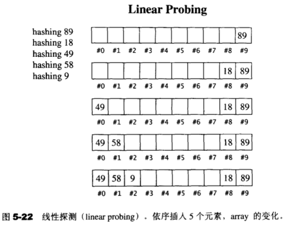

- 二次探测(quadratic probing): 以跳位:$H+1^2$,$H+2^2$,$H+3^2$..的方式来查找可用的插入点，用来解决碰撞问题

  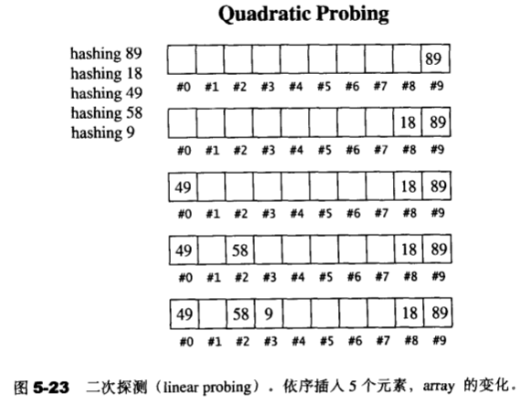

- 开链(separate chaining): 每一个表格元素中维护一个list,用来解决碰撞问题

  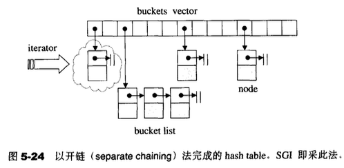

### hashtable的桶子(buckets)与节点(nodes)

对于一个数，进行散列函数处理，获得一个索引（桶节点）；当数量很大时，进过散列函数处理，会得到相同的索引，那么桶的节点位置一样，此时，将相同的节点使用链表连接起来。

```c++
template <class _Val>
struct _Hashtable_node
{
  _Hashtable_node* _M_next; // 指向下一个节点
  _Val _M_val;              // 节点值
};
```

### hashtable的迭代器

Hash table的迭代器没有后退操作，也没有逆向迭代器。

```c++
// hash table 迭代器
struct _Hashtable_iterator {
  _Node* _M_cur;      // 指向的节点
  _HashTable* _M_ht;  // 保持对容器的连接关系，bucket
}
```

### hashtable的数据结构

```c++
template <class _Val, class _key, class _HashFcn,
          class _ExtractKey, class _EqualKey, class _Alloc>
class hashtable {
public:
  typedef _HashFcn hasher;	// 哈希函数
private:
  typedef _Hashtable_node<_Val> _Node;	// 节点
public:
  hasher hash_funct() const { return _M_hash; }
  key_equal key_eq() const { return _M_equals; }
  
private:
  hasher 								_M_hash;					// 哈希函数
  key_equal 						_M_equals;				// 比对函数
  _ExtractKey 					_M_get_key;				// 从节点中取出键值的函数
  vector<_Node*,_Alloc> _M_buckets;				// 容器
  size_type 						_M_num_elements;	// 元素个数
};
```

### hashtable的构造与内存管理

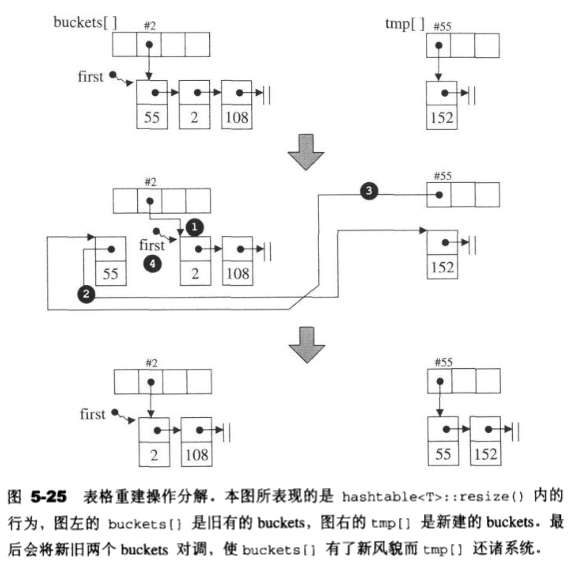

```c++
// 在不需要重建 buckets 大小下，插入新节点，键值不能重复
template <class _Val, class _Key, class _HF, class _Ex, class _Eq, class _All>
pair<typename hashtable<_Val,_Key,_HF,_Ex,_Eq,_All>::iterator, bool>
  ::insert_unique_noresize(const value_type& __obj)
{
	const size_type __n = _M_bkt_num(__obj);
  _Node* __first = _M_buckets[__n];
    
  for (_Node* __cur = __first; __cur; __cur = __cur->_M_next)
    if (_M_equals(_M_get_key(__cur->_M_val), _M_get_key(__obj))) // 节点已存在，跳出
      return pair<iterator, bool>(iterator(__cur, this), false);
    
  _Node* __tmp = _M_new_node(__obj); // 头插法，新建节点
  __tmp->_M_next = __first;
  _M_buckets[__n] = __tmp;
  ++_M_num_elements;
  return pair<iterator, bool>(iterator(__tmp, this), true);  
}

// 不允许有重复的节点插入
pair<iterator, bool> insert_unique(const value_type& __obj)
{
  resize(_M_num_elements + 1); // 判断是否需要重置 buckets
  return insert_unique_noresize(__obj);
}

// 在不需要重建 buckets 大小下，插入新节点，键值可以重复
template <class _Val, class _Key, class _HF, class _Ex, class _Eq, class _All>
typename hashtable<_Val,_Key,_HF,_Ex,_Eq,_All>::iterator
hashtable<_Val,_Key,_HF,_Ex,_Eq,_All>
  ::insert_equal_noresize(const value_type& __obj)
{
	const size_type __n = _M_bkt_num(__obj);
  _Node* __first = _M_buckets[__n];
    
  for (_Node* __cur = __first; __cur; __cur = __cur->_M_next)
    if (_M_equals(_M_get_key(__cur->_M_val), _M_get_key(__obj))) {	// 相等就新建节点
      _Node* __tmp = _M_new_node(__obj); 
      __tmp->_M_next = __cur->_M_next;
      __cur->_M_next = __tmp;
      ++_M_num_elements;
      return iterator(__tm;, this);
    }
    
  _Node* __tmp = _M_new_node(__obj);
  __tmp->_M_next = __first;
  _M_buckets[__n] = __tmp;
  ++_M_num_elements;
  return iterator(__tmp, this);
}

// 允许有重复的节点插入
iterator insert_equal(const value_type& __obj)
{
  resize(_M_num_elements + 1);
  return insert_equal_noresize(__obj);
}
```


### hash functions

字符串转size_t

```c++
// 对字符字符串进行转换
inline size_t __stl_hash_string(const char* __s)
{
  unsigned long __h = 0;
  for (; *__s; ++__s)
    __h = 5*__h + *__s;
  
  return size_t(__h);
}
```

---

## hash_set

- 底层实现机制是 hashtable, 所以 hash_set 内部实现就是封装 hash table 类
- 键值就是实值
- 不允许有重复元素存在，因为底层调用 hashtable 的insert_unique()
- 默认指定 hash table 大小为100(指数 193)
- 元素是无序的

```c++
template <class _Value, class _HashFcn, class _EqualKey, class _Alloc>
class hash_set
{
private:
  typedef hashtable<_Value, _Value, _HashFcn, _Identity<_Value>,
  									_EqualKey, _Alloc> _Ht;	// 底层机制
  _Ht _M_ht;
}
```


---

## hash_map

- 元素结构：<key, value>键值对
- 底层机制为hash table
- 元素是无序的，不会自动排序
- 默认使用hashtable大小为100
- 不允许键值重复的元素

```c++
template <class _Key, class _Tp, class _HashFcn, class _EqualKey,
					class _Alloc>
class hash_map
{
private:
  typedef hashtable<pair<const _Key,_Tp>,_Key,_HashFcn,
  									_Select1st<pair<const _Key,_Tp> >, _EqualKey,_Alloc> _Ht;
  _Ht _M_ht;
};
```


---

## hash_multiset

Hash_multiset与hash_set除了底层调用 hasttable 的 insert_equal(),允许重复元素存在；其他特性都相同

```c++
template <class _Value, class _HashFcn, class _EqualKey, class _Alloc>
class hash_multiset
{
private:
  typedef hashtable<_Value, _Value, _HashFcn, _Identity<_Value>,
  									_EqualKey, _Alloc> _Ht;
  _Ht _M_ht;
public:
  hash_multiset(const value_type* __f, const value_type* __l)
    : _M_ht(100, hasher(), key_equal(), allocator_type())
  { _M_ht.insert_equal(__f, __l); } // 与 hash_set 唯一差别，允许键值重复
}
```


---

## hash_multimap

Hash_multimap可以允许键值重复的元素，其它与 hash_map 特性相同

```c++
template <class _Key, class _Tp, class _HashFcn, class _EqualKey,
					class _Alloc>
class hash_multimap
{
private:
  typedef hashtable<pair<const _Key, _Tp>, _Key, _HashFcn,
  					_Select1st<pair<const _Key, _Tp> >, _EqualKey, _Alloc> _Ht;
  _Ht _M_ht;
public:
  hash_multimap(const value_type* __f, const value_type* __l)
    : _M_ht(100, hasher(), key_equal(), allocator_type())
  { _M_ht.insert_equal(__f, __l); } // 与 hash_map 唯一差别是允许键值重复
}
```


---

