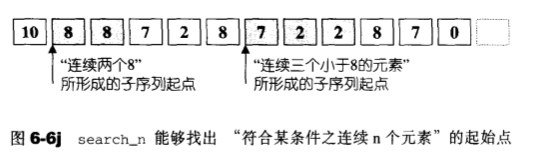
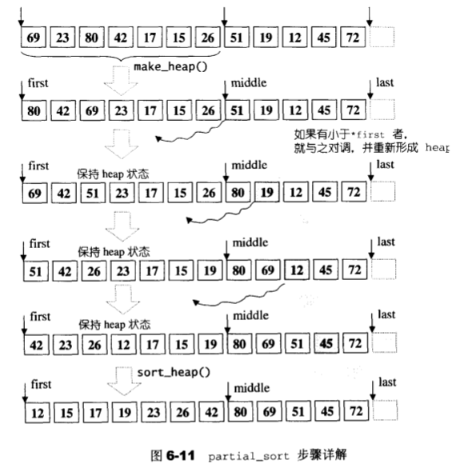
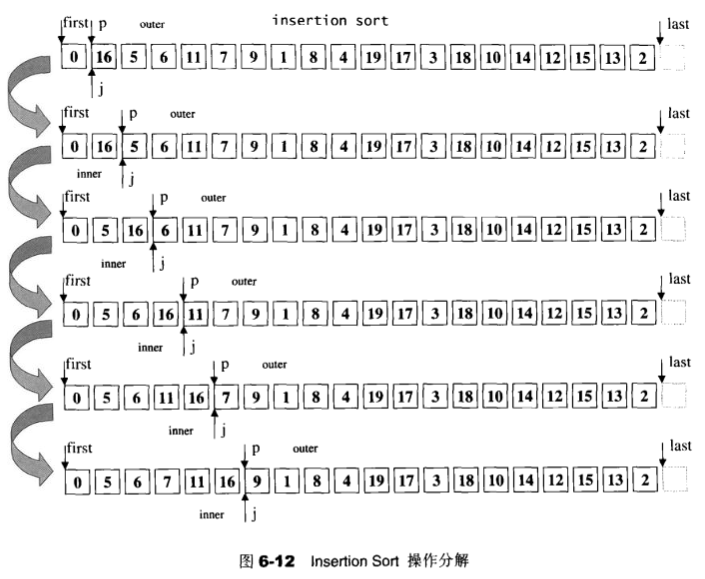

# 算法
[返回目录](README.md)

- [算法概观](#算法概观)

  - [算法分析与复杂度表示](#算法分析与复杂度表示)
  - [STL算法总览](#STL算法总览)
  - [质变算法mutating_algorithms-会改变操作对象的值](#质变算法mutating_algorithms-会改变操作对象的值)
  - [非质变算法non_mutating_algorithms-不改变操作对象的值](#非质变算法non_mutating_algorithms-不改变操作对象的值)
  - [非质变算法non_mutating_algorithms-不改变操作对象的值](#非质变算法non_mutating_algorithms-不改变操作对象的值)
  - [STL算法的一般形式](#STL算法的一般形式)

- [数值算法](#数值算法)

  - [accumulate](#accumulate)
  - [adjacent_difference](#adjacent_difference)
  - [inner_product](#inner_product)
  - [partial_sum](#partial_sum)
  - [power](#power)
  - [iota](#iota)

- [基本算法](#基本算法)

  - [equal](#equal)
  - [fill](#fill)
  - [fill_n](#fill_n)
  - [iter_swap](#iter_swap)
  - [lexicographical_compare](#lexicographical_compare)
  - [max](#max)
  - [min](#min)
  - [mismatch](#mismatch)
  - [copy](#copy)
  - [copy_backward](#copy_backward)

- [set相关算法](#set相关算法)

  - [set_union](#set_union)
  - [set_intersection](#set_intersection)
  - [set_difference](#set_difference)
  - [set_symmetric_difference](#set_symmetric_difference)

- [heap算法](#heap算法)

  - [make_heap](#make_heap)
  - [pop_heap](#pop_heap)
  - [push_heap](#push_heap)
  - [sort_heap](#sort_heap)

- [其它算法](#其它算法)

  - [adjacent_find](#adjacent_find)
  - [count](#count)
  - [count_if](#count_if)
  - [find](#find)
  - [find_if](#find_if)
  - [find_end](#find_end)
  - [find_first_of](#find_first_of)
  - [for_each](#for_each)
  - [generate](#generate)
  - [generate_n](#generate_n)
  - [includes](#includes)
  - [max_element](#max_element)
  - [merge](#merge)
  - [min_element](#min_element)
  - [partition](#partition)
  - [remove](#remove)
  - [remove_copy](#remove_copy)
  - [remove_if](#remove_if)
  - [remove_copy_if](#remove_copy_if)
  - [replace](#replace)
  - [replace_copy](#replace_copy)
  - [replace_if](#replace_if)
  - [replace_copy_if](#replace_copy_if)
  - [reverse](#reverse)
  - [reverse_copy](#reverse_copy)
  - [rotate](#rotate)
  - [rotate_copy](#rotate_copy)
  - [search](#search)
  - [search_n](#search_n)
  - [swap_ranges](#swap_ranges)
  - [transform](#transform)
  - [unique](#unique)
  - [unique_copy](#unique_copy)
  - [lower_bound](#lower_bound)

  - [upper_bound](#upper_bound)
  - [binary_search](#binary_search)
  - [next_permutation](#next_permutation)
  - [prev_permutation](#prev_permutation)
  - [random_shuffle](#random_shuffle)
  - [partial_sort&&partial_sort_copy](#partial_sort&&partial_sort_copy)
  - [sort](#sort)
  - [equal_range](#equal_range)
  - [inplace_merge](#inplace_merge)
  - [nth_element](#nth_element)
  - [merge_sort](#merge_sort)


## 算法概观

[返回顶部](#算法)

### 算法分析与复杂度表示
算法分析(algorithm analysis)

> 分析算法所耗用的空间和时间资源

大O标记法

> 如果有任何正值常数c和$N_0$时，使得当$N \geq N_0$时，$T(N) \leq cF(N)$，那么我们便可将T(N)的复杂度表示为$O(F(N))^3$


### STL算法总览
|算法名称|算法用途|mutating|所在文件|
|:--|:--|:--|:--|
|accumulate|元素累计|N|<stl_numeric.h>|
|adjacent_difference|相邻元素的差|Y if in-place|<stl_numeric.h>|
|adjacent_find|查找相邻而重复（或符合某条件）的元素|N|<stl_algo.h>|
|binary_search|二分查找|N|<stl_algo.h>|
|Copy|复制|Y if in-place|<stl_algobase.h>|
|Copy_backward|逆向复制|Y if in-place|<stl_algobase.h>|
|Copy_n *|复制n个元素|Y if in-place|<stl_algobase.h>|
|count|计数|N|<stl_algo.h>|
|count_if|在特定条件下计数|N|<stl_algo.h>|
|equal|判断两个区间相等与否|N|<stl_alogbase.h>|
|equal_range|试图在有序区间中寻找某值(返回一个上下限区间)|N|<stl_algo.h>|
|fill|改填元素值|Y|<stl_algobase.h>|
|fill_n|改填元素值，n次|Y|<stl_algobase.h>|
|find|循序查找|N|<stl_algo.h>|
|find_if|循序查找符合特定条件者|N|<stl_algo.h>|
|find_end|查找某个子序列的最后一次出现点|N|<stl_algo.h>|
|find_first_of|查找某些元素的首次出现点|N|<stl_algo.h>|
|for_each|对区间内的每个元素施行某操作|N|<stl_algo.h>|
|generate|以特定操作之运算结果填充特定区间内的元素|Y|<stl_algo.h>|
|generate_n|以特定操作之运算结果填充特n个元素内容|Y|<stl_algo.h>|
|includes|是否涵盖于某序列之中|N|<stl_algo.h>|
|inner_product|内积|N|<stl_numeric.h>|
|inplace_merge|合并并就地替换(覆写上去)|Y|<stl_algo.h>|
|Iota*|在某区间填入某指定值的递增序列|Y|<stl_numeric.h>|
|is_heap*|判断某区间是否为一个heap|N|<stl_algo.h>|
|is_sorted*|判断某区间是否已排序|N|<stl_algo.h>|
|iter_swap|元素互换|Y|<stl_algobase.h>|
|lexicographical_compare|以字典顺序进行比较|N|<stl_numeric.h>|
|lower_bound|将指定元素插入区间之内而不影响区间之原本排序的最低位置|N|<stl_algo.h>|
|max|最大值|N|<stl_algobase.h>|
|max_element|最大值所在位置|N|<stl_algo.h>|
|merge|合并两个序列|Y if in-place|<stl_algo.h>|
|min|最小值|N|<stl_algobase.h>|
|min_element|最小值所在位置|N|<stl_algo.h>|
|mismatch|找出不匹配点|N|<stl_algobase.h>|
|next_permutation|获得的下一个排列组合|Y|<stl_algo.h>|
|nth_element|重新安排序列中的第n个元素的左右两端|Y|<stl_algo.h>|
|partial_sort|局部排序|Y|<stl_algo.h>|
|partial_sort_copy|局部排序并复制到他处|Y if in-place|<stl_algo.h>|
|partial_sum|局部求和|Y if in-place|<stl_numeric.h>|
|partition|分割|Y|<stl_algo.h>|
|prev_permutation|获得前一个排列组合|Y|<stl_algo.h>|
|power*|幂次方。表达式可指定|N|<stl_numeric.h>|
|random_shuffle|随机重排元素|Y|<stl_algo.h>|
|random_sample*|随机取样|Y if in-place|<stl_algo.h>|
|random_sample_n*|随机取样|Y if in-place|<stl_algo.h>|
|remove|删除某类元素|Y|<stl_algo.h>|
|remove_copy|删除某类元素并将结果复制到另一个容器|Y|<stl_algo.h>|
|remove_if|有条件地删除某类元素|Y|<stl_algo.h>|
|remove_copy_if|有条件地删除某类元素并将结果复制到另一个容器|Y|<stl_algo.h>|
|replace|替换某类元素|Y|<stl_algo.h>|
|replace_copy|替换某类元素,并将结果复制到另一个容器|Y|<stl_algo.h>|
|replace_if|有条件地替换|Y|<stl_algo.h>|
|replace_copy_if|有条件地替换，并将结果复制到另一个容器|Y|<stl_algo.h>|
|reverse|反转元素次序|Y|<stl_algo.h>|
|reverse_copy|反转元素次序并将结果复制到另一个容器|Y|<stl_algo.h>|
|rotate|旋转|Y|<stl_algo.h>|
|rotate_copy|旋转，并将结果复制到另一个容器|Y|<stl_algo.h>|
|search|查找某个子序列|N|<stl_algo.h>|
|search_n|查找“连续发生n次”的子序列|N|<stl_algo.h>|
|set_difference|差集|Y if in-place|<stl_algo.h>|
|set_intersection|交集|Y if in-place|<stl_algo.h>|
|set_symmetric_difference|对称差集|Y if in-place|<stl_algo.h>|
|set_union|并集|Y if in-place|<stl_algo.h>|
|sort|排序|Y|<stl_algo.h>|
|stable_partition|分割并保持元素的相对次序|Y|<stl_algo.h>|
|stable_sort|排序并保持等值元素的相对次序|Y|<stl_algo.h>|
|swap|交换（对调）|Y|<stl_algobase.h>|
|swap_range|交换（指定区间）|Y|<stl_algo.h>|
|transform|以两个序列为基础，交互作用产生第三个序列|Y|<stl_algo.h>|
|unique|将重复的元素折叠缩编，变成唯一|Y|<stl_algo.h>|
|unique_copy|将重复的元素折叠缩编，变成唯一，并复制到他处|Y if in-place|<stl_algo.h>|
|upper_bound|将指定元素插入区间之内而不影响区间之原本排序的最高位置|N|<stl_algo.h>|
|make_heap|制造一个heap|Y|<stl_heap.h>|
|pop_heap|从heap取出一个元素|Y|<stl_heap.h>|
|push_heap|将一个元素推进heap内|Y|<stl_heap.h>|
|sort_heap|对heap排序|Y|<stl_heap.h>|

mutating: 质变，会改变其操作对象之内容

### 质变算法mutating_algorithms-会改变操作对象的值

- copy(拷贝)
- swap(交换)
- replace(替换)
- fill(填充)
- remove(删除)
- permutation(排列组合)
- partition(分割)
- random shuffling(随机重排)
- sort(排序)
- ...

### 非质变算法non_mutating_algorithms-不改变操作对象的值

- find(查找)
- search(匹配)
- count(计算)
- for_each(巡访)
- equal, mismatch(比较)
- max, min(寻找极值)
- ...

### STL算法的一般形式

所有泛型算法的前两个参数都是一对迭代器，STL 习惯使用前闭后开的区间，`[first, last)`。

最后一个元素的下一位置，称为 end()。

---


## 数值算法

[返回顶部](#算法)

STL 将数值算法的内部实现放在 <stl_numeric.h> 中，用户调用数值算法的接口，需要包含 <numeric> 头文件。

#### accumulate

计算 init 和 `[first, last)`内所有元素的总和。

```c++
template <class _InputIterator, class _Tp>
_Tp accumulate(_InputIterator __first, 
               _InputIterator __last, 
               _Tp __init)
{
  __STL_REQUIRES(_InputIterator, _InputIterator);
  for (; __first != __last; ++__first)
    __init = __init + *__first;
  return __init;
}
```

#### adjacent_difference

计算`[first, last)`中相邻元素的差值，将 `*first` 赋值给 `*result` 并针对`[first+1, last)`内的每个迭代器i，将`*i-*(i-1)`之值赋值给`*(result+(i-first))`。

```c++
template <class _InputIterator, class _OutputIterator, class _Tp>
_OutputIterator
__adjacent_difference(_InputIterator __first,
                      _InputIterator __last,
                      _OutputIterator __result,
                      _Tp*)
{
  _Tp __value = *__first;
  while (++__first != __last) {
    _Tp __tmp = *__first;
    *++__result = __tmp - __value;
    __value = __tmp;
  }
  return ++__result;
}
```

#### inner_product

计算`[first1, last1)`和`[first2, first2 + (last1 - first1))`的一般内积。

```c++
template <class _InputIterator1, class _InputIterator2, class _Tp>
_Tp inner_product(_InputIterator1 __first1, 
            			_InputIterator1 __last1, 
            			_InputIterator2 __first2, 
            			_Tp __init)
{
  __STL_REQUIRES(_InputIterator2, _InputIterator);
  __STL_REQUIRES(_InputIterator2, _InputIterator);
  for (; __first1 != __last1; ++__first1, ++__first2)
    __init = __init + (*__first1 * *__first2);
  return __init;
}
```

#### partial_sum

计算局部总和，将`*first`赋值给`*result`，将`*first`和`*(first+1)`之和赋值给`*(result+1)`。

```c++
template <class _InputIterator, class _OutputIterator, class _Tp>
_OutputIterator
__partial_sum(_InputIterator __first, 
              _InputIterator __last,
            	_OutputIterator __result, 
            	_Tp*)
{
  _Tp __value = *__first;
  while (++__first != __last) {
    __value = __value + *__first;
    *++__result = __value;
  }
  return __result;
}
```

#### power

SGI专属，并不在STL标准之列。计算某数的n幂次方。

```c++
template <class _Tp, class _Integer, class _MonoidOperation>
_Tp __power(_Tp __x, 
            _Integer __n, 
            _MonoidOperation __opr)
{
  if (__n == 0)
    return identity_element(__opr);
  else {
    while ((__n & 1) == 0) {
      __n >>= 1;
      __x = __opr(__x, __x);
    }
    
    _Tp __result = __x;
    __n >>= 1;
    while (__n != 0) {
      __x = __opr(__x, __x);
      if ((__n & 1) != 0)
        __result = __opr(__result, __x);
      __n >>= 1;
    }
    return __result;
  }
}

template <class _Tp, class _Integer>
inline _Tp __power(_Tp __x, _Integer __n)
{
  return __power(__x, __n, multiplies<_Tp>());
}

template <class _Tp, class _Integer>
inline _Tp power(_Tp __x, _Integer __n)
{
  return __power(__x, __n);
}
```

#### iota

SGI专属，并不在STL标准之列。用来设定某个区间的内容，使其内的每个元素从指定的value值开始，呈现递增状态。

```c++
template <class _ForwardIter, class _Tp>
void iota (_ForwardIter __first, 
           _ForwardIter __last, 
           _Tp __value)
{
  __STL_REQUIRES(_ForwardIter, _Mutable_ForwardIterator);
  __STL_CONVERTIBLE(_Tp, 
    	typename iterator_traits<_ForwardIter>::value_type);
  while (__first != __last)
    *__first++ = __value++;
}
```


---

## 基本算法

[返回顶部](#算法)

基本算法位于头文件`<stl_algobase.h>` 中

#### equal

如果两个序列在`[first,last)`区间内相等，`equal()`返回true。

**注意：如果第二序列的元素比较多，多出来的元素不予考虑。**

```c++
template <class _InputIter1, class _InputIter2>
inline bool equal(_InputIter1 __first1, 
                  _InputIter1 __last1,
                  _InputIter2 __first2) 
{
  __STL_REQUIRES(_InputIter1, _InputIterator);
  __STL_REQUIRES(_InputIter2, _InputIterator);
  __STL_REQUIRES(
    typename iterator_traits<_InputIter1>::value_type,
    	_EqualityComparable);
  __STL_REQUIRES(
    typename iterator_traits<_InputIter2>::value_type,
    	_EqualComparable);
  for (; __first1 != __last1; ++__first1, ++__first2)
    if (*__first1 != *__first2)
      return false;
  return true;
}
```

#### fill

将`[first, last)`内的所有元素改填新值。

```c++
template <class _ForwardIter, class _Tp>
void fill(_ForwardIter __first, _ForwardIter __last, 
          const _Tp& __value) 
{
  __STL_REQUIRES(_ForwardIter, _Mutable_ForwardIterator);
  for (; __first != __last; ++__first)
    *__first = __value;
}
```

#### fill_n

将`[first, last)`内的前n个元素改填新值，返回的迭代器指向被填入的最后一个元素的下一个位置。

```c++
template <class _OutputIter, class _Size, class _Tp>
_OutputIter fill_n(_OutputIter __first, 
                   _Size __n,
                   const _Tp& __value) 
{
  __STL_REQUIRES(_OutputIter, _OutputIterator);
  for (; __n > 0; --__n, ++__first)
    *__first = __value;
  return __first;
}
```

#### iter_swap

将两个 ForwardIterators 所指的对象对调，如图：


```c++
template <class _ForwardIter1, class _ForwardIter2, class _Tp>
inline void __iter_swap(_ForwardIter1 __a, 
		_ForwardIter2 __b, _Tp*) 
{
  _Tp __tmp = *__a;
  *__a = *__b;
  *__b = __tmp;
}
  
template <class _ForwardIter1, class _ForwardIter2>
inline void iter_swap(_ForwardIter1 __a, 
                      _ForwardIter2 __b) 
{
  __STL_REQUIRES(_ForwardIter1, _Mutable_ForwardIterator);
  __STL_REQUIRES(_ForwardIter2, _Mutable_ForwardIterator);
  __STL_CONVERTIBLE(
    typename iterator_traits<_ForwardIter1>::value_type,
    typename iterator_traits<_ForwardIter2>::value_type);
  __STL_CONVERTIBLE(
  	typename iterator_traits<_ForwardIter2>::value_type,
  	typename iterator_traits<_ForwardIter1>::value_type);
  __iter_swap(__a, __b, __VALUE_TYPE(__a));
}
```

#### lexicographical_compare

以“字典排列方式”对两个序列`[first1,last1)`和`[first2,last2)`进行比较。

```c++
template <class _InputIter1, class _InputIter2>
bool lexicographical_compare(_InputIter1 __first1, 
                             _InputIter1 __last1,
                             _InputIter2 __first2,
                             _InputIter2 __last2) 
{
  __STL_REQUIRES(_InputIter1, _InputIterator);
  __STL_REQUIRES(_InputIter2, _InputIterator);
  __STL_REQUIRES(
    typename iterator_traits<_InputIter1>::value_type,
  	_LessThanComparable);
  __STL_REQUIRES(
  	typename iterator_traits<_InputIter2>::value_type,
  	_LessThanComparable);
  for (; __first1 != __last1 && __first1 != __last2;
       ; ++__first1 < *__first2) {
    if (*__first1 < *__first2)
      return true;
    if (*__first2 < *__first1)
      return false;
  }
  return __first1 == __last1 && __first2 != __last2;
}
```

#### max

取两个对象中的较大值。

```c++
template <class _Tp>
inline const _Tp& max(const _Tp& __a, const _Tp& __b) 
{
  __STL_REQUIRES(_Tp, _LessThanComparable);
  return __a < __b ? __b : __a;
}
```

#### min

取两个对象中的较小值。

```c++
template <class _Tp>
inline const _Tp& min(const _Tp& __a, const _Tp& __b) 
{
  __STL_REQUIRES(_Tp, _LessThanComparable);
  return __b < __a ? __b : __a;
}
```

#### mismatch

用来平行比较两个序列，指出两者之间的第一个不匹配点，返回一对迭代器，分别指向两个序列中的不匹配点，如图：


```c++
template <class _InputIter1, class _InputIter2>
pair<_InputIter1, _InputIter2> 
msimatch(_InputIter1 __first1,
         _InputIter1 __last1,
         _InputIter2 __first2) 
{
  __STL_REQUIRES(_InputIter1, _InputIterator);
  __STL_REQUIRES(_InputIter2, _InputIterator);
  __STL_REQUIRES(
  	typename iterator_traits<_InputIter1>::value_type,
  	_EqualityComparable);
  __STL_REQUIRES(
  	typename iterator_traits<_InputIter2>::value_type,
  	_EqualityComparable);
  while (__first1 != __last1 && *__first1 == *__first2) {
    ++__first1;
    ++__first2;
  }
  return pair<_InputIter1, _InputIter2>(__first1, __first2);
}
```

#### copy

将输入区间[first,last)内的元素复制到输出区间[result,result+(last-first))内.


```c++
// InputIterator版本
template <class _InputIter, class _OutputIter, class _Distance>
inline _OutputIter __copy(_InputIter __first, 
                          _InputIter __last,
                          _OutputIter __result,
                          input_iterator_tag, 
                          _Distance*)
{
  for (; __first != __last; ++__result, ++__first)
    *__result = *__first;
  return __result;
}

// RandomAccessIterator版本
tempalte <class _RandomAccessIter, class _OutputIter, class _Distance>
inline _OutputIter __copy(_RandomAccessIter __first,
                          _RandomAccessIter __last,
                          _OutputIter __result,
                          random_access_iterator_tag,
                          _Distance*)
{
  for (_Distance __n = __last - __first; __n > 0; --__n) {
    *__result = *__first;
    ++__first;
    ++__result;
  }
  return __result;
}

template <class _InputIter, class _OutputIter>
inline _OutputIter copy(_InputIter __first, 
                        _InputIter __last,
                        _OutputIter __result) 
{
  return __copy(__first, __last, __result,
                __ITERATOR_CATEGORY(__first),
                __DISTANCE_TYPE(__first));
}
```

#### copy_backward

将`[first,last)`区间内的每一个元素，以逆行的方向复制到以`result-1`为起点，方向亦为逆行的区间上。


```c++
template <class _BindirectionalIter1, class _BindirectionalIter2, class _Distance>
inline _BindirectionalIter2 
__copy_backward(_BidirectionalIter1 __first,
                _BidirectionalIter1 __last,
                _BidirectionalIter2 __result,
                bidirectional_iterator_tag,
                _Distance*)
{
	while (__first != __last)
    *--__result = *--__last;
  return __result;
}

template <class _RandomAccessIter, class _BindirectionalIter, class _Distance>
inline _BidirectionalIter
__copy_backward(_RandomAccessIter __first,
                _RandomAccessIter __last,
                _BindirectionalIter __result,
                random_access_iterator_tag,
                _Distance*)
{
	for (_Distance __n = __last - __first; __n > 0; --__n)
    *--__result = *--__last;
  return __result;
}

template <class _BI1, class _BI2>
inline _BI2 copy_backward(_BI1 __first, 
                          _BI1 __last, 
                          _BI2 __result)
{
  return __copy_backward(__first, __last, __result,
                         __ITERATOR_CATEGORY(__first),
                         __DISTANCE_TYPE(__first));
}
```

---


## set相关算法

[返回顶部](#算法)

包含在头文件`<algorithm>`中

### set_union

构造两个集合的并集，是一种稳定操作，输入区间内的每个元素的相对顺序都不会改变。


```c++
template <class _InputIter1, class _InputIter2, class _OutputIter>
_OutputIter set_union(_InputIter1 __first1,
                      _InputIter1 __last1,
                      _InputIter2 __first2,
                      _InputIter2 __last2,
                      _OutputIter __result)
{
	__STL_REQUIRES(_InputIter1, _InputIterator);
  __STL_REQUIRES(_InputIter2, _InputIterator);
  __STL_REQUIRES(_OutputIter, _OutputIterator);
  __STL_REQUIRES_SAME_TYPE(
  	typename iterator_traits<_InputIter1>::value_type,
  	typename iterator_traits<_InputIter2>::value_type);
  __STL_REQUIRES(
  	typename iterator_traits<_InputIter1>::value_type,
  	_LessThanComparable);
  while (__first1 != __last1 && __first2 != __last2) {
    if (*__first1 < *__first2) {
      *__result = *__first1;
      ++__first;
    }
    else if (*__first2 < *__first1) {
      *__result = *__first2;
      ++__first2;
    }
    else {
      *__result = *__first1;
      ++__first1;
      ++__first2;
    }
    ++__result;
  }
  return copy(__first2, 
              __last2, 
              copy(__first1, __last1, __result));
}
```

### set_intersection

构造两个集合的交集，是一种稳定操作，输出区间内的每个元素的相对顺序都和s1内的相对顺序相同。


```c++
template <class _InputIter1, class _InputIter2, class _OutputIter>
_OutputIter set_intersection(_InputIter1 __first1,
                             _InputIter1 __last1,
                             _InputIter2 __first2,
                             _InputIter2 __last2,
                             _OutputIter __result)
{
	__STL_REQUIRES(_InputIter1, _InputIterator);
  __STL_REQUIRES(_InputIter2, _InputIterator);
  __STL_REQUIRES(_OutputIter, _OutputIterator);
  __STL_REQUIRES_SAME_TYPE(
  	typename iterator_traits<_InputIter1>::value_type,
    typename iterator_traits<_InputIter2>::value_type);
  __STL_REQUIRES(
  	typename iterator_traits<_InputIter1>::value_type,
  	_LessThanComparable);
  while (__first1 != __last1 && __first2 != __last2)
    if (*__first1 < *__first2)
      ++__first1;
    else if (*__first2 < *__first1)
      ++__first2;
    else {
      *__result = *__first1;
      ++__first1;
      ++__first2;
      ++__result;
    }
	return __result;
}
```

### set_difference

构造两个集合的差集，是一种稳定操作，输出区间内的每个元素的相对顺序都和s1内的相对顺序相同。


```c++
template <class _InputIter1, class _InputIter2, class _OutputIter>
_OutputIter set_difference(_InputIter1 __first1, 
                           _InputIter1 __last1,
                           _InputIter2 __first2,
                           _InputIter2 __last2,
                           _OutputIter __result)
{
	__STL_REQUIRES(_InputIter1, _InputIterator);
  __STL_REQUIRES(_InputIter2, _InputIterator);
  __STL_REQUIRES(_OutputIter, _OutputIterator);
  _STL_REQUIRES_SAME_TYPE(
  	typename iterator_traits<_InputIter1>::value_type,
  	typename iterator_traits<_InputIter2>::value_type);
  _STL_REQUIRES(
  	typename iterator_traits<_InputIter1>::value_type,
  	_LessThanComparable);
  while (__first1 != __last1 && __first2 != __last2)
    if (*__first1 < *__first2) {
      *__result = *__first1;
      ++__first1;
      ++__result;
    }
    else if (*__first2 < *__first1)
      ++__first2;
    else {
      ++__first1;
      ++__first2;
    }

	return copy(__first1, __last1, __result);
}
```

### set_symmetric_difference

构造两个集合的差集，输入区间内的元素相对顺序不会被改变。


```c++
template <class _InputIter1, class _InputIter2, class _OutputIter>
_OutputIter
set_symmetric_difference(_InputIter1 __first1,
                         _InputIter1 __last1,
                         _InputIter2 __first2, 
                         _InputIter2 __last2, 
                         _OutputIter __result)
{
	__STL_REQUIRES(_InputIter1, _InputIterator);
  __STL_REQUIRES(_InputIter2, _InputIterator);
  __STL_REQUIRES(_OutputIter, _OutputIterator);
  __STL_REQUIRES_SAME_TYPE(
  	typename iterator_traits<_InputIter1>::value_type,
  	typename iterator_traits<_InputIter2>::value_type);
  __STL_REQUIRES(
  	typename iterator_traits<_InputIter1>::value_type,
  	_LessThanComparable);
  while (__first1 != __last1 && __first2 != __last2)
    if (*__first1 < *__first2) {
      *__result = *__first1;
      ++__first1;
      ++__result;
    }
    else if (*__first2 < *__first1) {
      *__result = *__first2;
      ++__first2;
      ++__result;
    }
    else {
      ++__first1;
      ++__first2;
    }
   
	return copy(__first2, __last2, 
              copy(__first1, __last1, __result));
}
```

---


## heap算法

位于头文件`<stl_heap.h>`

```c++
template <class _RandomAccessIterator, class _Distance, class _Tp>
void
__adjust_heap(_RandomAccessIterator __first, 
              _Distance __holeIndex, 
              _Distance __len, 
              _Tp __value)
{
  _Distance __topIndex = __holdeIndex;
  _Distance __secondChild = 2 * __holeIndex + 2;
  while (__secondChild < __len) {
    if (*(__first + __secondChild) < 
        *(__first + (__secondChild - 1)))
      __secondChild--;
    
    *(__first + __holeIndex) = *(__first + __secondChild);
    __holeIndex = __secondChild;
    __secondChild = 2 * (__secondChild + 1);
  }
  if (__secondChild == __len) {
    *(__first + __holeIndex) = 
      *(__first + (__secondChild - 1));
    __holeIndex = __secondChild - 1;
  }
  __push_heap(__first, __holeIndex, __topIndex, __value);
}
```

#### make_heap 

建堆

```c++
template <class _RandomAccessIterator, class _Tp, class _Distance>
void __make_heap(_RandomAccessIterator __first,
                 _RandomAccessIterator __last,
                 _Tp*,
                 _Distance*)
{
	if (__last - __first < 2) return;
  _Distance __len = __last - __first;
  _Distance __parent = (__len - 2)/2;
  
  while (true) {
    __adjust_heap(__first, __parent, __len, 
                  _Tp(*(__first + __parent)));
    if (__parent == 0) return;
    __parent--;
  }
}

template <class _RandomAccessIterator>
inline void
make_heap(_RandomAccessIterator __first, 
          _RandomAccessIterator __last)
{
  __STL_REQUIRES(_RandomAccessIterator,
                 _Mutable_RandomAccessIterator);
  __STL_REQUIRES(
  	typename iterator_traits<_RandomAccessIterator>::value_type,
  	_LessThanComparable);
  __make_heap(__first, __last, __VALUE_TYPE(__first),
              __DISTANCE_TYPE(__first));
}
```

#### pop_heap

从堆中取出一个元素

```c++
template <class _RandomAccessIterator, class _Tp, class _Distance>
inline void
__pop_heap(_RandomAccessIterator __first,
           _RandomAccessIterator __last,
           _RandomAcceooIterator __result,
           _Tp __value, _Distance*)
{
  *__result = *__first;
  __adjust_heap(__first, _Distance(0), 
                _Distance(__last - __first), __value);
}
  
template <class _RandomAccessIterator, class _Tp>
inline void
__pop_heap_aux(_RandomAccessIterator __first, 
               _RandomAccessIterator __last, _Tp*)
{
  __pop_heap(__first, __last - 1, __last - 1,
             _Tp(*(__last - 1)), __DISTANCE_TYPE(__first));
}

template <class _RandomAccessIterator>
inline void pop_heap(_RandomAccessIterator __first,
                     _RandomAccessIterator __last)
{
  __STL_REQUIRES(_RandomAccessIterator,
                _Mutable_RandomAccessIterator);
  __STL_REQUIRES(
  	typename iterator_traits<_RandomAccessIterator>::value_type,
  	_LessThanComparable);
  __pop_heap_aux(__first, __last, __VALUE_TYPE(__first));
}
```

#### push_heap

将一个元素推进堆内

```c++
template <class _RandomAccessIterator, class _Distance, class _Tp>
void
__push_heap(_RandomAccessIterator __first,
            _Distance __holeIndex, 
            _Distance __topIndex, 
            _Tp __value)
{
  _Distance __parent = (__holeIndex - 1) / 2;
  while (__holeIndex > __topIndex && 
         *(__first + __parent) < __value)
  {
    *(__first + __holeIndex) = *(__first + __parent);
    __holeIndex = __parent;
    __parent = (__holeIndex - 1) / 2;
  }
}

template <class _RandomAccessIterator, class _Distance, class _Tp>
inline void
__push_heap_aux(_RandomAccessIterator __first,
                _RandomAccessIterator __last, 
                _Distance*, _Tp*)
{
	__push_heap(__first, _Distance((__last - __first) - 1), 
              _Distance(0), _Tp(*(__last - 1)));
}

template <class _RandomAccessIterator>
inline void
push_heap(_RandomAccessIterator __first,
          _RandomAccessIterator __last)
{
  __STL_REQUIRES(_RandomAccessIterator,
                 _Mutable_RandomAccessIterator);
  __STL_REQUIRES(
  	typename iterator_traits<_RandomAccessIterator>::value_type,
  	_LessThanComparable);
  __push_heap_aux(__first, __last, __DISTANCE_TYPE(__first), 
                  __VALUE_TYPE(__first));
}
```

#### sort_heap

对堆排序

```c++
template <class _RandomAccessIterator>
void sort_heap(_RandomAccessIterator __first,
               _RandomAccessIterator __last)
{
  __STL_REQUIRES(_RandomAccessIterator, 
                 _Mutable_RandomAccessIterator);
  __STL_REQUIRES(
  	typename iterator_traits<_RandomAccessIterator>::value_type,
  	_LessThanComparable);
  while (__last - __first > 1)
    pop_heap(__first, __last--);
}
```

---


## 其它算法

[返回顶部](#算法)

位于头文件 `<stl_algo.h>`

#### adjacent_find

找出第一组满足条件的相邻元素。

```c++
template <class _ForwardIter>
_ForwardIter adjacent_find(_ForwardIter __first, 
                           _ForwardIter __last)
{
  __STL_REQUIRES(_ForwardIter, _ForwardIterator);
  __STL_REQUIRES(
  	typename iterator_traits<_ForwardIter>::value_type,
  	_EqualityComparable);
  if (__first == __last)
    return __last;
  _ForwardIter __next = __first;
  while(++__next != __last) {
    if (*__first == *__next)
      return __first;
    __first = __next;
  }
  return __last;
}
```

#### count

运用equality操作符，将[first,last)区间内的每一个元素拿来和指定值value比较，并返回与value相等的元素个数。

```c++
template <class _InputIter, class _Tp, class _Size>
void count(_InputIter __first, _InputIter __last, 
           const _Tp& __value, _Size& __n)
{
  __STL_REQUIRES(_InputIter, _InputIterator);
  __STL_REQUIRES(
  	typename iterator_traits<_InputIter>::value_type,
  	_EqualityComparable);
  __STL_REQUIRES(_Tp, _EqualityComparable);
  for (; __first != __last; ++__first)
    if (*__first == __value)
      ++__n;
}
```

#### count_if

将指定操作（一个仿函数）pred实施于`[first,last)`区间内的每一个元素身上，并将使pred的计算结果为true的所有元素的个数返回。

```c++
template <class _InputIter, class _Predicate, class _Size>
void count_if(_InputIter __first, _InputIter __last, 
              _Predicate __pred, _Size& __n)
{
  __STL_REQUIRES(_InputIter, _InputIterator);
  __STL_UNARY_FUNCTION_CHECK(_Predicate, bool,
  	typename iterator_traits<_InputIter>::value_type);
  for (; __first != __last; ++__first)
    if (__pred(*__first))
      ++__n;
}
```

#### find

根据equality操作符，循序查找`[first,last)`内的所有元素，找出第一个匹配"等同(equality)条件"者。如果找到，就返回一个InputIterator指向该元素，否则返回迭代器last。

```c++
template <class _InputIter, class _Tp>
inline _InputIter find(_InputIter __first, _InputIter __last,
                       const _Tp& __val, input_iterator_tag)
{
  while (__first != __last && !(*__first == __val))
    ++__first;
  return __first;
}

template <class _InputIter, class _Tp>
inline _InputIter find(_InputIter __first, _InputIter __last, 
                       const _Tp& __val)
{
  __STL_REQUIRES(_InputIter, _InputIterator);
  __STL_REQUIRES_BINARY_OP(_OP_EQUAL, bool,
  	typename iterator_traits<_InputIter>::value_type, _Tp);
  return find(__first, __last, __val, 
              __ITERATOR_CATEGORY(__first));
}
```

#### find_if

根据指定的pred运算条件(以仿函数表示)，循序查找`[first,last)`内的所有元素，找出第一个令pred运算结果为true者。如果找到就返回一个InputIterator指向该元素，否则返回迭代器last。

```c++
template <class _InputIter, class _Predicate>
inline _InputIter fin_if(_InputIter __first, 
                         _InputIter __last,
                         _Predicate __pred,
                         input_iterator_tag)
{
  while (__first != __last && !__pred(*__first))
    ++__first;
  return __first;
}

template <class _InputIter, class _Predicate>
inline _InputIter find_if(_InputIter __first,
                          _InputIter __last,
                          _Predicate __pred)
{
  __STL_REQUIRES(_InputIter, _InputIterator);
  __STL_UNARY_FUNCTION_CHECK(_Predicate, bool,
  	typename iterator_traits<_InputIter>::value_type);
  return find_if(__first, __last, __pred, 
                 __ITERATOR_CATEGORY(__first));
}
```

#### find_end

在序列一`[first1,last1)`所涵盖的区间中，查找序列二`[first2,last2)`的最后一次出现点。如果序列一之内不存在“完全匹配序列二”的子序列，便返回迭代器last1。


```c++
template <class _ForwardIter1, class _ForwardIter2>
_ForwardIter1 __find_end(_ForwardIter1 __first1, 
                         _ForwardIter1 __last1, 
                         _ForwardIter2 __first2, 
                         _ForwardIter2 __last2, 
                         forward_iterator_tag, 
                         forward_iterator_tag)
{
  if (__first2 == __last2)
    return __last1;
  else {
    _ForwardIter1 __result = __last1;
    while (1) {
      _ForwardIter1 __new_result 
        = search(__first1, __last1, __first2, __last2);
      if (__new_result == __last1)
        return __result;
      else {
        __result = __new_result;
        __first1 = __new_result;
        ++__first1;
      }
    }
  }
}

template <class _ForwardIter1, class _ForwardIter2>
inline _ForwardIter1
find_end(_ForwardIter1 __first1, 
         _ForwardIter1 __last1, 
         _ForwardIter2 __first2, 
         _ForwardIter2 __last2)
{
  __STL_REQUIRES(_ForwardIter1, _ForwardIterator);
  __STL_REQUIRES(_ForwardIter2, _ForwardIterator);
  __STL_REQUIRES_BINARY_OP(_OP_EQUAL, bool,
  	typename iterator_traits<_ForwardIter1>::value_type,
  	typename iterator_traits<_ForwardIter2>::value_type);
  return __find_end(__first1, __last1, __first2, __last2,
                    __ITERATOR_CATEGORY(__first1),
                    __ITERATOR_CATEGORY(__first2));
}
```

#### find_first_of

以`[first2,last2)`区间内的某些元素作为查找目标，寻找它们在`[first1,last1)`区间内的第一次出现地点。

```c++
template <class _InputIter, class _ForwardIter>
_InputIter find_first_of(_InputIter __first1, 
                         _InputIter __last1, 
                         _ForwardIter __first2, 
                         _ForwardIter __last2)
{
  __STL_REQUIRES(_InputIter, _InputIterator);
  __STL_REQUIRES(_ForwardIter, _ForwardIterator);
  __STL_REQUIRES_BINARY_OP(_OP_EQUAL, bool,
		typename iterator_traits<_InputIter>::value_type,
		typename iterator_traits<_ForwardIter>::value_type);
  
  for (; __first1 != __last1; ++__first1)
    for (_ForwardIter __iter = __first2; 
         __iter != __last2; ++__iter)
      if (*__first1 == *__iter)
        return __first1;
  return __last1;
}
```

#### for_each

将仿函数f施行与`[first,last)`区间内的每一个元素身上。f不可以改变元素内容，因为first和last都是InputIterators，不保证接受赋值行为(assignment)。

```c++
template <class _InputIter, class _Function>
_Function for_each(_InputIter __first, 
                   _InputIter __last, 
                   _Function __f)
{
  __STL_REQUIRES(_InputIter, _InputIterator);
  for (; __first != __last; ++__first)
    __f(*__first);
  return __f;
}
```

#### generate

将仿函数gen的运算结果填写在`[first,alst)`区间内的所有元素身上。所谓填写，用的是迭代器所指元素之assignment操作符。

```c++
template <class _ForwardIter, class _Generator>
void generate(_ForwardIter __first, 
              _ForwardIter __last, 
              _Generator __gen)
{
  __STL_REQUIRES(_ForwardIter, _ForwardIterator);
  __STL_GENERATOR_CHECK(_Generator,
		typename iterator_traits<_ForwardIter>::value_type);
  for (; __first != __last; ++__first)
    *__first = __gen();
}
```

#### generate_n

将仿函数gen的运算结果填写在从迭代器first开始的n个元素身上。所谓填写，用的是迭代器所指元素的assignment操作符。

```c++
template <class _OutputIter, class _Size, class _Generator>
_OutputIter generate_n(_OutputIter __first, 
                       _Size __n, 
                       _Generator __gen)
{
  __STL_REQUIRES(_OutputIter, _OutputIterator);
  for (; __n > 0; --__n, ++__first)
    *__first = __gen();
  return __first;
}
```

#### includes

判断序列二s2是否包含于序列一s1。s1和s2都必须是有序集合，其中的元素都可以重复（不必唯一）。

!

```c++
template <class _InputIter1, class _InputIter2>
bool includes(_InputIter1 __first1, _InputIter1 __last1,
              _InputIter2 __first2, _InputIter2 __last2)
{
  __STL_REQUIRES(_InputIter1, _InputIterator);
  __STL_REQUIRES(_InputIter2, _InputIterator);
  __STL_REQUIRES_SAME_TYPE(
  	typename iterator_traits<_InputIter1>::value_type,
  	typename iterator_traits<_InputIter2>::value_type);
  __STL_REQUIRES(
    typename iterator_traits<_InputIter1>::value_type,
  	_LessThanComparable);
  
  while (__first1 != __last1 && __first2 != __last2)
    if (*__first2 < *__first1)
      return false;
  	else if(*__first1 < *__first2)
      ++__first1;
  	else
      ++__first1, ++__first2;
  
  return __first2 == __last2;
}
```

#### max_element

返回一个迭代器，指向序列中数值最大的元素。

```c++
template <class _ForwardIter>
_ForwardIter max_element(_ForwardIter __first, 
                         _ForwardIter __last)
{
  __STL_REQUIRES(_ForwardIter, _ForwardIterator);
  __STL_REQUIRES(
  	typename iterator_traits<_ForwardIter>::value_type,
  	_LessThanComparable);
  if (__first == __last)
    return __first;
  _ForwardIter __result = __first;
  while (++__first != __last)
    if (*__result < *__first)
      __result = __first;
  return __result;
}
```

#### merge

**注意：应用于有序区间。**

将两个经过排序的集合s1和s2，合并起来置于另一段空间。所得结果也是一个有序(sorted)序列。返回一个迭代器，指向最后结果序列的最后一个元素的的下一个位置。


```c++
template <class _InputIter1, class _InputIter2, class _OutputIter>
_OutputIter merge(_InputIter1 __first1, 
                  _IputIter1 __last1,
                  _InputIter2 __first2,
                  _InputIter2 __last2,
                  _OutputIter __result)
{
  __STL_REQUIRES(_InputIter1, _InputIterator);
  __STL_REQUIRES(_InputIter2, _InputIterator);
  __STL_REQUIRES(_OutputIter1, _OutputIterator);
  __STL_REQUIRES_SAME_TYPE(
  	typename iterator_traits<_InputIter1>::value_type,
  	typename iterator_traits<_InputIter2>::value_type);
  __STL_REQUIRES(
  	typename iterator_traits<_InputIter1>::value_type,
  	_LessThanComparable);
  while (__first1 != __last1 && __first2 != __last2) {
    if (*__first2 < *__first1) {
      *__result = *__first2;
      ++__first2;
    }
    else {
      *__result = *__first1;
      ++__first1;
    }
    ++__result;
  }
  return copy(__first2, __last2, 
              copy(__first1, __last1, __result));
}
```

#### min_element

返回一个迭代器，指向序列之中数值最小的元素。

```c++
template <class _ForwardIter>
_ForwardIter min_element(_ForwardIter __first, 
                         _ForwardIter __last) 
{
  __STL_REQUIRES(_ForwardIter, _ForwardIterator);
  __STL_REQUIRES(
  	typename iterator_traits<_ForwardIter>::value_type,
  	_LessThanComparable);
  if (__first == __last) return __first;
  _ForwardIter __result = __first;
  while (++__first != __last)
    if (*__first < *__result)
      __result = __first;
  return __result;
}
```

#### partition

将区间`[first,last)`中的元素重新排列。所有被一元条件运算pred判定为true的元素，都会被放在区间的前段，被判定为false的元素，都会被放在区间的后段。


```c++
template <class _ForwardIter, class _Predicate>
_ForwardIter __partition(_ForwardIter __first,
                         _ForwardIter __last,
                         _Predicate __pred,
                         forward_iterator_tag)
{
  if (__first == __last) return __first;
  
  while (__pred(*__first))
    if (++__first == __last) return __first;
  
  _ForwardIter __next = __first;
  
  while (++__next != __last)
    if (__pred(*__next)) {
      swap(*__first, *__next);
      ++__first;
    }
  
  return __first;
}

template <class _ForwardIter, class _Predicate>
inline _ForwardIter partition(_ForwardIter __first,
                              _ForwardIter __last,
                              _Predicate __pred)
{
  __STL_REQUIRES(_ForwardIter, _Mutable_ForwardIterator);
  __STL_UNARY_FUNCTION_CHECK(_Predicate, bool,
		typename iterator_traits<_ForwardIter>::value_type);
  return __partition(__first, __last, __pred, 
                     __ITERATOR_CATEGORY(__first));
}
```

#### remove

移除`[first,last)`之中所有与value相等的元素。

这一算法并不真正从容器中删除那些元素（换句话说容器大小并未改变），而是将每一个不予value相等（也就是我们并不打算移除）的元素轮番赋值给first之后的空间。

**注意，array不适合使用remove()和remove_if(), 因为array无法缩小尺寸，导致残余数据永远存在。对array而言，较受欢迎的算法是remove_copy()和remove_copy_if()。**


```c++
template <class _ForwardIter, class _Tp>
_ForwardIter remove(_ForwardIter __first, 
                    _ForwardIter __last, 
                    const _Tp& __value)
{
  __STL_REQUIRES(_ForwardIter, _Mutable_ForwardIterator);
  __STL_REQUIRES_BINARY_OP(_OP_EQUAL, bool,
		typename iterator_traits<_ForwardIter>::value_type, _Tp);
  __STL_CONVERTIBLE(_Tp, 
		typename iterator_traits<_ForwardIter>::value_type);
  __first = find(__first, __last, __value);
  _ForwardIter __i = __first;
  return __first == __last ? __first 
    : remove_copy(++__i, __last, __first, __value);
}
```

#### remove_copy

移除`[frist,last)`区间内所有与value相等的元素。

它并不真正从容器中删除那些元素（换句话说，原容器没有任何改变），而是将结果复制到一个以result标示起始位置的容器身上。

```c++
template <class _InputIter, class _OutputIter, class _Tp>
_OutputIter remove_copy(_InputIter __first, 
                        _InputIter __last,
                        _OutputIter __result, 
                        const _Tp& __value)
{
  __STL_REQUIRES(_InputIter, _InputIterator);
  __STL_REQUIRES(_OutputIter, _OutputIterator);
  __STL_REQUIRES_BINARY_OP(_OP_EQUAL, bool,
		typename iterator_traits<_InputIter>::value_type, _Tp);
  for (; __first != __last; ++__first)
    if (!(*__first == __value)) {
      *__result = *__first;
      ++__result;
    }
  return __result;
}
```

#### remove_if

移除`[first,last)`区间内所有被仿函数pred确定为true的元素。


#### remove_copy_if

移除`[first,last)`区间内所有被仿函数pred评估为true的元素。

它并不真正从容器中删除那些元素（换句话说，原容器没有任何改变），而是将结果复制到一个以result标示起始位置的容器身上。

```c++
template <class _InputIter, class _OutputIter, class _Predicate>
_OutputIter remove_copy_if(_InputIter __first, 
                           _InputIter __last,
                           _OutputIter __result, 
                           _Predicate __pred)
{
  __STL_REQUIRES(_InputIter, _InputIterator);
  __STL_REQUIRES(_OutputIter, _OutputIterator);
  __STL_UNARY_FUNCTION_CHECK(_Predicate, bool,
		typename iterator_traits<_InputIter>::value_type);
  for (; __first != __last; ++__first)
    if (!__pred(*__first)) {
      *__result = *__first;
      ++__result;
    }
  return __result;
}
```

#### replace

将`[first,last)`区间内的所有old_value都以new_value取代。

```c++
template <class _ForwardIter, class _Tp>
void replace(_ForwardIter __first, 
             _ForwardIter __last, 
             const _Tp& __old_value, 
             const _Tp& __new_value)
{
  __STL_REQUIRES(_ForwardIter, _Mutable_ForwardIterator);
  __STL_REQUIRES_BINARY_OP(_OP_EQUAL, bool,
		typename iterator_traits<_ForwardIter>::value_type, _Tp);
  __STL_CONVERTIBLE(_Tp,
		typename iterator_traits<_ForwardIter>::value_type);
  if (; __first != __last; ++__first)
    if (*__first == __old_value)
      *__first = __new_value;
}
```

#### replace_copy

行为与replace()类似，唯一不同的是新序列会被复制到result所指的容器中。返回值OutputIterator指向被复制的最后一个元素的下一位置。原序列没有任何改变

```c++
template <class _InputIter, class _OutputIter, class _Tp>
_OutputIter replace_copy(_InputIter __first, 
                         _InputIter __last,
                         _OutputIter __result,
                         const _Tp& __old_value,
                         const _Tp& __new_value)
{
  __STL_REQUIRES(_InputIter, _InputIterator);
  __STL_REQUIRES(_OutputIter, _OutputIterator);
  __STL_REQUIRES_BINARY_OP(_OP_EQUAL, bool,
		typename iterator_traits<_InputIter>::value_type, _Tp);
  for (; __first != __last; ++__first, ++__result)
    *__result = *__first == __old_value ? __new_value 
    	: *__first;
  return __result;
}
```

#### replace_if

将`[first,last)`区间内所有被pred评估为true的元素，都以new_value取而代之。

```c++
template <class _ForwardIter, class _Predicate, class _Tp>
void replace_if(_ForwardIter __first, 
                _ForwardIter __last, 
                _Predicate __pred, 
                const _Tp& __new_value)
{
  __STL_REQUIRES(_ForwardIter, _Mutable_ForwardIterator);
  __STL_CONVERTIBLE(_Tp, 
		typename iterator_traits<_ForwardIter>::value_type);
  __STL_UNARY_FUNCTION_CHECK(_Predicate, bool,
		typename iterator_traits<_ForwardIter>::value_type);
  for (; __first != __last; ++__first)
    if (__pred(*__first))
      *__first = __new_value;
}
```

#### replace_copy_if

行为与replace_if()类似，但是新序列会被复制到result所指的区间内。返回值OutputIterator指向被复制的最后一个元素的下一个位置。

```c++
template <class _InputIter, class _OutputIter, class _Predicate, class _Tp>
_OutputIter replace_copy_if(_InputIter __first, 
                            _InputIter __last, 
                            _OutputIter __result, 
                            _Predicate __prod, 
                            const _Tp& __new_value)
{
  __STL_REQUIRES(_InputIter, _InputIterator);
  __STL_REQUIRES(_OutputIter, _OutputIterator);
  __STL_UNARY_FUNCTION_CHECK(_Predicate, bool,
		typename iterator_traits<_InputIter>::value_type);
  for (; __first != __last; ++__first, ++__result)
    *__result = __pred(*__first) ? __new_value : *__first;
  return __result;
}
```

#### reverse

将序列`[first,last)`的元素在原容器中颠倒重排。

```c++
template <class _ForwardIter1, class _ForwardIter2, class _Tp>
inline void __iter_swap(_ForwardIter1 __a, 
                        _ForwardIter2 __b, _Tp*)
{
  _Tp __tmp = *__a;
  *__a = *__b;
  *__b = __tmp;
}

template <class _BidirectionalIter>
void __reverse(_BidirectionalIter __first, 
               _BidirectionalIter __last, 
               bidirectional_iterator_tag)
{
  while (true)
    if (__first == __last || __first == --__last)
      return;
  	else
      iter_swap(__first++, __last);
}

template <class _BidirectionalIter>
inline void reverse(_BindirectionalIter __first, 
                    _BidirectionalIter __last)
{
  __STL_REQUIRES(_BidirectionalIter, 
                 _Mutable_BidirectionalIterator);
  __reverse(__first, __last, 
            __ITERATOR_CATEGORY(__first));
}
```

#### reverse_copy

行为类似reverse()，但产生出来的新序列会被置于以result指出的容器中。返回值OutputIterator指向新产生的最后元素的下一个位置。原序列没有任何改变。

```c++
template <class _BidiractionalIter, class _OutputIter>
_OutputIter reverse_copy(_BidirectionalIter __first,
                         _BidirectionalIter __last,
                         _OutputIter __result)
{
  __STL_REQUIRES(_BidirectionalIter, 
                 _BidirectionalIterator);
  __STL_REQUIRES(_OutputIter, _OutputIterator);
  while (__first != __last) {
    --__last;
    *__result = *__last;
    ++__result;
  }
  return __result;
}
```

#### rotate

[返回顶部](#算法)

将`[first,middle)`内的元素和`[middle,last)`内的元素互换。middle所指的元素会成为容器的一个元素。


```c++
template <class _ForwardIter, class _Distance>
_ForwardIter __rotate(_ForwardIter __first,
                      _ForwardIter __middle,
                      _ForwardIter __last,
                      _Distance*,
                      forward_iterator_tag)
{
  if (__first == __middle)
    return __last;
  if (__last == __middle)
    return __first;
  
  _ForwardIter __first2 = __middle;
  do {
    swap(*__first++, *__first2++);
    if (__first == __middle)
      __middle = __first2;
  } while (__first2 != __last);
  
  _ForwardIter __new_middle = __first;
  
  __first2 = __middle;
  
  while (__first2 != __last) {
    swap(*__first++, *__first2++);
    if (__first == __middle)
      __middle = __first2;
    else if (__first2 == __last)
      __first2 = __middle;
  }
  
  return __new_middle;
}

template <class _BidirectionalIter, class _Distance>
_BidirectionalIter __rotate(_BidirectionalIter __first,
                            _BidirectionalIter __middle,
                            _BidirectionalIter __last,
                            _Distance*,
                            bidirectional_iterator_tag)
{
  __STL_REQUIRES(_BidirectionalIter, 
                 _Mutable_BidirectionalIterator);
  if (__first == __middle)
    return __last;
  if (__last == __middle)
    return __first;
  
  __reverse(__first, __middle, bidirectional_iterator_tag());
  __reverse(__middle, __last, bidirectional_iterator_tag());
  
  while (__first != __middle && __middle != __last)
    swap (*__first++, *--__last);
  
  if (__first == __middle) {
    __reverse(__middle, __last, 
              bidirectional_iterator_tag());
    return __last;
  }
  else {
    __reverse(__first, __middle, 
             bidirectional_iterator_tag());
    return __first;
  }
}

template <class _ForwardIter>
inline _ForwardIter rotate(_ForwardIter __first, 
                           _ForwardIter __middle, 
                           _ForwardIter __last)
{
  __STL_REQUIRES(_ForwardIter, _Mutable_ForwardIterator);
  return __rotate(__first, __middle, __last,
                  __DISTANCE_TYPE(__first),
                  __ITERATOR__CATEGORY(__first));
}
```

#### rotate_copy

行为类似rotate(),但产生出来的新序列会被置于result所指出的容器中。返回值OutputIterator所指向新产生的最后元素的下一个位置。原序列没有任何改变。

```c++
template <class _ForwardIter, class _OutputIter>
_OutputIter rotate_copy(_ForwardIter __first,
                        _ForwardIter __middle,
                        _ForwardIter __last,
                        _OutputIter __result)
{
  __STL_REQUIRES(_ForwardIter, _ForwardIterator);
  __STL_REQUIRES(_OutputIter, _OutputIterator);
  return copy(__first, __middle, 
              copy(__middle, __last, __result));
}
```

#### search

[返回顶部](#算法)

在序列一`[first1,last1)`所涵盖的区间中，查找序列二`[first2,last2)`的首次出现点。如果序列一内不存在与序列二完全匹配的子序列，便返回迭代器last1。

```c++
template <class _ForwardIter1, class _ForwardIter2>
_ForwardIter1 search(_ForwardIter1 __first1,
                     _ForwardIter1 __last1,
                     _ForwardIter2 __first2,
                     _ForwardIter2 __last2)
{
  __STL_REQUIRES(_ForwardIter1, _ForwardIterator);
  __STL_REQUIRES(_ForwardIter2, _ForwardIterator);
  __STL_REQUIRES_BINARY_OP(_OP_EQUAL, bool,
		typename iterator_traits<_ForwardIter1>::value_type,
    typename iterator_traits<_ForwardIter2>::value_type);
  
  if (__first1 == __last1 || __first2 == __last2)
    return __first1;
  
  _ForwardIter2 __tmp(__first2);
  ++__tmp;
  if (__tmp == __last2)
    return find(__first1, *__first2);
  
  _ForwardIter2 __p1, __p;
  
  __p1 = __first2; ++__p1;
  
  _ForwardIter1 __current = __first1;
  
  while (__first1 != __last1) {	// 遍历序列一
    __first1 = find(__first1, __last1, *__first2);
    if (__first1 == __last1)
      return __last1;
    
    __p = __p1;
    __current = __first1;
    if (++__current == __last1)
      return __last1;
    
    while (*__current == *__p) {	// 遍历序列二
      if (++__p = __last2)
        return __first1;
      if (++__current == __last1)
        return __last1;
    }
    
    ++__first1;
  }
  return __first1;
}
```

#### search_n

在序列`[first,last)`所涵盖的区间中，查找“连续count个符合条件之元素”所形成的子序列，并返回一个迭代器指向该子序列起始处。




```c++
template <class _ForwardIter, class _Integer, class _Tp>
_ForwardIter 
search_n(_ForwardIter __first, 
         _ForwardIter __last,
         _Integer __count,
         const _Tp& __val)
{
  __STL_REQUIRES(_ForwardIter, _ForwardIterator);
  __STL_REQUIRES(
  	typename iterator_traits<_ForwardIter>::value_type,
  	_EqualityComparable);
  __STL_REQUIRES(_Tp, _EqualityComparable);
  
  if (__count <= 0)
    return __first;
  else {
    __first = find(__first, __last, __val);
    while (__first != __last) {
      _Integer __n = __count - 1;
      _ForwardIter __i = __first;
      ++__i;
      while (__i != __last && __n != 0 && *__i == __val) {
        ++__i;
        --__n;
      }
      if (__n == 0)
        return __first;
      else
        __first = find(__i, __last, __val);
    }
    return __last;
  }
}
```

#### swap_ranges

将`[first1,last1)`区间内的元素与`“从first2开始，个数相同”`的元素相互交换。这两个序列可位于同一容器中，也可位于不同的容器中。如果第二序列的长度小于第一序列，或是两序列在同一容器中且彼此重叠，执行结果未可预期。此算法返回一个迭代器，指向第二序列中的最后一个被交换元素的下一位置。

```c++
template <class _ForwardIter1, class _ForwardIter2>
_ForwardIter2 swap_range(_ForwardIter1 __first1,
                         _ForwardIter1 __last1,
                         _ForwardIter2 __first2)
{
  __STL_REQUIRES(_ForwardIter1, _Mutable_ForwardIterator);
  __STL_REQUIRES(_ForwardIter2, _Mutable_ForwardIterator);
  __STL_CONVERTIBLE(
  	typename iterator_traits<_ForwardIter1>::value_type,
  	typename iterator_traits<_ForwardIter2>::value_type);
  __STL_CONVERTIBLE(
  	typename iterator_traits<_ForwardIter2>::value_type,
  	typename iterator_traits<_ForwardIter1>::value_type);
  for (; __first1 != __last1; ++__first1, ++__first2)
    iter_swap(__first1, __first2);
  return __first2;
}
```

#### transform

产生一个新序列

```c++
template <class _InputIter, class _OutputIter, class _UnaryOperation>
_OutputIter transform(_InputIter __first,
                      _InputIter __last,
                      _OutputIter __result,
                      _UnaryOperation __op)
{
  __STL_REQUIRES(_InputIter, _InputIterator);
  __STL_REQUIRES(_OutputIter, _OutputIterator);
  
  for (; __first != __last; ++__first, ++__result)
    *__result = __opr(*__first);
  return __result;
}
```

#### unique

移除(remove)重复的元素。

这个算法是稳定的(stable),亦即所有保留下来的元素，其原始相对次序不变。

事实上unique并不会改变`[first,last)`的元素个数，有一些残余数据会留下来。


```c++
template <class _ForwardIter>
_ForwardIter unique(_ForwardIter __first, 
                    _ForwardIter __last)
{
  __STL_REQUIRES(_ForwardIter, _Mutable_ForwardIterator);
  __STL_REQUIRES(
  	typename iterator_traits<_ForwardIter>::value_type,
  	_EqualityComparable);
  __first = adjacent_find(__first, __last);
  return unique_copy(__first, __last, __first);
}
```

#### unique_copy

算法unique_copy可从`[first,last)`中将元素复制到以result开头的区间上；如果面对相邻重复元素群，只会复制其中第一个元素。返回的迭代器指向以result开头的区间的尾端。

```c++
template <class _InputIter, class _OutputIter, class _Tp>
_OutputIter __unique_copy(_InputIter __first,
                          _InputIter __last,
                          _OutputIter __result,
                          _Tp*)
{
  _Tp __value = *__first;
  *__result = __value;
  while (++__first != __last)
    if (!(__value == *__first)) {
      __value = *__first;
      *++__result = __value;
    }
  return ++__result;
}

template <class _InputIter, class _OutputIter>
inline _OutputIter unique_copy(_InputIter __first, 
                               _InputIter __last, 
                               __OutputIter __result)
{
  __STL_REQUIRES(_InputIter, _InputIterator);
  __STL_REQUIRES(_OutputIter, _OutputIterator);
  __STL_REQUIRES(
  	typename iterator_traits<_InputIter>::value_type,
  	_EqualityComparable);
  if (__first == __last) return __result;
  return __unique_copy(__first, __last, __result,
                       _ITERATOR_CATEGORY(__result));
}
```

### lower_bound

应用于有序区间

二分查找(binary search)的一种版本，他会返回一个迭代器，指向第一个“不小于value”的元素。如果value大于`[first,last)`内的任何一个元素，则返回last


```c++
template <class _ForwardIter, class _Tp, class _Distance>
_ForwardIter __lower_bound(_ForwardIter __first,
                           _ForwardIter __last,
                           const _Tp& __val,
                           _Distance*)
{
  _Distance __len = 0;
  distance(__first, __last, __len);
  _Distance __half;
  _ForwardIter __middle;
  
  while (__len > 0) {
    __half = __len >> 1;
    __middle = __first;
    advance(__middle, __half);
    if (*__middle < __val) {
      __first = __middle;
      ++__first;
      __len = __len - __half - 1;
    }
    else
      __len = __half;
  }
  return __first;
}

template <class _ForwardIter, class _Tp>
inline _ForwardIter lower_bound(_ForwardIter __first, 
                                _ForwardIter __last, 
                                const _Tp& __val)
{
  __STL_REQUIRES(_ForwardIter, _ForwardIterator);
  __STL_REQUIRES_SAME_TYPE(_Tp,
  	typename iterator_traits<_ForwardIter>::value_type);
  __STL_REQUIRES(_Tp, _LessThanComparable);
  return __lower_bound(__first, __last, __val,
                       __DISTANCE_TYPE(__first));
}
```

### upper_bound

应用于有序区间

二分查找(binary search)法的一个版本，“查找可插入value的最后一个合适位置”。

```c++
template <class _ForwardIter, class _Ip, class _Distance>
_ForwardIter __upper_bound(_ForwardIter __first,
                           _ForwardIter __last,
                           const _Tp& __val,
                           _Distance*)
{
  _Distance __len = 0;
  distance(__first, __last, __len);
  _Distance __half;
  _ForwardIter __middle;
  
  while (__len > 0) {
    __half = __len >> 1;
    __middle = __first;
    advance(__middle, __half);
    if (__val < *__middle)
      __len = __half;
    else {
      __first = __middle;
      ++__first;
      __len = __len - __half - 1;
    }
  }
  return __first;
}
  
template <class _ForwardIter, class _Tp>
inline _ForwardIter upper_bound(_ForwardIter __first, 
                                _ForwardIter __last, 
                                const _Tp& __val)
{
  __STL_REQUIRES(_ForwardIter, _ForwardIterator);
  __STL_REQUIRES_SAME_TYPE(_Tp,
		typename iterator_traits<_ForwardIter>::value_type);
  __STL_REQUIRES(_Tp, _LessThanComparable);
  return __upper_bound(__first, __last, __val,
                       __DISTANCE_TYPE(__first));
}
```

### binary_search

应用于有序区间

算法binary_search是一种二分查找法，试图在已排序的`[first,last)`中寻找元素value。如果`[first,last)`内有等同于value的元素，便返回true，否则返回false。

```c++
template <class _ForwardIter, class _Tp>
bool binary_search(_ForwardIter __first,
                   _ForwardIter __last,
                   const _Tp& __val)
{
  __STL_REQUIRES(_ForwardIter, _ForwardIterator);
  __STL_REQUIRES_SAME_TYPE(_Tp,
		typename iterator_traits<_ForwardIter>::value_type);
  __STL_REQUIRES(_Tp, _LessThanComparable);
  _ForwardIter __i = lower_bound(__first, __last, __val);
  return __i != __last && !(__val < *__i);
}
```

### next_permutation

取得`[first,last)`所标识之序列的下一个排列组合。如果没有下一个排列组合，便会返回false；否则返回true。


```c++
template <class _BidirectionalIter>
bool next_permulation(_BidirectionalIter __first, 
                      _BidirectionalIter __last)
{
  __STL_REQUIRES(_BidirectionalIter, _BidirectionalIterator);
  __STL_REQUIRES(
  	typename iterator_traits<_BidirectionalIter>::value_type,
  	_LessThanComparable);
  if (__first == __last)
    return false;
  _BidirectionalIter __i = __first;
  ++__i;
  if (__i == __last)
    return false;
  __i = __last;
  --__i;
  
  for(;;) {
    _BidirectionalIter __ii = __i;
    --__i;
    if (*__i < *__ii) {
      _BidirectionalIter __j = __last;
      while (!(*__i < *--__j))
      {}
      iter_swap(__i, __j);
      reverse(__ii, __last);
      return true;
    }
    if (__i == __first) {
      reverse(__first, __last);
      return false;
    }
  }
}
```

### prev_permutation

取得`[first,last)`所标识之序列的上一个排列组合。如果没有上一个排列组合，便会返回false；否则返回true。


```c++
template <class _BidirectionalIter>
bool prev_permutation(_BidirectionalIter __first,
                      _BidirectionalIter __last)
{
  __STL_REQUIRES(_BidirectionalIter, _BidirectionalIterator);
  __STL_REQUIRES(
		typename iterator_traits<_BidirectionalIter>::value_type,
  	_LessThanComparable);
  if (__first == __last)
    return false;
  _BidirectionalIter __i = __first;
  ++__i;
  if (__i == __last)
    return false;
  __i = __last;
  --__i;
  
  for(;;) {
    _BidirectionalIter __ii = __i;
    --__i;
    if (*__ii < *__i) {
      _BidirectionalIter __j = __last;
      while (!(*--__j < *__i))
      	{}
      iter_swap(__i, __j);
      reverse(__ii, __last);
      return true;
    }
    if (__i == __first) {
      reverse(__first, __last);
      return false;
    }
  }
}
```

### random_shuffle

将`[first,last)`的元素次序随机重排

- 版本一: 使用内部随机数产生器

- 版本二: 使用一个会产生随机数的仿函数
	
	> 注意，该仿函数的传递方式是by reference而非一般的by value，这是因为随机数产生器有一个重要特质：它拥有局部状态(local state)，每次被调用时都会有所改变，并因此保障产生出来的随机数能够随机

```c++
// 版本一
template <class _RandomAccessIter>
inline void random_shuffle(_RandomAccessIter __first,
                           _RandomAccessIter __last)
{
  __STL_REQUIRES(_RandomAccessIter, _Mutable_RandomAccessIterator);
  if (__first == __last) return;
  for (_RandomAccessIter __i = __first + 1; __i != __last; ++__i)
    iter_swap(__i, __first + __random_number((__i - __first) + 1));
}

// 版本二
template <class _RandomAccessIter, class _RandomNumberGenerator>
void random_shuffle(_RandomAccessIter __first, 
                    _RandomAccessIter __last, 
                    _RandomNumberGenerator& __rand)
{
  __STL_REQUIRES(_RandomAccessIter, _Mutable_RandomAccessIterator);
  if (__first == __last) return;
  for (_RandomAccessIter __i = __first + 1; __i != __last; ++__i)
    iter_swap(__i, __first + __rand((__i - __first) + 1));
}
```

### partial_sort&&partial_sort_copy

接受一个middle迭代器(位于序列`[first,last)`之内)，然后重新安排`[first,last)`，使序列中的middle-first个最小元素以递增顺序排序，置于`[first,middle)`内。其余last-middle个元素安置于`[middle,last)`中，不保证有任何特定顺序。

使用sort算法，同样能够保证较小的N个元素以递增顺序置于`[first,first+N)`之内，选择partial_sort而非sort的唯一理由是效率。如果只是挑出前N个最小元素来排序，当然比对整个序列排序快得多。



```c++
template <class _RandomAccessIter, class _Tp>
void __partial_sort(_RandomAccessIter __first,
                    _RandomAccessIter __middle,
                    _RandomAccessIter __last,
                    _Tp*)
{
  make_heap(__first, __middle);
  for (_RandomAccessIter __i = __middle; __i < __last; ++__i)
    if (*__i < *__first)
      __pop_heap(__first, __middle, __i, _Tp(*__i),
                 __DISTANCE_TYPE(__first));
  sort_heap(__first, __middle);
}

template <class _RandomAccessIter>
inline void partial_sort(_RandomAccessIter __first,
                         _RandomAccessIter __middle,
                         _RandomAccessIter __last)
{
  __STL_REQUIRES(_RandomAccessIter, _Mutable_RandomAccessIterator);
  __STL_REQUIRES(
  	typename iterator_traits<_RandomAccessIter>::value_type,
  	_LessThanComparable);
  __partical_sort(__first, __middle, __last, __VALUE_TYPE(__first));
}
```

### sort

接受两个RandomAccessIterators(随机存取迭代器)，然后将区间内的所有元素以渐增方式由小到大重新排列。

STL的sort算法，数据量大时采用Quick Sort，分段式递归排序。一旦分段后的数据量小于某个门槛，为避免Quick Sort的递归调用带来过大的额外负担，就改用Insertion Sort。如果递归层次过深，还会改用Heap Sort

```c++
template <class _RandomAccessIter, class _Tp>
void __unguarded_linear_insert(_RandomAccessIter __last, 
                               _Tp __val) 
{
  _RandomAccessIter __next = __last;
  --__next;
  while (__val < *__next) {
    *__last = *__next;
    __last = __next;
    --__next;
  }
  *__last = __val;
}

template <class _RandomAccessIter, class _Tp>
inline void __linear_insert(_RandomAccessIter __first,
                            _RandomAccessIter __last,
                            _Tp*)
{
  _Tp __val = *__last;
  if (__val < *__first) {
    copy_backward(__first, __last, __last + 1);
    *__first = __val;
  }
  else
    __unguarded_linear_insert(__last, __val);
}
```

#### InsertionSort

插排



```c++
template <class _RandomAccessIter>
void __insertion_sort(_RandomAccessIter __first, 
                   		_RandomAccessIter __last)
{
if (__first == __last) return;
for (_RandomAccessIter __i = __first + 1; __i != __last; ++__i)
	__linear_insert(__first, __i, __VALUE_TYPE(__first));
}
```

#### QuickSort

将大区间分给为小区间，对每个小区间排序后，串接起来形成大区间。
Quick Sort时目前已知最快的排序法，平均复杂度为$O(N log N)$，最坏情况下将达$O(N^2)$。不过IntroSort可以将最坏情况推进到$O(N log N)$。早期的STL sort算法都采用Quick Sort, SGI STL 已改用 IntroSort。 


```c++
todo
```

#### Median

三点中值

取整个序列的头，尾，中间三个位置的元素，以其中值`（media）`作为枢轴。这种做法称为`median-of-three partitioning`或称为`mediun-of-three-QuickSort`。
**注意：迭代器必须能够随机定位，即必须是个RandomAccessIterators。**

```c++
template <class _Tp>
inline const _Tp& __median(const _Tp& __a, 
                           const _Tp& __b, 
                           const _Tp& __c)
{
  __STL_REQUIRES(_Tp, _LessThanComparable);
  if (__a < __b)
    if (__b < __c)
      return __b;
  	else if (__a < __c)
      return __c;
  	else
      return __a;
  else if (__a < __c)
    return __a;
  else if (__b < __c)
    return __c;
  else
    return __b;
}
```

#### Partitioining

分割；

令头端迭代器`first`向尾部移动，尾部迭代器`last`向头部移动。当`*first`大于或等于枢轴时就停下来，当`*last`小于或等于枢轴时也停下来，然后检验两个迭代器是否交错。如果`first`仍然在左而`last`仍然在右，就将两者元素互换，然后各自调整一个位置（向中央逼近），在继续进行相同的行为。如果发现两个迭代器交错了（即!(first < last)），表示整个序列已经调整完毕，以此时的`first`为轴，将序列分为左右两半，左半部所有元素值都小于或等于枢轴，右半部所有元素值都大于或等于枢轴。


```c++
template <class _RandomAccessIter, class _Tp>
_RandomAccessIter __unguarded_partition(_RandomAccessIter __first,
                                        _RandomAccessIter __last,
                                        _Tp __pivot)
{
  while (true) {
    while (*__first < __pivot)
      ++__first;
    --__last;
    while (__pivot < *__last)
      --__last;
    if (!(__first < __last))
      return __first
    iter_swap(__first, __last);
    ++__first;
  }
}
```

#### threshold

阈值；用来评估序列的大小，来决定使用Quick Sort还是Insertion Sort算法。

```c++
const int __stl_threshold = 16;
```

#### final_insertion_sort

最终插入排序；Insertion Sort在面对“几近排序”的序列时，有很好的表现。

```c++
template <class _RandomAccessIter>
void __insertion_sort(_RandomAccessIter __first, 
                      _RandomAccessIter __last)
{
  if (__first == __last) return;
  for (_RandomAccessIter __i = __first + 1; __i != __last; ++__i)
    __linear_insert(__first, __i, __VALUE_TYPE(__first));
}

template <class _RandomAccessIter>
void __final_insertion_sort(_RandomAccessIter __first,
                            _RandomAccessIter __last)
{
  if (__last - __first > __stl_threshold){
    __insertion_sort(__first, __first + __stl_threshold);
    __unguarded_insertion_sort(__first + __stl_threshold, __last);
  }
  else
    __insertion_sort(__first, __last);
}
```

#### introsort

当分割行为(partitioning)有恶化为二次行为的倾向时，能够自我侦测，转而改用Heap Sort

```c++
template <class _RandomAccessIter, class _Tp, class _Size>
void __introsort_loop(_RandomAccessIter __first,
                      _RandomAccessIter __last,
                      _Tp*,
                      _Size __depth_limit)
{
  while (__last - __first > __stl_threshold) {
    if (__depth_limit == 0) {
      partial_sort(__first, __last, __last);
      return;
    }
    --__depth_limit;
    _RandomAccessIter __cut = 
      __unguarded_partition(__first, __last, 
                            _Tp(__median(*__first,
                                         *(__first + (__last - __first)/2),
                                         *(__last - 1))));
    __introsort_loop(__cut, __last, (_Tp*) 0, __depth_limit);
    __last = __cut;
  }
}
```

### equal_range

**应用于有序区间**

算法equal_range是二分查找法的一个版本，试图在已排序的`[first,last)`中寻找value。它返回一对迭代器i和j，其中i是在不破坏次序的前提下，value可插入的第一个位置（即lower_bound），j则是在不破坏次序的前提下，value可插入的最后一个位置（即upper_bound）。因此`[i,j)`内的每个元素都等同于value，而且`[i,j)`是`[first,last)`之中符合此一性质的最大子区间。


```c++
template <class _ForwardIter, class _Tp, class _Distance>
pair<_ForwardIter, _ForwardIter>
__equal_range(_ForwardIter __first, 
              _ForwardIter __last, 
              const _Tp& __val, 
              _Distance*)
{
  _Distance __len = 0;
  distance(__first, __last, __len);
  _Distance __half;
  _ForwardIter __middle, __left, __right;
  
  while (__len > 0) {
    __half = __len >> 1;
    __middle = __first;
    advance(__middle, __half);
    if (*__middle < __val) {
      __first = __middle;
      ++__first;
      __len = __len - __half - 1;
    }
    else if (__val < *__middle)
      __len = _half;
    else {
      __left = lower_bound(__first, __middle, __val);
      advance(__first, __len);
      __right = upper_bound(++__middle, __first, __val);
      return pair<_ForwardIter, _ForwardIter>(__left, __right);
    }
  }
  return pair<_ForwardIter, _ForwardIter>(__first, __first);
}

template <class _ForwardIter, class _Tp>
inline pair<_ForwardIter, _ForwardIter>
equal_range(_ForwardIter __first, 
            _ForwardIter __last, 
            const _Tp& __val)
{
  __STL_REQUIRES(_ForwardIter, _ForwardIterator);
  __STL_REQUIRES_SAME_TYPE(_Tp,
  	typename iterator_traits<_ForwardIter>::value_type);
  __STL_REQUIRES(__first, __last, __val,
                 __DISTANCE_TYPE(__first));
}
```

### inplace_merge

**应用于有序区间**

如果两个连接在一起的序列`[first,middle)`和`[middle,last)`都已排序，那么inplace_merge可将它们结合成单一一个序列，并仍保有序性(sorted)。如果原先两个序列是递增排序，执行结果也会是递增排序，如果原先两个序列是递减排序，执行结果也会是递减排序。


```c++
template <class _BidirectionalIter, class _Distance>
void __merge_without_buffer(_BidirectionalIter __first,
                            _BidirectionalIter __middle,
                            _BidirectionalIter __last,
                            _Distance __len1, 
                            _Distance __len2)
{
  if (__len1 == 0 || __len2 == 0)
    return;
  if (__len1 + __len2 == 2) {
    if (*__middle < *__first)
    	iter_swap(__first, __middle);
    return;
  }
  _BidirectionalIter __first_cut = __first;
  _BidirectionalIter __second_cut = __middle;
  _Distance __len11 = 0;
  _Distance __len22 = 0;
  if (__len1 > __len2) {
    __len11 = __len1 / 2;
    advance(__first_cut, __len11);
    __second_cut = lower_bound(__middle, __last, *__first_cut);
    distance(__middle, __second_cut, __len22);
  }
  else {
    __len22 = __len2 / 2;
    advance(__second_cut, __len22);
    __first_cut = upper_bound(__first, __middle, *__second_cut);
    distance(__first, __first_cut, __len11);
  }
  _BidirectionalIter __new_middle
    = rotate(__first_cut, __middle, __second_cut);
  __merge_without_buffer(__first, __first_cut, __new_middle,
                         __len11, __len22);
  __merge_without_buffer(__new_middle, __second_cut, __last, 
                         __len1 - __len11, __len2 - __len22);
}

template <class _BidirectionalIter, class _Tp, class _Distance>
inline void __inplace_merge_aux(_BidirectionalIter __first,
                                _BidirectionalIter __middle,
                                _BidirectionalIter __last,
                                _Tp*,
                                _Distance*)
{
	_Distance __len1 = 0;
  distance(__first, __middle, __len1);
  _Distance __len2 = 0;
  distance(__middle, __last, __len2);
  
  _Temporary_buffer<_BidirectionalIter, _Tp> __buf(__first, __last);
  if (__buf.begin() == 0)
    __merge_without_buffer(__first, __middle, __last, __len1, __len2);
  else
    __merge_adaptive(__first, __middle, __last, __len1, __len2,
                     __buf.begin(), _Distance(__buf.size()));
}

template <class _BidirectionalIter>
inline void inplace_merge(_BidirectionalIter __first,
                          _BidirectionalIter __middle,
                          _BidirectionalIter __last)
{
  __STL_REQUIRES(_BidirectionalIter, 
                 _Mutable_BidirectionalIterator);
  __STL_REQUIRES(
  	typename iterator_traits<_BidirectionalIter>::value_type,
  	_LessThanComparable);
  if (__first == __middle || __middle == __last)
    return;
  __inplace_merge_aux(__first, __middle, __last
                      __VALUE_TYPE(__first), 
                      __DISTANCE_TYPE(__first));
}
```

### nth_element

不断以`median-of-3 partitioning(以首，尾，中间三点中值为枢轴之分割法)`将整个序列分割为更小的左，右子序列。如果nth迭代器落于左子序列，就再对左子序列进行分割，否则就再对右子序列进行分割。以此类推，知道分割后的子序列长度不大于3，便对最后这个待分割的子序列做Insertion Sort。

重新排列`[first,last)`，使迭代器nth所指的元素，与`“整个[first,last)完整排序后，同一位置的元素”`同值。此外并保证`[nth,last)`内没有任何一个元素小于（更精确的说是不大于）`[first,nth)`内的元素，但对于`[first,nth)`和`[nth,last)`两个子区间内的元素次序则无任何保证-这一点也是它与partial_sort很大的不同处。比较近似partition而非sort或partial_sort。


```c++
template <class _RandomAccessIter, class _Tp>
void __nth_element(_RandomAccessIter __first,
                   _RandomAccessIter __nth,
                   _RandomAccessIter __last,
                   _Tp*)
{
  while (__last - __first > 3) {
    _RandomAccessIter __cut =
      __unguarded_partition(__first, __last, 
                            _Tp(__median(*__first,
                                         *(__first + (__last - __first)/2),
                                         *(__last - 1))));
    if (__cut <= __nth)
      __first = __cut;
    else
      __last = __cut;
  }
  __insertion_sort(__first, __last);
}

template <class _RandomAccessIter>
inline void nth_element(_RandomAccessIter __first,
                        _RandomAccessIter __nth,
                        _RandomAccessIter __last)
{
  __STL_REQUIRES(_RandomAccessIter, _Mutable_RandomAccessIterator);
  __STL_REQUIRES(
  	typename iterator_traits<_RandomAccessIter>::value_type,
  	_LessThanComparable);
  __nth_element(__first, __nth, __last, __VALUE_TYPE(__first));
}
```

### merge_sort

将区间对半分割，左右两段各自排序，再利用inplace_merge重新组合为一个完整的有序序列。

复杂度为$O(N log N)$。虽然这和Quick Sort是一样的，但因为Merge Sort需要借用额外的内存，而且在内存之间移动（复制）数据也会耗费不少时间，所以Merge Sort的效率比不上Quick Sort。

```c++
template <class _RandomAccessIter1, class _RandomAccessIter2, class _Distance>
void __merge_sort_loop(_RandomAccessIter1 __first,
                       _RandomAccessIter1 __last,
                       _RandomAccessIter2 __result,
                       _Distance __step_size)
{
  _Distance __two_step = 2 * __step_size;
  
  while (__last - __first >= __two_step) {
    __result = merge(__first, __first, + __step_size,
                     __first + __step_size, __first + __two_step,
                     __result);
    __first += __two_step;
  }
  
  __step_size = min(_Distance(__last - __first), __step_size);
  merge(__first, __first + __step_size, 
        __first + __step_size, __last, __result);
}

template <class _RandomAccessIter, class _Distance>
void __chunk_insertion_sort(_RandomAccessIter __first,
                            _RandomAccessIter __last,
                            _Distance __chunk_size)
{
  while (__last - __first >= __chunk_size) {
    __insertion_sort(__first, __first + __chunk_size);
    __first += __chunk_size;
  }
  __insertion_sort(__first, __last);
}

template <class _RandomAccessIter, class _pointer, class _Distance>
void __merge_sort_with_buffer(_RandomAccessIter __first,
                              _RandomAccessIter __last,
                              _Pointer __buffer,
                              _Distance*)
{
  _Distance __len = __last - __first;
  _Pointer __buffer_last = __buffer + __len;
  
  _Distance __step_size = __stl_chunk_size;
  __chunk_insertion_sort(__first, __last, __step_size);
  
  while (__step_size < __len) {
    __merge_sort_loop(__first, __last, __buffer, __step_size);
    __step_size *= 2;
    __merge_sort_loop(__buffer, __buffer_last, __first, __step_size);
    __step_size *= 2;
  }
}
```

---

