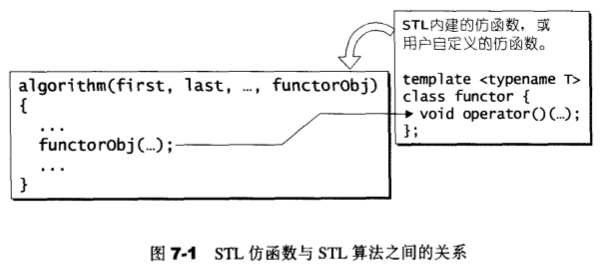

# 仿函数

[返回目录](README.md)

## 仿函数(functors)概观

函数对象: 一种具有函数特质的对象。

函数指针的缺点:函数指针不能满足STL对抽象性的要求，也不能满足软件积木的要求-函数指针无法和STL其他组件（如配接器adapter）搭配，产生更灵活的变化。

任何应用程序欲使用STL内建的仿函数，都必须包含<functional>头文件。

### STL仿函数分类
以操作数(operand)的个数分:

- 一元仿函数
- 二元仿函数

以功能划分:

- 算术运算(Arithmetic)
- 关系运算(Rational)
- 逻辑运算(Logical)

---

## 可配接(Adaptable)的关键

### unary_function
用来呈现一元函数的参数型别和返回值型别。

### binary_function
用来呈现二元函数的第一参数型别，第二参数型别，以及返回值型别。

---

## 算术类(Arthmetic)仿函数

- 加法: plus<T>
- 减法: minus<T>
- 乘法: multiplies<T>
- 除法: divides<T>
- 取模: modulus<T>
- 否定: negate<T>

### 证同元素(identity element)

所谓“运算op的证同元素(identity element)”，意思是数值A若与该元素做op运算，会得到A自己。加法的证同元素为0，因为任何元素加上0仍为自己。乘法的证同元素为1，因为任何元素乘以1仍为自己。

---

## 关系运算类(Relational)仿函数

- 等于: equal_to<T>
- 不等于: not_equal_to<T>
- 大于: greater<T>
- 大于或等于： greater_equal<T>
- 小于: less<T>
- 小于或等于： less_equal<T>

---

## 逻辑运算类(Logical)仿函数

- 逻辑运算 And: logical_and<T>
- 逻辑运算 Or： logical_or<T>
- 逻辑运算 Not： logical_not<T>

---

## 证同(identity),选择(select),投射(project)

