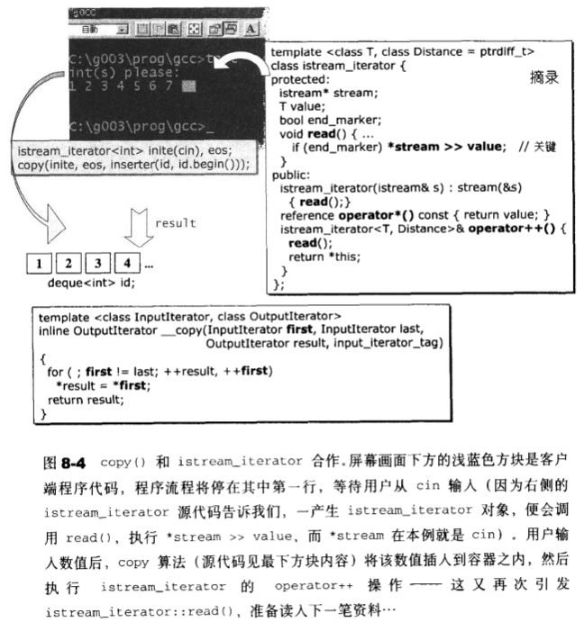

# 配接器

[返回目录](README.md)

## 配接器之概观与分类

- function adapter: 改变仿函数(functors)接口
- container adapter: 改变容器(containers)接口
- iterator adapter: 改变迭代器(iterators)接口

### 应用于容器,container adapters

### 应用于迭代器,iterator adapters

- Insert Iterators
> 将一般迭代器的赋值操作转变为插入操作。
> - back_insert_iterator
> - front_insert_iterator
> - insert_iterator

|辅助函数(helper function)|实际产生的对象|
|:--|:--|
|back_inserter(Container& x)|back_insert_iterator<Container>(x)|
|front_inserter(Container& x)|front_insert_iterator<Container>(x)|
|inserter(Container& x, Iterator i)|insert_iterator<Container>(x, Container::iterator(i))|

- Reverse Iterators

将一般迭代器的行进方向逆转，使原本应该前进的operator++编程后退操作，使原本应该后退的operator--变成前进操作。

- IOStream Iterators

将迭代器绑定到某个iostream对象身上。

### 应用于仿函数，functor adapters

是所有配接器中数量最庞大的一个族群。

这些配接操作包括:绑定，否定，组合以及对一般函数或成员函数的修饰；这些配接器的几口在<functional>。

通过它们之间的绑定，组合，修饰能力，几乎可以无限制地创造出各种可能的表达式。

**注意:所有期望获得配接能力地组件，本身都必须是可配接地(adaptable)。一元仿函数必须继承自unary_function，二元仿函数必须继承自binary_function,成员函数必须以mem_fun处理过，一般函数必须以ptr_fun处理过。一个未经ptr_fun处理过地一般函数，虽然也可以函数指针(pointer to function)地形式传给STL算法使用，却无法拥有任何配接能力。**

| 辅助函数(helper function)                                | 实际效果                   | 实际产生的对象                                     |
| -------------------------------------------------------- | -------------------------- | -------------------------------------------------- |
| bind1st(const Op& op, const T& x)                        | op(x, param)               | binder1st<Op>(op, arg1_type(x))                    |
| bind2nd(const Op& op, const T& x)                        | op(param, x)               | binder2nd<Op>(op, arg2_type(x))                    |
| not1(const Pred& pred)                                   | !pred(param)               | unary_negate<Pred>(pred)                           |
| not2(const Pred& pred)                                   | !pred(param1, param2)      | binary_negate<Pred>(pred)                          |
| compose1(const Op1& op1, const Op2& op2)                 | op1(op2(param))            | unary_compose<Op1,Op2>(op1, op2)                   |
| compose2(const Op1& op1, const Op2& op2, const Op3& op3) | op1(op2(param) op3(param)) | binary_compose<Op1,Op2,Op3>(op1, op2, op3)         |
| ptr_fun(Result(*fp)(Arg))                                | fp(param)                  | pointer_to_unary_function<Arg, Result>(fp)         |
| ptr_fun(Result(*fp)(Arg1, Arg2))                         | fp(param1 param2)          | pointer_to_binary_function<Arg1, Arg2, Result>(fp) |
| mem_fun(S (T::*f)())                                     | (param->*f)()              | mem_fun_t<S, T>(f)                                 |
| mem_fun(S (T::*f)() const)                               | (param->*f)()              | const_mem_fun_t<S,T>(f)                            |
| mem_fun_ref(S (T::*f)())                                 | (param->*f)()              | mem_fun_ref_t<S,T>(f)                              |
| mem_fun_ref(S (T::*f)() const)                           | (param->*f)()              | const_mem_fun_ref_t<S,T>(f)                        |
| mem_fun1(S (T::*f)(A))                                   | (param->*f)(x)             | mem_fun1_t<S,T,A>(f)                               |
| mem_fun1(S (T::*f)(A)const)                              | (param->*f)(x)             | const_mem_fun1_t<S,T,A>(f)                         |
| mem_fun1_ref(S (T::*f)(A))                               | (param->*f)(x)             | mem_fun1_ref_t<S,T,A>(f)                           |
| mem_fun1_ref(S (T::*f)(A)const)                          | (param->*f)(x)             | const_mem_fun1_ref_t<S,T,A>(f)                     |

- compose1和compose2不在c++标准规范之中

---

## container adapters

### stack

### queue

---

## iterator adapters

### insert iterators

### reverse iterators

### stream iterators

---

## function adapters
| 辅助函数(helper function) | 实际产生的配接器对象形式 | 内藏成员的型式 |
| ------------------------- | ------------------------ | -------------- |
| bind1st(const Op& op, const T& x)                        | binder1st<Op>(op, arg1_type(x)) | Op(二元仿函数)           |
| bind2nd(const Op& op, const T& x)                        | binder2nd<Op>(op, arg2_type(x))                   | Op(二元仿函数)          |
| not1(const Pred& pred)                                   | unary_negate<Pred>(pred)                          | Pred 返回布尔值的仿函数 |
| not2(const Pred& pred)                                   | binary_negate<Pred>(pred)                         | Pred 返回布尔值的仿函数 |
| compose1(const Op1& op1, const Op2& op2)                 | unary_compose<Op1,Op2>(op1, op2)                  | Op1, Op2                |
| compose2(const Op1& op1, const Op2& op2, const Op3& op3) | binary_compose<Op1,Op2,Op3>(op1, op2, op3)        | Op1, Op2, Op3           |
| ptr_fun(Result(*fp)(Arg))                                | pointer_to_unary_function<Arg, Result>(f)         | Result(*fp)(Arg)        |
| ptr_fun(Result(*fp)(Arg1, Arg2))                         | pointer_to_binary_function<Arg,  Arg2, Result>(f) | Result(*fp)(Arg1, Arg2) |
| mem_fun(S (T::*f)())                                     | mem_fun_t<S, T>(f)                                | S (T::*f)()             |
| mem_fun(S (T::*f)() const)                               | const_mem_fun_t<S, T>(f)                          | S (T::*f)() const       |
| mem_fun_ref(S (T::*f)())                                 | mem_fun_ref_t<S,T>(f)                             | S (T::*f)()             |
| mem_fun_ref(S (T::*f)() const)                           | const_mem_fun_ref_t<S,T>(f)                       | S (T::*f)() const       |
| mem_fun1(S (T::*f)(A))                                   | mem_fun1_t<S,T,A>(f)                              | S (T::*f)(A)            |
| mem_fun1(S (T::*f)(A)const)                              | const_mem_fun1_t<S,T,A>(f)                        | S (T::*f)(A) const      |
| mem_fun1_ref(S (T::*f)(A))                               | mem_fun1_ref_t<S,T,A>(f)                          | S (T::*f)(A)            |
| mem_fun1_ref(S (T::*f)(A)const)                          | const_mem_fun1_ref_t<S,T,A>(f)                    | S (T::*f)(A) const      |

### 对返回值进行逻辑否定: not1, not2

### 对参数进行绑定: bind1st, bind2nd

### 用于函数合成: compose1, compose2

### 用于函数指针: ptr_fun

### 用于成员函数指针: mem_fun, mem_fun_ref

