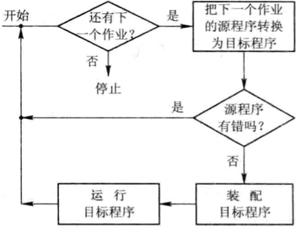

# 第一章 操作系统引论

[TOC]

## 操作系统的目标和作用

### 操作系统的目标

1. 有效性
   - 提高系统资源利用率
   - 提高系统的吞吐量
2. 方便性
3. 可扩充性
4. 开放性

### 操作系统的作用

1. OS作为用户与计算机硬件系统之间的接口

   OS处于用户与计算机硬件系统之间，用户通过OS来使用计算机系统；在OS帮助下，能够方便，快捷，安全，可靠的操纵计算机硬件和运行程序；

   

   *OS作为接口的示意图*

2. OS作为计算机系统资源的管理者

3. OS实现了对计算机资源的抽象

   

   *I/O软件隐藏了I/O操作实现的细节*

### 推动操作系统发展的主要动力

1. 不断提高计算机资源的利用率
2. 方便用户
3. 器件的不断更新换代
4. 计算机体系结构的不断发展
4. 不断提出新的应用需求

## 操作系统的发展过程

### 无操作系统的计算机系统

1. 人工操作方式

   人工操作的缺点：

   - 用户独占全机
   - CPU等待人工操作

2. 脱机输入/输出(Off-Line I/O)方式

   在主机的直接控制下进行输入/输出方式称为联机输入/输出（On-Line I/O）方式，主要优点如下：

   - 减少CPU的空闲时间
   - 提高了I/O速度

### 单道批处理系统(Simple Batch Processing System)

1. 单道批处理系统的处理过程：

   
   
   *单道批处理系统的处理流程*
   
2. 单道批处理系统的特征

   - 自动性
   - 顺序性
   - 单道性
   
2. 单道批处理系统的缺点

   - 系统中的资源得不到充分的利用
   
     
   
     *单道程序的运行情况*
   
   - 对内存的浪费

### 多道批处理系统(Multiprogrammed Batch Processing System)

1. 多道程序设计的基本概念

   

   *多道程序的运行情况*

2. 多道批处理系统的优缺点

   - 资源利用率高

   - 系统吞吐量大

     能提高系统吞吐量的主要原因为：

     1. CPU和其他资源保持“忙碌”状态
     2. 仅当作业完成时或运行不下去时进行切换时，系统开销小

   - 平均周转时间长

   - 无交互能力

3. 多道批处理系统需要解决的问题

   - 处理机管理问题
   - 内存管理问题
   - I/O设备管理问题
   - 文件管理问题
   - 作业管理问题
   - 用户与系统的接口问题
   
   我们把操作系统定义为：操作系统是一组控制和管理计算机硬件和软件资源，合理地对各类作业进行调度，以及方便用户使用的程序的集合。

### 分时系统(Time Sharing System)

1. 分时系统的产生

   分时操作系统（CTSS，Compatible Time Sharing System）与多道批处理系统之间有截然不同的性能差别，他能很好地将一台计算机提供给多个用户同时使用，提高计算机的利用率。它被经常应用于查询系统中，满足许多查询用户的需要。用户的需求具体表现在以下几个方面：

   - 人-机交互
   - 共享主机
   - 便于用户上机

2. 分时系统实现中的关键问题

   - 及时接收
   - 及时处理

3. 分时系统的特征

   分时系统的特征：

   - 多路性
   - 独立性
   - 及时性
   - 交互性

### 实时系统

1. 应用需求

   - 实时控制
   - 实时信息处理

2. 实时任务

   按任务执行时是否呈现周期性来划分：

   - 周期性实时任务
   - 非周期性实时任务

   根据对截止时间的要求来划分：

   - 硬实时任务（Hard real-time Task）
   - 软实时任务（Soft real-time Task）

3. 实时系统与分时系统特征的比较

   - 多路性
   - 独立性
   - 及时性
   - 交互性
   - 可靠性

### 微机操作系统的发展

1. 单用户单任务操作系统
   - CP/M
   - MS-DOS
2. 单用户多任务操作系统
3. 多用户多任务操作系统
   - Solaris OS
   - Linux OS

## 操作系统的基本特性

### 并发(Concurrence)

1. 并行与并发

   并行性是指两个或多个事件在同一时刻发生；

   并发性是指两个或多个事件在同一时间间隔内发生。

2. 引入进程

3. 引入线程

### 共享(Sharing)

共享（Sharing），是指系统中的资源可供内存中多个并发执行的进程（线程）共同使用，相应地，把这种资源共同使用称为资源共享，或称为资源复用。

1. 互斥共享方式
2. 同时访问方式

并发和共享是操作系统的两个最基本的特征，它们又是互为存在的条件。一方面，资源共享是以程序（进程）的并发执行为条件的，若系统不允许程序并发执行，自然不存在资源共享问题；另一方面，若系统不能对资源共享实施有效管理，协调好诸进程对共享资源的访问，也必然影响到程序并发执行的程度，甚至根本无法执行。

### 虚拟(Virtual)

1. 时分复用技术
   - 虚拟处理机技术
   - 虚拟设备技术
2. 空分复用技术
   - 虚拟磁盘技术
   - 虚拟存储器技术

如果虚拟的实现是通过时分复用的方法来实现的，即对某一物理设备进行分时使用，设N是某物理设备所对应的虚拟的逻辑设备数，则每台虚拟设备的平均速度必然等于或低于物理设备速度的1/N。类似的，如果是利用空分复用方法来实现虚拟，此时一台虚拟设备平局占用的空间必然也等于或低于物理设备所拥有空间的1/N。

### 异步(Asynchronism)

## 操作系统的主要功能

### 处理机管理功能

1. 进程控制
2. 进程同步
   - 进程互斥方式：指诸进程（线程）在对临界资源进行访问时，应采用互斥方式；
   - 进程同步方式：指在相互合作去完成共同任务的诸进程（线程）间，由同步机构对他们的执行次序加以协调；
3. 进程通信
4. 调度
   - 作业调度。作业调度的基本任务是从后备队列中按照一定的算法选择出若干个作业，为它们分配运行所需的资源，在将这些作业掉入内存后，分别为它们建立进程，使他们都成为可能获得处理机的就绪进程，并将它们插入就绪队列中。
   - 进程调度。进程调度的任务是从进程的就绪队列中按照一定的算法选出一个进程，将处理机分配给它，并为它设置运行现场，使其投入执行。

### 存储器管理功能

1. 内存分配

   内存分配的主要任务是为每道程序分配内存空间，提高存储器的利用率，以减少不可用的内存空间；允许正在运行的程序申请附加的内存空间，以适应程序和数据动态增长的需要。

   OS在实现内存分配时，在静态分配方式中，每个作业的内存空间是在作业装入时确定的；在作业装入后的整个运行期间，不允许该作业在申请新的内存空间。

   在动态分配方式中，每个作业所要求的基本内存空间也是在装入时确定的，但允许作业在运行过程中继续申请新的附加内存空间，以适应程序的数据的动态增长，也允许作业在内存中“移动”。

   为了实现内存分配，在内存分配的机制中应具有这样的结构和功能：

   - 内存分配数据结构。该结构用于记录内存空间的使用情况，作为内存分配的依据；
   - 内存分配功能。系统按照一定的内存分配算法为用户程序分配空间；
   - 内存回收功能。系统对于用户不再需要的内存，通过用户的释放请求去完成系统的回收功能；

2. 内存保护

   绝不允许用户程序访问操作系统的程序和数据；也不允许用户程序转移到非共享的其它用户程序中去执行。

3. 地址映射

4. 内存扩充

   系统必须具有内存扩充机制，用于实现下述功能：

   - 请求调入功能
   - 置换功能

### 设备管理功能

完成用户进程提出的I/O请求；为用户进程分配其所需的I/O设备：提高CPU和I/O设备的利用率；提高I/O速度；方便用户使用I/O设备。

1. 缓冲管理

   最常见的缓冲区机制有单缓冲机制，能实现双向同时传送数据的双缓冲机制；

2. 设备分配

3. 设备处理

### 文件管理功能

1. 文件存储空间的管理

2. 目录管理

3. 文件的读/写管理和保护

   1. 文件的读/写管理

   2. 文件保护

      为了防止系统中的文件被非法窃取和破坏，在文件系统中必须提供有效的存取控制功能，以实现下述目标：

      - 防止未经核准的用户存取文件；
      - 防止冒名顶替存取文件；
      - 防止以不正确的方式使用文件。

### 操作系统与用户之间的接口

1. 用户接口
   - 联机用户接口
   - 脱机用户接口
   - 图形用户接口
2. 程序接口

## OS结构设计

1. 无结构操作系统

2. 模块化结构OS

   - 模块化程序设计技术的基本概念

     

     *模块化结构的操作系统*

   - 模块的独立性

     衡量模块的独立性有以下两个标准：

     1. 内聚性，指模块内部各部分间联系的紧密程度。内聚性越高，模块的独立性越强。

     2. 耦合度，指模块间相互联系和相互影响的程度。显然，耦合度越低，模块的独立性越好。
   
   - 模块接口法的优缺点
   
     - 提高OS设计的正确性，可理解性和可维护性；
     - 增强OS的适应性；
     - 加速OS的开发过程；
   
2. 分层式结构OS

   - 分层式结构的基本概念
- 分层结构的优缺点：
     1. 易保证系统的正确性
  2. 易扩充和易维护性

### 客户/服务器模式

1. 客户/服务器模式的组成
   - 客户机
   - 服务器
   - 网络系统
2. 客户/服务器之间的交互
   1. 客户发送请求信息
   2. 服务器接收消息
   3. 服务器回送消息
   4. 客户机接收消息
3. 客户/服务器模式的优点
   1. 数据的分布处理和存储
   2. 便于集中管理
   3. 灵活性和可扩充性
   4. 易于改编应用软件

### 面向对象的程序设计

1. 面向对象技术的基本概念

   - 对象

   - 对象类

     在实践中，有许多对象可能标识的是同一类事物，每个对象具有自己的变量集合，而它们所具有的方法是相同的。

   - 继承

2. 面向对象技术的优点

   - 通过“重用”提高产品质量和生产率
   - 使系统具有更好的易修改性和易扩展性
   - 更易于保证系统的“正确性”和“可靠性”

### 微内核OS结构

1. 微内核操作系统的基本概念

   - 足够小的内核

     微内核通常用于：

     1. 实现与硬件紧密相关的处理
     2. 实现一些较基本的功能
     3. 负责客户和服务器之间的通信

   - 基于客户/服务器模式

     

     *在单机环境下的客户/服务器模式*

   - 应用“机制与策略分离”原理

     机制：指实现某一功能的具体执行机构

     策略：在机制的基础上，借助于某些参数和算法来实现该功能的优化，或达到不同的功能目标

     通常机制处于一个系统的基层，策略处于系统的高层；

   - 采用面向对象技术

2. 微内核的基本功能

   - 进程（线程）管理
   - 低级存储器管理
   - 中断和陷入处理

3. 微内核操作系统的优点

   - 提高了系统的可扩展性
   - 增强了系统的可靠性
   - 可移植性
   - 提供了对分布式系统的支持
   - 融入了面向对象技术

4. 微内核操作系统存在的问题

   在完成一次客户对OS提出的服务请求时，需要利用消息实现多次交互和进行用户/内核模式及上下文的多次切换

   由于客户和服务器及服务器和服务器之间的通信，都需要通过微内核，致使同样的服务请求至少需要进行4次上下文切换：

   - 第一次发生在客户发送请求消息给内核，以请求取得某服务器特定的服务时；
   - 第二次是发生在由内核把客户的请求消息发往服务器时；
   - 第三次是当服务器完成客户请求后，把响应消息发送到内核时；
   - 第四次是在内核将响应消息发送给客户时；

   

   *在传统OS和微内核OS中的上下文切换*

