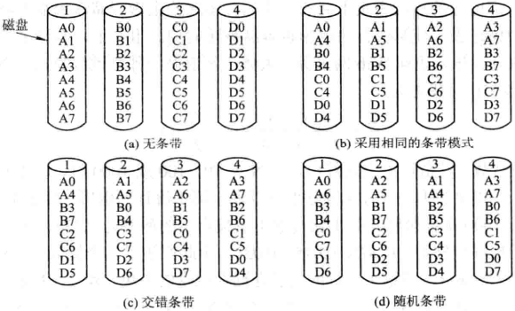

# 第十一章 多媒体操作系统

[TOC]

## 11.1 多媒体系统简介

### 11.1.1 多媒体的概念

1. 数据，信息与媒体
2. 媒体的分类
   - 感觉媒体；
   - 表示媒体；
   - 呈现媒体；
   - 存储媒体；
   - 传输媒体；
   - 交换媒体。
3. 多媒体

### 11.1.2 超文本和超媒体

1. 超文本(hypertext)
2. 超链接(hyperlink)
3. 超媒体(Hypermedia)

### 11.1.3 多媒体文件的特点

1. 多样性
2. 极高的数据率
3. 实时性
4. 集成性
5. 交互性

### 11.1.4 多媒体硬件与软件系统

1. 多媒体硬件系统的组成
   - 多媒体主机；
   - 多媒体输入设备；
   - 多媒体输出设备；
   - 多媒体存储设备；
   - 多媒体接口卡；
   - 人机交互设备。
2. 声卡(sound card)
3. 视频卡(video card)
4. 数码相机
5. 数码摄像机
6. 智能传感器
7. 多媒体软件系统

## 11.2 多媒体文件中的各种媒体

### 11.2.1 音频信号

1. 模拟音频和数字音频

   - 模拟音频；

   - 数字音频

     模/数转换分为以下步骤：

     - 采样：每隔一定的时间间隔，在模拟音频的波形上取得一个幅值；
     - 量化：将幅值转化为二进制的位序列；
     - 编码：对数据进行压缩和编码，然后形成文件。

2. 数字音频文件类型

   - WAV
   - MIDI
   - MPEG
   - APE

### 11.2.2 图像

1. 图像的数字表示
2. 图像的属性
   - 分辨率
     - 图像分辨率
     - 显示器分辨率
   - 色彩深度
   - 真/伪彩色
3. 图像文件格式
   - BMP格式
   - GIP格式
   - TIFF格式
   - JPEG格式

### 11.2.3 视频信号

1. 模拟视频
   - 彩色电视的制式
     - NTSC制式
     - PAL制式
     - SECAM制式
   - 隔行扫描和逐行扫描
2. 数字视频
3. 视频文件格式
   - MPEG文件格式
   - GIF文件格式
   - AVI文件格式

### 11.2.4 多媒体数据压缩及其标准

1. 数据压缩和解压缩

   压缩与解压缩间允许存在不对称性，原因如下：

   - 在许多情况下，一个多媒体只需要一次压缩，但却需要经常解压缩。
   - 压缩与解压缩并不需要是完全可逆的，即当一个多媒体文件被压缩后，再对它进行解压缩时，没有必要与原始文件精确一致，允许存在着某些轻微的差异，这样可获得更好的压缩效果。

2. 静止图像的压缩标准

   - JPEG(Joint Photographic Exports Group)；

3. 运动图像的压缩算法

   - MPEG(Motion Picture Exports Group)；

4. 运动图像的压缩标准

   - MPEG-1标准；
   - MPEG-2标准；
   - MPEG-3标准。

5. 音频压缩标准

## 11.3 多媒体进程管理中的问题和接纳控制

### 11.3.1 实时任务的处理需求和描述

1. 实时任务的处理需求

   - 多媒体进程管理，应能保证在系统中运行的所有硬实时HRT人物的截止时间要求，而且是在每一个周期里都提供这样的保证，否则会引起难以预料的后果。
   - 对在系统中运行的软实时SRT任务，进程管理应当保证它们的大多数截止时间要求，仅对极少数的截止时间要求，进程管理如不能保证，其所引发的后果并不会十分严重。
   - 当系统中有硬实时任务时，决不允许出现优先级倒置的情况，这样才能保证硬实时任务的截止时间需求。如果系统中仅有软实时任务，则只允许很少出现优先级倒置的情况，以便能保证软实时的任务的大多数截止时间。
   - 实时任务的处理时间，不仅包含每个周期对实时任务本身的处理时间，还应包含为调度每一个任务所花费的时间，因此，应尽量减少实时调度所付出的开销。

2. 软实时任务的时间特性描述

   

   *周期任务的时间特性*

### 11.3.2 多媒体进程管理中必须解决的问题

1. 同时运行不同类型的软实时任务
2. 支持软实时任务和非实时任务同时运行
3. 提供适当的进程接纳机制
4. 采用实时调度算法
   - 速率单调算法；
   - 最先截止时间优先算法。

### 11.3.3 软实时任务的接纳控制

1. SRT任务带宽和尽力而为任务带宽
   - SRT任务带宽；
   - 尽力而为任务带宽。
2. 接纳控制
3. CPU代理进程
4. 预留策略
   - 预留模式
     - 立即预留，一旦预留请求到达，CPU代理立刻为之服务，如果被接纳，便立即将它放入就绪队列；
     - 高级预留，在这种预留模式中，请求进程不仅要给进程的运行周期和利用率，还需给出任务处理的开始时间和结束时间，CPU代理需要保留当前和未来的许多预留信息，并考虑到调度情况，做好接纳控制。这样才有可能准确地估算出可以同时运行的SRT任务。
   - 基于服务质量参数范围的预留
     - 最小预留策略，基于最小的服务质量参数所产生的接纳控制，该策略比较适合于数据率比较稳定的进程，如动画。
     - 平均预留策略，基于平均的服务质量参数所产生的接纳控制，该策略比较适合于数据偶尔出现差错的多媒体任务。
     - 最大预留策略，基于最高的服务质量参数所产生的接纳控制，该策略可以保证所有实时人物的截止时间，即它可以获得最好的实时性保证。
   - 预留排序
     - 按先来先服务策略排序，先到达的请求进程优先获得服务。
     - 按优先级排序，根据进程的优先级大小依次为所有请求进程进行服务。

## 11.4 多媒体实时调度

### 11.4.1 最简单的实时调度方法

为电影所建立的进程可具有相同的周期和处理时间，可将它们按FCFS原则排成一个进程就绪队列，并采用定时轮转的策略来调度和运行它们。

### 11.4.2 速率单调调度(Rate Monotonic Scheduling, RMS)算法

RMS算法是一个静态的，优先级驱动的算法，适用于抢占式优先级调度方式以及实时任务是周期性的情况。在采用该算法时i，系统中的进程应满足如下条件：

- 在系统中允许同时存在周期性进程和非周期性进程，所有周期性任务具有固定的周期；
- 所有的进程之间相互独立，互不依赖；
- 对于周期性进程而言，所有进程在一个周期中，所需完成的工作量是相同的，而且任务还必须在周期内完成，不会影响到下一个周期的任务。

1. 优先级的确定

   在利用速率单调调度算法进行实时调度的系统中，代理进程将根据各个进程的请求速率（周期时间的倒数），分配给每一个进程一个静态优先级，该优先级在整个运行期间不变。

2. 调度算法能否有效调度的衡量

   调度算法是否能有效调度的衡量标准是：能否满足所有进程的截止时间要求。
   
   
   
   *周期性任务的时序图*
   
   - $P_i$ 进程；
   - $T_i$ 进程周期时间；
   - $C_i$ 进程需的处理机时间总量；
   - $U_i = C_i / T_i$ 进程的处理机使用率。
   
   对于任何周期性进程系统，如果能保持下面不等式成立，就可以保证RMS算法正确工作：
   
   $\frac{C_1}{T_1} + \frac{C_2}{T_2} + ... + \frac{C_n}{T_n} \leq n(2^{1/n} - 1)$
   
3. RMS算法实例
   
   
   
   *RMS实时调度例子*
   
### 11.4.3 EDF算法与RMS调度算法的比较

1. 用RMS算法调度失败举例

2. 用EDF算法调度成功举例

   

   *用RMS和EDF进行调度*

   如果系统中的多个实时进程的处理及总利用率低于RMS调度上限的限制时，可以选用RMS算法，否则应选用EDF算法。

3. RMS与EDF算法的比较

   |                | RMS                                                          | EDF                                                          |
   | -------------- | ------------------------------------------------------------ | ------------------------------------------------------------ |
   | 处理机的利用率 | 处理机的利用率存在着一个上限，它随进程数的增加而减少，逐渐趋于最低的上限为0.693。 | 可以达到100%的处理及利用率。                                 |
   | 算法复杂度     | RMS算法比较简单，计算出的每一个进程的优先级，在任务运行期间通常不会改变。 | EDF算法开销较大，因为它所依据的是动态优先级，它会不断地改变，每次调度时都需要先计算所有进程截止时间的大小，再从中选择最小的。 |
   | 调度的稳定性   | 易于保证调度的稳定性，只需要赋予重要进程较高的优先级，使之在进程整个运行期间都能保证优先获得处理机。 | 由于所依据的截止时间是动态的，截止时间在运行期间不断变化，因此很难使最重要进程的截止时间得到保证。 |

## 11.5 媒体服务器的特征和接纳控制

### 11.5.1 媒体服务器的特征

1. 多媒体文件的多种媒体性

   

   *一部电影所包含的多种媒体的文件*

2. 拉型和推型文件服务器

   

   *拉型服务器和推型服务器*

3. 多媒体文件的存储空间分配方式

   对多媒体文件主要采用连续分配方式，但这样会引起较多的内部和外部碎片（用空间换时间）。

4. 人机交互性

### 11.5.2 存储器管理中的接纳控制

1. 存储器页面锁定功能

   将SRT任务运行时所需代码和数据锁定在物理内存中，可避免发生缺页中断情况；此做法将减少内存的可用空间，导致系统综合性能降低，因此操作系统一般只允许最多60%~70%的内存空间分配给SRT任务。

2. 存储器代理

   - 接纳存储空间，这部分已经废配给了被接纳的SRT任务，正在使用；
   - 可利用存储空间，即可供新的预留请求使用的存储空间。

   SRT任务在进入系统后，必须向存储器代理声明，请求其运行时所需要的内存数量，存储器代理将对请求进行如下检查：$所请求的存储空间 \leqslant 可用存储空间$，条件成立时才为它预留存储空间，否则拒绝接纳。

3. 存储器控制器

### 11.5.3 媒体服务器的接纳控制

1. 媒体服务器的服务质量
   - 确定型的保证。
   - 统计型的保证。
   - 尽力而为型保证。
2. 接纳控制

## 11.6 多媒体存储器的分配方法

### 11.6.1 交叉连续存放方式

1. 多媒体文件存放中的问题

2. 交叉连续存放方式

   

   *交叉连续存放方式*

### 11.6.2 帧索引存放方式

为了克服交叉连续存放方式的缺点，引入了两种索引存放方式：

- 帧索引存放方式，又称为小盘块法；
- 块索引存放方式，又称为大盘块法。

1. 帧索引存放方式的基本原理

   

   *索引存放方式*

2. 帧索引存放方式的性能分析

   - 支持随机访问；由于采用了帧索引表，该方式能很好的支持随机访问。
   - 关于快进，快退问题：帧索引存放方式可以支持快进，但效果不一定好。
   - 磁盘碎片较小：在采取帧索引存放方式时，对每一帧采用连续存放方式，最后一个盘块可能会有一些空闲空间。
   - 帧索引表大：帧索引表不仅要占用磁盘空间，而且在播放时还需将它调入内存，这样又会占用很大的内存空间。
   - 缓存管理简单：可以采用双缓冲方式，可以提高磁盘的输出速度。
   - 存储管理复杂。

### 11.6.3 块索引存放方式

1. 块索引存放方式的基本原理
2. 块索引存放方式的性能分析
   - 支持随机访问：块索引存放方式虽然可以实现随机访问，但要比帧索引存放方式复杂。
   - 磁盘碎片较大：当盘块中的存储空间不足以装下后面一帧时，可以采取两种处理方法：
     - 一帧跨越两个盘块，该方法是继续装入下一帧，直到大盘块全部装满，剩余部分在装入下一个盘块。
     - 让剩余部分空闲，只要不能装下后面一帧，便让剩余的空间空着，由此会形成磁盘空间的浪费，称为内部碎片。
   - 块索引表小：在采取大盘块方式时，需要为每一块设置一个块索引表项。
   - 缓冲管理复杂。

### 11.6.4 近似视频点播的文件存放

1. 近似视频点播(near video on demand)

   近似视频点播是视频点播的一种近似，它是每隔一定时间开始一次播放。

   

   *近似视频点播的数据流图*

   在采用近似视频点播时需要考虑两个问题：

   - 间隔时间大小。
   - 用户数的多少。

2. 近似视频点播的文件存放

   

   *近似视频点播的文件存放*

### 11.6.5 多部电影的存储方法

1. 单个磁盘的情况

   Zipf定律：$\frac{C}{1} + \frac{C}{2} + \frac{C}{3} + \frac{C}{4} + ... + \frac{C}{N} = 1$；越流行的的电影越容易被访问到。
   
   
   
   *多部电影按管风琴算法分布*
   
2. 多个磁盘情况

   

   *在多个磁盘上的存放方式*

## 11.7 高速缓存与磁盘调度

### 11.7.1 高速缓存

1. 块高速缓存

2. 将两条视频流合并

   

   *将两条视频流合并*

3. 文件高速缓冲

### 11.7.2 静态磁盘调度

在多媒体系统中对磁盘调度提出了比传统OS更为严格的要求，其主要原因是：

- 多媒体文件的数据量特别大，相应地要求数据传输速率也非常高；
- 为了保证电影地播放质量，要求具有很高的实时性；
- 对于一台视频服务器，可能要同时处理成百上千地用户请求。

1. 可预测性

2. 按磁道顺序排序

   

   *磁盘请求的处理顺序*

### 11.7.3 动态磁盘调度

1. 动态磁盘调度算法应考虑的因素

   - 令磁盘总寻道时间最小，这是性能因素。为使磁盘的总寻道时间最小，在电梯调度算法中需要根据磁盘请求中的磁道号来排序；
   - 能满足截止时间要求，这是实时因素。为使电影的播放质量能满足用户的要求，应在截止时间前向用户提供所需的数据。

2. sacn-EDF算法

   

   *scan-EDF算法示意图*

