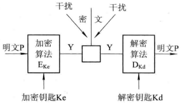
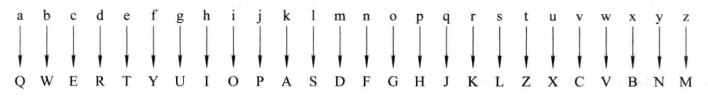
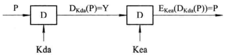
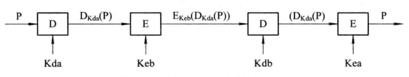
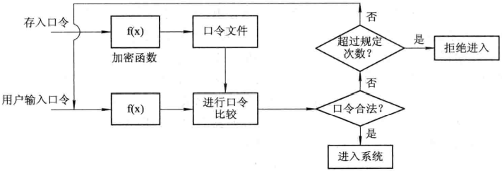
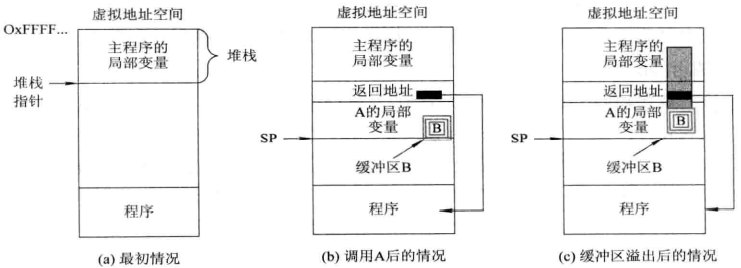
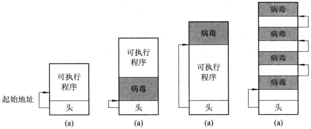
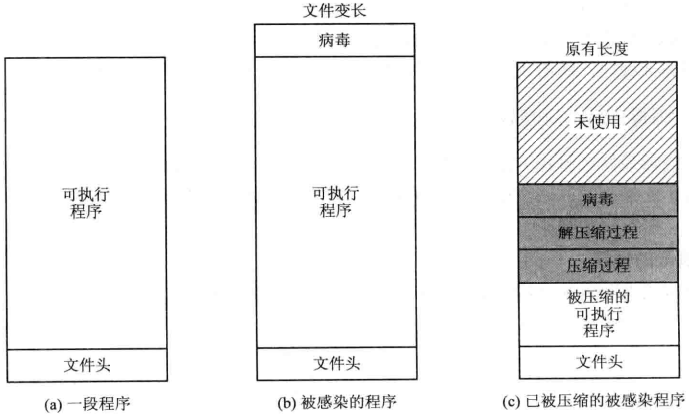
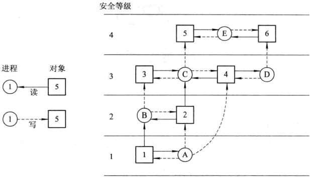
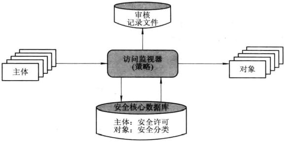

# 第十二章 保护和安全

[TOC]


## 12.1 安全环境

### 12.1.1 实现“安全环境”的主要目标和面临的威胁

1. 数据机密性(data secrecy)

   数据机密性是指将机密的数据置于保密状态，仅允许被授权用户访问系统中的薪资，以避免数据暴露。

2. 数据完整性(data integrity)

   完整性是指对数据或资源的可信赖程度，包括数据的完整性（信息内容）和来源的完整性（数据来源），通常用于表述防止不当或未经授权的修改。

3. 系统可用性(system availability)

   可用性是指保证计算机中的资源供授权用户随时访问，系统不会拒绝服务。

### 12.1.2 系统安全的特征

1. 多面性
   - 物理安全：是指系统设备及相关设施应得到无力保护，使之免遭破坏或丢失；
   - 逻辑安全：是指系统中信息资源的安全，它又包括数据机密性，数据完整性和系统可用性三个方面；
   - 安全管理：包括对系统各种安全管理的策略和机制。
2. 动态性
   - 信息的时效性；
   - 攻击手段的不断翻新。
3. 层次性
4. 适度性
   - 由于系统安全的多面性，使对安全问题的全面覆盖基本上不可能实现；
   - 实现全覆盖所需的成本也是难以令人接受的；
   - 由于系统安全的动态性，即使当时实现了安全问题的全覆盖，随着计算机技术的迅速发展，企业规模的不断扩大，必然很快就会出现新的问题。

### 12.1.3 计算机安全的分类

`信息技术安全评价公共准则(CC)`作为国际标准，为相互独立的机构对相应信息技术安全产品进行评价提供了可比性。

1. CC的由来
2. 计算机安全的分类
   - $D$类：最低安全类别，又称为安全保护欠缺级，该类安全等级只包括一个最低安全等级$D_1$。凡是无法达到另外三类标准要求的，都被归为D类。
   - $C_1$级：组合了若干种安全控制，其可信任运算基础体制(Trusted Computing Base, TCB)通过将用户和数据分离，以达到安全的目的。
   - $C_2$级：称为受控存取控制级，是在$C_1$级基础上，增加了一个个层访问控制，加强了可调的审慎控制。
   - $B_1$级：可将安全标注分为四级：内部级，秘密级，机密级和绝密级，系统为每个可控用户和对象（如文件）分别赋予一张某级别的安全标注；
   - $B_2$级：$B_2$级包含了$B_1$级的全部安全属性。$B_2$级要求系统必须采用自上而下的结构化设计方法，并能够对设计方法进行检验，能对可能存在的隐藏信道进行安全分析。
   - $B_3$级：$B_3$级包含了$B_2$级的全部安全属性。在B_3$级中必须包含有用户和组的访问控制表ACL，足够的安全审计和灾难恢复能力。此外，系统中必须包含TCB，由它来控制用户对文件的访问，使其免遭非授权用户的非法访问。
   - $A_1$级：$A_1$级是最高的安全级别，目前A类安全等级只包含$A_1$一个安全类别。$A_1$类与$B_3$类相似，对系统的结构和策略不作特别要求。$A_1$系统要求具有强制存取控制和形式化模型技术的应用，能证明模型是正确的，并需说明有关实现方法是与保护模型一致的。另外还必需对隐蔽信道做形式上的分析。


## 12.2 数据加密技术

### 12.2.1 数据加密原理

1. 数据加密模型

   

   *数据加密模型*

   - `明文` 被加密的文本称为明文P；
   - `密文` 加密后的文本称为密文Y；
   - `加密(解密)算法E(D)` 用于实现从明文（密文）到密文（明文）转换的公式，规则或程序；
   - `密钥K` 密钥是加密和解密算法中的关键参数。

2. 基本加密方法

   - 易位法

     按照一定的规则，重新安排明文中的比特或字符的顺序来形成密文，而字符本身保持不变。

     按易位单位的不同，可分为：

     - 比特易位；

     - 字符易位：利用密钥对明文进行易位后形成密文。

       

       *按字符易位加密算法*

   - 置换法

     按照一定的规则，用一个字符去置换（替代）另一个字符来形成密文。

     
     
     *26个字母的映象*
     
### 12.2.2 对称加密算法与非对称加密算法

1. 对称加密算法

   最具代表性的对称加密算法是 数据加密标准(<u>Data Encryption Standard</u>, DES)，ISO将DES作为数据加密标准。

   在DES中所使用的密钥长度为64位，它由两部分组成，一部分是实际密钥，占56位；另一部分是8位奇偶校验码。DES术语分组加密算法，它将明文按64位一组分成若干个明文组，每次利用56位密钥对64位的二进制明文数据进行加密，产生64位密文数据。

2. 非对称加密算法

   非对称加密算法的加密密钥$Ke$和解密密钥$Kd$不同，而且难以从$Ke$推导出$Kd$来，故而可将其中的一个密钥公开而成为公开密钥，故该算法也可称为公开密钥算法。

   特点如下：

   - 设加密算法为$E$，加密密钥为$Ke$，可利用它们对明文$P$进行加密，得到$E_{ke}(P)$密文。设解密算法为$D$，解密密钥为$Kd$，可利用它们将密文恢复为明文，即：

     $D_{Kd}(E_{Ke}(P)) = P$

   - 要保证从$Ke$推出$Kd$是极为困难的，或者说，从$Ke$推出$Kd$实际上是不可能的；

   - 在计算机上很容易产生成对的$Ke$和$Kd$；

   - 加密和解密运算可以对调，即利用$D_{kd}$对明文进行加密形成密文，然后用$E_{Ke}$对密文进行解密，即：

     $E_{Ke}(D_{Kd}(P)) = P$

### 12.2.3 数字签名和数字证明书

1. 数字签名

   数字签名能代替传统签名必须满足的条件：

   1. 接收者能够核实发送者对报文的签名；
   2. 发送者时候不能抵赖对报文的签名；
   3. 接收者无法伪造对报文的签名。

   常见的数字签名方法：

   - 简单数字签名

     

     *简单数字签名示意图*

     1. 接收者能利用$A$的公开密钥$Kea$对$D_{Kda}(P)$进行解密，这便证实了发送者对报文的签名；
     2. 由于只有发送者$A$才能发送出$D_{Kda}(P)$密文，故不容$A$进行抵赖；
     3. 由于$B$没有$A$所拥有的私用密钥，故$B$无法伪造对报文的签名。

   - 保密数字签名

     

     *保密数字签名*

     1. 发送者$A$可用自己的私用密钥$Kda$对明文$P$加密，得到密文$D_{Kda}(P)$；
     2. $A$再用$B$的公开密钥$Keb$对$D_{Kda}(P)$进行加密，得到$E_{Keb}(D_{Kda}(P))$后发送$B$；
     3. $B$收到后，先用私用密钥$Kdb$进行解密，即$D_{Kdb}(E_{Keb}(D_{Kda}(P))) = D_{Kda}(P)$；
     4. $B$再用$A$的公开密钥$Kea$对$D_{Kda}(P)$进行解密，得到$E_{Kea}(D_{Kda}(P)) = P$。

2. 数字证明书(Certificate)


## 12.3 用户验证

当前身份验证主要依据下述方面的信息来确定：

- `所知（knowledge）`即基于用户所知道的信息，如系统的登录名，口令等；
- `所有（possesses）`指用户所具有的东西，如身份证，信用卡等；
- `用户特征（characteristics）`指用户所具有的特征，特别是生理特征，如指纹，声纹，DNA等。

### 12.3.1 使用口令验证

1. 口令

2. 提高口令安全性的方法

   - 口令应适当长；
   - 应采用多种字符；
   - 自动断开连接；
   - 回送显示的安全性；
   - 记录和报告。

3. 一次性口令（One time Password）

4. 口令文件

   

   *对加密口令的验证方法*

   对口令加密的主要威胁：

   1. 当攻击者已掌握了口令的解密密钥时，就可用它来破译口令；
   2. 可利用加密程序来破译口令。

5. 挑战-响应验证

   用户选择一个算法，并将该算法告知服务器。每当用户登录时，服务器就给用户发来一个随机数，用户收到后，按所选算法对该数据进行运算，并用它作为口令。服务器将所受到的口令与自己计算的结果进行比较，从而对用户行为进行控制。

### 12.3.2 基于物理标志的验证技术

1. 基于磁卡的验证技术

2. 基于IC卡的验证技术

   IC卡分为以下类型：

   - 存储器卡；
   - 微处理器卡；
   - 密码卡。

### 12.3.3 生物识别验证技术

1. 常用于身份识别的生理标志
   - 足够的可变化；
   - 应保持稳定；
   - 不易被伪装。
2. 生物识别系统的组成
   1. 对生物识别系统的要求
      - 性能需求；
      - 易于被用户接受；
      - 成本合理。
   2. 生物识别系统的组成
      - 生物特征采集器；
      - 注册部分；
      - 识别部分。
3. 指纹识别系统
   - 指纹采集传感器；
   - 指纹识别系统。


## 12.4 来自系统内部的攻击

内部攻击一般是指攻击来自系统内部，可分为两类：

- 以合法用户身份直接进行攻击；
- 通过代理功能进行简介攻击。

### 12.4.1 早期常采用的攻击方式

1. 窃取尚未清除的有用信息。
2. 通过非法的系统调用搅乱系统。
3. 使系统自己封杀校验口令程序。
4. 尝试许多在明文规定中不允许做的操作。
5. 在OS中增添陷阱们。
6. 骗取口令。

### 12.4.2 逻辑炸弹和陷阱门

- 独立运行类：它可以通过OS调度执行。
- 寄生类：它本身不能独立运行，经常是寄生在某个应用程序中。

1. 逻辑炸弹（logic bomb）
   - 逻辑炸弹实例
   - 逻辑炸弹爆炸的条件
     - 时间触发；
     - 事件触发；
     - 计数器触发。
2. 陷阱门（trap door）
   - 陷阱门的基本概念
   - 陷阱门实例

### 12.4.3 特洛伊木马和登录欺骗

1. 特洛伊木马(trojan horses)的基本概念
2. 特洛伊木马实例
3. 登录欺骗（login spoofing）

### 12.4.4 缓冲区溢出

由于编译器存在某些漏洞，它对数组不进行边界检查；例：

```C
int i;
char C[1024];
i = 12000;
c[i] = 0; // 有10976个字节超出数组C所定义的范围
```



*缓冲区溢出前后的情况*


## 12.5 来自系统外部的攻击

### 12.5.1 病毒，蠕虫和移动代码

1. 病毒（viruses）

   计算机病毒是一段程序，它能把自己附加在其它程序中，并不断地自我复制，然后去感染其他程序，它能由被感染的程序的系统传播出去。

2. 蠕虫（worms）

   蠕虫与病毒相似，也能进行自我复制，并可传染给其它程序，给系统带来有害的影响。

   与病毒地区别：

   - 蠕虫本身是一个完整的程序，能作为一个独立地进程运行，不需要寄生在其他程序上；
   - 蠕虫地传播性没有病毒强，蠕虫必须先找到OS或其它软件的缺陷，才能基于缺陷进行传播。

3. 移动代码

   - 移动代码简述

     在网络上，如果能在远程计算机上执行代码，便认为系统具有远程执行功能；如果一个程序在运行时，能在不同机器之间来回迁移，那么该程序就被称为移动代码。

   - 移动代码的地安全运行

   - 防范移动代码的方式 - 沙盒法

     沙盒法的基本思想是采用隔离方法。具体做法是把虚拟地址空间，分为若干个相同大小的区域，每个区域称为一个沙盒。将不可信程序放入一个沙盒中运行，如果发现盒内程序要访问盒外的数据，或者有跳转到盒外某个地址去运行的任何企图，提供将停止该程序的运行。

   - 防范移动代码的方法 - 解释法

     每一条语句在执行前都经解释器检查，若移动代码是可信的（来自本地硬盘），就按正常情况进行处理；否则，就将它放入沙盒中来限制它的运行。

### 12.5.2 计算机病毒特征和类型

1. 计算机病毒的特征

   - 寄生性；
   - 传染性；
   - 隐蔽性：
     - 伪装成正常程序；
     - 隐藏在正常程序中或程序不太去访问的地方；
     - 病毒自身不断地改变状态或产生成千上万种状态等。
   - 破坏性。

2. 计算机病毒的类型

   - 文件型病毒；

     

     *病毒附加在文件中的情况*

   - 内存驻留病毒；

   - 引导扇区病毒：

     - 迁移型病毒：把真正的引导扇区复制到磁盘的安全区域，以便在完成操作后仍能正常引导操作系统；
     - 替代型病毒：取消被入侵扇区的原有内容，而将磁盘必须用到的程序段和数据融入到病毒程序中。

   - 宏病毒；

   - 电子邮件病毒。

### 12.5.3 病毒的隐藏方式

1. 伪装

   - 通过压缩法伪装；

     当病毒为附加到某个文件上后，会使文件长度边长；病毒通过压缩技术使被感染病毒的文件长度与原有文件的长度一致，以达到伪装目的。

     

     *病毒伪装示意图*

   - 通过修改日期或时间来伪装；

     被感染病毒的文件在文件日期和时间上有所改变，病毒程序修改被感染病毒文件的日期和时间，使之与原文件相同，以达到伪装目的。

2. 隐藏

   - 隐藏于目录和注册表空间。
   - 隐藏于程序的页内零头里。
   - 更改用于磁盘分配的数据结构。
   - 更改坏扇区列表。

3. 多形态

   - 插入多余的指令。
   - 对病毒程序进行加密。

### 12.5.4 病毒的预防和检测

1. 病毒的预防
   - 对于重要的软件和数据，应当定期备份到外部存储介质上，当发现病毒后可用该备份来取代被感染的文件；
   - 使用具有高安全性的OS；
   - 使用正版软件；
   - 购买性能优良的反病毒软件，按照规定使用，并定期升级；
   - 对于来历不明的电子邮件不要轻易打开；
   - 要定期检查硬盘及U盘，用反病毒软件来清除其中的病毒。
2. 基于病毒数据库的病毒检测方法
   - 建立病毒数据库；
   - 扫描硬盘上的可执行文件。
3. 完整性检测方法


## 12.6 可信系统(Trusted System)

### 12.6.1 访问矩阵模型和信息流控制模型

1. 安全策略

   根据系统对安全的需求所定义的一组规则及相应的描述。该规则决定了对系统中数据进行保护的规则和规定每一个用户权限的规则。

2. 安全模型

   用于精确描述系统的安全需求和策略。安全模型首先应当是精确的，同时也应当是简单和容易理解的，而且不涉及安全功能的具体实现细节。

3. 访问矩阵模型

   也称为保护矩阵；系统中的每一个主体（用户）都拥有矩阵中的一行，每个客体（程序/文件/设备）都拥有矩阵中的一列。矩阵中的交叉项用于表示主体对客体的存取权限集。

4. 信息流控制(information flow control)模型

   对访问矩阵模型的补充，用于监管信息在系统中流通的有效路径，控制着信息流从一个实体沿着安全途径流向另一个实体。

   

   *Bell-La Padula模型*

   Bell-La Padula模型把信息分为四等：内部级（U），秘密级（C），机密级（S）和绝密级（TS）；同时对信息的流动做出如下规定：

   - 不能上读：在密级k层中运行的进程，只能读相同或更低密级层中的对象。
   - 不能下写：在密级k层中运行的进程，只能写相同或更高密级层中的对象。

### 12.6.2 可信计算基TCB（Trusted Computing Base）

1. 可信计算基的功能

   

   *可信任计算基TCB*

2. 安全核心数据库

   - 访问控制模型：用于实现对用户访问文件的控制，其中列出了每个主体的访问权限和每个对象的保护属性。
   - 信息流控制模型：用于控制信息流从一个实体沿着安全的途径流向另一个实体。

3. 访问监视器

   - 完全仲裁；
   - 隔离；
   - 可证实性。

### 12.6.3 设计安全操作系统的原则

1. 微内核原则

   - 它不仅提供OS最核心的功能，如进程切换，内存映射等功能，还是实现整个OS安全机制的基础。使安全内核成为一个可信任计算基。
   - 在通常的微内核中，进入微内核的入口有多个，而在安全系统中，系统的其他部分与安全内核之间仅提供了唯一的安全接口。

2. 策略与机制分离原则

3. 安全入口原则

   为确保安全内核的安全，在安全内核与其他部分之间，只提供唯一的安全接口；凡是要进入安全内核进行访问者，都必须接受严格的安全检查。

4. 分离原则

   - 物理分离；
   - 时间分离；
   - 密码分离；
   - 逻辑分离。

5. 部分硬件实现原则

   - 提高处理速度；
   - 确保系统的安全性。

6. 分层设计原则。
