# 第二章 进程的描述与控制

[TOC]


## 前趋图和程序执行

### 前趋图

`前趋图（Precedence Graph）` 指一个有向无循环图，可记为DAG(Directed Acyclic Graph)，它用于描述进程之间执行的先后顺序。

进程（或程序）之间的前趋关系可用“$\rightarrow$”来表示，如果进程$P_i$和$P_j$存在着前趋关系，可表示为$(P_i, P_j)\in \rightarrow$，也可写成$P_i \rightarrow P_j$，表示在$P_j$开始执行之前$P_i$必须完成。此时称$P_i$是$P_j$的直接前趋，而称$P_j$是$P_i$的直接后继。

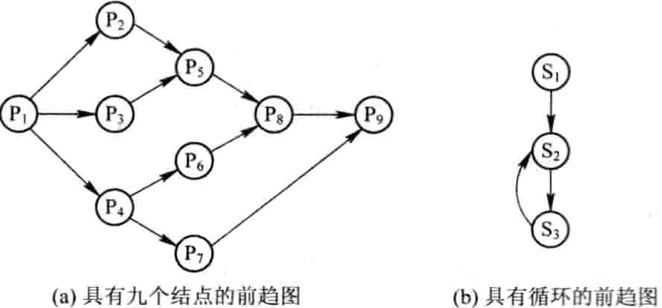

*前趋图*

### 程序顺序执行

1. 程序的顺序执行

   

   *程序顺序执行的前趋图*

   - $S_1: a := x + y;$
   - $S_2: b := a - 5;$
   - $S_3: c := b + 1;$

   三条语句存在着这样的前趋关系：$S_1 \rightarrow S_2 \rightarrow S_3$

2. 程序顺序执行时的特征

   在程序顺序执行时，具有这样三个特征：

   - `顺序性` 
   - `封闭性` 
   - `可在现性`

### 程序并发执行

1. 程序的并发执行

   例，四条语句的前趋关系：

   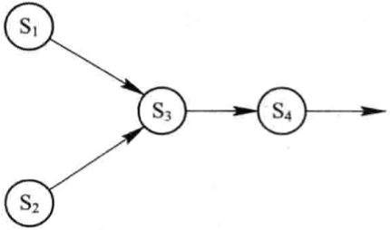

   $S_3$必须在$a$和$b$被赋值后方能执行；$S_4$必须在$S_3$之后执行；但$S_1$和$S_2$则可以并发执行，因为它们彼此互不依赖；

2. 程序并发执行时的特征

   - 间断性
   - 失去封闭性
   - 不可再现性


## 进程的描述

### 进程的定义和特征

1. 进程的定义
   - 进程是程序的一次执行
   - 进程是一个程序及其数据在处理机上顺序执行时所发生的活动
   - 进程是具有独立功能的程序在一个数据集合上运行的过程，它是系统进行资源分配和调度的一个独立单位
2. 进程的特征
   - 动态性
   - 并发性
   - 独立性
   - 异步性

### 进程的基本状态及转换

1. 进程的三种基本状态

   - `就绪（Ready）状态`
   - `执行（Running）状态`
   - `阻塞（Block）状态`

2. 三种基本状态的转换

   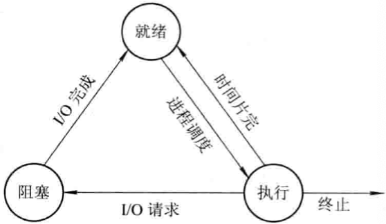

   *进程的三种基本状态及其转换*

3. 创建状态和终止状态

   - 创建状态

   - 终止状态

     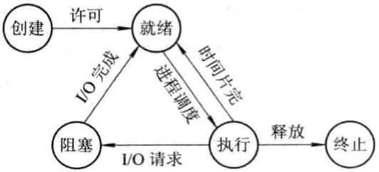

     *进程的五种基本状态及转换*

### 挂起操作和进程状态的转换

1. 挂起操作的引入

   引入挂起操作的原因，是基于系统和用户的如下需要：

   - 中断用户的需要
   - 父进程请求
   - 负荷调节的需要
   - 操作系统的需要

2. 引入挂起原语操作后三个进程状态的转换

   - 活动就绪 $\rightarrow$ 静止就绪
   - 活动阻塞 $\rightarrow$ 静止阻塞
   - 静止就绪 $\rightarrow$ 活动就绪
   - 静止阻塞 $\rightarrow$ 活动阻塞

3. 引入挂起操作后五个进程状态的转换

   - NULL $\rightarrow$ 创建
   - 创建 $\rightarrow$ 活动就绪
   - 创建 $\rightarrow$ 静止就绪
   - 执行 $\rightarrow$ 终止

   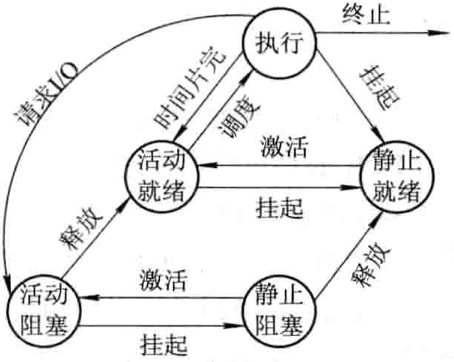

   *具有挂起状态的进程状态图*

   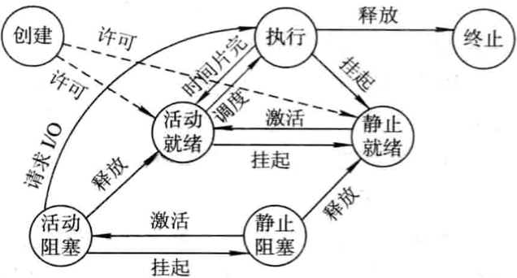

   *具有创建，终止和挂起状态的进程状态图*

### 进程管理中的数据结构

1. 操作系统中用于管理控制的数据结构

   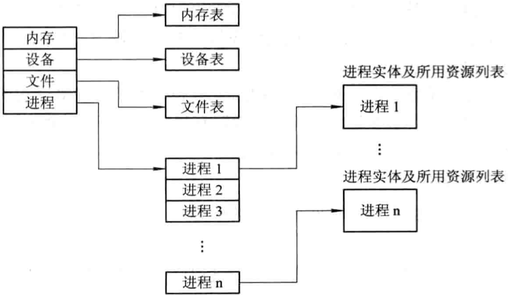

   *操作系统控制表的一般结构*

2. 进程控制PCB的作用

   - 作为独立运行基本单位的标志
   - 能实现间断性运行方式
   - 提供进程管理所需要的信息
   - 提供进程调度所需要的信息
   - 实现与其它进程的同步与通信
   
3. 进程控制块中的信息
   
   - 进程标识符
   
     1. 外部标识符
     2. 内部标识符
   
   - 处理机状态
   
     处理机状态主要由各种寄存器组成：
   
     1. 通用寄存器
     2. 指令计数器
     3. 程序状态字PSW
     4. 用户栈指针
   
   - 进程调度信息
   
     1. 进程状态
     2. 进程优先级
     3. 进程调度所需的其它信息
     4. 事件
   
   - 进程控制信息
   
     1. 程序和数据的地址
     2. 进程同步和通信机制
     3. 资源清单
     4. 链接指针
   
4. 进程控制块的组织方式
   
   - 线性方式
   
   - 链接方式
   
     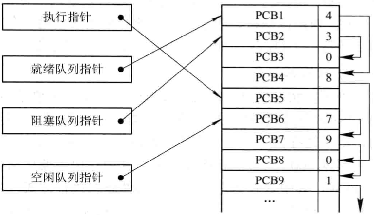
   
     *PCB链接队列示意图*
   
   - 索引方式
   
     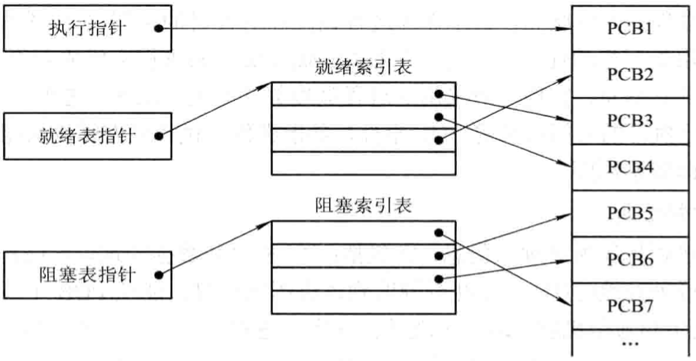
   
     *按索引方式组织PCB*


## 进程控制

### 操作系统内核

处理机的执行状态分成系统态和用户态：

- `系统态` 称为管态，也称为内核态。具有较高的特权，能执行一切指令，访问所有寄存器和存储区，传统的OS都在系统态运行。
- `用户态` 又称为目态。具有较低特权的执行状态，仅能执行规定的指令，访问指定的寄存器和存储区。

1. 支撑功能
   - 中断处理
   - 时钟管理
   - 原语操作
2. 资源管理功能
   - 进程管理
   - 存储器管理
   - 设备管理

### 进程的创建

1. 进程的层次结构

2. 进程图

   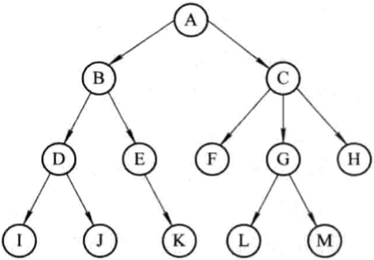

   *进程树：图中的结点代表进程；在进程$P_i$创建了进程$P_j$之后，称$P_i$是$P_j$的父进程（Parent Process），$P_j$是$P_i$的子进程（Progeny Process）。*

3. 引起创建进程的事件

   导致一个进程去创建另一个进程的典型事件有以下几类：
   
   - 用户登录
   - 作业调度
   - 提供服务
   - 应用请求
   
4. 进程的创建（Creation of Process）

   OS调用进程创建原语Creat按下述步骤创建一个新进程：
   
   1. 申请空白PCB，为新进程申请获得唯一的数字标识符，并从PCB集合中索取一个空白PCB。
   2. 为新进程分配其运行所需的资源，包括各种物理和逻辑资源，如内存，文件，I/O设备和CPU时间等。
   3. 初始化进程控制块（PCB）包括：
      - 初始化标识信息
      - 初始化处理机状态信息
      - 初始化处理机控制信息
   4. 如果进程就绪队列能够接纳新进程，便将新进程插入就绪队列。
   
### 进程的终止

1. 引起进程终止（Termination of Process）的事件

   - 正常结束
   - 异常结束
   - 外界干预

2. 进程的终止过程

   OS调用进程终止原语终止指定的进程：

   1. 根据被终止进程的标识符，从PCB集合中检索出该进程的PCB，从中读出该进程的状态；
   2. 若被终止进程处于执行状态，应立即终止该进程的执行，并置调度标志为真，用于指示该进程被终止后应重新进行调度；
   3. 若该进程还有子孙进程，还应将其所有子孙进程也都予以终止，以防他们成为不可控的进程；
   4. 将被终止进程所拥有的全部资源或者归还给其父进程，或者归还给系统；
   5. 将被终止进程（PCB）从所在队列（或链表）中移出，等待其它程序来搜集信息。

### 进程的阻塞和唤醒

1. 引起进程阻塞和唤醒的事件

   - 向系统请求共性资源失败
   - 等待某种操作的完成
   - 新数据尚未到达
   - 等待新任务的到达

2. 进程阻塞过程

3. 进程唤醒过程

   wakeup执行的过程是：首先把被阻塞的进程从等待该事件的阻塞队列中移出，将其PCB中的现行状态由阻塞改为就绪，然后再将该PCB插入到就绪队列中。

### 进程的挂起与激活

1. 进程的挂起
2. 进程的激活过程


## 进程同步

### 进程同步的基本概念

1. 两种形式的制约关系

   - 间接相互制约关系
   - 直接相互制约关系

2. 临界资源（Critical Resouce）

3. 临界区（Critical section）

4. 同步机制应遵循的规则

   - `空闲让进` 当无进程处于临界区时，表明临界资源处于空闲状态，应允许一个请求进入临界区的进程立即进入自己的临界区，以有效地利用临界资源。
   - `忙则等待` 当已有进程进入临界区时，表明临界资源正在被访问，因而其它试图进入临界区的进程必须等待，以保证对临界资源的互斥访问。
   - `有限等待` 对要求访问临界资源的进程，应保证在有限时间内能进入自己的临界区，以免陷入“死等”状态。
   - `让权等待` 当进程不能进入自己的临界区时，应立即释放处理机，以免进程陷入“忙等”状态。

### 硬件同步机制

1. 关中断

   在进入锁测试之前关闭中断，直到完成锁测试并上锁之后才能打开中断；关中断方法存在许多缺点：

   - 滥用关中断权力可能导致严重后果
   - 关中断事件过长，会影响系统效率，限制了处理器交叉执行程序的能力
   - 关中断方法不适用于多CPU系统，因为在一个处理器上关中断并不能防止进程在其它处理器上执行相同的临界段代码

2. 利用Test-and-Set指令实现互斥

   ```c
   boolean TS(boolean *lock) {
   	Boolean old;
     old = *lock;
     *lock = TRUE;
     return old;
   }
   do {
   	...
     while TS(&lock);
     critical section;
     lock := FALSE:
     remainder section;
   } while(TRUE);
   ```

3. 利用Swap志林实现进程互斥

   ```c
   void swap(boolean *a, boolean *b) {
   	boolean temp;
     temp = *a;
     *a = *b;
     *b = temp;
   }
   do {
   	key = TRUE;
     do {
     	swap(&lock, &key);
     } while(key != FALSE);
     临界区操作;
     lock = FALSE;
     ...
   } while(TRUE);
   ```

### 信号量(Semaphores)机制

1. 整型信号量

   ```c
   wait(S) {
   	while(S <= 0);
     S--;
   }
   signal(S)
   {
   	S++;
   }
   ```

2. 记录型信号量

   ```c
   typedef struct {
   	int value;
     struct process_control_block *list;
   } semaphore;
   wait(semaphore *S) {
   	S->value--;
     if (S->value < 0) block(S->list);
   }
   signal(semaphore *S) {
   	S->value++;
     if (S->value <= 0) wakeup(S->list);
   }
   ```

3. AND型信号量

   ```c
   Swait(S1, S2, ..., Sn)
   {
   	while(TRUE)
     {
     	if (Si >= 1 && ... && Sn >= 1) {
       	for (i = 1; i <= n; i++) Si--;
         break;
       } else {
       	place the process in the waiting queue associated with the first Si found with Si<1, and set the program count of this process to the beginning of Swait operation
       }
     }
   }
   Ssignal(S1, S2, ..., Sn) {
   	while(TRUE) {
     	for (i=1; i<=n; i++) {
       	Si++;
         Remove all the process waiting in the queue associated with Si into the ready queue
       }
     }
   }
   ```

4. 信号量集

   $Swait(S_1, t_1, d_1, ..., S_n, t_n, d_n);$

   $Ssignal(S_1, d_1, ..., S_n, d_n);$

   一般“信号量集”还有下面几种特殊情况：

   - $Swait(S, d, d)$。此时在信号量集中只有一个信号量$S$，但允许它每次申请$d$个资源，当现有资源数少于$d$时，不予分配。
   - $Swait(S, 1, 1)$。此时的信号量集已蜕化为一般的记录型信号量($S>1$时)或互斥信号量($S=1$时)。
   - $Swait(S, 1, 0)$。这是一种很特殊且很有用的信号量操作。当$S \geqslant 1$时，允许多个进程进入某特定区；当$S$变为0后，将阻止任何进程进入特定区。

### 信号量的应用

1. 利用信号量实现进程互斥
2. 利用信号量实现前趋关系

### 管程机制

1. 管程的定义

   代表共享资源的数据结构以及由对该共享数据结构实施操作的一组过程所组成的资源管理程序共同构成了一个操作系统的资源管理模块，我们称之为管程。

   管程由四部分组成：

   - 管程的名称
   - 局部于管程的共享数据结构说明
   - 对该数据结构进行操作的一组过程
   - 对局部于管程的共享数据设置初始值的语句

   管程的示意图：

   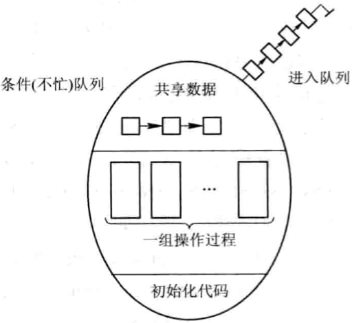

2. 条件变量


## 经典进程的同步问题

### 生产者-消费者问题(The proceducer-consumer problem)

1. 利用记录型信号量解决生产者-消费者问题
2. 利用AND信号量解决生产者-消费者问题
3. 利用管程解决生产者-消费者问题

### 哲学家进餐问题

1. 利用记录型信号量解决哲学家进餐问题
2. 利用AND信号量机制解决哲学家进餐问题

### 读者-写者问题

1. 利用记录型信号量解决读者-写者问题
2. 利用信号量集机制解决读者-写者问题


## 进程通信

### 进程通信的类型

1. 共享存储器系统(Shared-Memory System)

   - 基于共享数据结构的通信方式
   - 基于共享存储区的通信方式

2. 管道(pipe)通信系统

   管道机制必须提供以下三方面的协调能力：

   - `互斥` 当一个进程正在对pipe执行读/写操作时，其它进程必须等待；
   - `同步` 当写进程把一定数量的数据写入pipe，便去睡眠等待，知道读进程取走数据后再把它唤醒；
   - `确定对方是否存在` 只有确定了对方已存在时才能进行通信。

3. 消息传递系统(Message passing system)

   基于消息传递系统的通信方式属于高级通信方式，可分为以下几类：

   - `直接通信方式` 发送进程利用OS所提供的发送原语，直接把消息发送给目标进程；
   - `间接通信方式` 发送和接收进程，都通过共享中间实体的方式进行消息的发送和接收，完成进程间的通信。

4. 客户机-服务器系统(Client-Server system)

   - 套接字(Socket)
   - 远程过程调用和远程方法调用(Remote Procedure Call, RPC)

### 消息传递通信的实现方式

1. 直接消息传递系统

   - 直接通信原语
     1. 对称寻址方式
     2. 非对称寻址方式
   - 消息的格式
   - 进程的同步方式
   - 通信链路

2. 信箱通信

   - 信箱的结构

     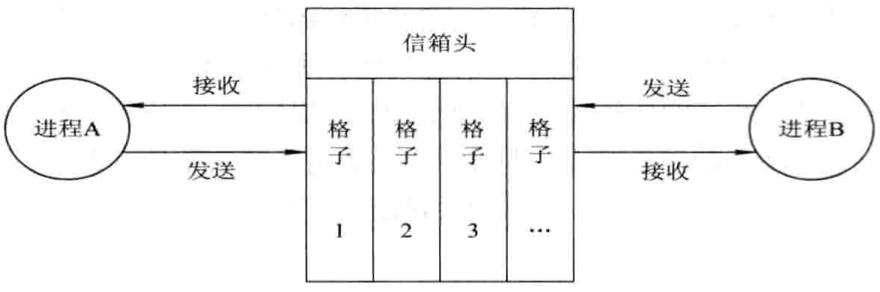

     *双向信箱示意图*

     - `信箱头` 用以存放有关信箱的描述信息 
     - `信箱体` 由若干个可以存放消息（或消息头）的信箱格组成

   - 信箱通信原语

     `Send(mailbox, message);` 将一个消息发送到指定邮箱

     `Receive(mailbox, message);` 从指定邮箱中接收一个消息

   - 信箱的类型

     - 私用邮箱
     - 公用邮箱
     - 共享邮箱

### 直接消息传递系统实例

1. 消息缓冲队列通信机制中的数据结构

   ```c
   type struct message_buffer {
   	int sender;									 // 发送者进程标识符
     int size;									   // 消息长度
     char *text;									 // 消息正文
     struct message_buffer *next; // 指向下一个消息缓冲区的指针
   }
   type struct processcontrol_block {
   	...
     struct message_buffer *mq;	// 消息队列队首指针
     semaphore mutex;						// 消息队列互斥信号量
     semaphore sm;								// 消息队列资源信号量
     ...
   }PCB;
   ```

2. 发送原语

   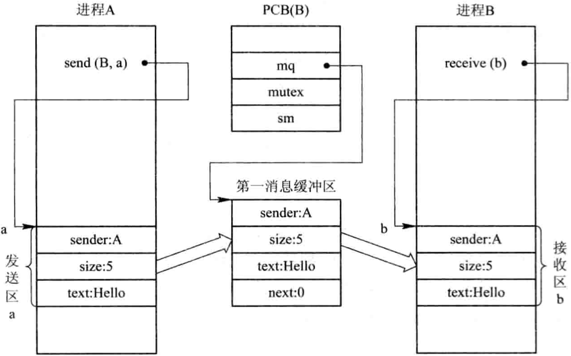

   ```c
   void send(receiver, a) {
   	getbuf(a.size, i);
     copy(i.sender, a.sender);
     i.size = a.size;
     copy(i.text, a.text);
     i.next = 0;
     getid(PCBset, receiver.j);
     wait(j.mutex);
     insert(&j.mq, i);
     signal(j.mutex);
     signal(j.sm);
   }
   ```

3. 接收原语

   ```c
   void receive(b) {
   	j = internal name;
     wait(j.sm);
     wait(j.mutex);
     remove(j.mq, i);
     signal(j.mutex);
     copy(b.sender, i.sender);
     b.size = i.size;
     copy(b.text, i.text);
     releasebuf(i);
   }
   ```


## 线程(Threads)的基本概念

### 线程的引入

1. 进程的两个基本属性
   - 进程是一个可拥有资源的独立单位
   - 进程是一个可独立调度和分派的基本单位
2. 程序并发执行所需付出的时空开销
   - `创建进程` 系统在创建一个进程时，必须为它分配其所必需的，除处理机以外的所有资源，如内存空间，I/O设备，以及建立相应的PCB；
   - `撤销进程` 系统在撤销进程时，又必须先对其所占有的资源执行回收操作，然后再撤销PCB；
   - `进程切换` 对进程进行上下文切换时，需要保留当前进程的CPU环境，设置新选中进程的CPU环境，因而须花费不少的处理机时间。
3. 线程-作为调度和分派的基本单位

### 线程与进程的比较

`轻型进程(Light-Weight Process)`

`重型进程(Heavy-Weight Process)`

1. 调度的基本单位
2. 并发性
3. 拥有资源
4. 独立性
5. 系统开销
6. 支持多处理机系统

### 线程的状态和线程控制块

1. 线程运行的三个状态
   - `执行状态` 表示线程已获得处理机而正在运行；
   - `就绪状态` 线程已具备了各种执行条件，只须再获得CPU便可立即执行；
   - `阻塞状态` 线程在执行中因某事件受阻而处于暂停状态；
2. 线程控制块TCB
3. 多线程OS中的进程属性
   - 进程是一个可拥有资源的基本单位；
   - 多个线程可并发执行；
   - 进程已不是可执行的实体；


## 线程的实现

### 线程的实现方式

1. 内核支持线程KST(Kernel Supported Threads)

   优点：

   - 在多处理器系统中，内核能够同时调度同一进程中的多个线程并行执行；
   - 如果进程中的一个线程被阻塞了，内核可以调度该进程中的其它线程占有处理器运行，也可以运行其它进程中的线程；
   - 内核支持线程具有很小的数据结构和堆栈，线程的切换比较快，切换开销小；
   - 内核本身也可以采用多线程技术，可以提高系统的执行速度和效率。

2. 用户级线程ULT(User Level Threads)

   优点：

   - 线程切换不需要转换到内核空间
   - 调度算法可以是进程专用的
   - 用户级线程的实现与OS平台无关

   缺点：

   - 系统调用的阻塞问题
   - 不能利用多处理机进行并行处理

3. 组合方式

   - 多对一模型，将用户线程映射到一个内核控制线程

     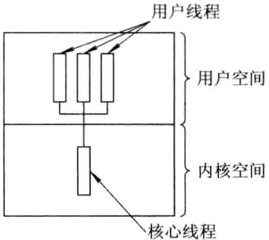

   - 一对一模型，将每一个用户级线程映射到一个内核支持线程

     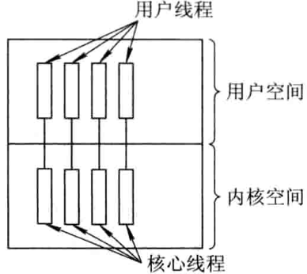

   - 多对多模型，将许多用户线程映射到同样数量或者更少数量的内核线程上

     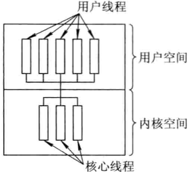

### 线程的实现

1. 内核支持线程的实现

2. 用户级线程的实现

   - 运行时系统(Runtime System)

   - 内核控制线程

     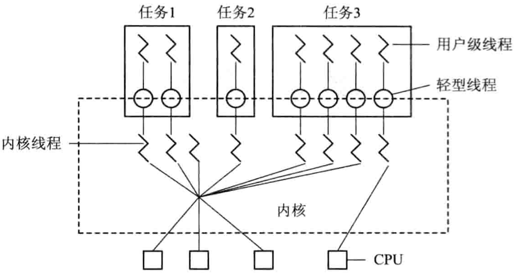

     *利用轻型进程作为中间系统*

### 线程的创建和终止

1. 线程的创建
2. 线程的终止


