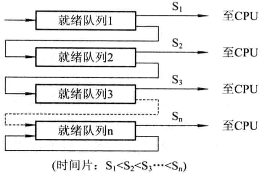
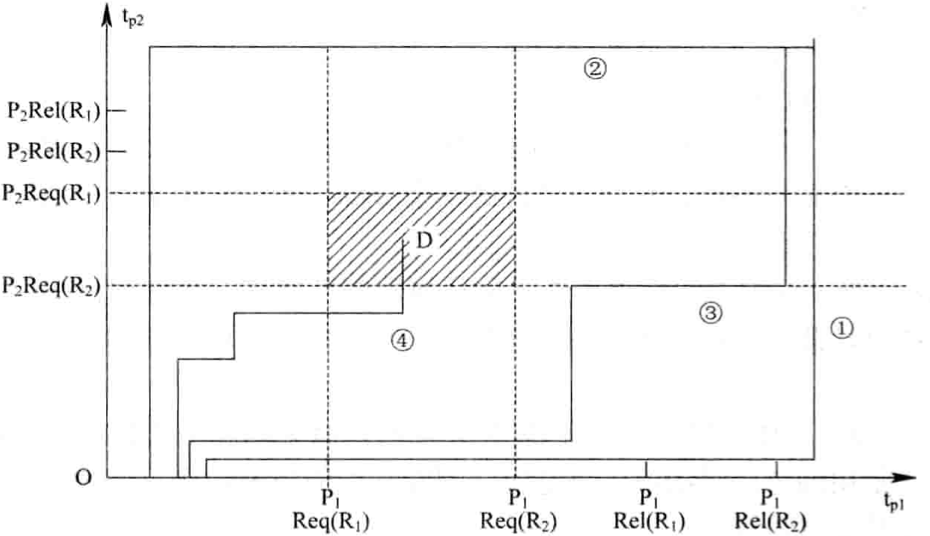

# 第三章 处理机调度与死锁

[TOC]

## 处理机调度的层次和调度算法的目标

### 处理机调度的层次

1. 高级调度(High Level Scheduling)
2. 低级调度(Low Level Scheduling)
3. 中级调度(Intermediate Scheduling)

### 处理机调度算法的目标

1. 处理机调度算法的共同目标

   - 资源利用率

     $CPU的利用率=\frac{CPU有效工作时间}{CPU有效工作时间+CPU空闲等待时间}$

   - 公平性

   - 平衡性

   - 策略强制执行

2. 批处理系统的目标

   - 平均周转时间短

     平均周转时间：

     $T=\frac{1}{n}[\sum_{i=1}^{n} T_i]$

     平均带权周转时间：

     $W = \frac{1}{n} \sum_{i=1}^{n} \frac{T_i}{T_s}$

   - 系统吞吐量高

   - 处理机利用率高

3. 分时系统的目标

   - 响应时间快
   - 均衡性

4. 实时系统的目标

   - 截止时间的保证
   - 可预测性

## 作业与作业调度

### 批处理系统中的作业

1. 作业(Job)和作业步(Job Step)
2. 作业控制块(Job Control Block, JCB)
3. 作业运行的三个阶段和三种状态
   - 收容阶段
   - 运行阶段
   - 完成阶段

### 作业调度的主要任务

在每次执行作业调度（Admission Scheduling，接纳调度）时，需要做以下决定：

1. 接纳多少个作业
2. 接纳哪些作业

### 先来先服务(FCFS)和短作业优先(SJF)调度算法

1. 先来先服务(first-come first-served, FCFS)调度算法

2. 短作业优先(short job first, SJF)的调度算法

   缺点：

   - 必须预知作业的运行时间。
   - 对长作业非常不利，长作业的周转时间会明显地增长。
   - 在采用FCFS算法时，人-机无法实现交互。
   - 该调度算法完全未考虑作业的紧迫程度，故不能保证紧迫性作业能得到及时处理。

### 优先级调度算法和高响应比优先调度算法

1. 优先级调度算法(priority-scheduling algorithm, PSA)

2. 高响应比优先调度算法(Highest Response Ratio Next, HRRN)

   优先级变化规律：

   $优先权 = \frac{等待时间+要求服务时间}{要求服务时间}$

   由于等待时间与服务时间之和就是系统对该作业的响应时间，故该优先级又相当于响应比$R_p$；优先又可表示为：

   $R_p = \frac{等待时间+要求服务时间}{要求服务时间} = \frac{响应时间}{要求服务时间}$

## 进程调度

### 进程调度的任务，机制和方式

1. 进程调度的任务

   - 保存处理机的现场信息
   - 按某种算法选取进程
   - 把处理器分配给进程

2. 进程调度机制

   - 排队器

     

     *进程调度机制*

   - 分派器

   - 上下文切换器

3. 进程调度方式

   - 非抢占方式(Nonpreemptive Mode)

   - 抢占方式(Preemptive Mode)

     抢占主要原则有：

     1. `优先权原则` 指允许优先级高的新到进程抢占当前进程的处理机，即当有新进程到达时，如果它的优先级比正在执行进程的优先级高，则调度程序将剥夺当前进程的运行，将处理机分配给新到的优先权高的进程。
     2. `短进程优先原则` 指允许新到的短进程可以抢占当前长进程的处理机，即当新到达的进程比正在执行的进程明显短时，将处理机分配给新到的短进程。
     3. `时间片原则` 即各进程按时间片轮运行时，当正在执行的进程的一个时间片用完后，便停止该进程的执行而重新进行调度。

### 轮转调度算法

1. 轮转法的基本原理

2. 进程切换时机

3. 时间片大小的确定

   

   *时间片大小对响应时间的影响*

   

   *q=1和q=4时进程的周转时间*

### 优先级调度算法

1. 优先级调度算法的类型

   - 非抢占式优先级调度算法
   - 抢占式优先级调度算法

2. 优先级的类型

   - 静态优先级

     决定进程优先级大小的依据：

     - 进程类型
     - 进程对资源的需求
     - 用户要求

   - 动态优先级

### 多队列调度算法

TODO

### 多级反馈队列(multileved feedback queue)调度算法

1. 调度机制

   1. 设置多个就绪队列。按照优先级依次降低的顺序给每个队列赋值。

      

      *多级反馈队列调度算法*

   2. 每个队列都采用FCFS算法

   3. 按队列优先级调度

2. 调度算法的性能

   - 终端型用户
   - 短批处理作业用户
   - 长批处理作业用户

### 基于公平原则的调度算法

1. 保证调度算法

   在实施公平调度算法时系统中必须具有这样一些功能：

   - 跟踪计算每个进程自创建以来已经执行的处理时间。
   - 计算每个进程应获得的处理机时间，即自创建以来的时间除以n。
   - 计算进程获得处理机时间的比率，即进程实际执行的处理时间和应获得的处理机时间之比。
   - 比较各进程获得处理机时间的比率。如进程A的比率最低，为0.5，而进程B的比率为0.8，进程C的比率为1.2等。
   - 调度程序应选择比率最小的进程将处理机分配给它，并让该进程一直运行，直到超过最接近它的进程比率为止。

2. 公平分享调度算法

## 实时调度

### 实现实时调度的基本条件

1. 提供必要的信息

   为了实现实时调度，系统应向调度程序提供有关任务的信息：

   - 就绪时间
   - 开始截止时间和完成截止时间
   - 处理时间
   - 资源要求
   - 优先级

2. 系统处理能力强

   在实时系统中，必须满足下面的限制条件系统才是可调度的：

   $\sum _{i=1}^{m} \frac {C_i}{P_i} \leq N$

   - $m$ 周期性硬实时任务个数
   - $C_i$ 处理时间
   - $P_i$ 周期时间

3. 采用抢占式调度机制

4. 具有快速切换机制

   该机制应具有如下两方面的能力：

   - 对中断的快速响应能力
   - 快速的任务分派能力

### 实时调度算法的分类

1. 非抢占式调度算法

   - 非抢占式轮转调度算法
   - 非抢占式优先调度算法

2. 抢占式调度算法

   - 基于时钟中断的抢占式优先级调度算法

   - 立即抢占(Immediate Preemption)的优先级调度算法

     

     *实时进度调度*

### 最早截止时间优先EDF(Earliest Deadline First)算法

1. 非抢占式调度方式用于非周期实时任务

   

   *EDF算法用于非抢占调度方式*

2. 抢占式调度方式用于周期实时任务

   

   *最早截止时间优先算法用于抢占调度方式之例*

### 最低松弛度优先LLF(Least Laxity First)算法

*A和B任务每次必须完成的时间*

*利用ELLF算法进行调度的情况*

### 优先级倒置(priority inversion problem)

1. 优先级倒置的形成

   

   *优先级倒置示意图*

   优先级：$P_1 > P_2 > P_3$

2. 优先级倒置的解决办法

   

   *采用了动态优先级继承方法的运行情况*

## 死锁概述

### 资源问题

1. 可重用性资源和消耗性资源

   - 可重用性资源

     可重用性资源是一种可供用户重复使用多次的资源，具有如下性质：

     - 每一个可重用性资源中的单元只能分配给一个进程使用，不允许多个进程共享。
     - 进程在使用可重用性资源时，须按照以下顺序：请求资源->使用资源->释放资源。
     - 系统中每一类可重用性资源中的单元数目是相对固定的，进程在运行期间既不能创建也不能删除它。

   - 可消耗性资源

     可消耗性资源是在进程运行期间，由进程动态创建和消耗的，具有如下性质：

     - 每一类可消耗性资源的单元数目在进程运行期间是可以不断变化的。
     - 进程在运行过程中可以不断地创造可消耗性资源的单元。
     - 进程在运行过程中可以请求多个可消耗性资源用于消耗。

2. 可抢占性资源和不可抢占性资源

   - 可抢占性资源
   - 不可抢占性资源

### 计算机系统中的死锁

1. 竞争不可抢占性资源引起死锁

   

   *共享文件时的死锁情况*

   

   *进程之间通信时的死锁*

2. 竞争可消耗资源引起死锁

3. 进程推进顺序不当引起死锁

   - 进程推进顺序合法

   - 进程推进顺序非法

     

     *进程推进顺序对死锁的影响*

     - $D$ 不安全区
     - $P_1, P_2$ 进程

     当$P_1$运行到$P_1$:$Request(R_2)$时，将因$R_2$已被$P_2$占用而阻塞；当$P_2$运行到$P_2$:$Request(R_1)$时，也将因$R_1$已被$P_1$占用而阻塞，于是发生了进程死锁；

### 死锁的定义，必要条件和处理方法

1. 死锁的定义

   如果一组进程中的每一个进程都在等待仅由该组进程中的其它进程才能引发的事件，那么该组进程是死锁的(Deadlock)。

2. 产生死锁的必要条件

   产生死锁必须同时具备下面必要条件：

   - 互斥条件
   - 请求和保持条件
   - 不可抢占条件
   - 循环等待条件

3. 处理死锁的方法

   - 预防死锁
   - 避免死锁
   - 检测死锁
   - 解除死锁

## 预防死锁

### 破坏“请求和保持”条件

为了能破坏“请求和保持”条件，系统必须保证做到：当一个进程在请求资源时，它不能持有不可抢占资源，可通过以下协议实现：

1. 第一种协议

   所有进程在开始运行之前，必须一次性地申请其在整个运行过程中所需的全部资源；

   缺点：

   - 资源被严重浪费
   - 使进程经常发生饥饿现象

2. 第二种协议

   允许一个进程只获得运行初期所需的资源后，便开始运行。进程运行过程中逐步释放已分配给自己的且已用毕的全部资源，然后再请求新的所需资源。

### 破坏“不可抢占”条件

当一个已经保持了某些不可被抢占资源的进程，提出新的资源请求而不能得到满足时，它必须释放已经保持的所有资源，待以后需要时再重新申请。

### 破坏“循环等待”条件

规定每个进程必须按序号递增的顺序请求资源。一个进程在开始时，可以请求某类资源$R_i$的单元。以后，当且仅当$F(R_j) > F(R_i)$时，进程才可以请求资源$R_j$的单元。

## 避免死锁

### 系统安全状态

1. 安全状态
2. 安全状态之例
3. 由安全状态向不安全状态的转换

## 死锁的检测与解除

### 死锁的检测

1. 资源分配图(Resource Allocation Graph)

   系统死锁，可利用资源分配图来描述。该图是由一组结点$N$和一组边$E$所组成的一对偶$G=(N,E)$，它具有下述形式的定义和限制：

   1. 把$N$分为两个互斥的子集，即一组进程结点$P={P_1, P_2, ..., P_n}$和一组资源结点$R={R_1, R_2, ..., R_n}, N = P \cup R$。
   2. 凡属于$E$中的一个边$e \in E$，都连接着$P$中的一个结点和$R$中的一个结点，$e={P_i, R_j}$是资源请求边，由进程$P_i$指向资源$R_j$，它标识进程$P_i$请求一个单位的$R_j$资源。$E = {R_j, P_i}$是资源分配边，由资源$R_j$指向进程$P_i$，它表示把一个单位的资源$R_j$分配给进程$P_i$。

   

   *每类资源有多个时的情况*

2. 死锁定理

   

   *资源分配图的简化*

3. 死锁检测中的数据结构

### 死锁的解除

常用的解除死锁的方法：

- 抢占资源
- 终止（或撤销）进程

1. 终止进程的方法

   - 终止所有死锁进程
   - 逐个终止进程

2. 付出代价最小的死锁解除算法

   

   *付出代价最小的的死锁解除算法*

   所花费的代价：$R(S)_{min} = min{C_{ui}} + min{C_{uj}} + min{C_{uk}} + ...$

   

   