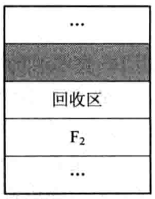
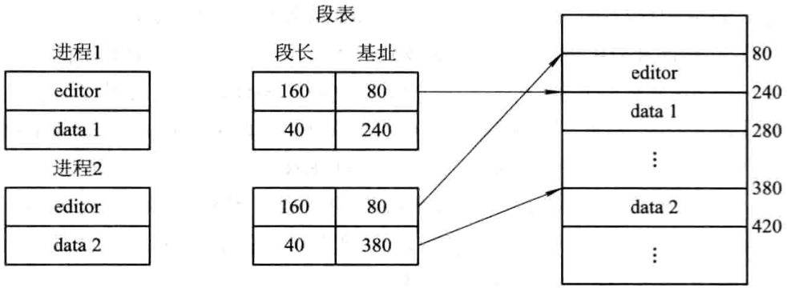
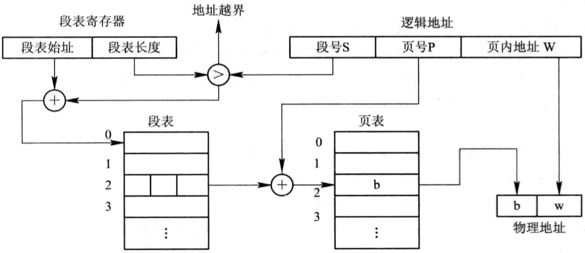

# 第四章 存储器管理

[TOC]

## 4.1 存储器的层次结构

### 4.1.1 多层结构的存储器系统

1. 存储器的多层架构

   

   *计算机系统存储层次示意*

2. 可执行存储器

   寄存器和主存储器又被称为可执行存储器。

### 4.1.2 主存储器与寄存器

1. 主存储器
2. 寄存器

### 4.1.3 高速缓存和磁盘缓存

1. 高速缓存
2. 磁盘缓存

## 4.2 程序的装入和链接

用户程序要在系统中运行，需要先装入内存，通常经过以下几个步骤：

1. `编译` 由编译程序(Compiler)对用户源程序进行编译，形成若干个目标模块(Object Module)；
2. `链接` 由链接程序(Linker)将编译后形成的一组目标模块以及它们所需要的库函数链接在一起，形成一个完整的装入模块(Load Module);
3. `装入` 由装入程序(Loader)将装入模块装入内存。

*对用户程序的处理步骤*

### 4.2.1 程序的装入

1. 绝对装入方式(Absolute Loading Mode, ALM)

   将目标模块装入到内存中事先指定的绝对位置；

2. 可重定位装入方式(Relocation Loading Mode, RLM)

   根据内存的具体情况将装入模块装入到内存的适当位置（程序运行时不允许移动内存中的位置）；

   

   *作业装入内存时的情况*

3. 动态运行时的装入方式(Dynamic Run-time Loading)

   动态运行时的装入程序在把装入模块装入内存后，并不立即把装入模块中的逻辑地址转换为物理地址，而是把这种地址转换推迟到程序真正要执行时才进行。因此，装入内存后的所有地址都仍时逻辑地址。

### 4.2.2 程序的链接

1. 静态链接(Static Linking, SL)

   在程序运行前，先将各目标模块及它们所需的库函数链接成一个完整的装配模块，以后不再拆开；

   

   *程序链接示意图*

2. 装入时动态链接(Load-time Dynamic Linking, LDL)

   编译后得到一组目标模块，在装入内存的过程中去链接所需要的模块；

   优点：

   - 便于修改和更新
   - 便于实现对目标模块的共享

3. 运行时动态链接(Run-time Dynamic Linking, RDL)

   对某些模块的链接推迟到程序执行时才进行，即在运行过程中查找和装入；

## 4.3 连续分配存储管理方式

### 4.3.1 单一连续分配

只能用于单用户，单任务的OS，分为系统区和用户区；

### 4.3.2 固定分区分配

1. 划分分区的方法

   将内存中的用户空间分为固定大小的若干分区，每个分区装入一道作业；
   分区方法:

   - 大小相等的分区；
   - 大小不相等的分区；

2. 内存分配

   将分区按大小排队，并建立一张分区使用表；

   

   *固定分区使用表*

### 4.3.3 动态分区分配

1. 动态分区分配中的数据结构

   - 空闲分区表

     

   - 空闲分区链

     

2. 动态分区分配算法

3. 分区分配操作

   - 分配内存

     

     *内存分配流程*

   - 回收内存

     1. 回收区域插入点的前一个空闲分区$F_1$相邻接

        

        *此时应将回收区与插入点的前一分区合并，不必为回收分区分配新表项，而只需修改其前一分区$F_1$的大小*

     2. 回收分区与插入点的后一空闲分区$F_2$相邻接

        

        *此时也可将两分区合并，形成新的空闲分区，但用回收区的首址作为新空闲区的首址，大小为两者之和*

     3. 回收区同时与插入点的前，后两个分区邻接

        
        
        *此时将三个分区合并，使用$F_1$的表项和$F_1$的首址，取消$F_2$的表项，大小为三者之和*
        
     4. 回收区既不与$F_1$邻接，又不与$F_2$邻接
        
        *此时应为回收区单独建立一个新表项，填写回收区的首址和大小，并根据其首址插入到空闲链中的适当位置*
     
     

     *内存回收流程*

### 4.3.4 基于顺序搜索的动态分区分配算法

- `首次适应算法(first fit, FF)` 在链表中从头开始找，找到为止；
- `循环首次适应算法(next fit, NF)` 从上一次找到的位置开始找，找到合适的为止，到了链尾还没有找到的话，再从链头开始找；
- `最佳适应算法(best fit, BF)` 将空间从小到大排列，从头开始找，每次找到的都是最接近要求的大小；
- `最坏适应算法(worst fit, WF)` 将空间从大到小排列，从头开始找，有利于减少碎片的产生；

### 4.3.5 基于索引搜索的动态分区分配算法

- `快速适应算法(quick fit, QF)` 

  将空闲空间按大小分类，建立一张管理索引表，每一项对应一种大小类型，每个空闲分区放一个进程；

- `伙伴系统(buddy system, BS)` 

  无论已分配分区或空闲分区，其大小均为2的$k$次幂(k为整数，$1 \leqslant k \leqslant m$)。

  对于一个大小为$2^k$，地址为$x$的内存块，其伙伴块的地址用$buddy_k(x)$表示，其通式为：
  $$
  buddy_k(x) = 
  \begin{cases}
  x + 2^k (若xMOD 2^{k+1} = 0) \\
  x - 2^k (若xMOD x^{k+1} = x^k)
  \end{cases}
  $$

- `哈希算法` 

  进行空闲分区分配时，根据所需空闲分区大小，通过哈希函数计算，即得到在哈希表中的位置，从中得到相应的空闲分区链表，实现最佳分配策略。

### 4.3.6 动态可重定位分区分配

1. 紧凑

   

   *紧凑的示意*

2. 动态重定位

   

   *动态重定位示意图*

3. 动态重定位分区分配算法

   动态重定位分区分配算法在动态分区分配算法的基础上增加了紧凑功能：

   

   *动态分区分配算法流程图*

## 4.4 对换(Swapping)

### 4.4.1 多道程序环境下的对换技术

1. 对换的引入
2. 对换的类型
   - 整体对换
   - 页面（分段）对换

### 4.4.2 对换空间的管理

1. 对换空间管理的主要目标

   - 对文件区管理的主要目标：提高文件存储空间的利用率；
   - 对对换空间管理的主要目标：提高进程换入和换出的速度。

2. 对换区空闲盘块管理中的数据结构

   包含：对换区的首址及其大小，分别用盘块号和盘块数表示。

3. 对换空间的分配与回收

   对换区的回收操作分为4种情况：

   - 回收分区与插入点的前一个空闲分区$F_1$相邻接；
   - 回收分区与插入点的后一个空闲分区$F_2$相邻接；
   - 回收分区同时与插入点的前，后两个分区邻接；
   - 回收分区既不与$F_1$邻接，又不与$F_2$邻接。

### 4.4.3 进程的换出与换入

- 进程的换出
  1. 选择被换出的进程；
  2. 进程换出过程。
- 进程的换入

## 4.5 分页存储管理方式

### 4.5.1 分页存储管理的基本方式

1. 页面和物理块

   - `页面`分页存储管理将进程的逻辑地址空间分成若干个页，并为各页加以编号。
   - `页面大小`每个内存页的大小。

2. 地址结构

   分页地址种的地址结构如下：

   

   $P = INT [\frac{A}{L}], d = [A]MOD \quad L$

   - $L$ 页面大小
   - $P$ 页号
   - $A$ 逻辑地址空间中的地址
   - $d$ 页内地址
   - $INT$ 整除函数
   - $MOD$ 取余函数

3. 页表

   

   *页表的作用*

### 4.5.2 地址变换机构

1. 基本的地址变换机构

   `页表寄存器(Page-Table Register, PTR)`

   

   *分页系统的地址变换机构*

2. 具有快表的地址变换机构

   
   
   *具有快表的地址变换机构*

### 4.5.3 访问内存的有效时间

`有效访问时间(Effective Access Time, EAT)` 从进程发出指定逻辑地址的访问请求，经过地址变换，到在内存中找到对应的实际物理地址单元并取出数据，所需要花费的总时间。

有效访问时间的计算公式：

$EAT = a \times \lambda + (t + \lambda)(1 - a) + t = 2t + \lambda - t \times a $

- $\lambda$ 查找快表所需的时间
- $a$ 命中率
- $t$ 访问一次内存所需要的时间

不同命中率与有效访问时间的关系：

| 命中率(%) a | 有效访问时间 EAT |
| ----------- | ---------------- |
| 0           | 220              |
| 50          | 170              |
| 80          | 140              |
| 90          | 130              |
| 98          | 122              |

### 4.5.4 两级和多级页表

1. 两级页表(Two-Level Page Table)

   

   *两级页表结构*

   

   *具有两级页表的地址变换机构*

2. 多级页表

   对于64位计算机，一般采用三级页表；

### 4.5.5 反置页表(Inverted Page Table)

1. 反置页表的引入

2. 地址变换

   在利用反置页表进行地址变换时，是根据进程标识符和页号，去检索反置页表。如果检索到与之匹配的页表项，则该页表项（中）的序号i便是该页所在的物理块号，可用该块号与页内地址一起构成物理地址宋内存地址寄存器。

## 4.6 分段存储管理方式

### 4.6.1 分段存储管理方式的引入

1. 方便编程
2. 信息共享
3. 信息保护
4. 动态增长
5. 动态链接

### 4.6.2 分段系统的基本原理

1. 分段

   

   该地址结构中，允许一个作业最长有64K个段，每个段的最大长度为64KB

2. 段表

   

   *利用段表实现地址映射*

3. 地址变换机构

   

   *分段系统的地址变换过程*

4. 分页和分段的主要区别

   - 页是信息的物理单位，是系统行为；
   - 页的大小固定且由系统决定，段的长度不固定，取决于用户编写的程序；
   - 分页的用户程序地址空间是一维的，分段的用户程序地址空间是二维的；

### 4.6.3 信息共享

1. 分页系统中对程序和数据的共享

   

   *分页系统中共享editor的示意图*

2. 分段系统中程序和数据的共享

   

   *分段系统中共享editor的示意图*

### 4.6.4 段页式存储管理方式

1. 基本原理

   

   *作业地址空间和地址结构*

   

   *利用段表和页表实现地址映射*

2. 地址变换过程

   

   *段页式系统中的地址变换机构*
