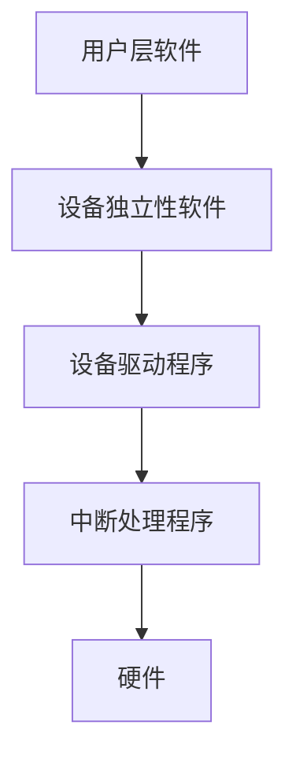

# 第五章 设备管理
## 1.设备分类：
* 按使用特征分：1.存储设备； 2.输入/输出设备；
* 按传输速率分：1.低速； 2.中速； 3高速；
* 按信息交换的单位分：1.块设备； 2.字符设备；
* 按共享属性分：1.独占设备； 2.共享设备； 3.虚拟设备；

## 2.接口：  
1. 数据信号线；  
2. 控制信号线；  
3. 状态信号线；

## 3.通道：
1. 字节多路通道；
2. 数组选择通道；
3. 数组多路通道；

## 4.I/O控制：
1. I/O忙等方式；
2. 中断驱动：一次传入1字；
3. DMA控制：一次传入1个数据块；
4. I/O通道控制：通道程序：操作码 + 内存地址 + 计数 + 通道程序结束位P + 记录结束标志R；

## 5.缓冲:

1. 单缓冲:


2. 双缓冲:

   ```mermaid
   graph LR
   A[I/O]-->B1[缓冲区1]-->C[工作区]
   A-->B2[缓冲区2]-->C
   ```

3. 玄幻缓冲:

   ```mermaid
   graph LR
   A[满]-->B[正使用]-->C[空]-->A
   ```

4. 缓冲池

   - 空缓冲队列 EMQ

   - 输入队列 INQ

   - 输出队列 OUTQ

     ```mermaid
     graph LR
     A[输入]--收容输入-->B[Hin]
     C[Sin]--提取输入-->D[用户进程]
     E[Hout]--收容输出-->D
     F[Sout]--提取输出-->G[输出]
     ```

## 6.I/O软件:



## 7.逻辑设备表`<LUT>`：
逻辑设备名 + 物理设备名 + 驱动程序入口

## 8.三大表：
1. 控制器控制表`<COCT>`;
2. 通道控制表`<CHCT>`;
3. 系统设备表`<SDT>`;

## 9.SPOOLING技术<假脱机技术>：
构成：输入井， 输出井， 输入缓冲区， 输入缓冲区， 输入进程SPI， 输出进程SPO；

## 10.磁盘：
磁盘容量大小与：扇区数， 磁道数， 盘面数 相关；在使用磁盘前需要对磁盘进行格式化，设置一个引导块，空闲存储管理，根目录和一个空文件系统；

磁盘调度方法：

1. FCFS<先来先服务>；
2. SSTF<最短寻道时间优先>；
3. SCAN<电梯调度算法>；
4. CSCAN<循环扫描算法>；
5. NSTEPSCAN;
6. FSCAN;

RAID<廉价磁盘冗余阵列>：
即把一个文件分割成多份，分别将每一份存入不同的磁盘，使用时多个磁盘同时工作，同时存取； 
RAID可分为：0， 1， 3， 5， 6， 7 共六级；  