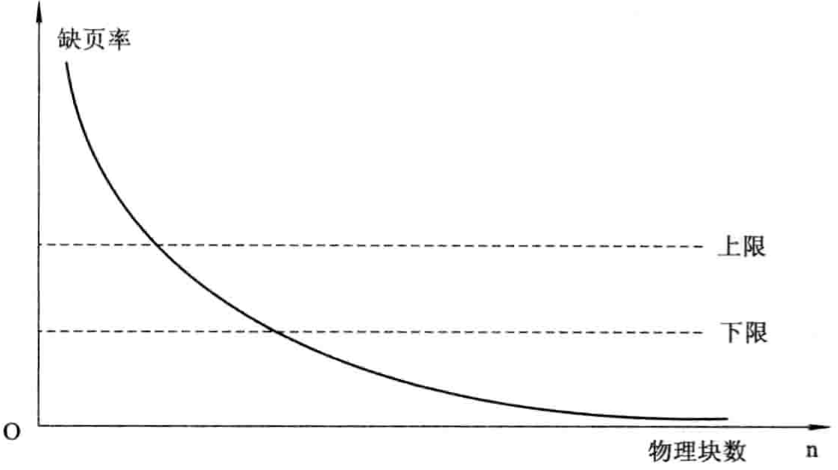

# 第五章 虚拟存储器

[TOC]

## 虚拟存储器概述

### 常规存储管理方式的特征和局部性原理

1. 常规存储器管理方式的特征

   - `一次性` 作业必须一次性地全部装入内存后方能开始运行；
   - `驻留性` 作业被装入内存后，整个作业都一直驻留在内存中，其中任何部分都不会换出，直至作业运行结束。

2. 局部性原理

   P.Denning指出：程序在执行时将呈现出局部性规律，即在一较短的时间内，程序的执行仅局限于某个部分，相应的，它所访问的存储空间也局限于某个区域。

   局限性表现在以下方面：

   - `时间局限性` 如果程序中的某条指令被执行，则不久后该指令可能再次执行；如果某数据被访问过，则不久后该数据可能再次被访问。产生时间局限性的典型原因是程序中存在大量的循环操作。
   - `空间局限性` 一旦程序访问了某个存储单元，在不久之后，其附近的存储单元也将被访问，即程序在一段时间内所访问的地址可能集中在一定范围内，其典型情况便是程序的顺序执行。

3. 虚拟存储器的基本工作情况

### 虚拟存储器的定义和特征

1. 虚拟存储器的定义

   具有请求调入功能和置换功能，能从逻辑上对内存容量加以扩充的一种存储器系统。

2. 虚拟存储器的特征

   - `多次性` 只需将当前要运行的部分程序和数据装入内存即可运行，当运行到尚未调入的那部分程序时，再将它调入；
   - `对换性` 在进程运行期间，允许将暂时不使用的代码和数据从内存调至外存(换出)，待以后需要时再将它们从外存调至内存(换进)；
   - `虚拟性` 能够从逻辑上扩充内存容量，是用户所看到的内存容量远大于实际内存容量。

### 虚拟存储器的实现方法

1. 分页请求系统

   主要的硬件支持：

   - 请求分页的页表机制
   - 缺页中断机构
   - 地址变换机构

2. 请求分段系统

## 请求分页存储管理方式

### 请求分页中的硬件支持

1. 请求页表机制

   `|页号|物理块号|状态位P|访问字段A|修改位M|外存地址|`

   - `状态位P（存在位）` 指示该页是否已调入内存
   - `访问字段A` 记录本页再一段时间内被访问的次数，或记录本页最近已有多长时间未被访问
   - `修改位M` 标识该页在调入内存后是否被修改过
   - `外存地址` 指出该页在外存上的地址，通常是物理块号

2. 缺页中断机构

   当所要访问的页面不在内存时，产生缺页中断，请求OS将所缺页调入内存。

   缺页中断与一般中断的区别：

   - 一般在指令执行执行完后，才检查是否有中断请求到达；缺页中断是在指令执行期间，发现所要访问的指令或数据不在内存时，立即产生和处理缺页中断信号，以便能及时将所缺页面调入内存；

   - 一条指令在执行期间可能产生多次缺页中断。

     

     *涉及6次缺页中断的指令*

3. 地址变换机构

   

   *请求分页中的地址变换过程*

### 请求分页中的内存分配

1. 最小物理块数的确定

   `最小物理块数` 保证进程正常运行所需的最小物理块数；

2. 内存分配策略

   - `固定分配局部置换(Fixed Allocation, Local Replacement)` 为每个进程分配一组固定数目的物理块，在进程运行期间不再改变；如果进程运行中发现缺页，则只能从分配给该进程的n个页面中选出一页换出，然后再调入一页，以保证分配给该进程的内存空间不变。
   - `可变分配全局置换(Variable Allocation, Global Replacement)` 为每个进程分配一定数目的物理块，在进程运行期间根据情况适当增加或减少；如果进程运行中发现缺页，则将OS所保留的空闲物理块取出一块分配给进程。
   - `可变分配局部置换(Variable Allocation, Local Replacement)` 为每个进程分配一定数目的物理块，当发现缺页时，只允许从该进程在内存的页面中选择一页换出，这样就不会影响其它进程的运行。如果进程在运行中频繁发生缺页中断，则系统再为该进程纷飞若干附加的的物理块；如果进程在运行中缺页率特别低，在不引起缺页率明显增加的情况下，适当减少分配给该进程的物理块数。

3. 物理块分配算法

   - `平均分配算法` 将系统中所有可供分配的物理块平均分配给各进程

   - `按比例分配算法` 根据进程大小按比例分配物理块；

     系统中各进程页面数总和计算公式：$S = \sum_{n}^{i=1} S_i$

     - $S$ 进程页面数总和
     - $S_i$ 每个进程页面数
     - $n$ 进程个数

     每个进程所能分配到的物理块数计算公式：$b_i = \frac{S_i}{S} \times m$

     - $b_i$ 进程能分到的物理块数（取整，必须大于最小物理块数）
     - $m$ 物理块总数

   - `考虑优先权的分配算法` 把内存中可供分配的所有物理块分成两部分：一部分按比例分配给各进程；另一部分则根据各进程的优先权进行分配，为高优先进程适当增加份额。

### 页面调入策略

1. 何时调入页面

   | 调页策略     | 说明                                                         | 优缺点                                                       |
   | ------------ | ------------------------------------------------------------ | ------------------------------------------------------------ |
   | 预调页策略   | 批量调入若干相邻的页                                         | 如果批量调入的页面中大多数未被访问，则是低效调入，目前预调页的成功率仅有50% |
   | 请求调页策略 | 当进程需要访问某部分程序和数据时，向OS提出请求，由OS将其所需页面调入内存 | 调页策略比较简单，但是每次只调入1页，需要花费较大的系统开销，增加了磁盘I/O的启动频率 |

2. 从何处调入页面

   分页系统外存分为两部分：

   - `文件区` 用户存放文件，采用离散分配方式
   - `对换区` 用于存放对换页面，采用连续分配方式，I/O效率较高

   在不同情况下，调入内存的位置有所区别：

   - 系统拥有足够的对换区空间：全部从对换区调入所需页面；
   - 系统缺少足够的对换区空间：凡是不会被修改的文件，直接从文件区调入；可能被修改的部分，在将它们换出时便须调到对换区，以后需要时再从对换区调入；
   - UNIX方式：未运行的页面，从文件区调入；曾经运行过但又被换出的页面，直接从对换区调入。

3. 页面调入过程

4. 缺页率

   $f = \frac{F}{S+F}$

   - $F$ 访问页面失败的次数
   - $S$ 访问页面成功的次数

   缺页率受以下几个因素影响：

   - `页面大小` 页面划分较大，则缺页率较低；反之，缺页率较高；
   - `进程所分配物理块的数目` 所分配的物理块数目越多，缺页率越低；反之越高；
   - `页面置换算法` 算法的优劣决定了进程执行过程中缺页中断的次数；
   - `程序固有特性` 程序编制的局部化程度越高，相应执行时的缺页程度越低；

   缺页中断处理时间计算公式：$t = \beta \times t_a + (1 - \beta) \times t_b$

   - $\beta$ 被置换的页面被修改的概率
   - $t_a$ 缺页中断处理时间
   - $t_b$ 被置换页面没有被修改的缺页中断时间

## 页面置换算法

`页面置换算法(Page-Replacement Algorithms)`

`抖动(Thrashing)`

### 最佳置换算法和先进先出置换算法

1. 最佳(Optimal)置换算法

   

   *利用最佳页面置换算法时的置换图*

2. 先进先出(FIFO)页面置换算法

   

   *利用FIFO置换算法时的置换图*

### 最近最久未使用和最少使用置换算法

1. LRU(Least Recently Used)置换算法的描述

   

   *LRU页面置换算法*

2. LRU置换算法的硬件支持

   - 寄存器

     

     *某进程具有8个页面的LRU访问情况*

   - 栈

     

     *用栈保存当前使用页面时栈的变化情况*

   - 最少使用(Least Frequently Used, LFU)置换算法

     为每个页面设置一个移位寄存器，用来记录该页面被访问的频率。

### Clock置换算法

1. 简单的Clock置换算法(Not Recently Used, NRU)

   

   *简单Clock置换算法的流程和示例*

2. 改进型Clock置换算法

   在简单Clock置换算法的基础上，增加“置换代价”因素，由访问位$A$和修改位$M$可以组合成下面四种类型的页面：

   1 类(A=0, M=0)：表示该页最近既未被访问，又未被修改，是最佳淘汰页；

   2 类(A=0, M=1)：表示该页最近未被访问，但已被修改，并不是很好的淘汰页；

   3 类(A=1, M=0)：表示最近已被访问，但未被修改，该页有可能再被访问；

   4 类(A=1, M=1)：表示最近已被访问且被修改，该页可能再被访问。

### 页面缓冲算法(Page Buffering ALgorithm, PBA)

1. 影响页面换进换出效率的若干因素
   - 页面置换算法
   - 写回磁盘的频率
   - 读入内存的频率
2. 页面缓冲算法PBA
   - 空闲页面链表
   - 修改页面链表

### 访问内存的有效时间

$\lambda$ 查找快表的时间

$t$ 访问实际物理地址所需的时间

有效访问时间(EAT)计算公式：

- 被访问页在内存中，且其对应的页表项在快表中

  $EAT = \lambda + t$

- 被访问页在内存中，且其对应的页表项不在快表中

  $EAT = \lambda + t \lambda + t = 2 \times (\lambda + t)$

- 被访问页不在内存中

  $EAT = \lambda + t + e + \lambda + t = e + 2(\lambda + t)$

## 抖动与工作集

### 多道程序度与抖动

1. 多道程序度与处理机的利用率

   

   *处理机的利用率*

2. 产生抖动的原因

   同时在系统中运行的进程太多，分配给每个进程的物理块太少，不能满足进程正常运行的基本要求，致使每个进程在运行时，频繁地出现缺页。

### 工作集

1. 工作集的基本概念

   

   *缺页率与物理块数之间的关系*

2. 工作集的定义

   

   *窗口为3, 4, 5时进程的工作集*

   $w(t, \Delta) \subseteq w(t, \Delta+1)$

### 抖动的预防方法

1. 采取局部置换策略
2. 把工作集算法融入到处理机调度中
3. 利用"L=S"准则调节缺页率(L:缺页之间的平均时间，S:平均缺页服务时间，即置换一个页面所需的时间)
4. 选择暂停的进程

## 请求分段存储管理方式

### 请求分段中的硬件支持

1. 请求段表机制

   请求分段的段表项：

   `|段名|段长|段基址|存取方式|访问字段A|修改位M|存在位P|增补位｜外存始址｜`

   - `存取方式` 
   - `访问字段` 记录该段被访问的频繁程度
   - `修改位M` 表示该页在进入内存后是否已被修改过
   - `存在位P` 指示本段是否已调入内存
   - `增补位` 表示本段在运行过程中是否做过动态增长
   - `外存始址` 本段在外存中的起始地址，即起始盘块号

2. 缺段中断机构

   

   *请求分段系统中的中断处理过程*

3. 地址变换机构

   

   *请求分段系统的地址变换过程*

### 分段的共享与保护

1. 共享段表

   

   - `共享进程计数count` 记录有多少进程正在共享该分段；
   - `存取控制字段` 对于一个共享段，为不同的进程赋予不同的存取权限；
   - `段号` 不同的进程可以拥有不同的段号，每个进程可用自己进程的段号去访问该共享段

2. 共享段的分配与回收

   - 共享段的分配
   - 共享段的回收

3. 分段保护

   - 越界检查

   - 存取控制检查

   - 环保护机构

     低编号的环具有高优先权，OS核心处于0号环内；某些重要的应用程序和操作系统服务占据中间环；一般的应用程序被安排在外环上；在环系统中，程序的访问和调用应遵循以下规则：

     1. 一个程序可以访问驻留在相同环或较低特权环（外环）中的数据；
     2. 一个程序可以调用驻留在相同环或较高特权环（内环）中的服务。

     

     *环保护机构*

