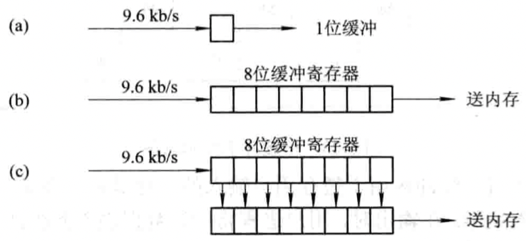

# 第六章 文件管理

[TOC]

## I/O系统的功能，模型和接口

### I/O系统的基本功能

1. 隐藏物理设备的细节

   I/O系统必须通过对设备加以适当的抽象，以隐藏掉物理设备的实现细节，仅向上层进程提供少量的，抽象的读/写命令，如read，write等。

2. 与设备的无关性

   - 用户不仅可以使用抽象的I/O命令，还可以使用抽象的逻辑设备名来使用设备；
   - 可以有效提高OS的可移植性和易适应性；

3. 提高处理机和I/O设备的利用率

4. 对I/O设备进行控制

   对I/O设备有四种控制方式：

   - 采用轮询的可编程I/O方式；
   - 采用中断的可编程I/O方式；
   - 直接存储器访问方式；
   - I/O通道方式。

5. 确保对设备的正确共享

   系统中的设备分为如下两类：

   - 独占设备
   - 共享设备

6. 错误处理

### I/O系统的层次结构和模型

1. I/O软件的层次结构

   

   *I/O系统的层次结构*

   - `用户层I/O软件` 实现与用户交互的接口，用户可直接调用该层所提供的，与I/O操作有关的库函数对设备进行操作；
   - `设备独立性软件` 用于实现用户程序与设备驱动器的统一接口，设备命名，设备的保护以及设备的分配与释放等，同时为设备管理和数据传送提供必要的存储空间；
   - `设备驱动程序` 与硬件直接相关，用于具体实现系统对设备发出的操作指令，驱动I/O设备工作的驱动程序；
   - `中断处理程序` 用于保存被中断进程的CPU环境，转入相应的中断处理程序进行处理，处理完毕再恢复被中断进程的现场后，返回到被中断的进程。

2. I/O系统中各种模块之间的层次视图

   

   *I/O系统中各模块之间的层次视图*

   - I/O系统的上，下接口
     - `I/O系统接口`
     - `软件/硬件(RW/HW)接口`
   - I/O系统的分层
     - `中断处理程序`
     - `设备驱动程序`
     - `设备独立性软件`

### I/O系统接口

1. 块设备接口
   - 块设备
   - 隐藏磁盘的二维结构
   - 将抽象命令映射为低层操作
2. 流设备接口
   - 字符设备
   - get和put操作
   - in-control指令
3. 网络通信接口

## I/O设备和设备控制器

### I/O设备

1. I/O设备的类型

   按使用特性分类：

   - 存储设备
   - I/O设备

   按传输速率分类：

   - 低速设备
   - 中速设备
   - 高速设备

2. 设备与控制器之间的接口

   

   *设备与控制器间的接口*

   - `数据信号线` 用于在设备和设备控制器之间传送数据信号；
   - `控制信号线` 作为由设备控制器向I/O设备发送控制信号时的通路；
   - `状态信号线` 用于传送指示设备当前状态的信号。

### 设备控制器

1. 设备控制器的基本功能

   - 接收和识别命令
   - 数据交换
   - 标识和报告设备的状态
   - 地址识别
   - 数据缓冲区
   - 差错控制

2. 设备控制器的组成

   

   *设备控制器的组成*

   - 设备控制器与处理机接口
     - 数据线
     - 地址线
     - 控制线
   - 设备控制器与设备的接口
   - I/O逻辑

### 内存映像I/O

设备寻址形式：

1. 利用特定的I/O指令

   

   *采用特定的指令形式*

2. 内存映像I/O

   
   
   *内存映像I/O形式*
   
### I/O通道

1. I/O通道设备的引入

   在CPU与I/O设备之间增加了`I/O通道（I/O Channel）`，其主要目的是为了建立独立的I/O操作，不仅使数据的传送能独立于CPU，而且也希望有关对I/O操作的组织，管理及其结束处理尽量独立，以保证CPU有更多的时间去进行数据处理。
   
   I/O通道与一般的处理机的不同表现在以下两个方面：
   
   - 由于通道硬件比较简单，其所能执行的命令，主要局限于与I/O操作有关的指令。
   - 通道没有自己的内存，通道所执行的通道程序是放在主机的内存中的，换言之，是通道与CPU共享内存。
   
2. 通道类型

   - 字节多路通道（Byte Multiplexor Channel）
   
     
   
     *字节多路通道的工作原理*
   
     **只要字节多路通道扫描每个子通道的速率足够快，而连接到子通道上的设备的速率又不是太高（不适用于高速设备），便不致丢失信息。**
   
   - 数组选择通道（Block Selector Channel）
   
   - 数组多路通道（Block Multiplexor Channel）
   
3. "瓶颈"问题
   
   
   
   *单通路I/O系统*
   
   
   
   *多通路I/O系统*
   

## 中断机构和中断处理程序

### 中断简介

1. 中断和陷入

   - `中断` CPU对I/O设备发来的中断信号的一种响应。CPU暂停正在执行的程序，保留CPU环境后，自动地转去执行该I/O设备的中断处理程序；执行完后，再回到断点，继续执行原来的程序；又称为外中断。
   - `陷入` 由CPU内部事件引起的中断；若系统发现了有陷入事件，CPU将暂停正在执行的程序，转去执行该陷入事件的处理程序；又称为内中断。

2. 中断向量表和中断优先级

   - `中断向量表` 为每种设备配以相应的中断处理程序，并把该程序的入口地址放在中断向量表的一个表项中。当I/O设备发来中断请求信号时，由中断控制器确定该请求的中断号，根据该设备的中断号去查找中断向量表，从中取得该设备中断处理程序的入口地址，这样便可以转入中断处理程序执行。
   - `中断优先级` 对于多个中断信号源，系统为他们分别规定不同的优先级。

3. 对多中断源的处理方式

   - `屏蔽（禁止）中断` 当处理机正在处理一个中断时，将屏蔽掉所有的中断（不适用于实时性要求高的场景）。
   - `嵌套中断` 在设置了中断优先级的系统中，通常按这样的规则来进行优先级控制：
     1. 当同时有多个不同优先级的中断请求时，CPU优先响应最高优先级的中断请求；
     2. 高优先级的中断请求可以抢占正在运行的低优先级中断的处理机。

   

   *对多中断的处理方式*

### 中断处理程序

中断处理程序的处理过程：

1. 测定是否有未响应的中断信号。

2. 保护被中断进程的CPU环境。

   

3. 转入相应的设备处理程序。

4. 中断处理。

5. 恢复CPU的现场并退出中断。

   退出中断之后，是否会返回到被中断的进程取决于：

   - 本中断是否采用了屏蔽（禁止）中断方式，若是，就会返回被中断的进程。
   - 采用的是中断嵌套方式，如果没有优先级更高的中断请求I/O，在中断完成后，仍会返回被中断的进程；反之，系统将处理优先级更高的中断请求。

*中断处理流程*

## 设备驱动程序

### 设备驱动程序概述

1. 设备驱动程序的功能
   - 接收由与设备无关的软件发来的命令和参数，并将命令中的抽象要求转换为与设备相关的底层操作序列。
   - 检查用于I/O请求的合法性，了解I/O设备的工作状态，传递与I/O设备操作有关的参数，设置设备的工作方式。
   - 发出I/O命令，如果设备空闲，便立即启动I/O设备，完成指定的I/O操作；如果设备忙碌，则将请求者的请求块挂在设备队列上等待。
   - 及时响应由设备控制器发来的中断请求，并根据其中断类型，调用相应的中断处理程序进行处理。
2. 设备驱动程序的特点
   - 驱动程序是实现在与设备无关的软件和设备控制器之间通信和转换的程序，具体说，它将抽象的I/O请求转换成具体的I/O操作后传送给控制器。又把控制器中所记录的设备状态和I/O操作完成情况，及时地反映给请求I/O的进程。
   - 驱动程序与设备控制器以及I/O设备的硬件特性紧密相关，对于不同类型的设备，应配置不同的驱动程序。但可以为相同的多个终端设置一个终端驱动程序。
   - 驱动程序与I/O设备所采用的I/O控制方式紧密相关，常用的I/O控制方式是中断驱动和DMA方式。
   - 由于驱动程序与硬件紧密相关，因而其中的一部分必须用汇编语言书写。目前有很多驱动程序的基本部分已经固化在ROM中。
   - 驱动程序应允许可重入。一个正在运行的驱动程序常会在一次调用完成前被再次调用。
3. 设备处理方式
   - 为每一类设备设置一个进程，专门用于执行这类设备的I/O操作。
   - 在整个系统中设置一个I/O进程，专门用于执行系统中所有各类设备的I/O操作。
   - 不设置专门的设备处理进程，而只为各类设备设置相应的设备驱动程序，供用户或系统进程调用。

### 设备驱动程序的处理过程

1. 将抽象要求转换为具体要求。

2. 对服务请求进行校验。

3. 检查设备的状态。

   

   *状态寄存器中的格式*

4. 传送必要的参数。

5. 启动I/O设备。

### 对I/O设备的控制方式

1. 使用轮询的可编程I/O方式

   

   *程序I/O和中断驱动方式的流程*

2. 使用中断的可编程I/O方式

   当某进程要启动某个I/O设备工作时，便由CPU向相应的设备控制器发出一条I/O命令，然后立即返回继续执行原来的任务。设备控制器按照该命令的要求去控制指定I/O设备。此时，CPU与I/O设备并行操作。

3. 直接存储器访问方式

   - 直接存储器访问方式的引入

     1. 数据传输的基本单位是数据块，即在CPU与I/O设备之间，每次传送至少一个数据块。
     2. 所传送的数据是从设备直接送入内存的，或者相反。
     3. 仅在传送一个或多个数据块的开始和结束时，才需CPU干预，整块数据的传送是在控制器的控制下完成的。

   - DMA控制器的组成

     DMA控制器由三部分组成：

     - 主机与DMA控制器的接口。
     - DMA控制器与块设备的接口。
     - I/O控制逻辑。

     

     *DMA控制器的组成*

     为了实现在主机与控制器之间成块数据的直接交换，DMA控制器需要设置如下寄存器：

     - `命令/状态寄存器CR` 用于接收从CPU发来的I/O命令，或有关控制信息，或设备的状态。
     - `内存地址寄存器MAR` 在输入时，它存放把数据从设备传送到内存的起始目标地址，在输出时，它存放由内存到设备的内存源地址。
     - `数据寄存器DR` 用于暂存从设备到内存，或从内存到设备的数据。
     - `数据计数器DC` 存放本次CPU要读或写的字（节）数。

   - CMA工作过程

     

     *DMA方式的工作流程图*

4. I/O通道控制方式

   - I/O通道控制方式的引入

     I/O通道方式是DMA方式的发展，它可进一步减少CPU的干预，即把对一个数据块的读（或写）为单位的干预，减少为对一组数据块的读（或写）及有关的控制和管理为单位的干预。同时，又可实现CPU，通道和I/O设备三者的并行操作，从而更有效地提高整个系统的资源利用率。

   - 通道程序

     通道指令包含如下信息：

     1. `操作码` 它规定了指令所执行的操作，如读，写，控制等操作。
     2. `内存地址` 标明字符送入内存（读操作）和从内存取出（写操作时的内存首址）。
     3. `计数` 表示本条指令所要读（或写）数据的字节数。
     4. `通道程序结束位P` 用于表示通道程序是否结束。$P=1$表示本条指令是通道程序的最后一条指令。
     5. `记录结束标志R` $R=0$表示本通道指令与吓一跳指令所处理的数据是同属于一个记录；$R=1$表示这是处理某记录的最后一跳指令。

## 与设备无关的I/O软件

### 与设备无关（Device Independence）软件的基本概念

1. 以物理设备名使用设备
2. 引入了逻辑设备名
3. 逻辑设备名称到物理设备名称的转换

### 与设备无关的软件

1. 设备驱动软件的统一接口

2. 缓冲管理

3. 差错控制

   错误分类：

   - 暂时性错误
   - 持久性错误

4. 对独立设备的分配与回收

   系统中设备分类：

   - 独占设备
   - 共享设备

5. 独立于设备的逻辑数据块

   

   *与设备无关软件的功能层次*

### 设备分配

1. 设备分配中的数据结构

   - 设备控制表DCT

     

     *设备控制表*

     在设备控制表中，除了用于指示设备类型的字段type和设备标识字段deviceid外，还应含有下列字段：

     1. `设备队列队首指针` 凡因请求本设备而未得到满足的进程，应将其PCB按照一定的策略排成一个设备请求队列，其队首指针指向队首PCB；
     2. `忙/闲标志` 用于表示当前设备的状态是忙或闲；
     3. `与设备连接的控制器表指针` 该指针指向该设备所连接的控制器的控制表；
     4. `重复执行次数` 由于外部设备在传送数据时较易发生数据传送错误，因而在许多系统中规定了设备在工作中发生错误时应重复执行的次数，在重复执行时，若能恢复正常传送，则认为传送成功，仅当重复执行次数达到规定值仍不成功时，才认为传送失败。

   - 控制器控制表，通道控制表和系统设备表

     1. `控制器控制表（COCT）` 
     2. `通道控制表（CHCT）`
     3. `系统设备表（SDT）`

     

     *COCT, CHCT和SDT表*

2. 设备分配时应考虑的因素

   1. 设备的固有属性
      - 独占设备的分配策略
      - 共享设备的分配策略
      - 虚拟设备的分配策略
   2. 设备分配算法
      - 先来先服务
      - 优先级高者优先
   3. 设备分配中的安全性
      - `安全分配方式` 每当进程发出I/O请求后，便进入阻塞状态，直到其I/O操作完成才被唤醒。
      - `不安全分配方式` 进程在发出I/O请求后仍继续运行，需要时又发出第二个I/O请求，第三个I/O请求等。仅当进程所请求的设备已被另一进程占用时，才进入阻塞状态。

3. 独占设备的分配程序

   1. 基本的设备分配程序
      - 分配设备
      - 分配控制器
      - 分配通道
   2. 设备分配程序的改进

### 逻辑设备名到物理设备名映射的实现

1. 逻辑设备表LUT（Logical Unit Table）

   

   *逻辑设备表*

2. 逻辑设备表的设置问题

   在系统中可采用以下方式设置逻辑设备表：

   - 在整个系统中只设置一张LUT

     由于系统中所有进程的设备分配情况都记录在同一张LUT中，因而不允许在LUT中具有相同的逻辑设备名，这就要求所有用户都不使用相同的逻辑设备名，主要用于单用户系统中。

   - 为每个用户设置一张LUT

     每当用户登录时，系统便为该用户建立一个进程，同时也为之建立一张LUT，并将该表放入进程的PCB中。

## 用户层的I/O软件

### 系统调度与库函数

1. 系统调用

   

   *系统调用的执行过程*

2. 库函数

### 假脱机（Spooling）系统

1. 假脱机技术

   `假脱机技术（Simultaneaus Periphernal Operation OnLine, SPOOLing）`

2. SPOOLing的组成

   

   *SPOOLing系统组成及工作原理*

   SPOOLing系统主要由以下部分组成：

   - 输入井和输出井
   - 输入缓冲区和输出缓冲区
   - 输入进程和输出进程
   - 井管理程序

3. SPOOLing系统的特点

   - 提高了I/O的速度
   - 将独占设备改造为共享设备
   - 实现了虚拟设备功能

4. 假脱机打印机系统

   - 磁盘缓冲区
   - 打印缓冲区
   - 假脱机管理进程和假脱机打印进程

5. 守护进程（daemon）

## 缓冲区管理

### 缓冲的引入

引入缓冲区的原因：

1. 缓和CPU与I/O设备间速度不匹配的矛盾。

2. 减少对CPU的中断频率，放宽对CPU中断响应时间的限制。

   

   *利用缓冲寄存器实现缓冲*

3. 解决数据粒度不匹配的问题

4. 提高CPU和I/O设备之间的并行性

### 单缓冲区和双缓冲区

1. 单缓冲区（Single BUffer）

   

   *单缓冲工作示意图*

2. 双缓冲区（Double Buffer）

   

   *双缓冲工作示意图*

   

   *双机通信时缓冲区的设置*

### 环形缓冲区

1. 环形缓冲区的组成

   - 多个缓冲区

     

     *环形缓冲区*

   - 多个指针

     作为输入的缓冲区可设置三个指针：

     1. 用于指示计算进程下一个可用缓冲区G的指针Nextg
     2. 指示输入进程下次可用的空缓冲区R的指针Nexti
     3. 用于指示计算进程正在使用的缓冲区C的指针Current

2. 环形缓冲区的使用

   - Getbuf过程
   - Releasebuf过程

3. 进程之间的同步问题

   - Nexti指针追赶上Nextg指针，这意味着输入进程输入数据的速度大于计算进程处理数据的速度，已把全部可用的空缓冲区装满，再无缓冲区可用。
   - Nextg指针追赶上Nexti指针，这意味着输入数据的速度低于计算进程处理数据的速度，使全部装有输入数据的缓冲区都被抽空，再无装有数据的缓冲区供计算进程提取数据。

### 缓冲池（Buffer Pool）

缓冲池与缓冲区的区别在于：缓冲区仅仅是一组内存块的链表，而缓冲池是包含了一个管理的数据结构及一组操作函数的管理机制，用于管理多个缓冲区。

1. 缓冲池的组成

   将缓冲池中具有相同类型的缓冲区连接成一个队列，可以形成以下三个队列：

   - 空白缓冲队列emq
   - 输入队列inq
   - 输出队列outq

2. Getbuf过程和Putbuf过程

3. 缓冲区的工作方式

   

   *缓冲区的工作方式*

   1. 收容输入
   2. 提取输入
   3. 收容输出
   4. 提取输出

## 磁盘存储器的性能和调度

### 磁盘性能简述

1. 数据的组织和格式

   *磁盘的结构和布局*

   每个扇区包含两个字段：

   - `标识符字段（ID Field）` 一个字节的SYNCH具有特定的位图像，作为该字段的定界符，利用磁道号（Track），磁头号（Head #）及扇区号（Sectors #）三者来标识一个扇区；CRC字段用于段校验。
   - `数据字段（Data Field）` 存放512个字节的数据。*磁盘的格式化*

2. 磁盘的类型

   - 固定头磁盘
   - 移动头磁盘

3. 磁盘访问时间

   - 寻道时间$T_s$ ，把磁臂移动到指定磁道上所经历的时间即：

     $T_s = m \times n + s$

     - $m$ 常数，一般磁盘$m = 0.2$，高速磁盘$m \leqslant 0.1$；
     - $s$ 磁臂启动时间；
     - $n$ 磁头移动的磁道条数；

   - 旋转延迟时间$T_t$，指定扇区移动到磁头下面所经历的时间；

     不同的磁盘转速不一样，如软盘300r/min，硬盘7200r/min~15000r/min；...。

   - 传输时间$T_t$，把数据从磁盘读出或向磁盘写入数据所经历的时间；

     $T_t = \frac{b}{rN}$

     - $b$ 每次所读写的字节数；
     - $r$ 磁盘每秒钟的转数；
     - $N$ 一条磁道上的字节数；

   **适当地集中数据传输，将有利于提高传输效率。**

### 早期的磁盘调度算法

1. 先来先服务（FCFS）

   FCFS仅适用于请求磁盘I/O的进程数目较少的场合。

2. 最短寻道时间优先（SSTF）

   要求访问的磁道与当前磁头所在的磁道距离最近，以使每次的寻道时间最短，但这种算法不能保证平均寻道时间最短。

   

   *FCFS调度算法*

   

   *SSTF调度算法*

### 基于扫描的磁盘调度算法

1. 扫描（SCAN）算法

   SCAN算法又叫电梯算法，不仅考虑道仅访问的磁道与当前磁道间的距离，更优先考虑的是磁头当前的移动方向。

   

   *SCAN调度算法示例*

2. 循环扫描（CSCAN）算法

   

   *CSCAN调度算法示例*

3. NStepSCAN和FSCAN调度算法

   - NStepSCAN算法
   - FSCAN算法