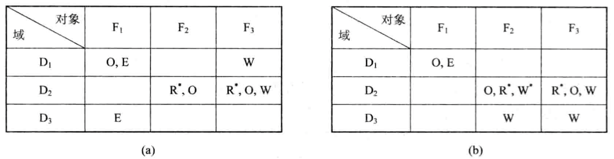

# 第七章 文件管理

[TOC]

## 7.1 文件和文件系统

### 7.1.1 数据项，记录和文件

1. 数据项

   - `基本数据项` 用于描述一个对象的某种属性的字符集，是数据组织中可以命名的最小逻辑数据单位，又称为字段。
   - `组合数据项` 是由若干个基本数据项组成的，简称组项。

2. 记录

   一组相关数据项的集合，用于描述一个对象在某方面的属性。

3. 文件

   文件是指由创建者所定义的，具有文件名的一组相关元素的集合，可分为有结构文件和无结构文件两种。

   文件属性包括：

   - 文件类型；
   - 文件长度；
   - 文件的物理位置；
   - 文件的建立时间。

   

   *文件，记录和数据项之间的层次关系*

### 7.1.2 文件名和类型

1. 文件名和扩展名

   - 文件名
   - 扩展名

2. 文件类型

   按用途分类：

   - 系统文件
   - 用户文件
   - 库文件

   按文件中数据的形式分类：

   - 源文件
   - 目标文件
   - 可执行文件

   按存取控制属性分类

   - 只执行文件
   - 只读文件
   - 读写文件

   按组织形式和处理方式分类：

   - 普通文件
   - 目录文件
   - 特殊文件

### 7.1.3 文件系统的层次结构

1. 对象及其属性

   

   *文件系统模型*

   文件管理系统管理的对象如下：

   - 文件
   - 目录
   - 磁盘（磁带存储空间）

2. 对对象操作和管理的软件集合

   该层是文件管理系统的核心部分，实现了以下功能：

   - 对文件存储空间的管理；
   - 对文件目录的管理；
   - 用于将文件的逻辑地址转换为物理地址的机制；
   - 对文件读和写的管理；
   - 对文件的共享与保护等功能。

   把与文件系统有关的软件分为四个层次：

   1. `I/O控制层` 是文件系统最底层，也称为设备驱动程序层；
   2. `基本文件系统层` 用于处理内存与磁盘之间数据块的交换；
   3. `基本I/O管理程序` 用于完成与磁盘I/O有关的事务；
   4. `逻辑文件系统` 用于处理与记录和文件相关的操作；

3. 文件系统的接口

   - `命令接口` 用户与文件系统直接交互的接口，通过键盘等终端交互；
   - `程序接口` 用户程序与文件系统的接口，通过系统调用取得文件系统的服务。

### 7.1.4 文件操作

1. 最基本的文件操作
   - 创建文件
   - 删除文件
   - 读文件
   - 写文件
   - 设置文件的读/写位置
2. 文件的“打开”和“关闭”操作
3. 其他文件操作

## 7.2 文件的逻辑结构

系统中所有文件都存在以下两种形式的文件结构：

- `文件的逻辑结构（File Logical Structure）`
- `文件的物理结构`

### 7.2.1 文件逻辑结构的类型

按文件是否有结构分类：

- 有结构文件
  - 定长记录
  - 变长记录
- 无结构文件

按文件的组织方式分类：

- 顺序文件
- 索引文件
- 索引顺序文件

### 7.2.2 顺序文件（Sequential File）

1. 顺序文件的排列方式

   - 串结构
   - 顺序结构

2. 顺序文件的优缺点

   | 优点                     | 缺点                                                        |
   | ------------------------ | ----------------------------------------------------------- |
   | - 适用于批量存取的场景； | - 对于单个文件的访问效率很低； - 增加/删除文件比较困难； |

### 7.2.3 记录寻址

1. 隐式寻址方式

   

   *定长和变长记录文件*

2. 显式寻址方式

   用于定长记录的文件实现直接或随机访问：

   - 通过文件中记录的位置

     对于定长记录文件，根据公式：$A_i = i \times L$获得第$i$个记录相对于第一个记录首址的地址；

     对于可变长记录，根据公式：$A_i = \sum_{i=0}^{i-1} L_i + 1$计算出第$i$个记录的首址。

   - 利用关键字

     指定一个字段作为关键字，通过指定的关键字来查找该记录。

### 7.2.4 索引文件（Index File）

1. 按关键字建立索引

   

   *具有单个和多个索引表的索引文件*

2. 具有多个索引表的索引文件

   索引文件的主要优点是：它将一个需要顺序查找的文件改造成一个可随机查找的文件，极大地提高了对文件的查找速度。同时，利用索引文件插入和删除记录也非常方便。

### 7.2.5 索引顺序文件（Index Sequential File）

1. 索引顺序文件的特征

   索引顺序文件是对顺序文件的一种改进，基本上克服了变长记录的顺序文件不能随机访问，以及不便于记录的删除和插入的缺点；同时新增了以下特性：

   - 引入了文件索引表，用来对索引顺序文件的随机访问；
   - 增加了溢出（overflow）文件，用来记录新增加的，删除的和修改的记录。

2. 一级索引顺序文件

   

   *索引顺序文件*

3. 二级索引顺序文件

### 7.2.6 直接文件和哈希文件

1. 直接文件

   对于直接文件，可根据给定的关键字直接获得指定记录的物理地址；关键字本身决定了记录的物理地址，由关键字到记录物理地址的转换称为`键值转换（Key to address transformation）`。

2. 哈希（Hash）文件

   利用Hash函数将关键字转换为相应记录的地址。

   

   *Hash文件的逻辑结构*

## 7.3 文件目录

目录管理要求：

1. 实现“按名存取”
2. 提高对目录的检索速度
3. 文件共享
4. 允许文件重名

### 7.3.1 文件控制块和索引结点

1. 文件控制块FCB（File Control Block）

   基本信息类：

   - 文件名
   - 文件物理位置
   - 文件逻辑结构
   - 文件的物理结构

   存取控制信息类：

   包括文件主的存取权限，核准用户的存取权限以及一般用户的存取权限。

   使用信息类：

   

   *MS-DOS的文件控制块*

2. 索引结点

   - 索引结点的引入

     

     *UNIX的文件目录*

   - 磁盘索引结点

     每个文件都有唯一的一个磁盘索引结点，它包括以下内容：

     1. 文件主标识符
     2. 文件类型
     3. 文件存取权限
     4. 文件物理地址
     5. 文件长度
     6. 文件连接计数
     7. 文件存取时间

   - 内存索引结点

     1. 索引结点编号
     2. 状态
     3. 访问计数
     4. 文件所属文件系统的逻辑设备号
     5. 链接指针

### 7.3.2 简单的文件目录

1. 单级文件目录

   最简单的文件目录，在整个文件系统中只建立一张目录表，每个文件占一个目录项。

   *单级文件目录*

   缺点：

   - 查找速度慢；对于一个具有$N$个目录项的单级目录，为检索出一个目录项，平均需要查找$N/2$个目录项。
   - 不允许重名；
   - 不便于实现文件共享；单级目录要求所有用户只能用同一个名字访问同一个文件，只适用于单用户环境。

2. 两级文件目录

   

   *两级文件目录*

   优点：

   - 提高了检索目录的速度；如果在主目录中有$n$个子目录，每个用户目录最多为$m$个目录项，为查找一指定的目录项，最多只需检索$n + m$个目录项。
   - 在不同的用户目录中，可以使用相同的文件名；
   - 不同用户还可以使用不同的文件名访问系统中的同一个共享文件。

### 7.3.3 树形结构目录（Tree-Structured Directory）

1. 树形目录

   

   *多级目录结构（方框代表目录文件，源泉代表数据文件）*

2. 路径名和当前目录

   - `路径名（path name）`
   - `当前目录（Current Directory）`
     - `相对路径名（relative path name）` 当前目录开始直到数据文件为止所构成的路径名称。
     - `绝对路径名（absolute path name）` 从树根开始的路径名称。

3. 目录操作

   1. 创建目录

   2. 删除目录

      当目录不为空是，采用以下方法处理：

      - 不删除非空目录
      - 可删除非空目录

   3. 改变目录

   4. 移动目录

   5. 链接（Link）操作

   6. 查找

### 7.3.4 目录查询技术

对目录进行查询的方式：

1. 线性检索法

   又称为顺序检索法；例：

   

   *查找/usr/ast/mbox的步骤*

2. Hash方法

   建立一张Hash索引文件目录，利用Hash方法进行查询。

   在进行文件名转换时，有可能把$n$个不同的文件名转换为相同的Hash值，此时出现冲突，处理冲突的规则是：

   - 在利用Hash法索引查找目录时，如果目录表中相应的目录项是空的，则表示系统中并无指定文件。
   - 如果目录项中的文件名与指定文件名相匹配，则表示该目录项是所要寻找的文件所对应的目录项，故而可从中找到该文件所在的物理地址。
   - 如果在目录表的相应目录项中的文件名与指定文件名不匹配，则表示发生了冲突，此时须将其Hash再加上一个常数（该常数与目录长度互质），形成新的索引值，再返回第一步重新开始查重。

## 7.4 文件共享

### 7.4.1 基于有向无循环图实现文件共享

1. 有向无循环图DAG（Directed Acyclic Graph）

   

   *有向无循环图目录层次*

2. 利用索引结点

   

   *基于索引结点的共享方式*

   

   *进程B链接前后的情况*

### 7.4.2 利用符号链接实现文件共享

1. 利用符号链接（Symbolic Linking）的基本思想

   

   *使用符号链接的目录层次*

2. 如何利用符号链实现共享

3. 利用符号链实现共享的优点

4. 利用符号链的共享方式存在的问题

   当其他用户去读共享文件时，系统根据给定的文件路径名逐个分量（名）地去查找目录，直到找到该文件的索引结点；因此，在每次访问共享文件时，都可能要多次地读盘，开销比较大；

   其次符号链本质是一个文件，也需要耗费一定的磁盘空间。

   当遍历整个文件系统时，将会多次遍历到该共享文件，有可能对一个共享文件产生多个拷贝。

## 7.5 文件保护

影响文件安全性的主要因素：

1. 人为因素
2. 系统因素
3. 自然因素

确保文件系统安全性的措施：

1. 通过存取控制机制，防止人为因素；
2. 采取系统容错技术，防止系统部分的故障造成的文件的不安全性；
3. 建立后备系统，防止由自然因素造成的不安全性。

### 7.5.1 保护域（Protection Domain）

1. 访问权

   一个进程能对某对象执行操作的权力，称为`访问权（Access right）`；每个访问权可以用一个有序对（对象名，权集）来表示。

2. 保护域

   进程对一组对象访问权的集合，称为`保护域`。

   

   *三个保护域*

3. 进程和域的静态联系

   `静态域` 进程与域为一对一的关系，在进程的整个生命周期中，其可用资源是固定的。

4. 进程和域间的动态联系

   `动态域` 进程与域为一对多的关系。

### 7.5.2 访问矩阵

1. 基本的访问矩阵

   `访问矩阵（Access Matrix）` 用来描述系统的访问控制的矩阵。

   

   *一个访问矩阵*

2. 具有域切换权的访问矩阵

   

   *具有切换权的访问控制矩阵*

### 7.5.3 访问矩阵的修改

1. 拷贝权（Copy Right）

   利用拷贝权为进程在其它的域中也赋予对同一对象的访问权$(access(k, j))$。

   

   *具有拷贝权的访问控制矩阵*

2. 所有权（Owner Right）

   

   *带所有权的访问矩阵*

3. 控制权（Control Right）

   

   *具有控制权的访问矩阵*

### 7.5.4 访问矩阵的实现

1. 访问控制表（Access Control List， ACL）

2. 访问权限（Capabilities）表

   

   *访问权限表*

   - `类型` 说明对象的类型
   - `权力` 域$D_2$对该对象所拥有的访问权限
   - `对象` 一个指向相应对象的指针（对于UNIX系统来说，它就是索引结点的编号）