# 第八章 磁盘存储器的管理

[TOC]

## 8.1 外存的组织方式

### 8.1.1 连续组织方式

连续组织方式又称为连续分配方式，要求为每一个文件分配一组相邻接的盘块，通常他们都位于一条磁道上，在进行读/写时，不必移动磁头。这样所形成的文件结构称为顺序文件结构，此时的物理文件称为顺序文件。

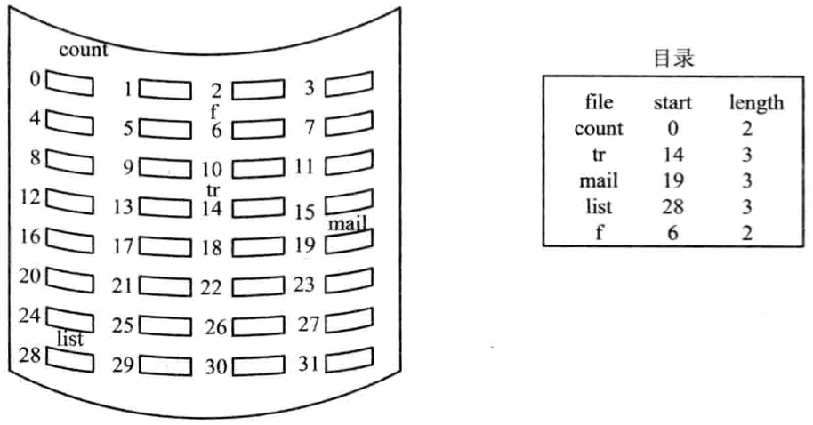

*磁盘空间的连续组织方式*

优点：

1. 顺序访问容易。
2. 顺序访问速度快。

缺点：

1. 要求为一个文件分配连续的存储空间，这样容易产生许多外部碎片，严重降低外存空间的利用率。
2. 必须事先知道文件的长度。
3. 不能灵活地删除和插入记录。
4. 对于那些动态增长的文件，由于事先很难知道文件的最终大小，因而很难为其分配空间。

### 8.1.2 链接组织方式

**隐式链接**

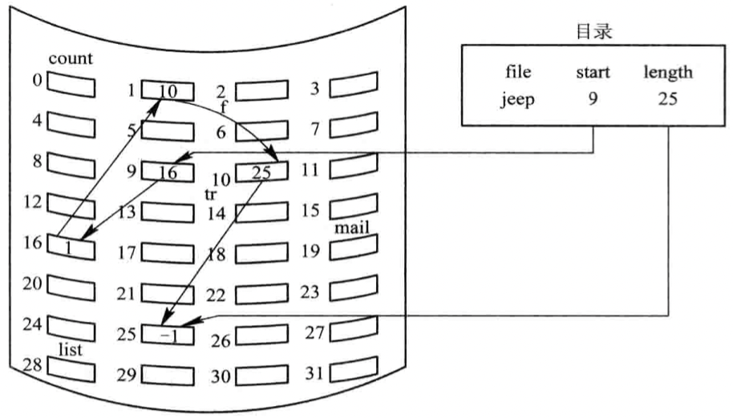

*磁盘空间的链式分配*

**显式链接**

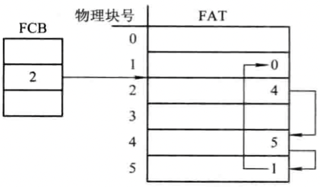

*显式链接结构*

链接组织方式的优点：

1. 消除了磁盘的外部碎片，提高了外存的利用率。
2. 对插入，删除和修改记录都非常容易。
3. 能适应文件的动态增长，无需事先知道文件的大小。

### 8.1.3 FAT技术

1. FAT12

   1. 早期的FAT12文件系统

      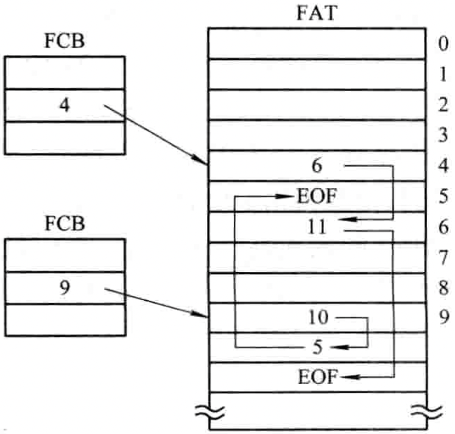

      *MS-DOS的文件物理结构*

   2. 以簇为单位的FAT12文件系统

      簇是一组相邻的扇区，在FAT中它是作为一个虚拟扇区；在进行盘块分配时，是以簇作为分配的基本单位；簇的大小一般是2n个盘块。

2. FAT16

3. FAT32

   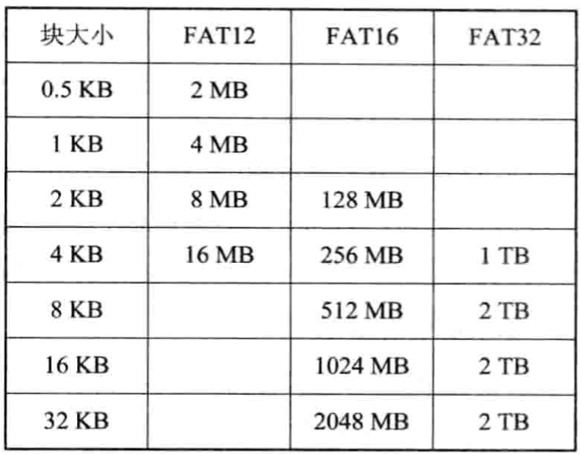

   *FAT中簇的大小与最大分区的对应关系*

### 8.1.4 NTFS的文件组织方式

1. NTFS新特性

   - 使用64位磁盘地址。
   - 支持长文件名，单个文件名限制在255个字符以内，全路径名为32767个字符。
   - 具有系统容错功能；
   - 能保证系统中的数据一致性。

2. 磁盘组织

   NTFS采用逻辑符号LCN(Logical Cluster Number)和虚拟簇号VCN(Virtual Cluster Number)进行。

   LCN以卷为单位，将整个卷中所有的簇按顺序进行简单的编号，NTFS在进行地址映射时，可以通过卷因子与LCN的乘积，算出卷上的物理字节偏移量，从而得到文件数据所在的物理磁盘地址。

3. 文件的组织

   在NTFS中，以卷为单位，将一个卷中的所有文件信息，目录信息以及可用的未分配空间信息，都以文件记录的方式记录在一张主控文件表MFT(Master File Table)中。

### 8.1.5 索引组织方式

1. 单级索引组织方式

   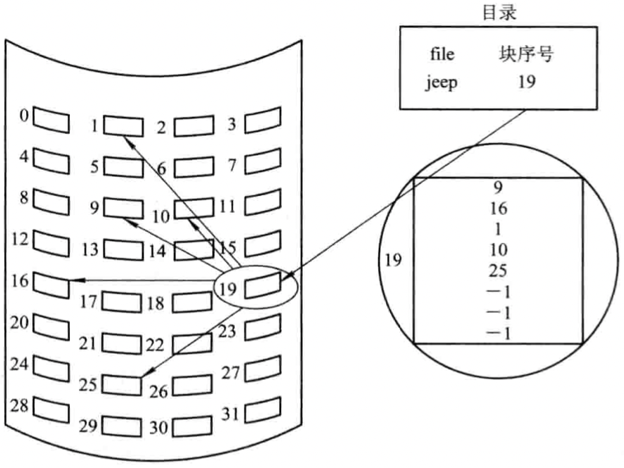

   *索引分配方式*

2. 多级索引组织方式

   采用两级索引时，所允许的文件最大长度为64MB；若盘块的大小为4KB，在采用单级索引时所允许的最大文件长度为4MB，而在采用两级索引时所允许的最大文件长度可达4GB。

   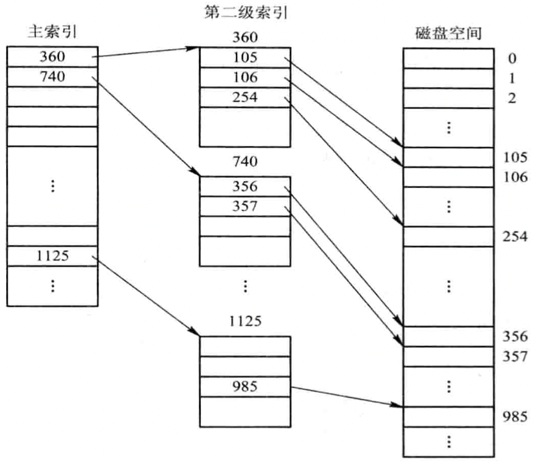

   *两级索引分配*

   **优点**

   1. 大大加快了对大型文件的查找速度。

   **缺点**

   1. 在访问一个盘块时，其所需启动磁盘的次数随着索引级数的增加而增多。

3. 增量式索引组织方式

   1. 增量式索引组织方式的基本思想
   2. UNIX System V的组织方式
      - 直接地址。
      - 一次间接地址。
      - 多次间接地址。

   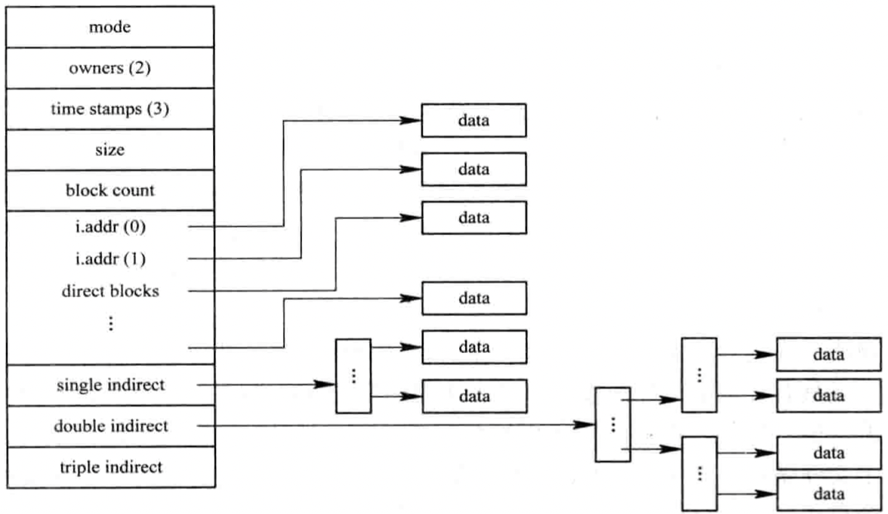

   *混合索引方式*

## 8.2 文件存储空间的管理

### 8.2.1 空闲表法和空闲链表法

1. 空闲表法

   1. 空闲表

      系统为外存上所有空闲区建立一张空闲表，每个空闲表对应于一个空闲表项，其中包括表项序号，该空闲区的第一个盘块号，该区的空闲盘块数等信息。再将所有空闲区按其起始盘块号递增的次序排列，形成空闲盘块表。

      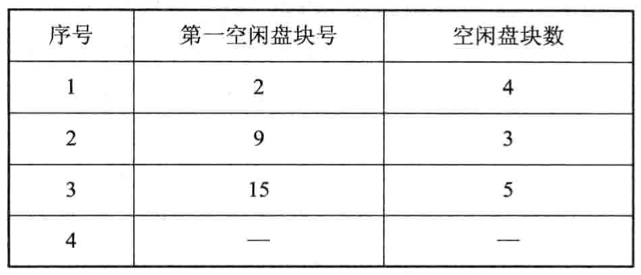

      *空闲盘块表*

   2. 存储空间的分配与回收

      在系统为某新创建的文件分配空闲盘块时，先顺序地检索空闲表的各表项，直到找到第一个其大小能满足要求的空闲区，再将该盘区分配给用户（进程），同时修改空闲表。

2. 空闲链表法

   1. 空闲盘块链

      将磁盘上的所有空闲空间以盘块为单位拉成一条链，其中的每一个盘块都有指向后继盘块的指针。当用户因创建文件而请求分配存储空间时，系统从链首开始，依次摘下适当数目的空闲盘块分配给用户。当用户因删除文件而释放存储空间时，系统将回收的盘块依次挂在空闲盘块链的末尾。

   2. 空闲盘区链

      将磁盘上的所有空闲盘区（每个盘区可包含若干个盘块）拉成一条链。在每个盘区上除含有用于指示下一个空闲盘区的指针外，还应有能指明本盘区大小（盘块数）的信息。

### 8.2.2 位示图法

1. 位示图

   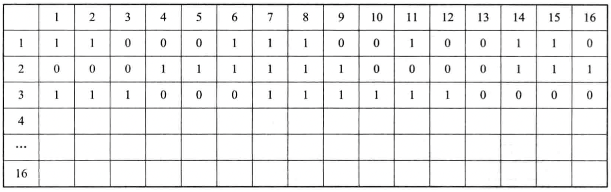

   *位示图*

   - 0 盘块空闲。
   - 1 盘块已分配。

2. 盘块的分配

   盘块分配步骤：

   1. 顺序扫描位示图，从中找出一个或一组其值为“0”的二进制位（“0”表示空闲时）。

   2. 将所找到的一个或一组二进制位转换成与之相应的盘块号。

      盘块号计算公式：

      $b = n(i - 1) + j$

      - $n$ 每行的位数。
      - $i$ 行号。
      - $j$ 列号。

   3. 修改位示图，令$map[i, j] = 1$。

3. 盘块的回收

   盘块的回收分2步：

   1. 将回收盘块的盘块号转换成位示图中的行号和列号。转换公式为：

      $i = (b - 1)DIV\ n + 1$

      $j = (b - 1)MOD\ n + 1$

   2. 修改位示图。令$map[i, j] = 0$。

### 8.2.3 成组链接法

1. 空闲盘块的组织

   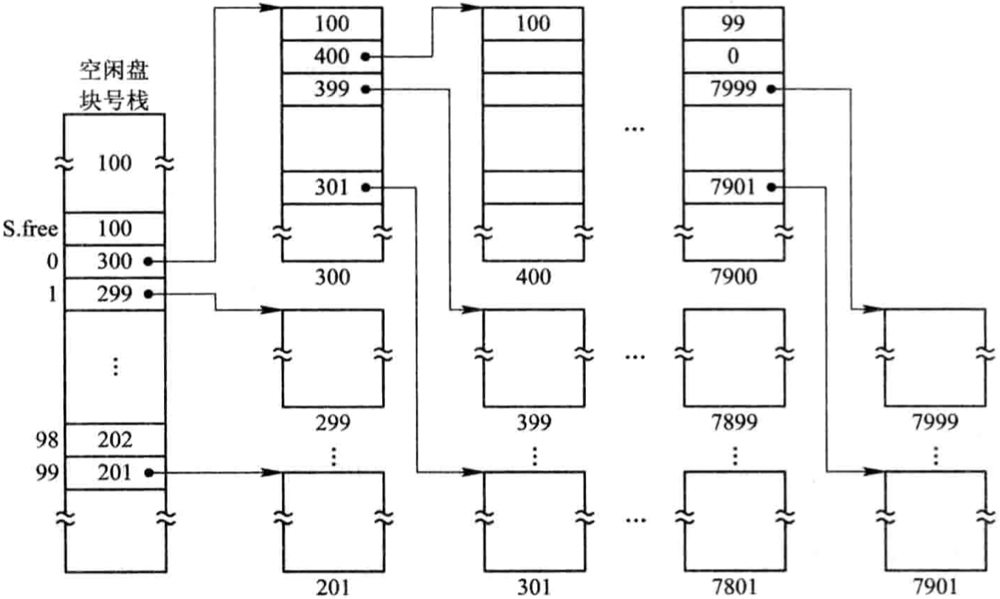

   *空闲盘块的成组链接法*

   1. 空闲盘块号栈，用来存放当前可用的一组空闲盘块的盘块号（最多含100个号），以及栈中尚有的空闲盘块（号）数N。
   2. 文件去中的所有空闲盘块被分成若干组。
   3. 将每一组含有的盘块总数N和该组所有的盘块号记入其前一组的第一个盘块的`S.free(0)~S.free(99)`中。这样，由各组的第一个盘块可链成一条链。
   4. 将第一组的盘块总数和所有的盘块号记入空闲盘块号栈中，作为当前可供分配的空闲盘块号。
   5. 最末一组只有99个盘块，其盘块号分别记入其前一组的`S.free(1)~S.free(99)`中，而在`S.free(0)`中则存放“0”，作为空闲盘块链的结束标识。

2. 空闲盘块的分配与回收

   分配过程：

   回收过程：

## 8.3 提高磁盘I/O速度的途径

提高文件系统性能的着手点：

1. 改进文件的目录结构以及检索目录的方法来减少对目录的查找时间；
2. 选取好的文件存储结构，以提高对文件的访问速度；
3. 提高磁盘的I/O速度，能将文件中的数据快速地从磁盘传送到内存中，或者相反。

### 8.3.1 磁盘高速缓存（Disk Cache）

1. 数据交付(Data Delivery)方法

   - 数据交付，直接将高速缓存中的数据传送到请求者进程的内存工作区中；
   - 指针交付，只将指向高速缓存中某区域的指针交付给请求者进程。

2. 置换算法

   - 访问频率。
   - 可预见性。
   - 数据的一致性。

3. 周期性地写回磁盘

   在UNIX系统中专门增设了一个修改（update）程序，使之在后台运行，该程序周期性地执行一个系统调用SYNC。强制性地将所有在高速缓存中已修改的盘块数据写回磁盘。

### 8.3.2 提高磁盘I/O速度的其它方法

1. 提前读

   在读当前块时，将下一个盘块（提前读的块）中的数据也读入缓冲区。

2. 延迟写

   将缓冲区中的数据挂在空闲缓冲区队列的末尾，当再有进程申请到该缓冲区时，才将该缓冲区中的数据写入磁盘。

3. 优化物理块的分布

   尽量将属于同一个文件的盘块安排在同一条磁道上或相邻的磁道上，以减少磁头的移动。

4. 虚拟盘

   虚拟盘，又称为RAM盘；利用内存空间去仿真磁盘，该盘的设备驱动程序也可以接受所有标准的磁盘操作，但这些操作的执行不是在磁盘上而是在内存中。

### 8.3.3 廉价磁盘冗余阵列(RAID)

`磁盘冗余阵列(Redundant Array of Inexpensive Disk, RAID)`

1. 并行交叉存取

   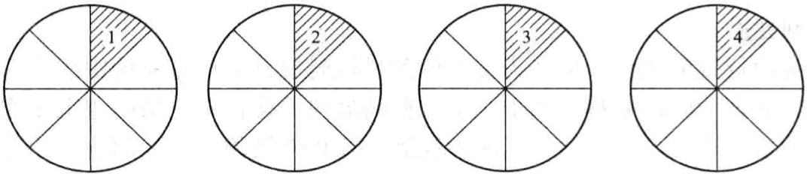

   *磁盘并行交叉存取方式*

   在一个系统中有多个磁盘驱动器，系统将每一盘块中的数据分为若干个子盘块数据，再分别存储到不同磁盘中；当需要读取磁盘数据时，采用并行传输方式，将各个盘块中的数据同时向内存传输，大大减少传输时间。

2. RAID的分级

   - RAID 0：仅提供并行交叉存取。
   - RAID 1：具有磁盘镜像功能。
   - RAID 3：具有并行传输功能的磁盘阵列。
   - RAID 5：具有独立传送功能的磁盘阵列。
   - RAID 6：强化的RAID，在阵列中设置一个专用的，可快速访问的异步校验盘，具有独立的数据访问通路。
   - RAID 7：强化的RAID，在阵列中的所有磁盘都具有较高的传输速率和优异的性能。

3. RAID的优点

   - 可靠性高。
   - 磁盘I/O速度高。
   - 性能/价格比高。

## 8.4 提高磁盘可靠性的技术

### 8.4.1 第一级容错技术 SFT-1

1. 双份目录和双份文件分配表

   在不同的磁盘上或磁盘的不同区域中分别建立（双份）目录表和FAT（一份为主目录及主FAT，另一份为备份目录及备份FAT）。一旦由于磁盘表面缺陷造成主文件目录或主FAT的损坏时，系统便自动启用备份文件目录及备份FAT，从而保证磁盘上数据的可访问性。

2. 热修复重定向和写后读校验

   在磁盘表面有少量缺陷的情况下，可采取以下补救措施：

   - 热修复重定向：系统将磁盘容量的很小一部分（例如2%～2%）作为热修复重定向区，用于存放当发现磁盘有缺陷时的待写数据，并对写入该区的所有数据进行登记，以便于以后对数据进行访问。
   - 写后读校验方式：为保证所有写入磁盘的数据都能写入到完好的盘块中，应该在每次向磁盘中写入一个数据块后，又立即将它读出，并送至另一个缓冲区中，再将该缓冲区内容与内存缓冲区中在写后仍保留的数据进行比较，若两者一致，便认为此次写入成功；否则，再重写。若重写后两者仍不一致，则认为该盘块有缺陷，此时，便将应写入该盘块的数据写入到热修复重定向区中。

### 8.4.2 第二级容错技术SFT-2

1. 磁盘镜像（Disk Mirroring）

   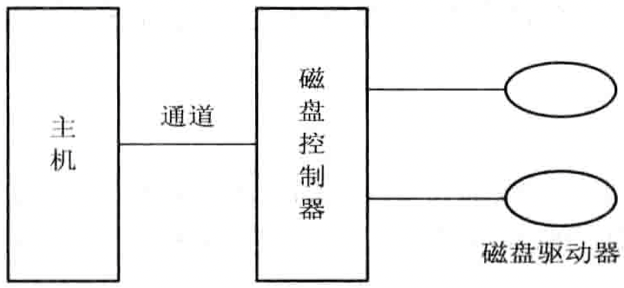

   *磁盘镜像示意图*

   在同一磁盘控制器下，增设一个完全相同的磁盘驱动器。

2. 磁盘双工（Disk Duplexing）

   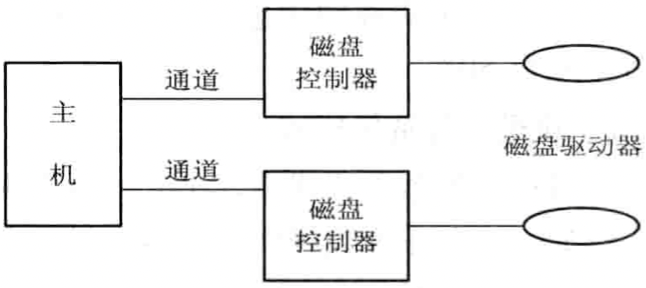

   *磁盘双工示意图*

   将两台磁盘驱动器分别接到两个磁盘控制器上，同样使这两台磁盘机镜像成对。

### 8.4.3 基于集群技术的容错功能

1. 双机热备份模式

   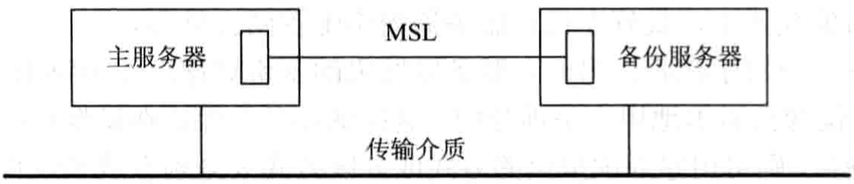

   *双机热备份模式*

   `镜像服务器链路MSL(Mirrored Server Link)`

2. 双机互为备份模式

   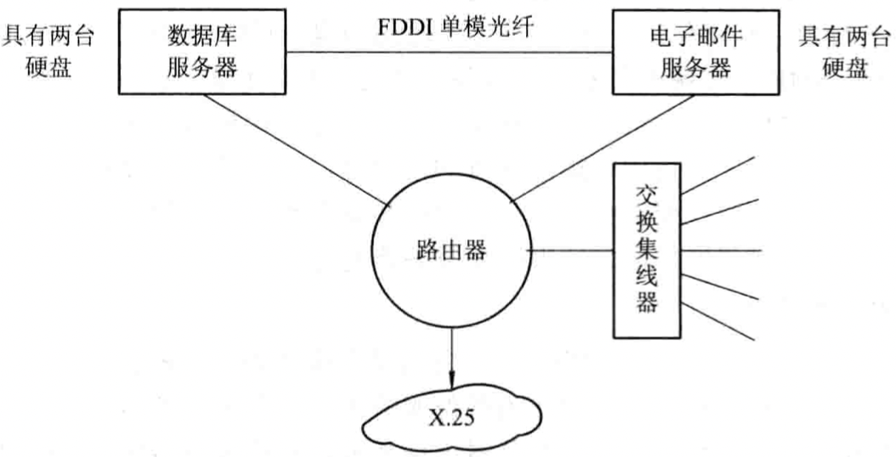

   *双机互为备份系统的示意图*

3. 公用磁盘模式

   将多台计算机连接到一台公共的磁盘系统上，该公共磁盘被划分为若干个卷。每台计算机使用一个卷。如果某台计算机发生故障，此时系统将重新进行配置，根据某种调度策略来选择另一台替代机器。这种模式消除了信息的复制时间，减少了网络和服务器的开销。

### 8.4.4 后备系统

1. 磁带机

2. 硬盘

   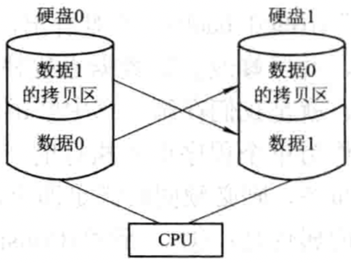

   *利用大容量硬盘兼做后备系统*

   - 移动磁盘。
   - 固定硬盘驱动器。

3. 光盘驱动器

   - 只读光盘驱动器CD-ROM和DVD-ROM。
   - 可读写光盘驱动器。

## 8.5 数据一致性控制

### 8.5.1 事务

1. 事务的定义

   事务是用于访问和修改各种数据项的一个程序单位；可以看做是一系列相关读/写操作；事务必须同时具备以下属性(ACID)：

   - `原子性（Atomic）`；
   - `一致性（Consistent）`事务在完成时，必须使所有的数据都保持一致状态；
   - `隔离性（Isolated）`一个事务对数据所作的修改，必须与任何其它与之并发事务相隔离；
   - `持久性（Durable）` 事务完成后，对系统的影响是永久性的。

2. 事务记录(Transaction Record)

   运行记录(Log)，包括以下字段：

   - `事务名` 用于标识该事务的唯一名字；
   - `数据项名` 被修改数据项的唯一名字；
   - `旧值` 修改前数据项的值；
   - `新值` 修改后数据项奖具有的值。

3. 恢复算法

   - $undo <T_i>$ 该过程把所有被事务$T_i$修改过的数据恢复为修改前的值。
   - $redo <T_i>$ 该过程能把所有被事务$T_i$修改过的数据设置为新值。

### 8.5.2 检查点

1. 检查点(Check Points)的作用

   引入检查点的主要目的是，使对事务记录表中事务记录的清理工作经常化，即每隔一定时间便执行下述工作：

   1. 将驻留在易失性存储器（内存）中的当前事务记录表中的所有记录输出到稳定存储器中；
   2. 将驻留在易失性存储器中的所有已修改数据输出到稳定存储器中；
   3. 将事务记录表中的（检查点）记录输出到稳定存储器中；
   4. 每当出现一个（检查点）记录时，系统利用redo和undo过程实现恢复功能。

2. 新的恢复算法

   如果把所有在事务$T_i$以后开始执行的事务表示为事务集$T$，则新的恢复操作要求是：对所有在$T$中的事务$T_k$，如果在事务记录表中出现了$(T_k托付)$记录，则执行$redo(T_k)$操作；反之，如果在事务记录表中并未出现$(T_k托付)$记录，则执行$undo(T_k)$操作。

### 8.5.3 并发控制(Concurrent Control)

1. 利用互斥锁实现“顺序性”。
2. 利用互斥锁和共享锁实现顺序性。

### 8.5.4 重复数据的数据一致性问题

1. 重复文件的一致性

   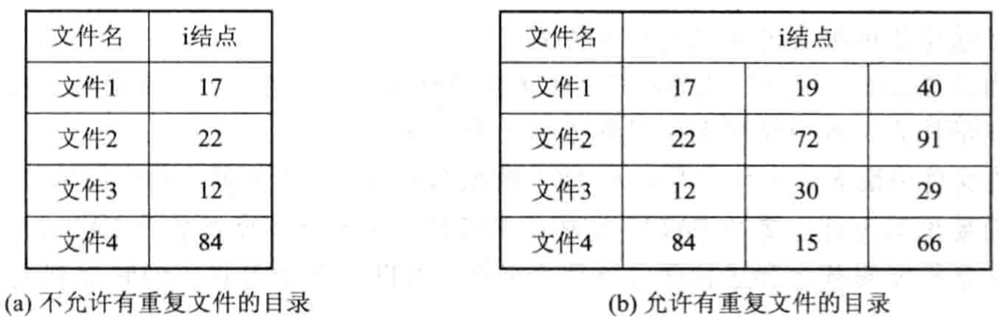

   *UNIX类型的目录*

2. 链接数一致性检查

   在共享文件的索引节点中有一个链接计数count，用来指出共享本文件的用户（进程）数。配置一张计数器表，为每个文件建立一个表项，其中含有该索引节点号的计数值。在进行检查时，从根目录开始查找，每当在目录中遇到该索引节点号时，便在该计数器表中相应文件的表项上+1。将文件索引节点的链接计数count与计数器表中的索引节点计数值进行比较，即可判断是否发生了链接数据不一致错误。

