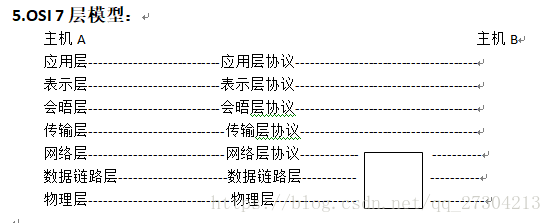
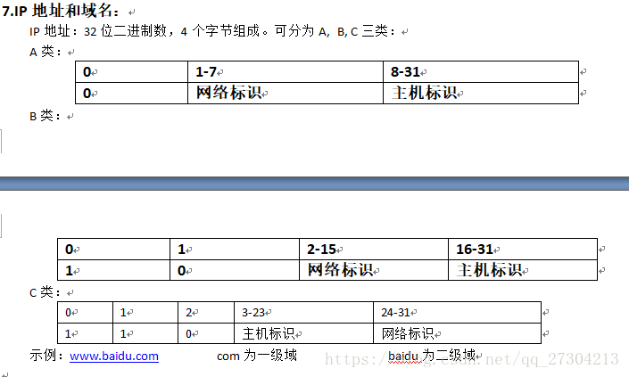
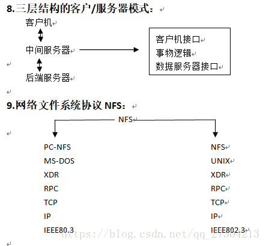
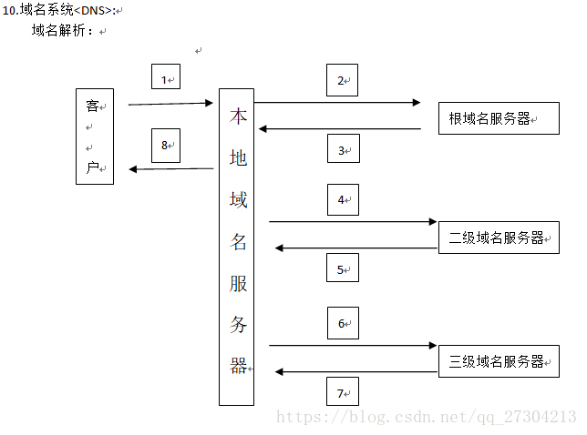

# 第八章 网络操作系统
## 1.网络拓扑结构：
1. 星型网络拓扑结构；
2. 树形网络拓扑结构；
3. 公用总线形网络拓扑结构；
4. 环形网络拓扑结构；
5. 网状形网络拓扑结构；

## 2.计算机广域网络：
1. 公用交换电话网；
2. 分组交换网；
3. 帧中继网；
4. 异步传输模式（ATM）：信元 = 信头 + 信息段；

## 3.计算机局域网：
1. 基本型局域网：以太网， 令牌环网；
2. 快速局域网：FDDI光纤环网， 快速以太网；
3. 交换式LAN；
4. 千兆位以太网；
5. 10GB/S以太网；

## 4.网络互连：
1. 网桥；
2. 路由器；
3. 网关；

## 6.TCP/IP:
1. 应用层：TELENT,  FTP,  SMTP
2. 传输层：TCP, UDP
3. 网络互连层：
4. 网络访问层：

