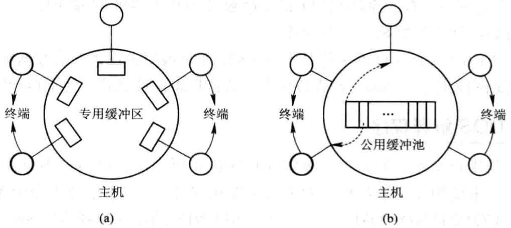
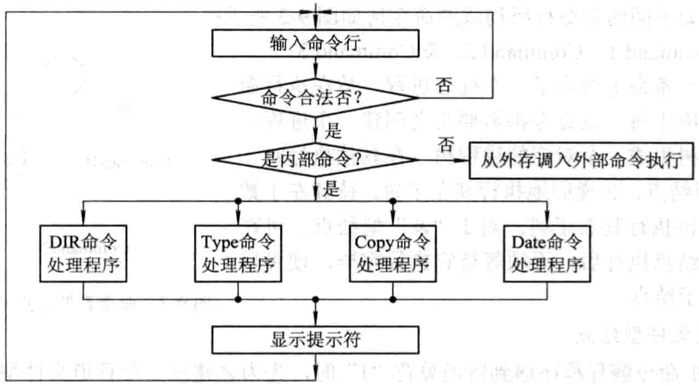
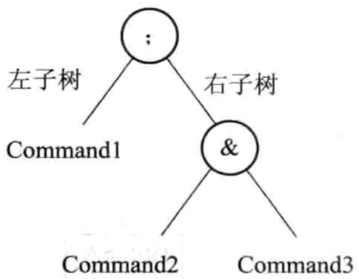
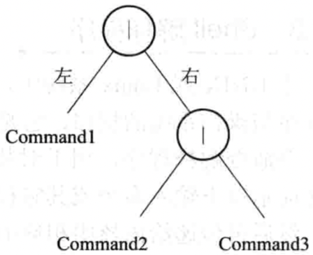
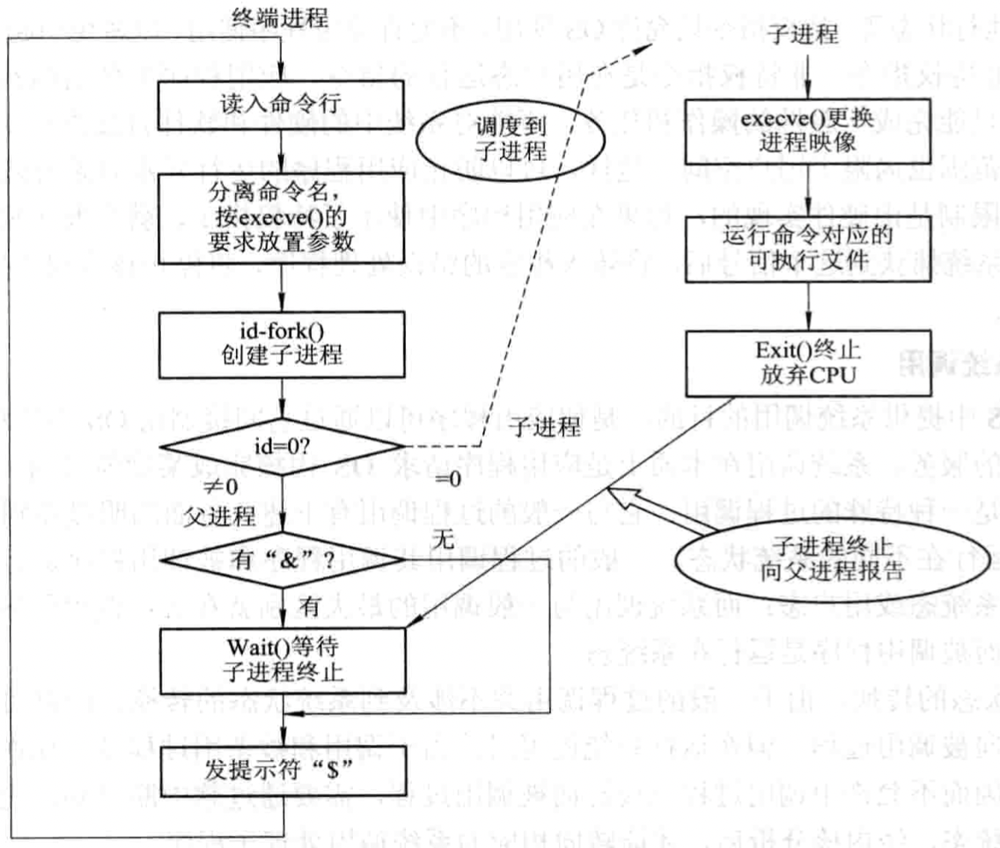
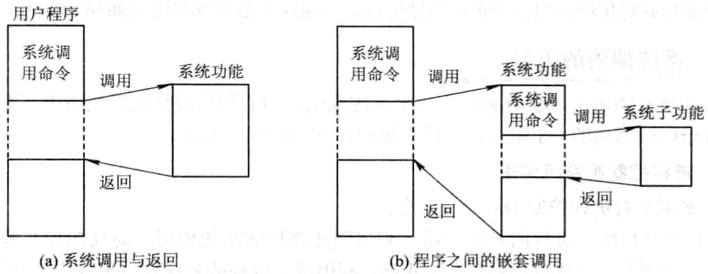
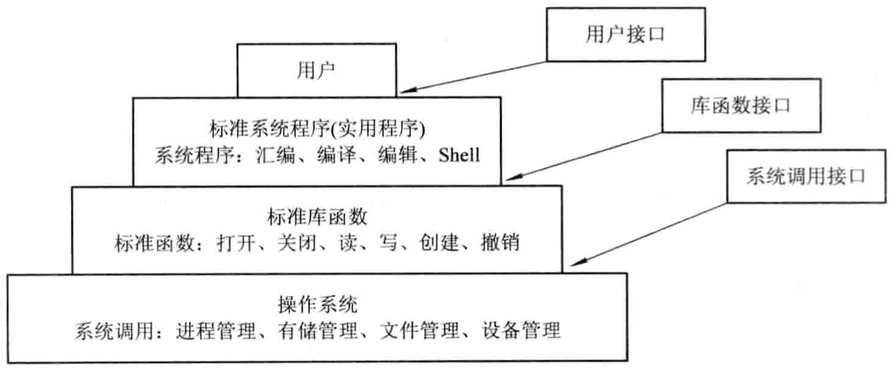
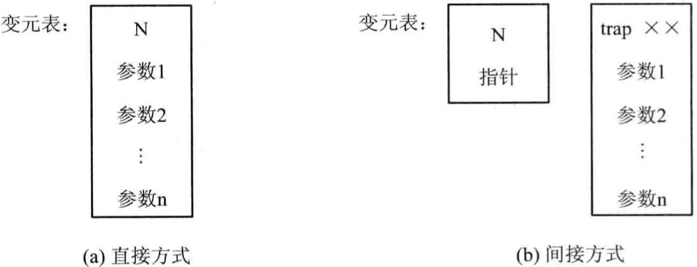
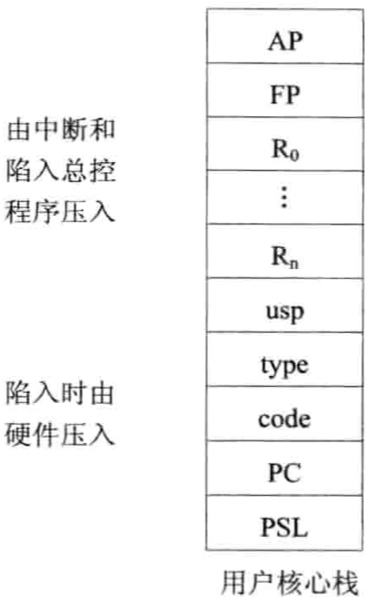

# 第九章 操作系统接口

[TOC]


## 9.1 用户接口

### 9.1.1 字符显示式联机用户接口

字符显示式联机用户接口又称为联机命令接口，指用户通过命令语言实现对作业的控制，以及取得操作系统的服务。

1. 命令行方式

2. 批命令方式

### 9.1.2 图形化联机用户接口

1. 图形用户接口GUI(Graphics User Interface)的引入
2. 使用WIMP技术
3. Windows的GUI简介

### 9.1.3 联机命令的类型

1. 系统访问类
2. 文件操作命令
   - `type` 将指定文件内容显示在屏幕；
   - `copy` 实现文件的拷贝；
   - `comp` 对两个指定文件进行比较；
   - `rename` 重命名操作；
   - `erase` 删除一个/一组文件。
3. 目录操作命令
   - `mkdir` 建立子目录；
   - `dir` 显示目录；
   - `rmdir` 删除子目录，但不删除普通文件；
   - `tree` 显示目录结构命令；
   - `chdir` 改变当前目录。
4. 其它命令
   - 输入输出重定向：`<`；
   - 管道连接：`|`；
   - 过滤命令：`/N`；
   - 批命令。


## 9.2 Shell命令语言

### 9.2.1 简单明了简介

1. 简单命令的格式

   `$Command -option argument list`

   例：

   ```sh
   ls file1 file2
   ls -tr file1 file2
   ```

2. 简单命令的分类

   - 系统提供的标准命令；
   - 用户自定义的命令；

   对于简单命令，还可根据命令是否包含在Shell内部，分为以下2类：

   - 内部命令。Shell中少数标准命令，如改变工作目录命令cd等，是包含在Shell内部的，作为内部命令常驻内存。
   - 外部命令。Shell中大多数的命令，均保存在外存，每个命令是存在于文件系统中某个目录下的单独程序。

3. Shell的种类

   - Bourne Shell；
   - C Shell；
   - Korn Shell。

### 9.2.2 简单命令的类型

1. 进入与退出系统
   - 进入系统；
   - 退出系统。
2. 文件操作命令
   - `cat`显示文件内容命令；
   - `cp`复制文件副本；
   - `mv`对已有文件改名；
   - `rm`删除文件；
   - `file`确定文件类型。
3. 目录操作命令
   - `mkdir`建立目录；
   - `rmdir`删除目录；
   - `cd`改变工作目录。
4. 系统询问命令
   - `date`访问当前日期和时间；
   - `who`询问系统当前用户；
   - `pwd`显示当前目录路径名。

### 9.2.3 重定向与管道命令

1. 重定向命令

   ```sh
   cat file1>file2 #file1输出到file2
   wc<file3 #从file3中读出行中的字和字符进行计数
   cat file4>>file2 #重定向到file2
   a.out<file1>file0 #在执行a.out时，从file1中提取数据，把a.out的执行结果数据输出到文件file0
   ```

2. 管道命令

   ```sh
   cat file | wc #把文件file的数据作为wc命令的计数输入
   ```

### 9.2.4 通信命令

1. 信箱通信命令mail

2. 对话通信命令write

   ```sh
   write user[ttyname]
   ```

3. 允许或拒绝接收消息的mesg命令

   ```sh
   mesg [-n][-y]
   ```

   - n 表示拒绝对方的写许可（即拒绝接收消息）；
   - y 指示恢复对方的写许可，仅在此时双方才可联机通信。

### 9.2.5 后台命令

在命令后面加上`&`，以告诉Shell将该命令放在后台执行。


## 9.3 联机命令接口的实现

1. 字符接收功能

   - 面向字符方式。
   - 面向行方式。

2. 字符缓冲功能

   

   - 专用缓冲方式。
   - 公用缓冲方式。

3. 回送显示

4. 屏幕编辑

5. 特殊字符处理

   - 中断字符
   - 停止上卷字符
   - 恢复上卷字符

### 9.3.2 MS-DOS解释程序

1. 命令解释程序的作用

   在屏幕上给出提示符，请用户键入命令，然后读入该命令，识别命令，再转到相应命令处理程序的入口地址，把控制权交给该处理程序去执行，并将处理结果送到屏幕显示。

2. 命令解释程序的组成

   - 常驻部分；
   - 初始化部分；
   - 暂存部分。

3. 命令解释程序的工作流程

   

   *COMMAND.COM的工作流程*

### 9.3.3 Shell解释程序

1. Shell命令的特点

   - 一条命令行中含有多个命令；
   - 具有不同的分隔符。

2. 二叉树结构的命令行树

   - 命令表型结点

     

     *命令表型结点及其左，右子树*

   - 管道文件型结点

     

     *管道文件型结点及其左，右子树*

   - 简单命令型结点

3. Linux命令解释程序的工作流程

   在Linux系统中，系统初启后，内核为每个终端用户建立一个进程，去执行Shell解释程序；执行过程按如下步骤进行：

   1. 读取用户由键盘输入的命令行；
   2. 对命令进行分析；
   3. 建立相应的子进程；
   4. 等待子进程完成；
   5. 对于"&"型结点，在启动其左子结点执行后，因它是后台命令，不需要等待，因此终端进程不用系统调用`Wait4()`，而是再执行其右子树。

   

   *Shell基本执行过程及父子进程之间的关系*


## 9.4 系统调用的概念和类型

### 9.4.1 系统调用的基本概念

1. 系统态和用户态

   在计算机系统中设置了两种状态：系统态（或称为核心态）和用户态；在实际运行过程中，处理机会在系统态和用户态间切换；

   现代多数OS将CPU的指令集分为以下两类：

   - 特权指令

     在系统态运行的指令；对内存空间的访问范围基本不受限制，不仅能访问用户空间，也能访问系统空间。特权指令只允许OS使用，不允许应用程序使用，以避免引起系统混乱。

   - 非特权指令

     在用户态运行的指令；应用程序所使用的都是非特权指令，它只能完成一般性的操作和任务，不能对系统中的硬件和软件直接进行访问，对内存的访问范围也局限于用户空间。这样，可以防止应用程序的运行异常对系统造成破坏。

2. 系统调用

   与一般过程调用的差别：

   - 运行在不同的系统状态；
   - 状态的转换；
   - 返回问题；
   - 嵌套调用。

   

   *系统功能的调用*

3. 中断机制

   系统调用是通过中断机制实现的，并且一个操作系统的所有系统调用，都通过同一个中断入口来实现。

### 9.4.2 系统调用的类型

1. 进程控制类系统调用
   - 创建和终止进程的系统调用；
   - 获得和设置进程属性的系统调用；
   - 等待某事件出现的系统调用。
2. 文件操作类系统调用
   - 创建和删除文件；
   - 打开和关闭文件的系统调用；
   - 读和写文件的系统调用。
3. 进程通信类系统调用

### 9.4.3 POSIX标准



*UNIX/Linux系统程序，库函数，系统调用的分层关系*


## 9.5 UNIX系统调用

### 9.5.1 进程控制

1. 进程的创建和终止
   - `fork`创建进程；
   - `exit`终止进程；
2. 改变进程映像和等待
   - `exec` 执行一个文件；
   - `wait`等待子进程结束。
3. 其它进程调用
   - 获得进程ID；
   - 获得用户ID；
   - 进程暂停(pause)。

### 9.5.2 文件操纵

1. 文件的创建和删除
   - `create` 创建文件；
   - 删除文件。在UNIX系统中没有专门的删除文件的系统调用，故无人可对文件进行删除，只有当文件的确已无人需要时才删除它。
2. 文件的打开和关闭
   - `open` 打开文件；
   - `close` 关闭文件。
3. 文件的读和写
   - `read` 对文件读；
   - `write` 对文件写。
4. 建立与文件的连接和去连接
   - `link` 连接；
   - `unlink` 取消连接。

### 9.5.3 进程通信和信息保护

1. 进程通信
   - 消息机制；
   - 共享存储器机制；
   - 信号量机制。
2. 信息维护
   - 设置和获得时间；
   - `times`获得进程和子进程时间；
   - `utime`设置文件访问和修改时间；
   - `uname`获得当前UNIX系统的名称。


## 9.6 系统调用的实现

### 9.6.1 系统调用的实现方法

1. 系统调用号和参数的设置

   - 陷入指令自带方式；

   - 直接将参数送入相应的寄存器中；

   - 参数表方式

     

     *系统调用的参数形式*

2. 系统调用的处理步骤

   1. 将处理机状态由用户态转为系统态；
   2. 分析系统调用类型，转入相应的系统调用处理子程序；
   3. 在系统调用处理子程序执行完后，应恢复被中断的或设置新进程的CPU现场，然后返回被中断进程或新进程，继续往下执行。

3. 系统调用处理子程序的处理过程

### 9.6.2 UNIX系统调用的实现

1. CPU环境保护

   在执行系统调用命令（即CHMK命令）之前，应在用户空间提供系统调用所需的参数表，并将该参数表的地址送入$R_0$寄存器。

   在执行CHMK命令后，处理机将由用户态转为核心态，并由硬件自动地将处理机状态长字(PSL)，程序计数器(PC)和代码操作数(code)压入用户核心栈。

   继而从中断和陷入向量表中取出trap.S的入口地址，然后便转入中断和陷入总控程序trap.S中执行。

   trap.S程序执行后，继续将陷入类型type和用户栈指针usp压入用户核心栈，接着还要将被中断进程的CPU环境中的一系列寄存器部分或全部内容压入栈中。

2. AP和FP指针

   

   *用户核心栈*

   - `AP` 系统调用参数表指针，指示正在执行的系统调用所需参数表的地址；
   - `FP` 栈帧指针，指示本次系统调用所保存的数据项。

3. 确定系统调用号

   在中断和陷入发生后，应先经硬件陷入机构予以处理，再进入中断和陷入总控程序trap.S，在保护好CPU现场后再调用trap.C继续处理，其调用形式为：

   `trap(usp, type, code, PC, PSL)`

   - `PSL` 陷入时处理机状态字长；
   - `PC` 程序计数器；
   - `code` 代码操作数；
   - `type` 陷入类型号；
   - `usp` 用户栈指针。

4. 参数传递

   参数传递是指由trap.C程序将系统调用参数表中的内容从用户去传送到User结构的U.U-arg中，供系统调用处理程序使用。

   **注意：系统调用定义表所规定的参数个数最多为10个参数。**

5. 利用系统调用定义表转入相应的处理程序

6. 系统调用返回前的公共处理

   在UNIX系统中，进程调度的主要依据是进程的动态优先级。

   UNIX系统规定：当进程的运行是处于系统态时，即使再有其它进程又发来了信号，也不予理睬；仅当进程已从系统态返回到用户态时，内核才检查该进程是否已收到了由其它进程发来的信号。若有信号，便立即按该信号的规定执行相应的动作。在从信号处理程序返回后，还将执行一条返回指令RET，该指令将把已被压入用户核心栈中的所有数据（如PSL，PC，FP及AP等）都退还到相应的寄存器中，这样，即可将CPU控制权从系统调用返回到被中断进程，后者继续执行下去。

### 9.6.5 Linux系统调用

每个系统调用由两部分组成：

- 内核函数：是实现系统调用功能的（内核）代码，作为操作系统的核心驻留在内存中，是一种共享代码，用C语言实现。它运行在内核态，数据也存放在内核空间，通常它不能再使用系统调用，也不能使用应用程序可用的库函数。
- 接口函数：是提供给应用程序的API，以库函数形式存在Linux的lib.a中，该库中存放了所有系统调用的接口函数的目标代码，用汇编语言书写。其主要功能是：把系统调用号，入口参数地址传送给相应的核心函数，并使用户态下运行的应用程序陷入核心态。

系统调用控制程序的工作流程：

1. 取系统调用号，检验合法性；
2. 执行int 80h产生中断；
3. 进行地址空间的转换，以及堆栈的切换，进入内核态；
4. 进行中断处理，根据系统调用号定位内核函数地址；
5. 根据通用寄存器内容，从用户栈取入口参数；
6. 核心函数执行，把结果返回应用程序。

### 9.6.6 Win32的应用程序接口

