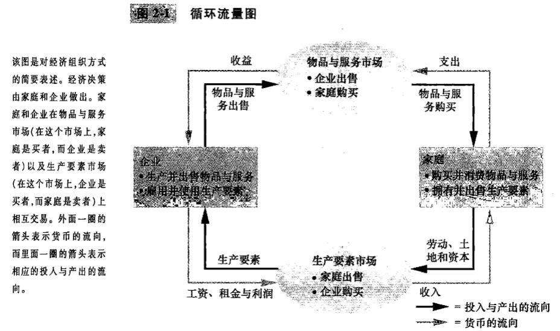
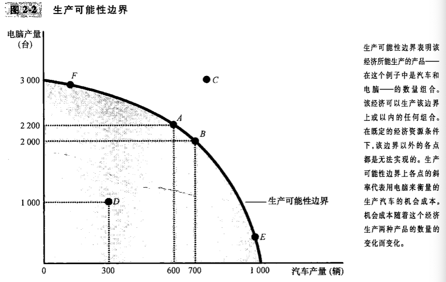
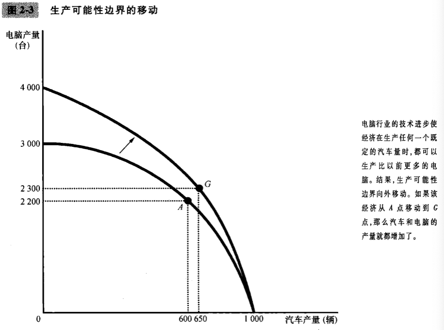

# 第二章 向经济学家一样思考

1. 经济学家：提出问题，收集资料，并分析这些资料以努力证明或否定他们的理论

2. 科学方法：观察，理论和进一步观察

3. 经济模型：

   - 循环流向图

   

   - 生产可能性边界

     

     

4. 微观经济学与宏观经济学

   微观经济学(microeconomics)：研究家庭和企业如何做出决策，以及他们如何在特定市场上相互交易。

   宏观经济学(macroeconomics): 研究整体经济现象

5. 为什么经济学家往往给决策者提供相互矛盾的建议？，原因如下：

   - 经济学家可能对世界如何运行的不同实证理论的正确性看法不一致
   - 经济学家可能有不同的价值观，因此对政策应该努力实现的目标有不同的规范观点
   - 经济学家可能实际上是一致的，淡一些不懂装懂的人或古怪的人的建议混淆了这种共识

6. 大多数经济学家同意以下主张(括号里面为：同意人数所占百分比)：

   - 租金上限降低了可得到的住房的数量和质量。(93%)
   - 关税和进口配额通常降低了总体进肌肤里。（93%）
   - 弹性汇率和浮动汇率提供了一种有效的国际货币协定。（90%）
   - 财政政策（例如，减税和/或增加政府支出）对低于充分就业的经济有重要的刺激效应。（90%）
   - 美国不应该限制雇主将工作外包给其他国家。（90%）
   - 像美国这样的发达国家的经济增长会使福利水平更高。（88%）
   - 美国应该取消农业补贴。（85%）
   - 设计适当的财政政策可以提高长期资本形成率。（85%）
   - 地方政府和州政府应该取消对职业运动队的补贴。（85%）
   - 如果联邦预算要实现平衡，也应该是以经济周期为基础，而不是以年度为基础。（85%）
   - 如果现行的政策保持不变，在接下来的50年中社会保障基金与支出之间的缺口会持续扩大并超出承受能力。（85%）
   - 现金支付要比与现金等值的实物转移支付更多的提高接受者的福利水平。（84%）
   - 庞大的联邦预算赤字对经济有不利的影响。（83%）
   - 美国的收入再分配是政府的一项合法职能。（83%）
   - 通货膨胀主要是由于货币供给的过分增长而引起的。（83%）
   - 美国不应该禁止转基因作物。（82%）
   - 最低工资增加了年轻人和不熟练工人的失业。（79%）
   - 政府应该按“负所得税”的思路重建福利制度。（79%）
   - 作为控制污染的方法，排污税和可交易的污染许可证要优于实行污染上限。（78%）
   - 在美国，政府对乙醇的补贴应该减少或取消。（78%）

## 内容提要

- 经济学家们努力以科学家的客观态度来研究他们的科学。像所有科学家一样，他们做出了适当的假设并建立了简化的模型，以便理解我们周围的世界。两个简单的经济模型是循环流量图和生产可能性边界。
- 经济学可划分为两个领域：微观经济学和宏观经济学。微观经济学家研究家庭和企业作出的决策以及家庭和企业在市场上的相互交易。宏观经济学家研究影响整体经济的力量和趋势。
- 实证表述是关于世界是什么的论断。规范表述是关于世界应该是什么的论断。当经济学家做出规范表述时，他们的行为更像是政策顾问而不是科学家。
- 经济学家们向决策者提出的建议之所以有时会相互矛盾，不是因为科学判断的差别，就是因为价值观的差别。在另一些时候，经济学家提供的建议是一致的，但由于政治过程施加的力量和约束，决策者可能选择1不理会这些建议。