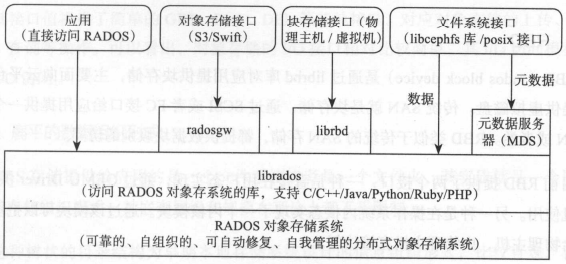
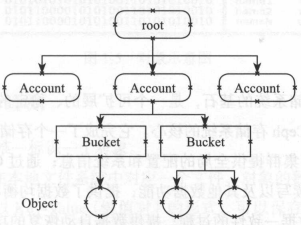
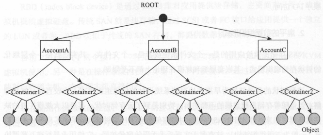
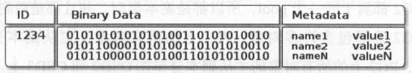
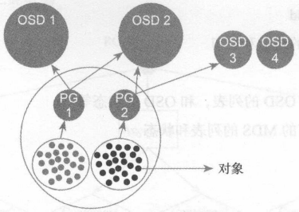
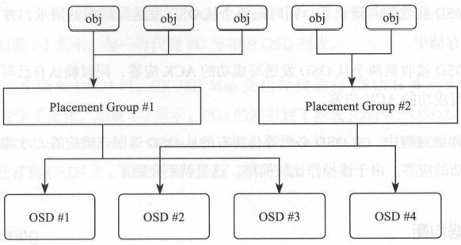
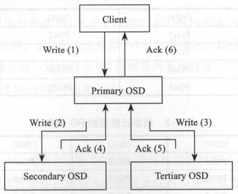
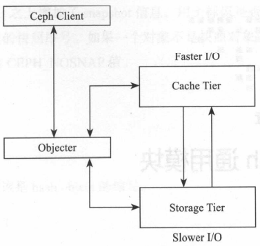

# 第一章 Ceph整体架构

[TOC]

## 1.1 Ceph的发展历程

## 1.2 Ceph的设计目标

## 1.3 Ceph基本架构图

*Ceph基本架构图*

- 最底层基于RADOS(reliable, autonomous, distributed object store)；
- 中间层librados库用于本地或者远程通过网络访问RADOS对象存储系统；
- 最上层面向应用提供以下存储接口：
  - 块存储接口：通过librbd库提供了块存储访问接口；
  - 对象存储接口：
    1. 与AWS的S3接口兼容的API；
    2. 与OpenStack的Swift对象接口兼容的API。
  - 文件系统接口：
    1. 标准posix接口；
    2. 通过libcephfs库提供文件系统访问接口。

## 1.4 Ceph客户端接口

### 1.4.1 RBD

`RBD(rados block device)`通过librbd库对应用提供块存储，主要面向云平台的虚拟机提供虚拟磁盘。

RBD提供以下接口：

- 直接在用户态实现，通过QEMU Driver供KVM虚拟机使用；
- 在操作系统内核态实现内核模块，该模块可以把块设备映射给物理主机，由物理主机直接访问。

### 1.4.2 CephFS

CephFS通过在RADOS基础之上增加了MDS(Metadata Server)来提供文件存储。

### 1.4.3 RadosGW

RadosGW基于librados提供了和Amazon S3接口以及OpenStack Swift接口兼容的对象存储接口；具有以下特点：

1. 提供RESTful Web API接口；

2. 采用扁平的数据组织形式。

   

   *Amazon S3的对象存储结构*

   

   *OpenStack Swift对象存储结构*

## 1.5 RADOS

RADOS是一个可扩展的，稳定的，自我管理的，自我修复的对象存储系统，是Ceph春初系统的和姓。

### 1.5.1 Monitor

Monitor是一个独立部署的daemon进程，通过组成Monitor集群来保证高可用，通过Paxos算法实现数据一致性。

Cluster Map保存了系统的全局配置信息，包括：

- Monitor Map
  - 包括集群的fsid；
  - 所有Monitor的地址和端口；
  - current epoch。
- OSD Map：所有OSD的列表，和OSD的状态等。
- MDS Map：所有的MDS的列表和状态。

### 1.5.2 对象存储

*对象示意图*

一个对象由以下部分组成：

- `对象标识（ID）`唯一标识一个对象；
- `对象的数据`其在本地文件系统中对应一个文件，对象的数据就保存在文件中；
- `对象的元数据`以kv（键值对）形式保存在文件对应的扩展属性中，同时提供另一种方式：以Leveldb等KV存储系统来保存对象的元数据。

### 1.5.3 pool和PG的概念

`PG(placement group)`是一个对象的集合，该集合里所有对象具有相同的防止策略：对象的副本都分布在相同的OSD列表上。

*PG的概念示意图*

### 1.5.4 对象寻址过程

对象寻址过程指的是查找对象在集群中分布的位置信息，步骤如下：

1. 对象到PG的映射；

   `pg_id = hash(object_id) % pg_num`

2. PG到OSD列表映射

   

### 1.5.5 数据读写过程

*读写过程*

### 1.5.6 数据均衡

### 1.5.7 Peering

当OSD启动或者某个OSD失效时，该OSD上的主PG会发起一个Peering的过程：一个PG的所有副本通过PG日志来达成数据一致的过程。

### 1.5.8 Recovery和Backfill

Recovery过程：根据Peering过程中产生的PG日志，推测出不一致的对象加以修复。

### 1.5.9 纠删码

`纠删码（Erasure Code）`：将写入的数据分成N份原始数据块，通过这N份原始数据块计算出M份校验数据块，N+M份数据块可以分别保存在不同的设备或者节点中；可以允许最多M个数据块失效，通过N+M份中的任意N份数据，就还原出其它数据块。

### 1.5.10 快照和克隆

- `快照（snapshot）`一个存储设备在某一时刻的全部**只读**镜像；
  - pool级别快照：给整个pool中的所有对象统一做快照操作；
  - `用户自定义快照实现`：需要客户端配合实现快照机制。
- `克隆（clone）`某一时刻的全部**可读写**镜像。

### 1.5.11 Cache Tier

*Cache Tier结构图*

- `Ceph Client`对于`Cache`层是透明的；
- 类`Objecter`负责请求是发给`Cache Tier`层，还是发给`Storage Tier`层；
- `Cache Tier`层为高速I/O层，保存热点数据，或称为活跃的数据；
- `Storage Tier`层为慢速层，保存非活跃的数据；
- 在`Cache Tier`层和`Storage Tier`层之间，数据根据活跃度自动地迁移。

### 1.5.12 Scrub

Scrub机制用于检查数据的一致性。通过在后台定期（默认1次/天）扫描，比较一个PG内的对象分别在其它OSD上的各副本的元数据和数据来检查是否一致。

## 1.6 本章小结

