# 第十章 Ceph Peering机制

[TOC]


## 10.1 statechart状态机

Ceph使用boost库的statechart状态机来实现PG的状态转换。

### 10.1.1 状态

`boost::statechart`关于状态的定义有2种方式：

- 没有子状态情况下的状态定义

  ```c++
  // Reset 状态，RecoveryMachind 所属状态机
  struct Reset : boost::statechart::state<Reset, RecoveryMachind> 
  ```

- 有子状态情况下的状态定义

  ```c++
  // Started 状态，RecoveryMachine 所属状态机，Start 默认初始子状态
  struct Started : boost::statechart::state<Started, RecoveryMachine, Start> 
  
  // Start 子状态，Started 父状态
  struct Start : boost::statechart::state<Start, Started> 
  ```

*在`boost::statechart`中，一个状态要么属于状态机，要么属于另一个状态。*

### 10.1.2 事件

状态能够接收并处理事件，事件可以改变状态，促使状态发生转移；事件的定义：

```c++
// QueryState 事件
struct QueryState : boost::statechart::event<QueryState>
```

### 10.1.3 状态响应事件

事件处理函数的定义：

```c++
struct Initial : boost::statechart::state<Initial, RecoveryMachine>, NamedState {
    typedef boost::mpl::list <
        boost::statechart::transition<Initialize, Reset>, // Initialize -> Reset
    	boost::statechart::custom_reaction<Load>,         // 自定义Load事件处理方法
    	boost::statechart::custom_reaction<NullEvt>,
    	boost::statechart::transition<boost::statechart::event_base, Crashed>
    > reactions;
    
    // 状态跳转
    boost::statechart::result react(const Load&);
    boost::statechart::result react(const MNotifyRec&);
    boost::statechart::result react(const MInfoRec&);
    boost::statechart::result react(const MLogRec&);
    boost::statechart::result react(const boost::statechart::event_base&){
        return discard_event();
    }
}
```

### 10.1.4 状态机的定义

定义状态机需要继承`boost::statechart::state_machine`类：

```c++
// 定义状态机；RecoveryMachine：状态机名字，Initial：状态机默认初始状态
class RecoveryMachine : public boost::statechart::state_machine<RecoveryMachine, Initial>{...}
    
// 状态机初始化
machine.initiate();
// 向状态机投递事件（触发状态机处理逻辑）
machine.process_event(evt);
```

### 10.1.5 context函数

`context`用于获取父状态以及祖先状态的一些内部参数和状态值：

```c++
// 获取父状态的指针
Start* parent = context<Start>();

// 获取祖先状态的指针
RecoveryMachine* grandparent = context<RecoveryMachine>();
```

### 10.1.6 事件的特殊处理

- 在用户自定义的函数里，可以直接调用函数`transit`来直接跳转到目标状态；例：

  ```c++
  transit<WaitRemoteBackfillReserved>();
  ```

- 在用户自定义的函数里，可以调用函数`post_event`直接产生相应的事件，并投递给状态机；

- 在用户自定义的函数里，调用函数`discard_event`可以直接丢弃事件，不做任何处理；

- 在用户自定义的函数里，调用函数`forward_event`可以把当前事件继续投递给状态机。


## 10.2 PG状态机


## 10.3 PG的创建过程

### 10.3.1 PG在主OSD上的创建

```c++
/*
 * 创建PG的请求
 */

struct MOSDPGCreate : public Message {

  const static int HEAD_VERSION = 3;
  // At head_version 2 the unspecified compat_version was set to 2
  const static int COMPAT_VERSION = 2;

  version_t          epoch;
  map<pg_t,pg_create_t> mkpg; // 要创建的PG列表（一次可以创建多个PG）
  map<pg_t,utime_t> ctimes;   // 创建时间
  ...
}

/**
 * PG创建参数
 */
struct pg_create_t {
  epoch_t created;   // epoch PG已经被创建
  pg_t parent;       // (if != pg_t())，本PG不是从parent中分裂出来的
  __s32 split_bits;
  ...
}
```

### 10.3.2 PG在从OSD上的创建

函数`handle_pg_peering_evt`是处理Peering状态机事件等待入口。该函数会查找相应的PG，如果该PG不存在，就创建该PG，该PG的状态机进入`RecoveryMachine/Stray`状态。

### 10.3.3 PG的加载

当OSD重启时，调用函数`OSD::init()`，该函数调用`load_pgs`函数加载已经存在的PG，其处理过程和创建PG的过程相似。


## 10.4 PG创建后状态机的状态转换

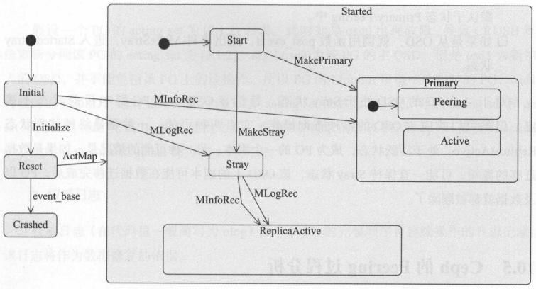

*PG总体状态图的简化版*


## 10.5 Ceph的Peering过程分析

PG在如下两种情况下触发Peering过程：

- 当系统初始化时，OSD重新启动导致PG重新加载，或者PG新创建时，PG会发起一次Peering的过程；
- 当有OSD失效，OSD的增加或者删除等导致PG的acting set发生了改变，该PG就会重新发起一次Peering过程。

### 10.5.1 基本概念

- `acting set` 是一个PG对应副本所在的OSD列表，该列表是有序的，列表中第一个OSD为主OSD；
- `up set` 在通常情况下，`up set`和`acting set`列表完全相同。
- `up_thru` 记录每个OSD完成Peering后的epoch值，用于处理特殊情况：当两个以上的OSD处于`down`状态，但是Monitor在两次epoch中检测到这种状态，从而导致Monitor认为它们是先后宕掉；后宕的OSD有可能产生数据的更新，导致需要等待该OSD的修复，否则有可能产生数据丢失。

例：

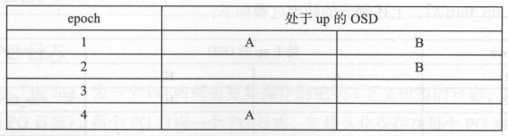

*初始情况*

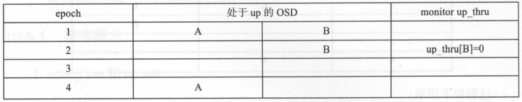

*引入`up_thru`后的处理过程1*

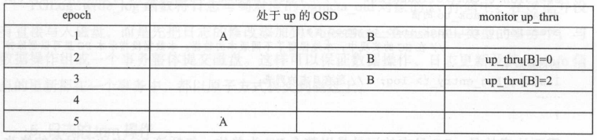

*引入`up_thru`后的处理过程2*


## 10.5.2 PG日志

`PG日志（pg log）`为一个PG内所有更新操作的记录，每个PG对应一个PG日志，它持久化地保存在每个PG对应的`pgmeta_oid`对象的`omap`属性中；具有如下特点：

- 记录一个PG内所有对象的更新操作元数据信息，并不记录操作的数据；
- 是一个完整的日志记录，版本号是顺序的且连续的。

```c++
/**
 * 保存PG的所有操作日志以及控制结构
 *
 *  serves as a recovery queue for recent changes.
 */
struct pg_log_t {
  /*
   *   head - newest entry (update|delete)
   *   tail - entry previous to oldest (update|delete) for which we have
   *          complete negative information.  
   * i.e. we can infer pg contents for any store whose last_update >= tail.
   */
  eversion_t head;    /* 日志头，记录最新的日志记录 */
  eversion_t tail;    /* 日志尾，记录最旧的日志记录 */

  // We can rollback rollback-able entries > can_rollback_to
  eversion_t can_rollback_to; /* 本地可回滚的版本（> can_rollback_to）*/

  // always <= can_rollback_to, indicates how far stashed rollback
  // data can be found
  eversion_t rollback_info_trimmed_to; /* 本PG里可以删除掉的对象版本 */

  list<pg_log_entry_t> log;  /* 所有日志的列表 */
  ... 
}
```

*pg_log_t*

```c++
/**
 * PG日志的单条记录
 *
 */
struct pg_log_entry_t {
  // describes state for a locally-rollbackable entry
  ObjectModDesc mod_desc;                             // 本地回滚的信息（用于EC的回滚操作）
  bufferlist snaps;                                   // 克隆操作用于记录当前对象的snap列表
  hobject_t  soid;                                    // 操作的对象
  osd_reqid_t reqid;                                  // 请求标识（唯一，called + tid）
  vector<pair<osd_reqid_t, version_t> > extra_reqids; // 
  eversion_t version, prior_version, reverting_to;    // 当前版本，前一个版本，本次操作回退的版本
  version_t user_version;                             // 用户的版本
  utime_t     mtime;                                  // 用户本地时间
  ...
}
```

*pg_log_entry_t*

```c++
/** @brief 合并权威日志 */
void PGLog::merge_log(ObjectStore::Transaction& t,
                      pg_info_t &oinfo, pg_log_t &olog, pg_shard_t fromosd,
                      pg_info_t &info, LogEntryHandler *rollbacker,
                      bool &dirty_info, bool &dirty_big_info);
```

例：

- 情况1，权威日志的尾部版本比本地日志的尾部小：

  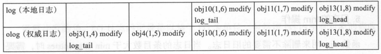

  *本地log的`log_tail`为$obj10(1, 6)$，权威日志olog的`log_tail`为$obj3(1, 4)$。*

  日志合并的处理方式如下所示：

  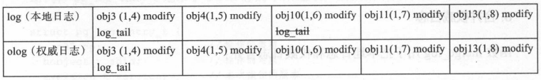

  *把日志记录$obj3(1, 4), obj4(1, 5)$添加到本地日志中，修改`info.log_tail`和`log.tail`指针即可。*

- 情况2，本地日志的头部版本比权威日志长：

  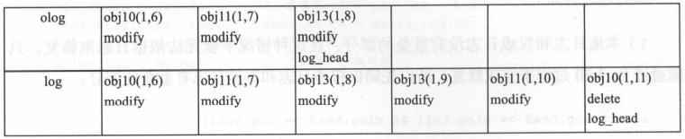
  
  *把对象$obj10$, $obj11$, $obj13$加入missing列表中用于修复，最后删除多余的日志：*
  
  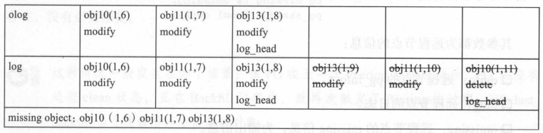
  
- 情况3，本地日志的头部版本比权威日志的头部短：

  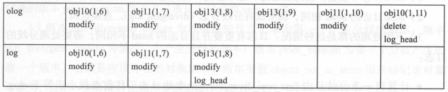

  *把本地日志缺失的日志添加到本地，并计算本地缺失的对象。最后把缺失的对象添加到`missing object`列表中用于后续的修复*

  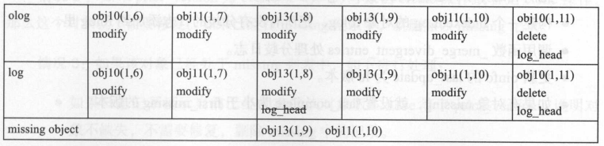

### 10.5.3 Peering的状态转换图

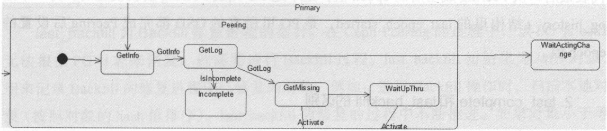

*Peering状态转换图*

Peering过程步骤：

1. `GetInfo` PG的主OSD通过发送消息获取所有从OSD的`pg_info`信息；
2. `GetLog` 根据各个副本获取的`pg_info`信息的比较，选择一个拥有权威日志的`OSD（auth_log_shared）`。如果主OSD不是拥有权威日治的OSD，就从该OSD上拉取权威日志；主OSD完成拉取权威日志后也就拥有了权威日志；
3. `GetMissing` 主OSD拉取其它从OSD的PG日志（或者部分获取，或者全部获取`FULL_LOG`）。通过与本地权威日志的对比，来计算该OSD上缺失的object信息，作为后续Recovery操作过程的依据；最后通过`Active`操作激活主OSD，并发送`notify`通知消息，激活相应的从OSD。

### 10.5.4 pg_info数据结构

```c++

/**
 * PG在OSD上的一些描述信息
 *
 * some notes: 
 *  - last_complete implies we have all objects that existed as of that
 *    stamp, OR a newer object, OR have already applied a later delete.
 *  - if last_complete >= log.bottom, then we know pg contents thru log.head.
 *    otherwise, we have no idea what the pg is supposed to contain.
 */
struct pg_info_t {
  spg_t pgid;                  // PG的id
  eversion_t last_update;      // PG最后一次更新的版本
  eversion_t last_complete;    ///< last version pg was complete through.
  epoch_t last_epoch_started;  ///< last epoch at which this pg started on this osd
  
  version_t last_user_version; // 最后更新的用户版本号，用于分层存

  eversion_t log_tail;         // 日志的尾部版本

  hobject_t last_backfill;     // 上一次Backfill操作的对象指针（如果该操作未完成，[last_backfill, last_complete]之间的对象就会丢失）
  bool last_backfill_bitwise;  ///< true if last_backfill reflects a bitwise (vs nibblewise) sort

  interval_set<snapid_t> purged_snaps; // PG要删除的snap集合

  pg_stat_t stats;             // PG的统计信息

  pg_history_t history;        // PG的历史信息
  pg_hit_set_history_t hit_set;// 这是Cache Tier用的hit_set
  ...
}
```

### 10.5.5 GetInfo

TODO

### 10.5.6 GetLog

TODO

### 10.5.7 GetMissing

TODO

### 10.5.8 Active操作

TODO

### 10.5.9 副本端的状态转移

TODO

### 10.5.10 状态机异常处理

TODO


## 10.6 本章小结


