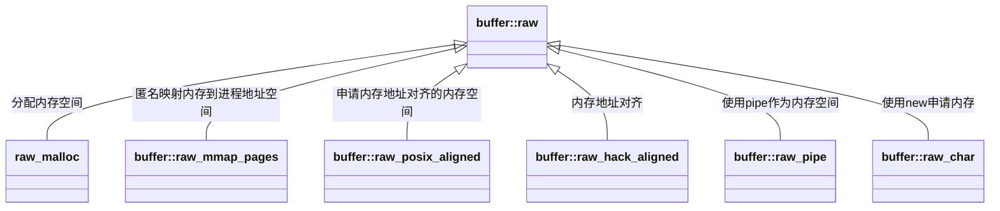
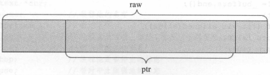

# 第二章 Ceph通用模块

[TOC]


## 2.1 Object

```c++
// 本地文件
struct object_t {
  string name; // 对象名

  object_t() {}
  // cppcheck-suppress noExplicitConstructor
  object_t(const char *s) : name(s) {}
  // cppcheck-suppress noExplicitConstructor
  object_t(const string& s) : name(s) {}

  void swap(object_t& o) {
    name.swap(o.name);
  }
  void clear() {
    name.clear();
  }
  
  void encode(bufferlist &bl) const {
    ::encode(name, bl);
  }
  void decode(bufferlist::iterator &bl) {
    ::decode(name, bl);
  }
};
```

*object_t*

```c++
// 带快照信息的本地文件
struct sobject_t {
  object_t oid;
  snapid_t snap; // 快照序号

  sobject_t() : snap(0) {}
  sobject_t(object_t o, snapid_t s) : oid(o), snap(s) {}

  void swap(sobject_t& o) {
    oid.swap(o.oid);
    snapid_t t = snap;
    snap = o.snap;
    o.snap = t;
  }

  void encode(bufferlist& bl) const {
    ::encode(oid, bl);
    ::encode(snap, bl);
  }
  void decode(bufferlist::iterator& bl) {
    ::decode(oid, bl);
    ::decode(snap, bl);
  }
};
```

*sobject_t*

```c++
// 带hash信息的本地文件
struct hobject_t {
  object_t oid;
  snapid_t snap;
private:
  uint32_t hash;
  bool max;
  uint32_t nibblewise_key_cache;
  uint32_t hash_reverse_bits;
  static const int64_t POOL_META = -1;
  static const int64_t POOL_TEMP_START = -2; // and then negative
  friend class spg_t;  // for POOL_TEMP_START
public:
  int64_t pool;  // 所在的pool的id
  string nspace; // 用于标识特殊的对象

private:
  string key; // 对象的特殊标记
  ...
}
```

*hobject_t*

```c++
// 本地文件（用于ErasureCode模式下的PG）
struct ghobject_t {
  hobject_t hobj;
  gen_t generation;    // 对象的版本号
  shard_id_t shard_id; // 对象所在的osd在EC类型的PG中的序号
  bool max;

public:
  static const gen_t NO_GEN = UINT64_MAX;
  ...
}
```

*ghobject_t*


## Buffer

### buffer::raw

```c++

  class buffer::raw {
  public:
    char *data;    // 数据指针
    unsigned len;  // 数据长度
    atomic_t nref; // 引用计数

    mutable simple_spinlock_t crc_spinlock; // 自旋锁（保护crc_map）
    map<pair<size_t, size_t>, pair<uint32_t, uint32_t> > crc_map; 
      // crc校验信息{<数据段起始，结束>,<crc32校验码，计算出的crc32校验码>}
    ...
  }
```

*基础的数据buffer*



### 2.2.2 buffer::ptr

```c++
  class CEPH_BUFFER_API ptr {
    raw *_raw;           // 数据段
    unsigned _off, _len; // 偏移量，长度
    ...
  }
```

*对于buffer::raw的一个部分数据段*



*raw和ptr示意图*

### 2.2.3 buffer::list

```c++
  class CEPH_BUFFER_API list {
    // my private bits
    std::list<ptr> _buffers; // ptr集合
    unsigned _len;           // 所有ptr的数据总长度
    unsigned _memcopy_count; // 内存拷贝的数据量（内存对齐时用）
    ptr append_buffer;       // 用于添加小的数据
    ...
private:
    mutable iterator last_p; // 访问list的迭代器
  }
```


## 2.3 线程池

```c++
class ThreadPool : public md_config_obs_t {
  CephContext *cct;
  string name;            // 线程池名字
  string thread_name;     // 
  string lockname;        // 锁的名字
  Mutex _lock;            // 线程互斥的锁（也是工作队列访问互斥的锁）
  Cond _cond;             // 条件变量
  bool _stop;             // 线程池是否停止
  int _pause;             // 线程池是否暂停
  int _draining;
  Cond _wait_cond;
  int ioprio_class, ioprio_priority;

private:
  vector<WorkQueue_*> work_queues; // 工作队列
  int last_work_queue;             // 最后访问的工作队列
  
  set<WorkThread*> _threads;       // 线程池中的工作线程
  list<WorkThread*> _old_threads;  // 等待进joined操作的线程
  int processing;
};

```

### 2.3.1 线程池的启动

### 2.3.2 工作队列

```c++
  template<class T>
  class WorkQueue : public WorkQueue_ {
    ThreadPool *pool; // 线程池
  };
```

### 2.3.3 线程池的执行函数

```c++
// 线程池执行函数
void ThreadPool::worker(WorkThread *wt)
{
  _lock.Lock();
  ldout(cct,10) << "worker start" << dendl;
  
  std::stringstream ss;
  ss << name << " thread " << (void*)pthread_self();
  heartbeat_handle_d *hb = cct->get_heartbeat_map()->add_worker(ss.str());

  while (!_stop) { // 线程池打开

    // manage dynamic thread pool
    join_old_threads();
    if (_threads.size() > _num_threads) {
      ldout(cct,1) << " worker shutting down; too many threads (" << _threads.size() << " > " << _num_threads << ")" << dendl;
      _threads.erase(wt);
      _old_threads.push_back(wt);
      break;
    }

    if (!_pause && !work_queues.empty()) {
      WorkQueue_* wq;
      int tries = work_queues.size();
      bool did = false;
      while (tries--) {
	last_work_queue++;
	last_work_queue %= work_queues.size();
	wq = work_queues[last_work_queue]; // 取工作
	
	void *item = wq->_void_dequeue();
	if (item) {
	  processing++;
	  ldout(cct,12) << "worker wq " << wq->name << " start processing " << item
			<< " (" << processing << " active)" << dendl;
	  TPHandle tp_handle(cct, hb, wq->timeout_interval, wq->suicide_interval);
	  tp_handle.reset_tp_timeout();
	  _lock.Unlock();
	  wq->_void_process(item, tp_handle);
	  _lock.Lock();
	  wq->_void_process_finish(item);
	  processing--;
	  ldout(cct,15) << "worker wq " << wq->name << " done processing " << item
			<< " (" << processing << " active)" << dendl;
	  if (_pause || _draining)
	    _wait_cond.Signal();
	  did = true;
	  break;
	}
      }
      if (did)
	continue;
    }

    ldout(cct,20) << "worker waiting" << dendl;
    cct->get_heartbeat_map()->reset_timeout(
      hb,
      cct->_conf->threadpool_default_timeout,
      0);
    _cond.WaitInterval(cct, _lock,
      utime_t(
	cct->_conf->threadpool_empty_queue_max_wait, 0));
  }
  ldout(cct,1) << "worker finish" << dendl;

  cct->get_heartbeat_map()->remove_worker(hb);

  _lock.Unlock();
}
```

### 2.3.4 超时检查

```c++
// 心跳超时检查
struct heartbeat_handle_d {
  const std::string name;
  atomic_t timeout, suicide_timeout;
  time_t grace, suicide_grace;
  std::list<heartbeat_handle_d*>::iterator list_item;

  explicit heartbeat_handle_d(const std::string& n)
    : name(n), grace(0), suicide_grace(0)
  { }
};
// 线程回调类
class TPHandle {
    friend class ThreadPool;
    CephContext *cct;
    heartbeat_handle_d *hb; // 心跳
    time_t grace;           // 超时时间
    time_t suicide_grace;   // 自杀的超时时间
};
```

```c++
// 心跳信息集合
class HeartbeatMap {
 private:
  CephContext *m_cct;
  RWLock m_rwlock;
  time_t m_inject_unhealthy_until;
  std::list<heartbeat_handle_d*> m_workers;
  atomic_t m_unhealthy_workers;
  atomic_t m_total_workers;
};
```

### 2.3.5 ShardedThreadPool

```c++
// 共享线程池（防止线程阻塞，提升效率）
class ShardedThreadPool {

  CephContext *cct;
  string name;
  string thread_name;
  string lockname;
  Mutex shardedpool_lock;
  Cond shardedpool_cond;
  Cond wait_cond;
  uint32_t num_threads;
  atomic_t stop_threads;
  atomic_t pause_threads;
  atomic_t drain_threads;
  uint32_t num_paused;
  uint32_t num_drained;

private:

  BaseShardedWQ* wq;
};
```


## 2.4 Finisher

```c++
class Finisher {
  CephContext *cct;
  Mutex        finisher_lock; ///< Protects access to queues and finisher_running.
  Cond         finisher_cond; ///< Signaled when there is something to process.
  Cond         finisher_empty_cond; ///< Signaled when the finisher has nothing more to process.
  bool         finisher_stop; ///< Set when the finisher should stop.
  bool         finisher_running; ///< True when the finisher is currently executing contexts.
  /// Queue for contexts for which complete(0) will be called.
  /// NULLs in this queue indicate that an item from finisher_queue_rval
  /// should be completed in that place instead.
  vector<Context*> finisher_queue; // 需要执行的Context，成功返回值为0

  string thread_name;

  /// Queue for contexts for which the complete function will be called
  /// with a parameter other than 0.
  list<pair<Context*,int> > finisher_queue_rval; // 需要执行的Context，返回值为int类型的有效值

  /// Performance counter for the finisher's queue length.
  /// Only active for named finishers.
  PerfCounters *logger;
};
```

类Finisher用来完成回调函数Context的执行。


## 2.5 Throttle

```c++
class Throttle {
  CephContext *cct;
  const std::string name;
  PerfCounters *logger;
  ceph::atomic_t count, max; // 当前占用的slot数量，slot数量的最大值
  Mutex lock;                // 锁
  list<Cond*> cond;          // 条件变量
  const bool use_perf;
}
```


## 2.6 SafeTimer

```c++
// 定时器
class SafeTimer
{
  CephContext *cct;
  Mutex& lock;
  Cond cond;
  bool safe_callbacks;          // 是否是safe_callbacks
  SafeTimerThread *thread;      // 定时器执行线程
  void timer_thread();          // 定时任务执行
  std::multimap<utime_t, Context*> schedule; // 目标时间和定时任务执行函数Context
  std::map<Context*, std::multimap<utime_t, Context*>::iterator> events; // 定时任务<-->定时任务在schedule中的位置映射
  bool stopping; // 是否停止

public:
  void add_event_at(utime_t when, Context *callback); // 添加定时任务
  bool cancel_event(Context *callback); // 取消定时任务
};
```

